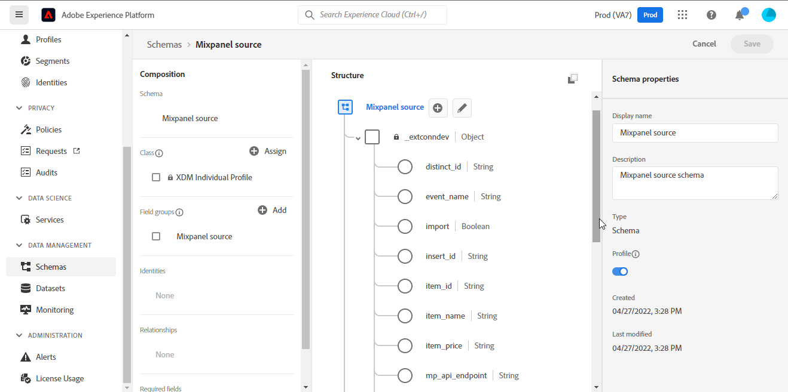

# [!DNL Mixpanel]

Adobe Experience Platform permet d’ingérer des données à partir de sources externes tout en vous offrant la possibilité de structurer, d’étiqueter et d’améliorer les données entrantes à l’aide des services d’Experience Platform. Vous pouvez ingérer des données provenant de diverses sources telles que les applications Adobe, le stockage dans le cloud, les bases de données, etc.

Experience Platform prend en charge l’ingestion de données provenant d’une application d’analyse tierce. La prise en charge des fournisseurs d’analyses inclut [!DNL Mixpanel].

[[!DNL Mixpanel]](https://www.mixpanel.com) est un outil d’analyse de produit qui vous permet de capturer des données sur la manière dont les utilisateurs interagissent avec un produit numérique. Mixpanel vous permet d’analyser ces données de produit à l’aide de rapports simples et interactifs qui vous permettent d’interroger et de visualiser les données en quelques clics seulement.

Sources tire parti de l’[API d’exportation d’événement Mixpanel > Télécharger](https://developer.mixpanel.com/reference/raw-event-export) pour télécharger vos données d’événement telles qu’elles sont reçues et stockées dans [!DNL Mixpanel], ainsi que toutes les propriétés d’événement (y compris les `distinct_id`) et la date et l’heure exactes auxquelles l’événement a été envoyé à Experience Platform. Mixpanel utilise des jetons porteur comme mécanisme d&#39;authentification pour communiquer avec l&#39;API d&#39;exportation d&#39;événements Mixpanel.

## Liste autorisée d’adresses IP

Vous devez ajouter à votre place sur la liste autorisée des adresses IP spécifiques à une région avant de connecter vos sources à Experience Platform. Placer sur la liste autorisée Pour plus d’informations, consultez le guide sur la [connexion des adresses IP à Experience Platform](../../ip-address-allow-list.md).

## Authentification de votre compte [!DNL Mixpanel]

Cette section décrit les étapes préalables à suivre pour authentifier votre compte et importer vos données [!DNL Mixpanel] dans Experience Platform.

Pour créer une connexion source [!DNL Mixpanel] et un flux de données, vous devez d’abord disposer d’un compte [!DNL Mixpanel] valide. Si vous ne disposez pas d&#39;un compte [!DNL Mixpanel] valide, consultez la page [Registre Mixpanel](https://mixpanel.com/register/) pour créer votre compte.

Une fois que vous avez créé un compte [!DNL Mixpanel], accédez à l’onglet [!DNL Project Details] dans la page [!DNL Project Seettings] de l’interface utilisateur [!DNL Mixpanel] pour récupérer votre identifiant de projet et configurer votre fuseau horaire.

Ensuite, accédez à l’onglet [!DNL Service Accounts] dans la page [!DNL Project Settings] de l’interface utilisateur de [!DNL Mixpanel] pour récupérer les informations d’identification de votre compte de service.

>[!TIP]
>
>Pour suivre les bonnes pratiques, sélectionnez un compte de service qui [n’expire pas](https://developer.mixpanel.com/reference/service-accounts#service-account-expiration).

Enfin, créez un schéma Experience Platform [schema](../../../xdm/schema/composition.md) requis pour le [!DNL Mixpanel Event Export API]. Pour plus d’informations sur les mappages requis pour votre schéma, consultez le guide sur la [création d’une connexion source  [!DNL Mixpanel]  l’interface utilisateur](../../tutorials/ui/create/analytics/mixpanel.md#additional-resources).

## Connexion de [!DNL Mixpanel] à Experience Platform à l’aide d’API

La documentation ci-dessous fournit des informations sur la connexion de [!DNL Mixpanel] à Experience Platform à l’aide d’API ou de l’interface utilisateur :

* [Créer une connexion source et un flux de données pour à l’aide  [!DNL Mixpanel]  l’API Flow Service](../../tutorials/api/create/analytics/mixpanel.md)

## Connexion d’[!DNL Mixpanel] à Experience Platform à l’aide de l’interface utilisateur

* [Créer une connexion source  [!DNL Mixpanel]  dans l’interface utilisateur](../../tutorials/ui/create/analytics/mixpanel.md)
* [Créer un flux de données pour une connexion source de succès client dans l’interface utilisateur](../../tutorials/ui/dataflow/analytics.md)
