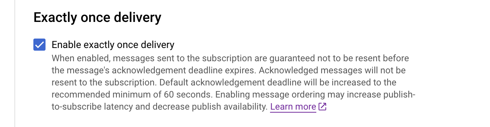

# Source [!DNL Google PubSub]

>[!IMPORTANT]
>
>La source [!DNL Google PubSub] est disponible dans le catalogue des sources pour les utilisateurs qui ont acheté Real-Time CDP Ultimate.

Adobe Experience Platform fournit une connectivité native aux fournisseurs de cloud tels que [!DNL AWS], [!DNL Google Cloud Platform] et [!DNL Azure], ce qui vous permet d’importer des données de ces systèmes dans Experience Platform pour les utiliser dans des services et des destinations en aval.

Les sources de stockage dans le cloud peuvent importer vos données dans Experience Platform sans avoir à les télécharger, les formater ou les charger. Les données ingérées peuvent être formatées sous la forme XDM JSON, XDM Parquet ou délimitées. Chaque étape du processus est intégrée dans le processus Sources. Experience Platform vous permet d’importer des données de [!DNL Google PubSub] en temps réel.

## Conditions préalables {#prerequisites}

Cette section décrit la configuration préalable à effectuer avant de connecter votre compte [!DNL Google PubSub] à Experience Platform.

### Créer un compte de service {#create-service-account}

Un **compte de service** est un type de compte souvent utilisé par une application ou une charge de travail de calcul, plutôt que par une personne. Un compte de service est identifié par son adresse e-mail, qui est propre au compte.

* D’une part, les comptes de service sont des **entités** - vous pouvez accorder aux comptes de service l’accès aux ressources [!DNL Google Cloud]. Par exemple, vous pouvez accorder à un compte de service le rôle Administrateur de calcul `(roles/compute.admin)` sur un projet donné. Cela permet ensuite au compte de service de gérer les ressources du moteur de calcul dans ce projet particulier.
* D’un autre côté, les comptes de service sont également des ressources : vous pouvez donner à d’autres entités de sécurité l’autorisation d’accéder au compte de service. Par exemple, vous pouvez accorder à un utilisateur le rôle Utilisateur du compte de service `(roles/iam.serviceAccountUser)` sur un compte de service pour lui permettre de joindre ce compte de service aux ressources. Vous pouvez également accorder à un utilisateur le rôle d’administrateur de compte de service `(roles/iam.serviceAccountAdmin)` pour lui permettre d’effectuer des tâches telles que l’affichage, la modification, la désactivation et la suppression du compte de service.

Pour plus d’informations sur la détermination du type d’authentification approprié à votre cas d’utilisation, consultez le [[!DNL Google] guide sur les méthodes d’authentification](https://cloud.google.com/docs/authentication).

Pour créer un compte de service, procédez comme suit :

Tout d’abord, accédez à la page [!DNL IAM] du [!DNL Google Developer Console], puis sélectionnez **[!DNL Create Service Account]**.

Saisissez ensuite un nom d’affichage et un identifiant pour votre compte de service, puis sélectionnez **[!DNL Create and Continue]**.

### Générer des clés de compte de service {#generate-service-account-keys}

Pour générer des clés pour votre compte de service, sélectionnez l’en-tête des clés dans la page Comptes de service . À partir de là, sélectionnez **[!DNL Add key]** , puis **[!DNL Create new key]** dans le menu déroulant. Vous pouvez également utiliser ce panneau pour charger une clé existante.

En cas de réussite, vous recevrez un message indiquant que la clé privée a été enregistrée sur votre ordinateur et qu&#39;un fichier sera téléchargé. Vous pouvez ensuite utiliser le contenu de ce fichier comme informations d’identification lors de la création de votre compte [!DNL Google PubSub] sur Experience Platform.

### Octroi d’autorisations au niveau de la rubrique et de l’abonnement {#grant-permissions}

Pour accorder des autorisations au niveau de la rubrique et de l’abonnement, accédez à la page de console de la rubrique, puis sélectionnez **[!DNL Show info panel]**. Ensuite, sous l’onglet [!DNL Permissions] , sélectionnez [!DNL Add Principal] , puis ajoutez le principal du compte de service ainsi que les autorisations.

## Configurations pour une [!DNL Google PubSub usage] optimale {#optimal-configurations}

Cette section présente les configurations recommandées pour optimiser l’utilisation de la source [!DNL Google PubSub] sur Experience Platform.

### Propriétés de l’abonnement {#subscription-properties}

Utilisez l’[!DNL Google Developer Console] pour **augmenter l’échéance de votre accusé de réception**. Cela permet au [!DNL Google Publisher] d’attendre en fonction du temps que vous configurez avant d’envoyer à nouveau le message. Ce délai permet de réduire la charge inutile au niveau de l&#39;abonné.

Activez **[!DNL exactly one delivery]**. Cette configuration informe l’[!DNL Google Publisher] de garantir que les messages envoyés à l’abonnement ne seront pas renvoyés avant l’expiration de la date limite d’accusé de réception. Vous pouvez utiliser ce paramètre pour vous assurer que les messages d’accusé de réception ne sont pas renvoyés à l’abonnement.

Vous pouvez activer **[!DNL Retry after exponential backoff delay]** pour réduire le risque de surcharger davantage le serveur. Vous pouvez activer cette configuration dans l’[!DNL Google Developer Console] pour mieux atténuer les défaillances transitoires (erreurs temporaires qui se résolvent généralement d’elles-mêmes), en donnant au système plus de temps pour récupérer avant de tenter une autre connexion.

Vous devez **définir la durée de rétention de vos messages d’abonnement sur 24 heures ou plus** pour vous assurer que les données non reconnues ne sont pas perdues pendant les pics de charge. En outre, **activez une rubrique de lettre morte** pour vous assurer que la perte de données ne se produit pas, même dans de rares cas de périphérie.

>[!IMPORTANT]
>
>Vous ne pouvez créer qu’un seul flux de données source par abonnement [!DNL Google PubSub]. La réutilisation d’un abonnement, même sur les sandbox, entraîne une perte de données.

## Connexion de [!DNL Google PubSub] à Experience Platform

>[!NOTE]
>
>Après avoir créé ou mis à jour un flux de données en continu, une brève pause de 5 minutes dans l’ingestion des données est nécessaire pour éviter toute instance potentielle de perte de données ou d’abandon de données.

La documentation ci-dessous fournit des informations sur la connexion de [!DNL Google PubSub] à Experience Platform à l’aide d’API ou de l’interface utilisateur :

### Utiliser les API

* [Créer une connexion source Google PubSub à l’aide de l’API Flow Service](../../tutorials/api/create/cloud-storage/google-pubsub.md)
* [Collecter des données en continu à l’aide de l’API Flow Service](../../tutorials/api/collect/streaming.md)

### Utiliser l’interface utilisateur

* [Créer une connexion source Google PubSub dans l’interface utilisateur](../../tutorials/ui/create/cloud-storage/google-pubsub.md)
* [Configurer un flux de données pour une connexion de stockage dans le cloud dans l’interface utilisateur](../../tutorials/ui/dataflow/streaming/cloud-storage-streaming.md)
