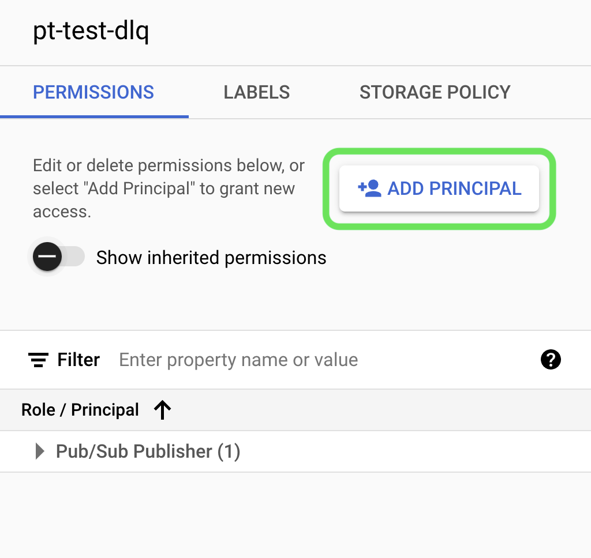

# Source [!DNL Google PubSub]

>[!IMPORTANT]
>
>La variable [!DNL Google PubSub] source est disponible dans le catalogue des sources pour les utilisateurs qui ont acheté Real-time Customer Data Platform Ultimate.

Adobe Experience Platform fournit une connectivité native aux fournisseurs de cloud tels que [!DNL AWS], [!DNL Google Cloud Platform] et [!DNL Azure], ce qui vous permet d’importer des données de ces systèmes dans Platform pour les utiliser dans des services et des destinations en aval.

Les sources de stockage dans le cloud peuvent introduire vos propres données dans Platform sans avoir à les télécharger, les formater ou les transférer. Les données ingérées peuvent être formatées sous la forme XDM JSON, XDM Parquet ou délimitées. Chaque étape du processus est intégrée dans le processus Sources. Platform vous permet d’importer des données depuis [!DNL Google PubSub] en temps réel.

## Conditions préalables {#prerequisites}

Cette section décrit la configuration prérequise que vous devez effectuer avant de connecter votre [!DNL Google PubSub] compte à Experience Platform.

### Créer un compte de service {#create-service-account}

A **compte de service** est un type de compte souvent utilisé par une application ou une charge de travail calculée, plutôt qu’une personne. Un compte de service est identifié par son adresse électronique, qui est propre au compte.

* D’une part, les comptes de service sont **principals** - vous pouvez accorder aux comptes de service l’accès à [!DNL Google Cloud] ressources. Par exemple, vous pouvez accorder à un compte de service le rôle d’administrateur de calcul `(roles/compute.admin)` sur un projet donné. Cela permet ensuite au compte de service de gérer les ressources du moteur de calcul dans ce projet particulier.
* D’un autre côté, les comptes de service sont également des ressources. Vous pouvez autoriser d’autres entités à accéder au compte de service. Par exemple, vous pouvez accorder à un utilisateur le rôle Utilisateur du compte de service `(roles/iam.serviceAccountUser)` sur un compte de service pour permettre à l’utilisateur de joindre ce compte de service à des ressources. Vous pouvez également accorder à un utilisateur le rôle d’ administrateur de compte de service . `(roles/iam.serviceAccountAdmin)` pour permettre à l’utilisateur d’exécuter des tâches telles que l’affichage, la modification, la désactivation et la suppression du compte de service.

Pour plus d’informations sur la détermination du type d’authentification approprié à votre cas d’utilisation, consultez la section [[!DNL Google] guide sur les méthodes d’authentification](https://cloud.google.com/docs/authentication).

Pour créer un compte de service, procédez comme suit :

Tout d’abord, accédez au [!DNL IAM] de la page [!DNL Google Developer Console] puis sélectionnez **[!DNL Create Service Account]**.

Ensuite, saisissez un nom d’affichage et un identifiant pour votre compte de service, puis sélectionnez **[!DNL Create and Continue]**.

### Génération des clés de compte de service {#generate-service-account-keys}

Pour générer les clés de votre compte de service, sélectionnez l’en-tête keys dans la page des comptes de service. À partir de là, sélectionnez **[!DNL Add key]** puis sélectionnez **[!DNL Create new key]** dans le menu déroulant. Vous pouvez également utiliser ce panneau pour charger une clé existante.

En cas de réussite, vous recevrez un message indiquant que la clé privée a été enregistrée sur votre ordinateur et qu’un fichier sera téléchargé. Vous pouvez ensuite utiliser le contenu de ce fichier comme informations d’identification lors de la création de votre [!DNL Google PubSub] sur Experience Platform.

### Octroi d’autorisations au niveau des rubriques et des abonnements {#grant-permissions}

Pour accorder des autorisations au niveau de la rubrique et de l’abonnement, accédez à la page de la console de rubrique, puis sélectionnez **[!DNL Show info panel]**. Ensuite, sous [!DNL Permissions] onglet, sélectionnez [!DNL Add Principal] puis ajoutez l’entité de compte de service avec les autorisations.

## Configurations optimales [!DNL Google PubSub usage] {#optimal-configurations}

Cette section décrit les configurations que vous devez effectuer pour optimiser l’utilisation de la variable [!DNL Google PubSub] source sur Experience Platform.

### Propriétés de l&#39;abonnement {#subscription-properties}

Utilisez la variable [!DNL Google Developer Console] to **augmenter le délai d’accusé de réception ;**. Cela permet à la variable [!DNL Google Publisher] d’attendre en fonction de l’heure que vous configurez avant d’envoyer à nouveau le message. Ce délai permet de réduire la charge inutile au niveau des abonnés.

Activer **[!DNL exactly one delivery]**. Cette configuration informe la variable [!DNL Google Publisher] afin de garantir que les messages envoyés à l’abonnement ne seront pas renvoyés avant l’expiration du délai d’accusé de réception. Vous pouvez utiliser ce paramètre pour vous assurer que les messages d’accusé de réception ne sont pas renvoyés à l’abonnement.

Vous pouvez activer **[!DNL Retry after exponential backoff delay]** afin de réduire le risque de surcharge du serveur. Vous pouvez activer cette configuration dans la section [!DNL Google Developer Console] pour mieux atténuer les échecs transitoires (erreurs temporaires qui se résolvent généralement par elles-mêmes), en donnant au système plus de temps pour récupérer avant de tenter une autre connexion.

Vous devez **définissez la durée de rétention de votre message d’abonnement sur 24 heures ou plus.** afin de s’assurer que les données non acquittées ne sont pas perdues lors des charges maximales. En outre, **Activation d’une rubrique de lettre morte** afin de s’assurer que la perte de données ne se produit pas même dans de rares cas de périphérie.

>[!IMPORTANT]
>
>Vous ne pouvez créer qu’un seul flux de données source par [!DNL Google PubSub] abonnement. La réutilisation d’un abonnement, même entre des environnements de test, entraîne la perte de données.

## Connexion [!DNL Google PubSub] à Experience Platform

La documentation ci-dessous fournit des informations sur la connexion de [!DNL Google PubSub] à Platform à l’aide d’API ou de l’interface utilisateur :

### Utiliser les API

* [Créer une connexion source Google PubSub à l’aide de l’API Flow Service](../../tutorials/api/create/cloud-storage/google-pubsub.md)
* [Collecter des données en continu à l’aide de l’API Flow Service](../../tutorials/api/collect/streaming.md)

### Utiliser l’interface utilisateur

* [Créer une connexion source Google PubSub dans l’interface utilisateur](../../tutorials/ui/create/cloud-storage/google-pubsub.md)
* [Configurer un flux de données pour une connexion de stockage dans le cloud dans l’interface utilisateur](../../tutorials/ui/dataflow/streaming/cloud-storage-streaming.md)
