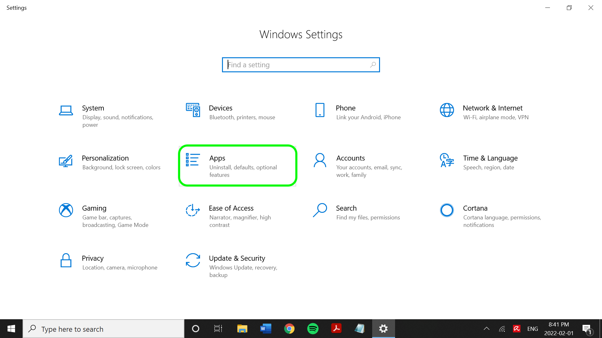

# Connecteur SFTP

Adobe Experience Platform permet d’ingérer des données à partir de sources externes tout en vous offrant la possibilité de structurer, d’étiqueter et d’améliorer les données entrantes à l’aide des services d’Experience Platform. Vous pouvez ingérer des données provenant de diverses sources telles que les applications Adobe, le stockage dans le cloud, les bases de données, etc.

Lisez ce document pour connaître les étapes préalables à suivre pour connecter votre compte [!DNL SFTP] à Experience Platform.

>[!TIP]
>
>Vous devez désactiver l’authentification interactive du clavier dans la configuration du serveur SFTP avant de vous connecter. La désactivation du paramètre permet la saisie manuelle des mots de passe, contrairement à la saisie via un service ou un programme.

## Conditions préalables {#prerequisites}

Lisez cette section pour connaître les étapes préalables à suivre pour connecter votre source [!DNL SFTP] à Experience Platform.

### Liste autorisée d’adresses IP

Une liste d’adresses IP doit être ajoutée à un place sur la liste autorisée avant d’utiliser les connecteurs source. Si vous n’ajoutez pas vos adresses IP spécifiques à une région à votre place sur la liste autorisée, des erreurs ou une absence de performances peuvent se produire lors de l’utilisation de sources. Voir la page [place sur la liste autorisée d’adresse IP](../../ip-address-allow-list.md) pour plus d’informations.

### Contraintes de dénomination pour fichiers et répertoires

La liste suivante inclut les contraintes dont vous devez tenir compte lorsque vous nommez votre fichier ou répertoire de stockage dans le cloud.

* Les noms des composants de répertoire et de fichier ne doivent pas dépasser 255 caractères.
* Les noms de répertoire et de fichier ne peuvent pas se terminer par une barre oblique (`/`). Elle sera le cas échéant automatiquement supprimée.
* Les caractères d’URL réservés suivants doivent être des caractères d’échappement : `! ' ( ) ; @ & = + $ , % # [ ]`
* Les caractères suivants ne sont pas autorisés : `" \ / : | < > * ?`.
* Caractères de chemin d’URL illégaux interdits. Les points de code tels que `\uE000`, bien que valides dans les noms de fichier NTFS, ne sont pas des caractères Unicode valides. En outre, certains caractères ASCII ou Unicode, tels que les caractères de contrôle (0x00 à 0x1F, \u0081, etc.), ne sont pas non plus autorisés. Pour les règles régissant les chaînes Unicode en HTTP/1.1, voir [RFC 2616, section 2.2 : règles de base](https://www.ietf.org/rfc/rfc2616.txt) et [RFC 3987](https://www.ietf.org/rfc/rfc3987.txt).
* Les noms de fichier suivants ne sont pas autorisés : LPT1, LPT2, LPT3, LPT4, LPT5, LPT6, LPT7, LPT8, LPT9, COM1, COM2, COM3, COM4, COM5, COM6, COM7, COM8, COM9, PRN, AUX, NUL, CON, CLOCK$, point (.) et deux points (..).

### Configurer une clé privée OpenSSH codée en Base64 pour [!DNL SFTP]

Le [!DNL SFTP] source prend en charge l’authentification à l’aide d’une clé privée clé privée OpenSSH codée [!DNL Base64]. Pour plus d’informations sur la génération de votre clé privée OpenSSH codée en Base64 et la connexion de [!DNL SFTP] à Experience Platform, reportez-vous aux étapes ci-dessous.

>[!BEGINTABS]

>[!TAB  Windows ]

### utilisateurs [!DNL Windows]

Si vous utilisez une machine [!DNL Windows], ouvrez le menu **Démarrer** puis sélectionnez **Paramètres**.


Dans le menu **Paramètres** qui s’affiche, sélectionnez **Applications**.



Ensuite, sélectionnez **Fonctionnalités facultatives**.


Une liste des fonctionnalités facultatives s’affiche. Si un **client OpenSSH** est déjà préinstallé sur votre machine, il sera ensuite inclus dans la liste **Fonctionnalités installées** sous **Fonctionnalités facultatives**.


S’il n’est pas installé, sélectionnez **Installer** puis ouvrez **[!DNL Powershell]** et exécutez la commande suivante pour générer votre clé privée :

```shell
PS C:\Users\lucy> ssh-keygen -t rsa -m pem
Generating public/private rsa key pair.
Enter file in which to save the key (C:\Users\lucy/.ssh/id_rsa):
Enter passphrase (empty for no passphrase):
Enter same passphrase again:
Your identification has been saved in C:\Users\lucy/.ssh/id_rsa.
Your public key has been saved in C:\Users\lucy/.ssh/id_rsa.pub.
The key fingerprint is:
SHA256:osJ6Lg0TqK8nekNQyZGMoYwfyxNc+Wh0hYBtBylXuGk lucy@LAPTOP-FUJT1JEC
The key's randomart image is:
+---[RSA 3072]----+
|.=.*+B.o.        |
|=.O.O +          |
|+o+= B           |
|+o +E .          |
|.o=o  . S        |
|+... . .         |
| *o .            |
|o.B.             |
|=O..             |
+----[SHA256]-----+
```

Exécutez ensuite la commande suivante tout en fournissant le chemin d’accès au fichier de la clé privée pour encoder votre clé privée en [!DNL Base64] :

```shell
C:\Users\lucy> [convert]::ToBase64String((Get-Content -path "C:\Users\lucy\.ssh\id_rsa" -Encoding byte)) > C:\Users\lucy\.ssh\id_rsa_base64
```

La commande ci-dessus enregistre la clé privée encodée [!DNL Base64] dans le chemin d’accès au fichier que vous avez désigné. Vous pouvez ensuite utiliser cette clé privée pour vous authentifier auprès de [!DNL SFTP] et vous connecter à Experience Platform.

>[!TAB Mac]

### utilisateurs [!DNL Mac]

Si vous utilisez un [!DNL Mac], ouvrez **Terminal** et exécutez la commande suivante pour générer la clé privée (dans ce cas, la clé privée sera enregistrée dans `/Documents/id_rsa`) :

```shell
ssh-keygen -t rsa -m pem -f ~/Documents/id_rsa
Generating public/private rsa key pair.
Enter passphrase (empty for no passphrase):
Enter same passphrase again:
Your identification has been saved in /Users/vrana/Documents/id_rsa.
Your public key has been saved in /Users/vrana/Documents/id_rsa.pub.
The key fingerprint is:
SHA256:s49PCaO4a0Ee8I7OOeSyhQAGc+pSUQnRii9+5S7pp1M vrana@vrana-macOS
The key's randomart image is:
+---[RSA 2048]----+
|o ==..           |
|.+..o            |
|oo.+             |
|=.. +            |
|oo = .  S        |
|+.+ +E . = .     |
|o*..*.. . o      |
|.o*=.+   +       |
|.oo=Oo  ..o      |
+----[SHA256]-----+
```

Exécutez ensuite la commande suivante pour encoder la clé privée en [!DNL Base64] :

```shell
base64 ~/Documents/id_rsa > ~/Documents/id_rsa_base64
 
 
# Print Content of base64 encoded file
cat ~/Documents/id_rsa_base64
LS0tLS1CRUdJTiBPUEVOU1NIIFBSSVZBVEUgS0VZLS0tLS0KYjNCbGJuTnphQzFyWlhrdGRqRUFBQUFBQkc1dmJtVUFBQUFFYm05dVpRQUFBQUFBQUFBQkFBQUJGd0FBQUFkemMyZ3RjbgpOaEFBQUFBd0VBQVFBQUFRRUF0cWFYczlXOUF1ZmtWazUwSXpwNXNLTDlOMU9VYklaYXVxbVM0Q0ZaenI1NjNxUGFuN244CmFxZWdvQTlCZnVnWDJsTVpGSFl5elEzbnp6NXdXMkdZa1hkdjFjakd0elVyNyt1NnBUeWRneGxrOGRXZWZsSzBpUlpYWW4KVFRwS0E5c2xXaHhjTXg3R2x5ejdGeDhWSzI3MmdNSzNqY1d1Q0VIU3lLSFR5SFFwekw0MEVKbGZJY1RGR1h1dW1LQjI5SwpEakhwT1grSDdGcG5Gd1pabTA4Uzc2UHJveTVaMndFalcyd1lYcTlyUDFhL0E4ejFoM1ZLdllzcG53c2tCcHFQSkQ1V3haCjczZ3M2OG9sVllIdnhWajNjS3ZsRlFqQlVFNWRNUnB2M0I5QWZ0SWlrYmNJeUNDaXV3UnJmbHk5eVNPQ2VlSEc0Z2tUcGwKL3V4YXNOT0h1d0FBQThqNnF6R1YrcXN4bFFBQUFBZHpjMmd0Y25OaEFBQUJBUUMycHBlejFiMEM1K1JXVG5Rak9ubXdvdgowM1U1UnNobHE2cVpMZ0lWbk92bnJlbzlxZnVmeHFwNkNnRDBGKzZCZmFVeGtVZGpMTkRlZlBQbkJiWVppUmQyL1Z5TWEzCk5TdnY2N3FsUEoyREdXVHgxWjUrVXJTSkZsZGlkTk9rb0QyeVZhSEZ3ekhzYVhMUHNYSHhVcmJ2YUF3cmVOeGE0SVFkTEkKb2RQSWRDbk12alFRbVY4aHhNVVplNjZZb0hiMG9PTWVrNWY0ZnNXbWNYQmxtYlR4THZvK3VqTGxuYkFTTmJiQmhlcjJzLwpWcjhEelBXSGRVcTlpeW1mQ3lRR21vOGtQbGJGbnZlQ3pyeWlWVmdlL0ZXUGR3cStVVkNNRlFUbDB4R20vY0gwQiswaUtSCnR3aklJS0s3Qkd0K1hMM0pJNEo1NGNiaUNST21YKzdGcXcwNGU3QUFBQUF3RUFBUUFBQVFBcGs0WllzMENSRnNRTk9WS0sKYWxjazlCVDdzUlRLRjFNenhrSGVydmpJYk9kL0lvRXpkcHlVa28rbm41RmpGK1hHRnNCUXZnOFdTaUlJTk1oU3BNYWI1agpvWXlka2gvd0ovWElOaDlZaE5QVXlURi9NNkFnMkNYd21KS2RxN1VKWjZyNjloV3V0VVN6U05QbkVYWTZLc29GeVUwTEFvCko0OHJMT1pMZldtMHFhWDBLNUgzNmJPaHFXSWJwMDNoZk94eno5M0MrSDM5MFJkRkp4bzJVZ0FVY3UvdHREb0REVldBdmEKVkVyMWEzak9LenVHbThrK21WeXpPZERjVFY4ckZIT0pwRnRBU3l6Q24yVld1MjV0TWtrcGRPRjNKcVdMZHdOY3loeG1URApXZGVDNWh4V0Fiano0WDZ5WXpHcFcwTmptVkFoWUVVZGNBSVlXWWM3OGEvQkFBQUFnRm8wakl4aGhwZkJ6QjF6b09FMDJBClpjTC9hcUNuYysrdmJ1a2V0aFg5Zzhlb0xQMTQyeUgzdlpLczl3c1RtbVVsZ0prZURaN2hUcklwOGY2eEwzdDRlMXByY1kKb2ZLd0gwckNGOTFyaldPbGZOUmxEempoR1NTTEVMczZoNlNzMEdBQXE2Z0ZQTVF2dTB4TDlQUTlGQ21YZVVKazJpRm1MWgpEWWJGc0NyVUxEQUFBQWdRRGF0a1pMamJaSTBFM0ZuY2dTOVF5Y3lVWmtkZ1dVNjBQcG9ud3BMQXdUdHRpOG1EQXE5cHYwClEvUlk1WE9UeGF3VXNHa0tYMjNtV1BYR0grdUlBSzhrelVVM2dGM1dRWGVkTWw4NHVCVFZCTEtUdStvVVAvZmIvMEE0dE0KSE9BSythbXZPMkZuYzFiSmVwd05USTE2cjZXWk9sZWV2ZklJQVpXcEgxVVpIdkVRQUFBSUVBMWNwcStDNUVXSFJwbnVPZQpiNHE4T0tKTlJhSUxIRUN6U0twWlFpZDFhRmJYWlVKUXpIQU85YzhINVZMcjBNUjFkcW1ORkNja2ZsZzI2Y3BEUEl3TjBYCm5HMFBxcmhKbXp0U3ZQZ3NGdkNPallncXF6U0RYUjkxd1JQTEN5cU8zcGMyM2kzZnp2WkhtMGhIdWdoNVJqV0loUlFZVkwKZUpDWHRqM08vY3p1SWdzQUFBQVJkbkpoYm1GQWRuSmhibUV0YldGalQxTUJBZz09Ci0tLS0tRU5EIE9QRU5TU0ggUFJJVkFURSBLRVktLS0tLQo=
```

Une fois votre clé privée encodée en [!DNL Base64] enregistrée dans le dossier que vous avez désigné, vous devez ensuite ajouter le contenu de votre fichier de clé publique à une nouvelle ligne dans l’hôte [!DNL SFTP] des clés autorisées. Exécutez la commande suivante sur la ligne de commande :

```shell
cat ~/id_rsa.pub >> ~/.ssh/authorized_keys
```

Pour vérifier si votre clé publique a été correctement ajoutée, vous pouvez exécuter la ligne de commande suivante :

```shell
more ~/.ssh/authorized_keys
```

>[!ENDTABS]

### Collecter les informations d’identification requises {#credentials}

Vous devez fournir des valeurs pour les informations d’identification suivantes afin de connecter votre serveur [!DNL SFTP] à Experience Platform.

>[!BEGINTABS]

>[!TAB  Authentification de base ]

Indiquez les valeurs appropriées pour les informations d’identification suivantes afin d’authentifier le serveur [!DNL SFTP] à l’aide de l’authentification de base.

| Informations d’identification | Description |
| ---------- | ----------- |
| `host` | Nom ou adresse IP associé à votre serveur [!DNL SFTP]. |
| `port` | Port du serveur [!DNL SFTP] auquel vous vous connectez. Si elle n’est pas fournie, la valeur par défaut est `22`. |
| `username` | Nom d’utilisateur ayant accès à votre serveur [!DNL SFTP]. |
| `password` | Mot de passe de votre serveur [!DNL SFTP]. |
| `maxConcurrentConnections` | Ce paramètre permet de spécifier une limite maximale de connexions simultanées qu’Experience Platform créera lors de la connexion à votre serveur SFTP. Vous devez définir cette valeur pour qu’elle soit inférieure à la limite définie par SFTP. **Remarque** : lorsque ce paramètre est activé pour un compte SFTP existant, il affecte uniquement les flux de données futurs et non les flux de données existants. |
| `folderPath` | Chemin d’accès au dossier auquel vous souhaitez accorder l’accès. [!DNL SFTP] source, vous pouvez indiquer le chemin d’accès au dossier pour spécifier l’accès des utilisateurs au sous-dossier de votre choix. |
| `disableChunking` | Lors de l’ingestion de données, la source de [!DNL SFTP] peut d’abord récupérer la longueur du fichier, diviser le fichier en plusieurs parties, puis les lire en parallèle. Vous pouvez activer ou désactiver cette valeur pour spécifier si votre serveur [!DNL SFTP] peut récupérer les longueurs de fichier ou lire les données à partir d’un décalage spécifique. |
| `connectionSpec.id` | (API uniquement) La spécification de connexion renvoie les propriétés de connecteur d’une source, y compris les spécifications d’authentification liées à la création des connexions de base et source. L’identifiant de spécification de connexion pour [!DNL SFTP] est `b7bf2577-4520-42c9-bae9-cad01560f7bc`. |

>[!TAB authentification par clé publique SSH]

Indiquez les valeurs appropriées pour les informations d’identification suivantes afin d’authentifier le serveur [!DNL SFTP] à l’aide de l’authentification par clé publique SSH.

| Informations d’identification | Description |
| ---------- | ----------- |
| `host` | Nom ou adresse IP associé à votre serveur [!DNL SFTP]. |
| `port` | Port du serveur [!DNL SFTP] auquel vous vous connectez. Si elle n’est pas fournie, la valeur par défaut est `22`. |
| `username` | Nom d’utilisateur ayant accès à votre serveur [!DNL SFTP]. |
| `password` | Mot de passe de votre serveur [!DNL SFTP]. |
| `privateKeyContent` | Contenu de clé privée SSH codée en Base64. Les types de clés OpenSSH pris en charge sont `ed25519`, `RSA` et `DSA`. |
| `passPhrase` | Le mot de passe ou le mot de passe pour déchiffrer la clé privée si le fichier de clé ou le contenu de la clé est protégé par un mot de passe. Si PrivateKeyContent est protégé par mot de passe, ce paramètre doit être utilisé avec la phrase secrète de PrivateKeyContent comme valeur. |
| `maxConcurrentConnections` | Ce paramètre permet de spécifier une limite maximale de connexions simultanées qu’Experience Platform créera lors de la connexion à votre serveur SFTP. Vous devez définir cette valeur pour qu’elle soit inférieure à la limite définie par SFTP. **Remarque** : lorsque ce paramètre est activé pour un compte SFTP existant, il affecte uniquement les flux de données futurs et non les flux de données existants. |
| `folderPath` | Chemin d’accès au dossier auquel vous souhaitez accorder l’accès. [!DNL SFTP] source, vous pouvez indiquer le chemin d’accès au dossier pour spécifier l’accès des utilisateurs au sous-dossier de votre choix. |
| `disableChunking` | Lors de l’ingestion de données, la source de [!DNL SFTP] peut d’abord récupérer la longueur du fichier, diviser le fichier en plusieurs parties, puis les lire en parallèle. Vous pouvez activer ou désactiver cette valeur pour spécifier si votre serveur [!DNL SFTP] peut récupérer les longueurs de fichier ou lire les données à partir d’un décalage spécifique. |
| `connectionSpec.id` | (API uniquement) La spécification de connexion renvoie les propriétés de connecteur d’une source, y compris les spécifications d’authentification liées à la création des connexions de base et source. L’identifiant de spécification de connexion pour [!DNL SFTP] est `b7bf2577-4520-42c9-bae9-cad01560f7bc`. |

>[!ENDTABS]

## Connexion de SFTP à Experience Platform

La documentation ci-dessous fournit des informations sur la connexion d’un serveur SFTP à Experience Platform à l’aide d’API ou de l’interface utilisateur :

### Utiliser les API

* [Créer une connexion de base SFTP à l’aide de l’API Flow Service](../../tutorials/api/create/cloud-storage/sftp.md)
* [Explorer la structure de données et le contenu d’une source de stockage dans le cloud à l’aide de l’API Flow Service](../../tutorials/api/explore/cloud-storage.md)
* [Créer un flux de données pour une source de stockage dans le cloud à l’aide de l’API Flow Service](../../tutorials/api/collect/cloud-storage.md)

### Utiliser l’interface utilisateur

* [Créer une connexion source SFTP dans l’interface utilisateur](../../tutorials/ui/create/cloud-storage/sftp.md)
* [Créer un flux de données pour une connexion de stockage dans le cloud dans l’interface utilisateur](../../tutorials/ui/dataflow/batch/cloud-storage.md)
