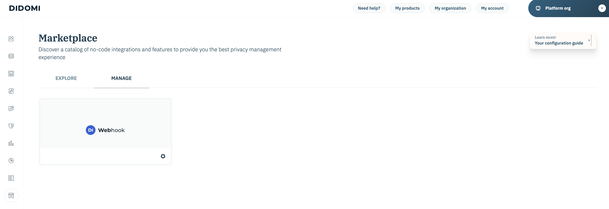

# [!DNL Didomi]

[!DNL Didomi] est une plateforme de gestion des préférences et du consentement qui aide les organisations à collecter, gérer et appliquer les choix des utilisateurs concernant les données personnelles sur les sites web, les applications et les outils internes.

Adobe Experience Platform prend en charge l’ingestion de données provenant de nombreux systèmes externes, notamment l’espace de stockage dans le cloud, les bases de données et des applications telles que [!DNL Didomi], par le biais d’un système de connecteurs sources. Utilisez des sources pour authentifier les systèmes externes, gérer les flux de données dans Experience Platform et assurer une ingestion cohérente et structurée de vos données client.

Utilisez la source [!DNL Didomi] pour diffuser en temps réel les données de consentement et de préférences des utilisateurs depuis la plateforme de gestion des préférences et du consentement [!DNL Didomi] vers Experience Platform. Grâce à la source [!DNL Didomi], vous pouvez centraliser et agir sur les données de consentement dans Experience Platform, préservant ainsi la conformité et la mise à jour de vos profils client et de vos workflows en aval.

## Conditions préalables

Suivez les étapes préalables décrites ci-dessous pour connecter votre compte [!DNL Didomi] à Experience Platform.

### Liste autorisée d’adresses IP

Vous devez ajouter à votre place sur la liste autorisée des adresses IP spécifiques à une région avant de connecter vos sources à Experience Platform. Placer sur la liste autorisée Pour plus d’informations, consultez le guide sur la [connexion des adresses IP à Experience Platform](../../ip-address-allow-list.md).

### Configuration des autorisations sur Experience Platform

Pour connecter votre compte **[!UICONTROL à Experience Platform]** les autorisations **[!UICONTROL Afficher les sources et]** Gérer les sources[!DNL Didomi] doivent être activées. Contactez votre administrateur de produit pour obtenir les autorisations nécessaires. Pour plus d’informations, consultez le [guide de l’interface utilisateur du contrôle d’accès](../../../access-control/ui/overview.md).

### Collecter des informations d’identification d’API Adobe

Pour connecter [!DNL Didomi] à Experience Platform en toute sécurité, vous devez vous authentifier à l’aide de vos informations d’identification d’API Adobe. Ces informations d’identification sont essentielles pour configurer le webhook et l’ingestion des données.

Lisez le guide sur [Prise en main des API Experience Platform](../../../landing/api-authentication.md) pour plus d’informations sur la manière d’effectuer avec succès des appels vers les API Experience Platform.

### Création d’un schéma Experience Platform

>[!TIP]
>
>Vous pouvez ignorer cette étape si vous disposez déjà d’un schéma XDM.

Un schéma **Modèle de données d’expérience (XDM)** définit la structure des données que vous enverrez à partir de [!DNL Didomi] (par exemple, les identifiants d’utilisateur, à des fins de consentement) vers Experience Platform.

Pour créer un schéma, sélectionnez [!UICONTROL Schémas] dans le volet de navigation de gauche de l’interface utilisateur d’Experience Platform, puis sélectionnez **[!UICONTROL Créer un schéma]**. Ensuite, sélectionnez **[!UICONTROL Standard]** comme type de schéma, puis sélectionnez **[!UICONTROL Manuel]** pour créer manuellement les champs. Sélectionnez une classe de base pour votre schéma et indiquez un nom pour votre schéma.

Une fois créé, mettez à jour le schéma en ajoutant l’un des champs requis. Assurez-vous qu’au moins un champ est un champ [!UICONTROL Identité] pour informer Experience Platform de vos valeurs d’identité principales. Enfin, assurez-vous d’activer le bouton (bascule) [!UICONTROL Profil] pour stocker vos données avec succès.

Pour plus d’informations, consultez le guide sur la [création de schémas dans l’interface utilisateur](../../../xdm/tutorials/create-schema-ui.md).

### Créer un jeu de données

>[!TIP]
>
>Vous pouvez ignorer cette étape si vous disposez déjà d’un jeu de données.

Un **jeu de données** dans Experience Platform est utilisé pour stocker les données entrantes en fonction du schéma que vous définissez.

Pour créer un jeu de données, sélectionnez [!UICONTROL Jeux de données] dans le volet de navigation de gauche de l’interface utilisateur d’Experience Platform, puis sélectionnez **[!UICONTROL Créer un jeu de données]**. Sélectionnez ensuite **[!UICONTROL Créer un jeu de données à partir d’un schéma]** puis sélectionnez le schéma à associer à votre nouveau jeu de données.

## Configuration du Webhook HTTP sur la console [!DNL Didomi]

[!DNL Webhooks] permet de vous abonner à des événements déclenchés sur la plateforme [!DNL Didomi] lorsque les utilisateurs interagissent avec leurs préférences de consentement. Lorsqu’un événement pertinent se produit (par exemple, lorsqu’un utilisateur donne ou retire son consentement), [!DNL Didomi] envoie une requête HTTP POST en temps réel contenant une payload JSON au point d’entrée [!DNL webhook] configuré.

Pour garantir la compatibilité avec Experience Platform, votre webhook doit répondre aux exigences suivantes.

| Champ | Description | Exemple |
| --- | --- | --- | 
| Secret client | Clé secrète associée à vos informations d’identification API Adobe. | `d8f3b2e1-4c9a-4a7f-9b2e-8f1c3d2a1b6e` |
| Clé API | Clé API publique utilisée pour authentifier les requêtes envoyées aux services Adobe. |
| Type d&#39;octroi | Méthode par laquelle une application obtient un jeton d’accès du serveur d’autorisation. Définissez cette valeur sur `client_credentials`. | `client_credentials` |
| Portée | Les portées d’autorisation définissent les autorisations ou niveaux d’accès spécifiques qu’une application demande au fournisseur d’API. | `openid,AdobeID,read_organizations,additional_info.projectedProductContext,session` |
| En-tête d’authentification | En-têtes supplémentaires requis pour la demande de jeton Adobe. | `{"Content-type": "application/x-www-form-urlencoded"}` |
| URL du jeton | Point d’entrée du jeton Adobe. | `https://ims-na1.adobelogin.com/ims/token/v3` |
| URL du point d’entrée | URL du connecteur Adobe final (fournie à la fin de la configuration). | `https://dcs.adobedc.net/collection/your-adobe-endpoint-id` |

{style="table-layout:auto"}

Configurez ensuite les options suivantes pour votre [!DNL webhook].

| Champ | Description | Valeur |
| ---| --- | --- | 
| En-têtes de requête | En-têtes personnalisés pour la [!DNL webhook]. Veillez à inclure le `x-adobe-flow-id` . Vous pouvez récupérer cette valeur une fois votre [flux de données créé](../../tutorials/ui/create/consent-and-preferences/didomi.md#retrieve-the-streaming-endpoint-url). | `{"Content-Type": "application/json", "Cache-Control": "no-cache", "x-adobe-flow-id": "{DATAFLOW_ID}"}` |
| Aplatir | Cette propriété doit être vérifiée car elle garantit que les données [!DNL webhook] sont envoyées en tant qu’objet plat. | Activé |
| Types d’événement | Sélectionnez le groupe spécifique d’événements [!DNL Didomi] (`event.*` ou `user.*`) qui doit déclencher la [!DNL webhook]. Utilisez `event.*` pour suivre les modifications de consentement ou de préférence, et `user.*` pour suivre les mises à jour du profil utilisateur. Cette sélection est nécessaire pour s’assurer que seuls les événements compatibles sont envoyés à Adobe. Adobe ne prend en charge qu’un seul schéma par flux de données. Par conséquent, la sélection des deux types d’événements peut provoquer des erreurs d’ingestion. | La liste des types d’événements pris en charge est la suivante : <ul><li>`Event.created`</li><li>`Event.updated`</li><li>`Event.deleted`</li><li>`User.created`</li><li>`User.updated`</li><li>`User.deleted`</li></ul> |

### Téléchargement du fichier d’exemple de payload {#download-the-sample-payload-file}

En fonction du groupe d&#39;événements sélectionné, téléchargez le **exemple de fichier de payload** approprié directement à partir de la console [!DNL Didomi]. Ce fichier représente la structure des données et sera utilisé lors des étapes de schéma et de mappage dans Adobe.

| **Groupe d’événements** | **Exemple de fichier à télécharger** | **Option de filtrage** |
| --- | ---| --- |
| `event.*` | Téléchargement d’un exemple pour `event.created` | Filtrer uniquement pour les événements `event.*` |
| `user.*` | Téléchargement d’un exemple pour `user.created` | Filtrer uniquement pour les événements `user.*` |

## Connexion de votre compte [!DNL Didomi] à Experience Platform

Lisez le guide sur la [connexion [!DNL Didomi] à Experience Platform](../../tutorials/ui/create/consent-and-preferences/didomi.md) pour savoir comment créer une connexion source et ingérer les données de consentement et de préférences de [!DNL Didomi] dans Experience Platform.