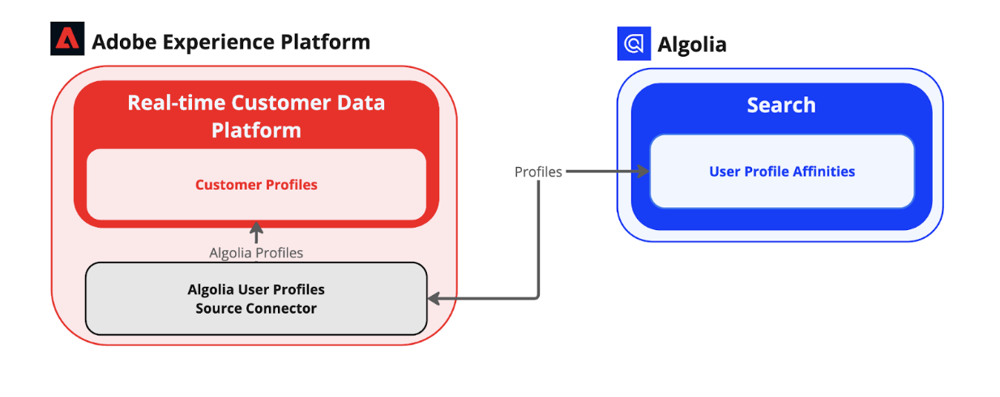

# [!DNL Algolia User Profiles]

[[!DNL Algolia]](https://www.algolia.com/) est une puissante plateforme d’API de recherche qui permet aux entreprises de fournir des expériences de recherche rapides, pertinentes et personnalisables. Il fournit des fonctionnalités de recherche en temps réel avec des fonctionnalités telles que la tolérance aux fautes de frappe, le filtrage, la facettisation et l’optimisation de la pertinence basée sur l’IA. [!DNL Algolia] aide les entreprises à améliorer l’interaction client, les taux de conversion et l’expérience client globale en proposant des solutions de recherche hautes performances pour les sites web, les plateformes d’e-commerce et les applications.

Voici quelques-uns des principaux avantages de [!DNL Algolia] :

* Recherche ultrarapide avec des résultats instantanés.
* Recommandations très pertinentes optimisées par l’IA.
* Classement personnalisable pour établir la priorité des besoins de l’entreprise.
* Évolutivité permettant de gérer facilement les charges de trafic élevées.

Pour plus d’informations, consultez la [[!DNL Algolia]  documentation du produit &#x200B;](https://resources.algolia.com/).

## Architecture

Les sources en libre-service (SDK par lots) fournissent toutes les fonctionnalités nécessaires telles que l’authentification, la pagination ou l’extraction de données complète et partielle. La source de [!DNL Algolia User Profiles] utilise ces fonctionnalités pour terminer l’intégration.

## Conditions préalables {#prerequisites}

Vous devez effectuer les étapes préalables suivantes avant de pouvoir connecter votre compte [!DNL Algolia] à Experience Platform.

1. Utilisez le [[!DNL Algolia] tableau de bord](https://dashboard.algolia.com/users/sign_up) pour vous connecter à votre compte [!DNL Algolia] ou créer un compte.
2. [Préparez votre index](https://www.algolia.com/doc/guides/sending-and-managing-data/prepare-your-data/in-depth/prepare-data-in-depth/).
3. [Configurez vos facettes](https://www.algolia.com/doc/guides/managing-results/refine-results/faceting/).
4. [Envoyer des événements utilisateur](https://www.algolia.com/doc/guides/sending-events/getting-started/).
5. [Personnaliser l’index](https://www.algolia.com/doc/guides/personalization/advanced-personalization/configure/setup/indices/).

### Configuration des autorisations sur Experience Platform

Pour connecter votre compte [!DNL Algolia] à Experience Platform **les autorisations** Afficher les sources et **[!UICONTROL Gérer les sources]** doivent être activées. Contactez votre administrateur de produit pour obtenir les autorisations nécessaires. Pour plus d’informations, consultez le [guide de l’interface utilisateur du contrôle d’accès](../../../access-control/abac/ui/permissions.md).

### Liste autorisée d’adresses IP

Une liste d’adresses IP doit être ajoutée à un place sur la liste autorisée avant d’utiliser les connecteurs source. Si vous n’ajoutez pas vos adresses IP spécifiques à une région à votre place sur la liste autorisée, des erreurs ou une absence de performances peuvent se produire lors de l’utilisation de sources. Voir la page place sur la liste autorisée d’adresse IP[&#128279;](../../ip-address-allow-list.md) pour plus d’informations.

## Connexion de votre compte [!DNL Algolia] à Experience Platform

Une fois les conditions préalables remplies, vous pouvez passer à l’étape suivante et [connecter votre compte  [!DNL Algolia]  Experience Platform](../../tutorials/ui/create/data-partners/algolia-user-profiles.md).
