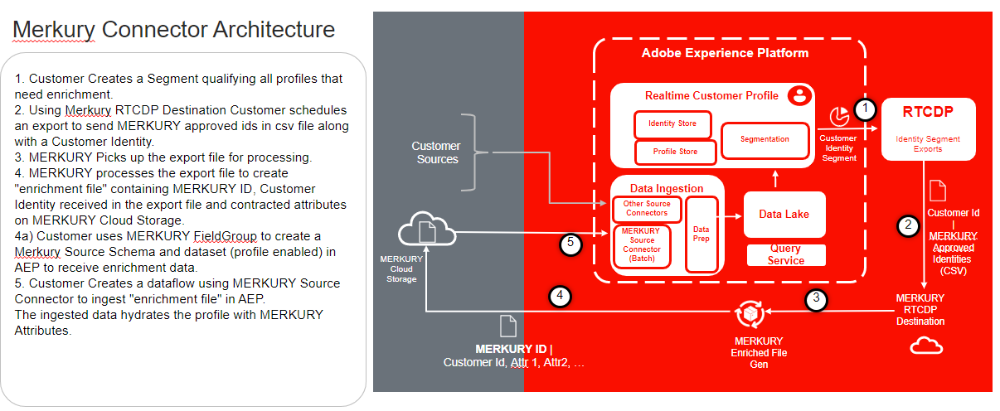

# [!DNL Merkury Enterprise Identity Resolution]

Adobe Experience Platform prend en charge l’ingestion de données à partir d’une application d’un partenaire de données. La prise en charge des partenaires de données inclut [!DNL Merkury Enterprise Identity Resolution].

Vous pouvez utiliser [!DNL Merkury] par [!DNL Merkle] pour reconnaître davantage de visiteurs numériques, même sans utiliser de cookies, et offrir les expériences pertinentes et personnalisées dont votre client a besoin.

Vous pouvez utiliser l’**ID de personne** dans le cadre de la source de [!DNL Merkury] pour combiner tout ce que votre entreprise sait sur un individu dans un profil unique et complet. Ces informations peuvent inclure :

- Comportements numériques
- Préférences d’achat
- Informations d’identification telles qu’un nom, une adresse e-mail, une adresse physique ou un identifiant d’appareil.

Vous pouvez formater les données ingérées en tant que JSON du modèle de données d’expérience (XDM), Parquet XDM ou délimitées. Chaque étape du processus est intégrée dans le travail des sources

## Liste autorisée d’adresses IP

Avant de pouvoir utiliser les connecteurs source, vous devez ajouter à votre place sur la liste autorisée les adresses IP requises pour votre région. Si vous n’ajoutez pas ces adresses IP, les connecteurs source risquent de ne pas fonctionner correctement ou de produire des erreurs. Placer sur la liste autorisée Pour obtenir des instructions détaillées et la liste des adresses IP à autoriser, lisez la page [Adresses IP à inclure](../../ip-address-allow-list.md).

## Contraintes de dénomination pour fichiers et répertoires

La liste suivante inclut les contraintes dont vous devez tenir compte lorsque vous nommez votre fichier ou répertoire de stockage dans le cloud.

- Les noms des composants de répertoire et de fichier ne doivent pas dépasser 255 caractères.
- Les noms de répertoire et de fichier ne peuvent pas se terminer par une barre oblique (`/`). Elle sera le cas échéant automatiquement supprimée.
- Les caractères d’URL réservés suivants doivent être des caractères d’échappement : `! ' ( ) ; @ & = + $ , % # [ ]`
- Les caractères suivants ne sont pas autorisés : `" \ / : | < > * ?`.
- Caractères de chemin d’URL illégaux interdits. Les points de code tels que `\uE000`, bien que valides dans les noms de fichier NTFS, ne sont pas des caractères Unicode valides. En outre, certains caractères ASCII ou Unicode, tels que les caractères de contrôle (0x00 à 0x1F, \u0081, etc.), ne sont pas non plus autorisés. Pour les règles régissant les chaînes Unicode en HTTP/1.1, voir [RFC 2616, section 2.2 : règles de base](https://www.ietf.org/rfc/rfc2616.txt) et [RFC 3987](https://www.ietf.org/rfc/rfc3987.txt).
- Les noms de fichier suivants ne sont pas autorisés : LPT1, LPT2, LPT3, LPT4, LPT5, LPT6, LPT7, LPT8, LPT9, COM1, COM2, COM3, COM4, COM5, COM6, COM7, COM8, COM9, PRN, AUX, NUL, CON, CLOCK$, point (.) et deux points (..).

## Conditions préalables

Vous devez remplir les conditions préalables suivantes avant de pouvoir commencer à utiliser la source [!DNL Merkury] :

- Vous devez terminer la configuration de votre [!DNL Merkury] avec votre équipe [!DNL Merkury].
- Vous devez récupérer vos informations d’identification (clé d’accès, clé secrète et nom du compartiment) auprès de votre équipe [!DNL Merkury]. 

>[!NOTE]
>
>Un chemin d’accès au fichier tel que `myBucket/folder/subfolder/subsubfolder/abc.csv` peut vous conduire à n’accéder qu’à `subsubfolder/abc.csv`. Si vous souhaitez accéder au sous-dossier, vous pouvez définir le paramètre de compartiment sur myBucket et le folderPath sur folder/subfolder pour vous assurer que l’exploration des fichiers commence au niveau du sous-dossier et non du `subsubfolder/abc.csv`.

## Étapes suivantes

En lisant ce document, vous avez terminé la configuration requise pour importer des données de votre compte [!DNL Merkury] vers Experience Platform. Vous pouvez maintenant passer au guide sur la [connexion [!DNL Merkury] à Experience Platform à l’aide de l’interface utilisateur](../../tutorials/ui/create/data-partners/merkury.md).
