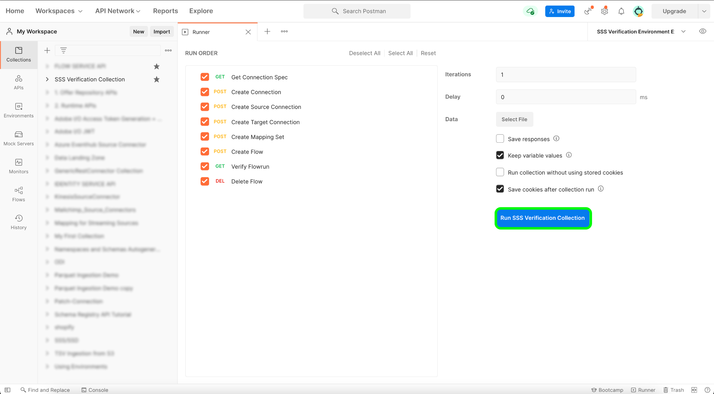

# Envoyer votre source

La dernière étape de l’intégration de votre nouvelle source à Adobe Experience Platform à l’aide de sources en libre-service (SDK par lots) consiste à tester votre source pour vérification. Une fois l’opération terminée, vous pouvez envoyer votre nouvelle source en contactant votre représentant Adobe.

Le document suivant décrit les étapes à suivre pour tester et déboguer votre source à l’aide de l’ [[!DNL Flow Service] API](https://www.adobe.io/experience-platform-apis/references/flow-service/).

## Commencer

* Pour plus d’informations sur la manière d’effectuer des appels vers les API Platform, consultez le guide [Prise en main des API Platform](../../../landing/api-guide.md).
* Pour plus d’informations sur la génération de vos informations d’identification pour les API Platform, consultez le tutoriel sur l’ [ authentification et accès aux API Experience Platform](../../../landing/api-authentication.md).
* Pour plus d’informations sur la configuration de [!DNL Postman] pour les API Platform, consultez le tutoriel sur la [configuration de la console de développement et [!DNL Postman]](../../../landing/postman.md).
* Pour faciliter le processus de test et de débogage, téléchargez la [collecte de vérification des sources en libre-service et l’environnement ici](../assets/sdk-verification.zip) et suivez les étapes décrites ci-dessous.

## Test de votre source

Pour tester votre source, vous devez exécuter la [collecte et environnement de vérification des sources en libre-service](../assets/sdk-verification.zip) sur [!DNL Postman] tout en fournissant les variables d’environnement appropriées relatives à votre source.

Pour commencer les tests, vous devez d’abord configurer la collection et l’environnement sur [!DNL Postman]. Indiquez ensuite l’identifiant de spécification de connexion que vous souhaitez tester.

### Spécifier `authSpecName`

Une fois que vous avez saisi l’identifiant de spécification de connexion, vous devez spécifier le `authSpecName` que vous utilisez pour votre connexion de base. Selon votre choix, il peut s’agir de `OAuth 2 Refresh Code` ou de `Basic Authentication`. Une fois que vous avez spécifié votre `authSpecName`, vous devez inclure ses informations d’identification requises dans votre environnement. Par exemple, si vous spécifiez `authSpecName` comme `OAuth 2 Refresh Code`, vous devez fournir les informations d’identification requises pour OAuth 2, qui sont `host` et `accessToken`.

### Spécifier `sourceSpec`

Une fois vos paramètres de spécification d’authentification ajoutés, vous devez ajouter les propriétés requises de votre spécification source. Vous trouverez les propriétés requises dans `sourceSpec.spec.properties`. Dans le cas de l’exemple [!DNL MailChimp Members] ci-dessous, la seule propriété requise est `listId`, ce qui signifie `listId` et sa valeur d’identifiant correspondante à votre environnement [!DNL Postman].

```json
"spec": {
  "$schema": "http://json-schema.org/draft-07/schema#",
  "type": "object",
  "description": "Define user input parameters to fetch resource values.",
  "properties": {
    "listId": {
      "type": "string",
      "description": "listId for which members need to fetch."
    }
  }
}
```

Une fois les paramètres d’authentification et de spécification source fournis, vous pouvez commencer à renseigner le reste des variables d’environnement. Voir le tableau ci-dessous à titre de référence :

>[!NOTE]
>
>Toutes les variables d’exemple ci-dessous sont des valeurs d’espace réservé que vous devez mettre à jour, à l’exception de `flowSpecificationId` et `targetConnectionSpecId`, qui sont des valeurs fixes.

| Paramètre | Description | Exemple |
| --- | --- | --- |
| `x-api-key` | Identifiant unique utilisé pour authentifier les appels vers les API Experience Platform. Pour plus d’informations sur la récupération de votre `x-api-key`, consultez le tutoriel sur l’ [ authentification et accès aux API Experience Platform](../../../landing/api-authentication.md) . | `c8d9a2f5c1e03789bd22e8efdd1bdc1b` |
| `x-gw-ims-org-id` | Personne morale pouvant posséder ou accorder une licence pour des produits et des services et permettre l’accès à ses membres. Consultez le tutoriel sur la [configuration de Developer Console et [!DNL Postman]](../../../landing/postman.md) pour obtenir des instructions sur la récupération de vos informations `x-gw-ims-org-id`. | `ABCEH0D9KX6A7WA7ATQE0TE@adobeOrg` |
| `authorizationToken` | Jeton d’autorisation requis pour terminer les appels vers les API Experience Platform. Pour plus d’informations sur la récupération de votre `authorizationToken`, consultez le tutoriel sur l’ [ authentification et accès aux API Experience Platform](../../../landing/api-authentication.md) . | `Bearer authorizationToken` |
| `schemaId` | Pour que les données sources soient utilisées dans Platform, un schéma cible doit être créé pour structurer les données sources en fonction de vos besoins. Pour obtenir des instructions détaillées sur la création d’un schéma XDM cible, suivez le tutoriel sur la [création d’un schéma à l’aide de l’API](../../../xdm/api/schemas.md). | `https://ns.adobe.com/{TENANT_ID}.schemas.0ef4ce0d390f0809fad490802f53d30b` |
| `schemaVersion` | La version unique qui correspond à votre schéma. | `application/vnd.adobe.xed-full-notext+json; version=1` |
| `schemaAltId` | `meta:altId` renvoyé avec le `schemaId` lors de la création d’un nouveau schéma. | `_{TENANT_ID}.schemas.0ef4ce0d390f0809fad490802f53d30b` |
| `dataSetId` | Pour obtenir des instructions détaillées sur la création d’un jeu de données cible, suivez le tutoriel sur la [création d’un jeu de données à l’aide de l’API](../../../catalog/api/create-dataset.md). | `5f3c3cedb2805c194ff0b69a` |
| `mappings` | Les jeux de mappages peuvent être utilisés pour définir la façon dont les données d’un schéma source sont mappées à celui d’un schéma de destination. Pour obtenir des instructions détaillées sur la création d’un mappage, consultez le tutoriel sur la [création d’un jeu de mappages à l’aide de l’API](../../../data-prep/api/mapping-set.md). | `[{"destinationXdmPath":"person.name.firstName","sourceAttribute":"email.email_id","identity":false,"version":0},{"destinationXdmPath":"person.name.lastName","sourceAttribute":"email.activity.action","identity":false,"version":0}]` |
| `mappingId` | L’identifiant unique qui correspond à votre jeu de mappages. | `bf5286a9c1ad4266baca76ba3adc9366` |
| `connectionSpecId` | L’identifiant de spécification de connexion qui correspond à votre source. Il s’agit de l’identifiant que vous avez généré après la [création d’une spécification de connexion](./create.md). | `2e8580db-6489-4726-96de-e33f5f60295f` |
| `flowSpecificationId` | ID de spécification de flux de `RestStorageToAEP`. **Il s’agit d’une valeur fixe**. | `6499120c-0b15-42dc-936e-847ea3c24d72` |
| `targetConnectionSpecId` | L’identifiant de connexion cible du lac de données dans lequel les données ingérées se trouvent. **Il s’agit d’une valeur fixe**. | `c604ff05-7f1a-43c0-8e18-33bf874cb11c` |
| `verifyWatTimeInSecond` | Intervalle de temps désigné à suivre lors de la vérification de la fin d’une exécution de flux. | `40` |
| `startTime` | Heure de début désignée pour votre flux de données. L’heure de début doit être formatée en heure unique. | `1597784298` |

Une fois que vous avez fourni toutes vos variables d’environnement, vous pouvez commencer à exécuter la collection à l’aide de l’interface [!DNL Postman]. Dans l’interface [!DNL Postman], sélectionnez les ellipses (**...**) en regard de [!DNL Sources SSSs Verification Collection], puis sélectionnez **Exécuter la collection**.


L’interface [!DNL Runner] s’affiche, vous permettant de configurer l’ordre d’exécution de votre flux de données. Sélectionnez **Exécuter la collection de vérification SSS** pour exécuter la collection.

>[!NOTE]
>
>Vous pouvez désactiver la **suppression du flux** de la liste de contrôle de l’ordre d’exécution si vous préférez utiliser le tableau de bord de surveillance des sources dans l’interface utilisateur de Platform. Cependant, une fois le test terminé, vous devez vous assurer que vos flux de test sont supprimés.



## Envoyer votre source

Une fois que votre source a pu terminer l’ensemble du workflow, vous pouvez contacter votre représentant d’Adobe et envoyer votre source pour l’intégration.
