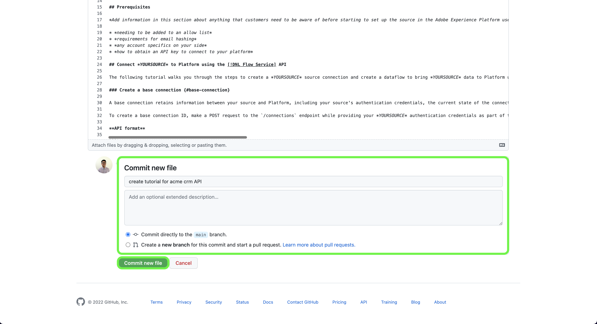

# Utiliser l’interface web GitHub pour créer une page de documentation source

Ce document décrit les étapes à suivre pour utiliser l’interface web GitHub afin de créer de la documentation et d’envoyer une requête de tirage.

>[!TIP]
>
>Les documents suivants du guide de contribution d’Adobe peuvent être utilisés pour continuer à prendre en charge votre processus de documentation : <ul><li>[Installation des outils de création Git et Markdown](https://experienceleague.adobe.com/docs/contributor/contributor-guide/setup/install-tools.html)</li><li>[Configurer le référentiel Git localement pour la documentation](https://experienceleague.adobe.com/docs/contributor/contributor-guide/setup/local-repo.html)</li><li>[Workflow de contribution GitHub pour les modifications majeures](https://experienceleague.adobe.com/docs/contributor/contributor-guide/setup/full-workflow.html)</li></ul>

## Configuration de votre environnement GitHub

La première étape de la configuration de votre environnement GitHub consiste à accéder au référentiel GitHub [Adobe Experience Platform](https://github.com/AdobeDocs/experience-platform.en).

Sélectionnez ensuite **Branchement**.

Une fois le branchement terminé, sélectionnez **principal** et saisissez le nom de votre nouvelle branche dans le menu déroulant qui s’affiche. Veillez à attribuer un nom explicite à votre branche, car il sera utilisé pour contenir votre travail, puis sélectionnez **créer une branche**.

Dans la structure de dossiers GitHub de votre référentiel dupliqué, accédez à [`experience-platform.en/help/sources/tutorials/api/create/`](https://github.com/AdobeDocs/experience-platform.en/tree/main/help/sources/tutorials/api/create) , puis sélectionnez la catégorie appropriée pour votre source dans la liste. Par exemple, si vous créez une documentation pour une nouvelle source CRM, sélectionnez **crm**.

>[!TIP]
>
>Si vous créez une documentation pour l’interface utilisateur de , accédez à [`experience-platform.en/help/sources/tutorials/ui/create/`](https://github.com/AdobeDocs/experience-platform.en/tree/main/help/sources/tutorials/ui/create) et sélectionnez la catégorie appropriée pour votre source. Pour ajouter vos images, accédez à [`experience-platform.en/help/sources/images/tutorials/create/sdk`](https://github.com/AdobeDocs/experience-platform.en/tree/main/help/sources/images/tutorials/create) , puis ajoutez vos captures d’écran au dossier `sdk` .

Un dossier des sources CRM existantes s’affiche. Pour ajouter de la documentation pour une nouvelle source, sélectionnez **Ajouter un fichier** puis **Créer un nouveau fichier** dans le menu déroulant qui s’affiche.

Nommez votre fichier source `YOURSOURCE.md` où YOURSOURCE correspond au nom de votre source dans Experience Platform. Par exemple, si votre société s’appelle ACME CRM, votre nom de fichier doit être `acme-crm.md`.

## Créer la page de documentation pour votre source

Pour commencer à documenter votre nouvelle source, collez le contenu du [modèle de documentation des sources](./template.md) dans l’éditeur web GitHub. Vous pouvez également télécharger le modèle [ici](../assets/api-template.zip).

Une fois le modèle copié dans l’interface de l’éditeur web GitHub, suivez les instructions indiquées sur le modèle et modifiez les valeurs contenant les informations pertinentes pour votre source.

Une fois l’opération terminée, validez le fichier dans votre branche.

## Envoi de la documentation pour révision

Une fois votre fichier validé, vous pouvez ouvrir une requête de tirage (PR) pour fusionner votre branche de travail dans la branche principale du référentiel de documentation Adobe. Assurez-vous que la branche sur laquelle vous travaillez est sélectionnée, puis sélectionnez **Comparer et extraire la requête**.

Vérifiez que les branches de base et de comparaison sont correctes. Ajoutez une note au PR décrivant votre mise à jour, puis sélectionnez **Créer une demande d’extraction**. Cette action ouvre une requête de tirage pour fusionner la branche de travail de votre travail dans la branche principale du référentiel Adobe.

>[!TIP]
>
>Laissez la case **Autoriser les modifications par les responsables** sélectionnée pour vous assurer que l’équipe de documentation d’Adobe peut apporter des modifications à la requête de modification.

À ce stade, une notification s’affiche vous invitant à signer le contrat de licence du contributeur (CLA) d’Adobe. Il s’agit d’une étape obligatoire. Après avoir signé le contrat de licence du contributeur, actualisez la page de requête de tirage et envoyez la demande d’extraction.

Vous pouvez confirmer que la demande d’extraction a été envoyée en examinant l’onglet Demandes d’extraction dans https://github.com/AdobeDocs/experience-platform.en.

