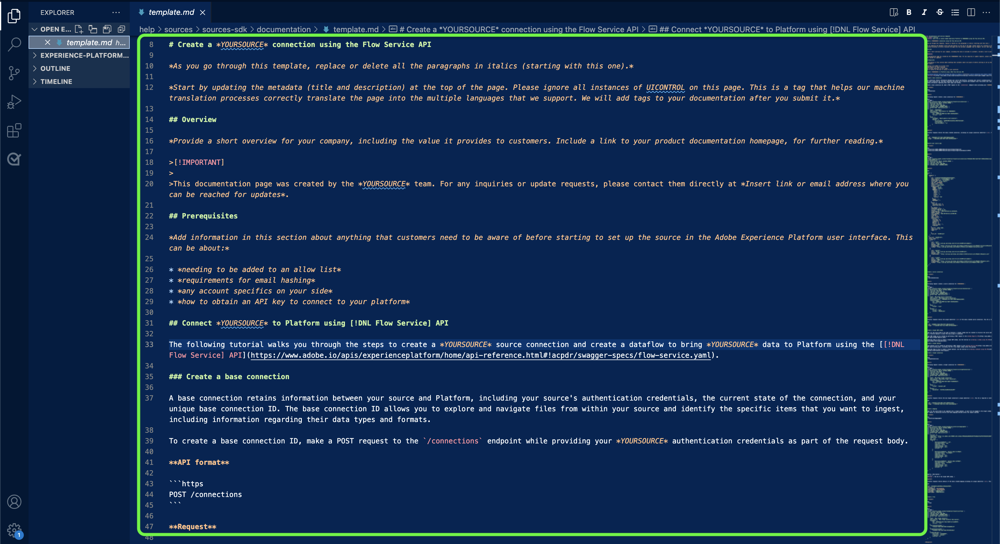

# Utiliser un éditeur de texte dans votre environnement local pour créer une page de documentation sur les sources

Ce document décrit les étapes à suivre pour utiliser votre environnement local afin de créer de la documentation pour votre source et d’envoyer une requête de tirage (PR).

>[!TIP]
>
>Les documents suivants du guide de contribution d’Adobe peuvent être utilisés pour continuer à prendre en charge votre processus de documentation : <ul><li>[Installation des outils de création Git et Markdown](https://experienceleague.adobe.com/docs/contributor/contributor-guide/setup/install-tools.html?lang=fr)</li><li>[Configurer le référentiel Git localement pour la documentation](https://experienceleague.adobe.com/docs/contributor/contributor-guide/setup/local-repo.html?lang=fr)</li><li>[Workflow de contribution GitHub pour les modifications majeures](https://experienceleague.adobe.com/docs/contributor/contributor-guide/setup/full-workflow.html?lang=fr)</li></ul>

## Conditions préalables

Le tutoriel suivant nécessite l’installation préalable de GitHub Desktop sur votre ordinateur local. Si vous ne disposez pas de GitHub Desktop, vous pouvez télécharger l’application [ici](https://desktop.github.com/).

## Connexion à GitHub et configuration de votre environnement de création local

La première étape de la configuration de votre environnement de création local consiste à accéder au référentiel GitHub de [Adobe Experience Platform](https://github.com/AdobeDocs/experience-platform.fr-FR).

Sur la page principale du référentiel GitHub d’Experience Platform, sélectionnez **Branchement**.

Pour cloner le référentiel sur votre ordinateur local, sélectionnez **Code**. Dans le menu déroulant qui s’affiche, sélectionnez **HTTPS** puis **Ouvrir avec le bureau GitHub**.

>[!TIP]
>
>Pour plus d’informations, consultez le tutoriel sur [la configuration locale du référentiel Git pour obtenir de la documentation](https://experienceleague.adobe.com/docs/contributor/contributor-guide/setup/local-repo.html?lang=fr#create-a-local-clone-of-the-repository).

Ensuite, patientez quelques instants le temps que GitHub Desktop clone le référentiel `experience-platform.en`.

Une fois le processus de clonage terminé, accédez à GitHub Desktop pour créer une branche . Sélectionnez **Principal** dans la barre de navigation supérieure, puis sélectionnez **Nouvelle branche**

Dans le panneau contextuel qui s’affiche, saisissez un nom explicite pour votre branche, puis sélectionnez **Créer une branche**.

Sélectionnez ensuite **Branche de publication**.

## Créer la page de documentation pour votre source

Avec le référentiel cloné sur votre ordinateur local et une nouvelle branche créée, vous pouvez maintenant commencer à créer la page de documentation de votre nouvelle source via l’éditeur de texte [&#x200B; de votre choix](https://experienceleague.adobe.com/docs/contributor/contributor-guide/setup/install-tools.html?lang=fr#understand-markdown-editors).

Adobe vous recommande d’utiliser [Visual Studio Code](https://code.visualstudio.com/) et d’installer l’extension de création Adobe Markdown. Pour installer l’extension, lancez Visual Studio Code, puis sélectionnez l’onglet **Extensions** dans le volet de navigation de gauche.

Ensuite, saisissez `Adobe Markdown Authoring` dans la barre de recherche, puis sélectionnez **Installer** dans la page qui s’affiche.

Une fois votre ordinateur local prêt, téléchargez le modèle de documentation [sources](../assets/api-template.zip) et extrayez le fichier à `experience-platform.en/help/sources/tutorials/api/create/...` avec [`...`] représentant la catégorie de votre choix. Par exemple, si vous créez une source de base de données, sélectionnez le dossier de base de données.

Enfin, suivez les instructions indiquées sur le modèle et modifiez le modèle avec les informations pertinentes relatives à votre source.

## Envoi de la documentation pour révision

Pour créer une requête de tirage (PR) et envoyer votre documentation pour révision, enregistrez d’abord votre travail dans [!DNL Visual Studio Code] (ou l’éditeur de texte de votre choix). Ensuite, à l’aide de GitHub Desktop, saisissez un message de validation et sélectionnez **Valider pour créer-la-documentation-source**.

Ensuite, sélectionnez **Pousser l’origine** pour charger votre travail dans la branche distante.

Pour créer une demande d’extraction, sélectionnez **Créer une demande d’extraction**.

Vérifiez que les branches de base et de comparaison sont correctes. Ajoutez une note au PR décrivant votre mise à jour, puis sélectionnez **Créer une demande d’extraction**. Cela ouvre une requête de tirage pour fusionner la branche de travail de votre travail dans la branche principale du référentiel Adobe.

>[!TIP]
>
>Laissez la case **Autoriser les modifications par les responsables** sélectionnée pour vous assurer que l’équipe de documentation d’Adobe peut apporter des modifications à la requête de modification.

Vous pouvez confirmer que la demande d’extraction a été envoyée en examinant l’onglet Demandes d’extraction dans https://github.com/AdobeDocs/experience-platform.fr-FR.

