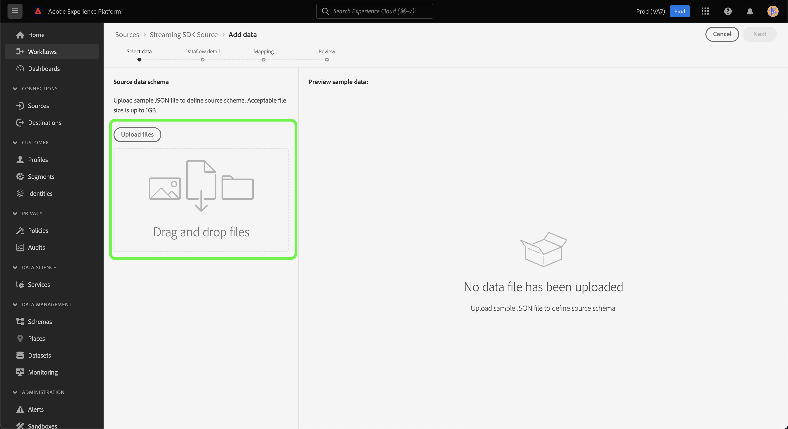
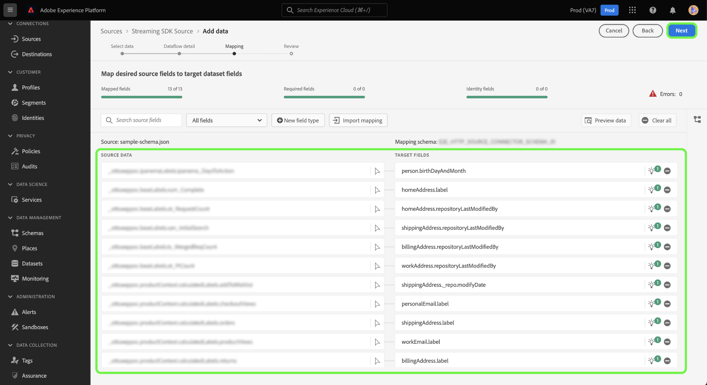

# Créer une connexion source et un flux de données pour diffuser des données *YOURSOURCE* à l’aide de l’interface utilisateur

*Au fur et à mesure que vous parcourez ce modèle, remplacez ou supprimez tous les paragraphes en italique (en commençant par celui-ci).*

*Commencez par mettre à jour les métadonnées (titre et description) en haut de la page. Veuillez ignorer toutes les instances d&#39;UICONTROL sur cette page. Il s’agit d’une balise qui aide nos processus de traduction automatique à traduire correctement la page dans les différentes langues que nous prenons en charge. Nous ajouterons des balises à votre documentation une fois que vous l’aurez envoyée.*

Ce tutoriel décrit les étapes à suivre pour créer un connecteur source *YOURSOURCE* à l’aide de l’interface utilisateur d’Experience Platform.

## Vue d’ensemble

*Donnez un bref aperçu de votre entreprise, y compris de la valeur qu&#39;elle offre aux clients. Insérez un lien vers la page d’accueil de la documentation de votre produit pour en savoir plus.*

>[!IMPORTANT]
>
>Ce connecteur source et cette page de documentation sont créés et gérés par l’équipe *YOURSOURCE*. Pour toute demande ou information, contactez-les directement à l&#39;adresse *Insérez un lien ou une adresse e-mail où vous pouvez être contacté pour les mises à jour*.

## Conditions préalables

*Ajoutez dans cette section des informations sur tout ce que les clients doivent savoir avant de commencer à configurer la source dans l’interface utilisateur de Adobe Experience Platform. Cela peut concerner :*

* *ajout nécessaire à une liste autorisée*
* *exigences relatives au hachage des e-mails*
* *toutes les caractéristiques du compte de votre côté*
* *comment obtenir les informations d’authentification pour vous connecter à votre plateforme*

### Collecter les informations d’identification requises

Pour connecter *YOURSOURCE* à Experience Platform, vous devez fournir des valeurs pour les propriétés de connexion suivantes :

| Informations d’identification | Description | Exemple |
| --- | --- | --- |
| *informations d’identification un* | *Ajoutez une brève description aux informations d’authentification de votre source ici* | *Veuillez ajouter un exemple des informations d’authentification de votre source ici* |
| *informations d’identification 2* | *Ajoutez une brève description aux informations d’authentification de votre source ici* | *Veuillez ajouter un exemple des informations d’authentification de votre source ici* |
| *informations d’identification trois* | *Ajoutez une brève description aux informations d’authentification de votre source ici* | *Veuillez ajouter un exemple des informations d’authentification de votre source ici* |

Pour plus d’informations sur ces informations d’identification, consultez la documentation sur l’authentification *YOURSOURCE*. *Ajoutez un lien vers la documentation d’authentification de votre plateforme ici*.

### Intégrer *YOURSOURCE* à votre webhook

*La diffusion en continu de SDK nécessite que votre source soit en mesure de prendre en charge les Webhooks pour communiquer avec Experience Platform. Dans cette section, vous devez indiquer les étapes que vos utilisateurs devront suivre pour intégrer YOURSOURCE à un webhook.*

## Connecter votre compte *YOURSOURCE*

Dans l’interface utilisateur d’Experience Platform, sélectionnez **[!UICONTROL Sources]** dans la barre de navigation de gauche pour accéder à l’espace de travail [!UICONTROL Sources]. L’écran [!UICONTROL Catalogue] affiche diverses sources avec lesquelles vous pouvez créer un compte.

Vous pouvez sélectionner la catégorie appropriée dans le catalogue sur le côté gauche de votre écran. Vous pouvez également trouver la source spécifique à utiliser à l’aide de l’option de recherche.

Dans la catégorie **Streaming**, sélectionnez *YOURSOURCE*, puis sélectionnez **[!UICONTROL Ajouter des données]**.

>[!TIP]
>
>Les captures d’écran utilisées ci-dessous sont des exemples. Lors de la création de votre documentation, veuillez remplacer les images par des captures d’écran de votre source réelle. Vous pouvez utiliser le même motif et la même couleur de marquage, ainsi que les mêmes noms de fichier. Assurez-vous que la capture d’écran capture l’ensemble de l’écran de l’interface utilisateur Experience Platform. Pour plus d’informations sur le téléchargement des captures d’écran, consultez le guide sur la [soumission de la documentation à révision](../documentation/github.md).

## Sélectionner les données

L’étape **[!UICONTROL Sélectionner les données]** s’affiche, fournissant une interface vous permettant de sélectionner les données que vous apportez à Experience Platform.

* La partie gauche de l’interface est un navigateur qui vous permet d’afficher les flux de données disponibles dans votre compte ;
* La partie droite de l’interface vous permet de prévisualiser jusqu’à 100 lignes de données à partir d’un fichier JSON.

Sélectionnez **[!UICONTROL Télécharger des fichiers]** pour télécharger un fichier JSON à partir de votre système local. Vous pouvez également faire glisser et déposer le fichier JSON que vous souhaitez charger dans le panneau [!UICONTROL Glisser-déposer des fichiers].

Une fois votre fichier chargé, l’interface de prévisualisation se met à jour pour afficher un aperçu du schéma que vous avez chargé. L’interface de prévisualisation vous permet d’examiner le contenu et la structure d’un fichier. Vous pouvez également utiliser l’utilitaire [!UICONTROL Champ de recherche] pour accéder à des éléments spécifiques à partir de votre schéma.

Lorsque vous avez terminé, sélectionnez **[!UICONTROL Suivant]**.

## Détails du flux de données

L’étape **Détails du flux de données** s’affiche, vous offrant des options pour utiliser un jeu de données existant ou établir un nouveau jeu de données pour votre flux de données, ainsi que la possibilité de fournir un nom et une description pour votre flux de données. Au cours de cette étape, vous pouvez également configurer les paramètres d’ingestion de profil, de diagnostics d’erreur, d’ingestion partielle et d’alertes.

Lorsque vous avez terminé, sélectionnez **[!UICONTROL Suivant]**.

## Mappage

L’interface de [!UICONTROL mappage] fournit un outil complet pour mapper les champs sources de votre schéma source aux champs XDM cibles correspondants dans le schéma cible.

Experience Platform fournit des recommandations intelligentes pour les champs mappés automatiquement en fonction du schéma ou du jeu de données cible que vous avez sélectionné. Vous pouvez ajuster manuellement les règles de mappage en fonction de vos cas d’utilisation. Selon vos besoins, vous pouvez choisir de mapper directement des champs ou d’utiliser des fonctions de préparation de données pour transformer les données sources afin d’obtenir des valeurs informatisées ou calculées. Pour obtenir des instructions complètes sur l’utilisation de l’interface du mappeur et des champs calculés, consultez le [ Guide de l’interface utilisateur de la préparation des données ](https://experienceleague.adobe.com/docs/experience-platform/data-prep/ui/mapping.html).

Une fois vos données source mappées, sélectionnez **[!UICONTROL Suivant]**.

## Révision

L’écran de **[!UICONTROL Révision]** s’affiche, vous permettant dʼexaminer votre nouveau flux de données avant sa création. Les détails sont regroupés dans les catégories suivantes :

* **[!UICONTROL Connexion]** : affiche le type de source, le chemin d’accès correspondant au fichier source choisi et le nombre de colonnes au sein de ce fichier source.
* **[!UICONTROL Attribuer des champs de jeu de données et de mappage]** : affiche le jeu de données dans lequel les données sources sont ingérées, y compris le schéma auquel le jeu de données se conforme.

Une fois que vous avez révisé votre flux de données, cliquez sur **[!UICONTROL Terminer]** et patientez quelques instants le temps que le flux de données soit créé.

## Obtention de l’URL du point d’entrée de diffusion en continu

Une fois votre flux de données en continu créé, vous pouvez récupérer votre URL de point d’entrée en continu. Ce point d’entrée sera utilisé pour vous abonner à votre webhook, ce qui permettra à votre source de diffusion en continu de communiquer avec Experience Platform.

Pour récupérer votre point d’entrée de flux continu, accédez à la page [!UICONTROL Activité du flux de données] du flux de données que vous venez de créer, puis copiez le point d’entrée au bas du panneau [!UICONTROL Propriétés].

## Étapes suivantes

*Les workflows des étapes restantes de la création d’un flux de données sont modularisés. Si vous souhaitez effectuer des appels externes spécifiques concernant votre source, reportez-vous à la section Ressources supplémentaires ci-dessous.*

En suivant ce tutoriel, vous avez établi une connexion à votre compte *YOURSOURCE*. Vous pouvez maintenant passer au tutoriel suivant et [configurer un flux de données pour importer des données dans Experience Platform](https://experienceleague.adobe.com/docs/experience-platform/sources/ui-tutorials/dataflow/crm.html).

## Ressources supplémentaires

*Il s’agit d’une section facultative dans laquelle vous pouvez fournir des liens supplémentaires vers la documentation de votre produit ou toute autre étape, capture d’écran ou nuance que vous jugez importante pour le succès du client. Vous pouvez utiliser cette section pour ajouter des informations ou des conseils sur l’ensemble du workflow de votre source, en particulier s’il existe des « pièges » particuliers qu’un utilisateur final peut rencontrer.*
