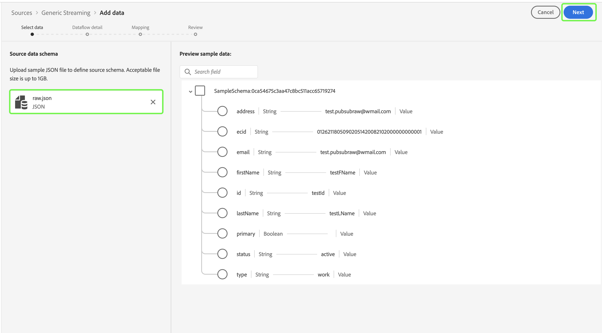

# Tester et envoyer votre source

>[!NOTE]
>
>La diffusion en continu de SDK par les sources en libre-service est en version bêta. Veuillez lire la [présentation des sources](../../home.md#terms-and-conditions) pour plus d’informations sur l’utilisation de sources étiquetées bêta.

Les dernières étapes pour intégrer votre nouvelle source à Adobe Experience Platform à l’aide des sources en libre-service (streaming SDK) consistent à tester et à envoyer votre nouvelle source. Une fois que vous avez terminé votre spécification de connexion et mis à jour la spécification du flux de diffusion en continu, vous pouvez commencer à tester la fonctionnalité de votre source via l’API ou l’interface utilisateur. Une fois l’opération réussie, vous pouvez envoyer votre nouvelle source en contactant votre représentant Adobe.

Le document suivant décrit les étapes à suivre pour tester et déboguer votre source à l’aide de l’[[!DNL Flow Service] API](https://www.adobe.io/experience-platform-apis/references/flow-service/).

## Commencer

* Pour plus d’informations sur la manière d’effectuer avec succès des appels vers les API Experience Platform, consultez le guide [Prise en main des API Experience Platform](../../../landing/api-guide.md).
* Pour plus d’informations sur la génération de vos informations d’identification pour les API Experience Platform, consultez le tutoriel sur l’[authentification et accès aux API Experience Platform](../../../landing/api-authentication.md).
* Pour plus d’informations sur la configuration de [!DNL Postman] pour les API Experience Platform, consultez le tutoriel sur [configuration de Developer Console et  [!DNL Postman]](../../../landing/postman.md).
* Pour faciliter votre processus de test et de débogage, téléchargez ici l’environnement et la collection de vérification des sources en libre-service [&#128279;](../assets/sdk-verification.zip) et suivez les étapes décrites ci-dessous.

## Tester votre source à l’aide de l’API

Pour tester votre source à l’aide de l’API, vous devez exécuter la [collection et environnement de vérification des sources en libre-service](../assets/sdk-verification.zip) sur [!DNL Postman] tout en fournissant les variables d’environnement appropriées qui se rapportent à votre source.

Pour commencer les tests, vous devez d’abord configurer la collection et l’environnement sur [!DNL Postman]. Indiquez ensuite l’identifiant de spécification de connexion à tester.

>[!NOTE]
>
>Toutes les variables d’exemple ci-dessous sont des valeurs d’espace réservé que vous devez mettre à jour, à l’exception de `flowSpecificationId` et `targetConnectionSpecId`, qui sont des valeurs fixes.

| Paramètre | Description | Exemple |
| --- | --- | --- |
| `x-api-key` | Identifiant unique utilisé pour authentifier les appels aux API Experience Platform. Pour plus d’informations sur la récupération de vos `x-api-key`, consultez le tutoriel sur [l’authentification et l’accès aux API Experience Platform](../../../landing/api-authentication.md). | `c8d9a2f5c1e03789bd22e8efdd1bdc1b` |
| `x-gw-ims-org-id` | Entité d’entreprise pouvant posséder des produits et services ou en obtenir la licence et permettre l’accès à ses membres. Consultez le tutoriel sur [configuration de Developer Console et [!DNL Postman]](../../../landing/postman.md) pour obtenir des instructions sur la récupération de vos informations de `x-gw-ims-org-id`. | `ABCEH0D9KX6A7WA7ATQE0TE@adobeOrg` |
| `authorizationToken` | Jeton d’autorisation requis pour effectuer des appels vers les API Experience Platform. Pour plus d’informations sur la récupération de vos `authorizationToken`, consultez le tutoriel sur [l’authentification et l’accès aux API Experience Platform](../../../landing/api-authentication.md). | `Bearer authorizationToken` |
| `schemaId` | Pour que les données sources soient utilisées dans Experience Platform, un schéma cible doit être créé pour structurer les données sources en fonction de vos besoins. Pour obtenir des instructions détaillées sur la création d’un schéma XDM cible, suivez le tutoriel sur la [création d’un schéma à l’aide de l’API](../../../xdm/api/schemas.md). | `https://ns.adobe.com/{TENANT_ID}.schemas.0ef4ce0d390f0809fad490802f53d30b` |
| `schemaVersion` | Version unique correspondant à votre schéma. | `application/vnd.adobe.xed-full-notext+json; version=1` |
| `schemaAltId` | Le `meta:altId` renvoyé avec le `schemaId` lors de la création d’un schéma. | `_{TENANT_ID}.schemas.0ef4ce0d390f0809fad490802f53d30b` |
| `dataSetId` | Pour obtenir des instructions détaillées sur la création d’un jeu de données cible, suivez le tutoriel sur la [création d’un jeu de données à l’aide de l’API](../../../catalog/api/create-dataset.md). | `5f3c3cedb2805c194ff0b69a` |
| `mappings` | Les jeux de mappages peuvent être utilisés pour définir la façon dont les données d’un schéma source sont mappées à celui d’un schéma de destination. Pour obtenir des instructions détaillées sur la création d’un mappage, consultez le tutoriel sur la [création d’un jeu de mappages à l’aide de l’API](../../../data-prep/api/mapping-set.md). | `[{"destinationXdmPath":"person.name.firstName","sourceAttribute":"email.email_id","identity":false,"version":0},{"destinationXdmPath":"person.name.lastName","sourceAttribute":"email.activity.action","identity":false,"version":0}]` |
| `mappingId` | Identifiant unique qui correspond à votre jeu de mappages. | `bf5286a9c1ad4266baca76ba3adc9366` |
| `connectionSpecId` | Identifiant de spécification de connexion correspondant à votre source. Il s’agit de l’identifiant que vous avez généré après [création d’une spécification de connexion](./create.md). | `2e8580db-6489-4726-96de-e33f5f60295f` |
| `flowSpecificationId` | Identifiant de spécification de flux de `GenericStreamingAEP`. **Il s’agit d’une valeur fixe**. | `e77fde5a-22a8-11ed-861d-0242ac120002` |
| `targetConnectionSpecId` | Identifiant de connexion cible du lac de données où se trouvent les données ingérées. **Il s’agit d’une valeur fixe**. | `c604ff05-7f1a-43c0-8e18-33bf874cb11c` |
| `verifyWatTimeInSecond` | Intervalle de temps désigné à suivre lors de la vérification de la fin d’une exécution de flux. | `40` |
| `startTime` | Heure de début désignée pour votre flux de données. L&#39;heure de début doit être au format horaire unix. | `1597784298` |

Une fois que vous avez fourni toutes vos variables d’environnement, vous pouvez commencer à exécuter la collection à l’aide de l’interface [!DNL Postman]. Dans l’interface [!DNL Postman], sélectionnez les points de suspension (**...**) à côté de [!DNL Sources SSSs Verification Collection], puis sélectionnez **Exécuter la collection**.

L’interface [!DNL Runner] s’affiche, vous permettant de configurer l’ordre d’exécution de votre flux de données. Sélectionnez **Exécuter la collecte de vérification SSS** pour exécuter la collecte.

>[!NOTE]
>
>Vous pouvez désactiver le **flux de suppression** de la liste de contrôle de l’ordre d’exécution si vous préférez utiliser le tableau de bord de surveillance des sources dans l’interface utilisateur d’Experience Platform. Cependant, une fois les tests terminés, vous devez vous assurer que vos flux de test sont supprimés.

## Tester votre source à l’aide de l’interface utilisateur

Pour tester votre source dans l’interface utilisateur, accédez au catalogue de sources du sandbox de votre entreprise dans l’interface utilisateur d’Experience Platform. À partir de là, votre nouvelle source devrait apparaître sous la catégorie *Diffusion en continu*.

Maintenant que votre nouvelle source est disponible dans votre sandbox, vous devez suivre le workflow des sources pour tester les fonctionnalités. Pour commencer, sélectionnez **[!UICONTROL Configurer]**.

L’étape [!UICONTROL Ajouter les données] apparaît. Pour tester si votre source peut diffuser des données, utilisez le côté gauche de l’interface pour charger [un exemple de données JSON](../assets/testing/raw.json.zip). Une fois vos données chargées, le côté droit de l’interface se met à jour vers un aperçu de la hiérarchie de fichiers de vos données. Cliquez sur **[!UICONTROL Suivant]** pour continuer.

La page [!UICONTROL Détails du flux de données] vous permet de choisir si vous souhaitez utiliser un jeu de données existant ou un nouveau jeu de données. Au cours de ce processus, vous pouvez également configurer vos données à ingérer dans le profil et activer des paramètres tels que [!UICONTROL Diagnostics d’erreur] et [!UICONTROL Ingestion partielle].

Pour les tests, sélectionnez **[!UICONTROL Nouveau jeu de données]** et indiquez un nom de jeu de données de sortie. Au cours de cette étape, vous pouvez également fournir une description facultative pour ajouter des informations supplémentaires à votre jeu de données. Sélectionnez ensuite un schéma à mapper à l’aide de l’option [!UICONTROL Recherche avancée] ou en faisant défiler la liste des schémas existants dans le menu déroulant. Une fois que vous avez sélectionné un schéma, saisissez un nom et une description pour votre flux de données.

Lorsque vous avez terminé, sélectionnez **[!UICONTROL Suivant]**.

L’interface de [!UICONTROL mappage] fournit un outil complet pour mapper les champs sources de votre schéma source aux champs XDM cibles correspondants dans le schéma cible.

Experience Platform fournit des recommandations intelligentes pour les champs mappés automatiquement en fonction du schéma ou du jeu de données cible que vous avez sélectionné. Vous pouvez ajuster manuellement les règles de mappage en fonction de vos cas d’utilisation. Selon vos besoins, vous pouvez choisir de mapper directement des champs ou d’utiliser des fonctions de préparation de données pour transformer les données sources afin d’obtenir des valeurs informatisées ou calculées. Pour obtenir des instructions complètes sur l’utilisation de l’interface du mappeur et des champs calculés, consultez le guide de l’interface utilisateur de la [préparation des données](../../../data-prep/ui/mapping.md)

Une fois vos données source mappées, sélectionnez **[!UICONTROL Suivant]**.

L’écran de **[!UICONTROL Révision]** s’affiche, vous permettant dʼexaminer votre nouveau flux de données avant sa création. Les détails sont regroupés dans les catégories suivantes :

* **[!UICONTROL Connexion]** : affiche le nom de votre compte, le type de source et d’autres informations diverses spécifiques à la source de stockage dans le cloud en flux continu que vous utilisez.
* **[!UICONTROL Attribuer des champs de jeu de données et de mappage]** : affiche le jeu de données et le schéma cibles que vous utilisez pour votre flux de données.

Une fois que vous avez vérifié votre flux de données, sélectionnez **[!UICONTROL Terminer]** et patientez quelques instants le temps que le flux de données soit créé.

Enfin, vous devez récupérer le point d’entrée de flux continu de votre flux de données. Ce point d’entrée sera utilisé pour vous abonner à votre webhook, ce qui permettra à votre source de diffusion en continu de communiquer avec Experience Platform. Pour récupérer votre point d’entrée de flux continu, accédez à la page [!UICONTROL Activité du flux de données] du flux de données que vous venez de créer, puis copiez le point d’entrée au bas du panneau [!UICONTROL Propriétés].

## Envoyer votre source

Une fois que votre source est en mesure de terminer l’ensemble du workflow, vous pouvez contacter votre représentant Adobe et envoyer votre source pour intégration à d’autres organisations Experience Platform.
