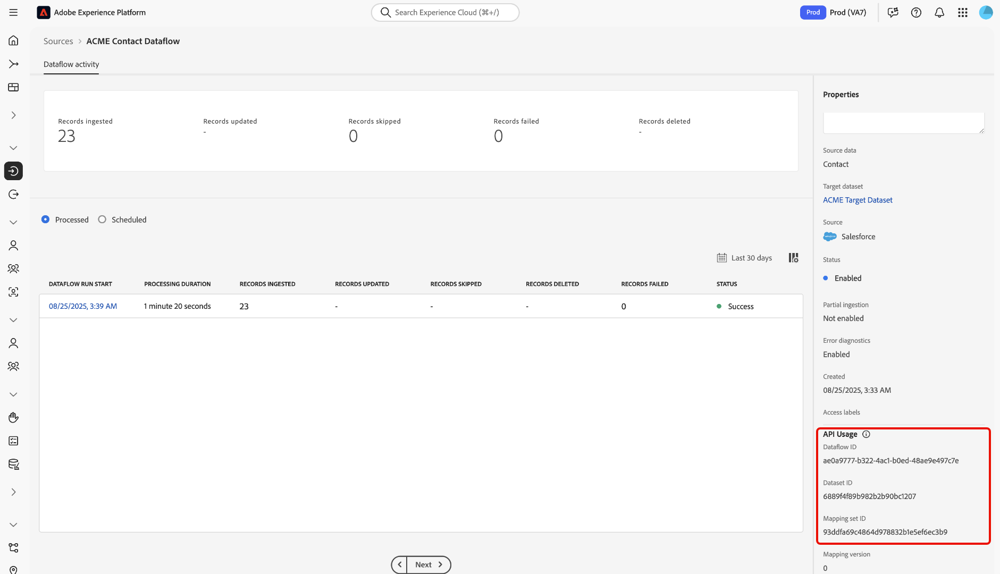

# Créer un flux de données pour ingérer les données d’une source

Lisez ce guide pour savoir comment créer un flux de données et ingérer des données dans Adobe Experience Platform à l’aide de l’[[!DNL Flow Service] API](https://developer.adobe.com/experience-platform-apis/references/flow-service/).

## Commencer

Ce guide nécessite une compréhension professionnelle des composants suivants d’Experience Platform :

* [Ingestion par lots](../../../../ingestion/batch-ingestion/overview.md) : découvrez comment télécharger efficacement d’importants volumes de données par lots.
* [Service de catalogue](../../../../catalog/datasets/overview.md) : organisez et suivez vos jeux de données dans Experience Platform.
* [Préparation de données](../../../../data-prep/home.md) : transformez et mappez vos données entrantes pour qu’elles correspondent aux exigences de votre schéma.
* [Flux de données](../../../../dataflows/home.md) : configurez et gérez les pipelines qui déplacent vos données des sources vers les destinations.
* [Schémas de modèle de données d’expérience (XDM)](../../../../xdm/home.md) : structurez vos données à l’aide de schémas XDM afin qu’elles soient prêtes à être utilisées dans Experience Platform.
* [Sandbox](../../../../sandboxes/home.md) : testez et développez en toute sécurité dans des environnements isolés sans affecter les données de production.
* [Sources](../../../home.md) : découvrez comment connecter vos sources de données externes à Experience Platform.

### Utilisation des API Experience Platform

Pour plus d’informations sur la manière d’effectuer avec succès des appels vers les API Experience Platform, consultez le guide sur la [Prise en main des API Experience Platform](../../../../landing/api-guide.md).

### Créer une connexion de base

Vous devez disposer d’un compte source entièrement authentifié et de son identifiant de connexion de base correspondant pour créer un flux de données pour votre source. Si vous ne disposez pas de cet identifiant, consultez le [catalogue de sources](../../../home.md) pour obtenir une liste des sources avec lesquelles vous pouvez créer une connexion de base.

### Créer un schéma XDM cible {#target-schema}

Un schéma de modèle de données d’expérience (XDM) offre un moyen normalisé d’organiser et de décrire les données d’expérience client dans Experience Platform. Pour ingérer les données sources dans Experience Platform, vous devez d’abord créer un schéma XDM cible qui définit la structure et les types de données à ingérer. Ce schéma sert de plan directeur pour le jeu de données Experience Platform où se trouveront vos données ingérées.

Un schéma XDM cible peut être créé en adressant une requête POST à l’[API Schema Registry](https://developer.adobe.com/experience-platform-apis/references/schema-registry/). Lisez les guides suivants pour obtenir des instructions détaillées sur la création d’un schéma XDM cible :

* [Créez un schéma à l’aide de l’API](../../../../xdm/api/schemas.md).
* [Créez un schéma à l’aide de l’interface utilisateur](../../../../xdm/tutorials/create-schema-ui.md).

Une fois créé, le schéma XDM cible `$id` sera requis ultérieurement pour votre jeu de données cible et votre mappage.

### Créer un jeu de données cible {#target-dataset}

Un jeu de données est une structure de stockage et de gestion pour une collection de données, généralement sous la forme d’un tableau, qui contient un schéma (des colonnes) et des champs (des lignes). Les données correctement ingérées par Experience Platform sont stockées dans le lac de données sous forme de jeux de données. Au cours de cette étape, vous pouvez créer un jeu de données ou utiliser un jeu de données existant.

Vous pouvez créer un jeu de données cible en adressant une requête POST à l’[API Catalog Service](https://developer.adobe.com/experience-platform-apis/references/catalog/), tout en fournissant l’identifiant du schéma cible dans la payload. Pour obtenir des instructions détaillées sur la création d’un jeu de données cible, consultez le guide [création d’un jeu de données à l’aide de l’API](../../../../catalog/api/create-dataset.md).

>[!TIP]
>
>Si vous souhaitez ingérer vos données dans le profil client en temps réel, vous devez vous assurer que vos schémas XDM cibles et votre jeu de données cible sont activés pour le profil.

+++Sélectionner pour afficher l’exemple

**Format d’API**

```HTTP
POST /dataSets
```

**Requête**

L’exemple suivant montre comment créer un jeu de données cible activé pour l’ingestion du profil client en temps réel. Dans cette requête, la propriété `unifiedProfile` est définie sur `true` (sous l’objet `tags` ), ce qui indique à Experience Platform d’inclure ce jeu de données dans le profil client en temps réel.

```shell
curl -X POST \
  'https://platform.adobe.io/data/foundation/catalog/dataSets' \
  -H 'Authorization: Bearer {ACCESS_TOKEN}' \
  -H 'x-api-key: {API_KEY}' \
  -H 'x-gw-ims-org-id: {ORG_ID}' \
  -H 'x-sandbox-name: {SANDBOX_NAME}' \
  -H 'Content-Type: application/json' \
  -d '{
    "name": "ACME Target Dataset",
    "schemaRef": {
      "id": "https://ns.adobe.com/{TENANT_ID}/schemas/719c4e19184402c27595e65b931a142b",
      "contentType": "application/vnd.adobe.xed+json;version=1"
    },
    "tags": {
      "unifiedProfile": [
        "enabled: true"
      ]
    }
  }'
```

| Propriété | Description |
| --- | --- |
| `name` | Nom explicite de votre jeu de données cible. Utilisez un nom clair et unique pour faciliter l’identification et la gestion de votre jeu de données dans les opérations futures. |
| `schemaRef.id` | Identifiant de votre schéma XDM cible. |
| `tags.unifiedProfile` | Valeur booléenne qui indique à Experience Platform si les données doivent être ingérées par le profil client en temps réel. |

**Réponse**

Une réponse réussie renvoie l’identifiant du jeu de données cible. Cet identifiant est requis ultérieurement pour créer une connexion cible.

```json
[
    "@/dataSets/6889f4f89b982b2b90bc1207"
]
```

+++

## Créer une connexion source

Une connexion source définit la manière dont les données sont importées dans Experience Platform à partir d’une source externe. Il spécifie à la fois le système source et le format des données entrantes, et il fait référence à une connexion de base contenant des détails d’authentification. Chaque connexion source est propre à votre organisation.

* Pour les sources basées sur des fichiers (telles que les stockages dans le cloud), une connexion source peut inclure des paramètres tels que le délimiteur de colonne, le type de codage, le type de compression, les expressions régulières pour la sélection de fichiers et le fait d’ingérer des fichiers de manière récursive ou non.
* Pour les sources basées sur un tableau (telles que les bases de données, les CRM et les fournisseurs d’automatisation marketing), une connexion source peut spécifier des détails tels que le nom du tableau et les mappages de colonnes.

Pour créer une connexion source, envoyez une requête POST au point d’entrée `/sourceConnections` de l’API [!DNL Flow Service] et indiquez votre identifiant de connexion de base, l’identifiant de spécification de connexion et le chemin d’accès au fichier de données source.

**Format d’API**

```http
POST /sourceConnections
```

**Requête**

```shell
curl -X POST \
  'https://platform.adobe.io/data/foundation/flowservice/sourceConnections' \
  -H 'Authorization: Bearer {ACCESS_TOKEN}' \
  -H 'x-api-key: {API_KEY}' \
  -H 'x-gw-ims-org-id: {ORG_ID}' \
  -H 'x-sandbox-name: {SANDBOX_NAME}' \
  -H 'Content-Type: application/json' \
  -d '{
    "name": "ACME source connection",
    "baseConnectionId": "6990abad-977d-41b9-a85d-17ea8cf1c0e4",
    "description": "A source connection for ACME contact data",
    "data": {
      "format": "tabular"
    },
    "params": {
      "tableName": "Contact",
      "columns": [
        {
          "name": "TestID",
          "type": "string",
          "xdm": {
            "type": "string"
          }
        },
        {
          "name": "Name",
          "type": "string",
          "xdm": {
            "type": "string"
          }
        },
        {
          "name": "Datefield",
          "type": "string",
          "meta:xdmType": "date-time",
          "xdm": {
            "type": "string",
            "format": "date-time"
          }
        }
      ],
      "cdcEnabled": true
    },
    "connectionSpec": {
      "id": "cfc0fee1-7dc0-40ef-b73e-d8b134c436f5",
      "version": "1.0"
    }
  }'
```

| Propriété | Description |
| --- | --- |
| `name` | Nom descriptif de votre connexion source. Utilisez un nom clair et unique pour faciliter l’identification et la gestion de votre connexion dans les opérations futures. |
| `description` | Description facultative que vous pouvez ajouter pour fournir des informations supplémentaires sur votre connexion source. |
| `baseConnectionId` | `id` de votre connexion de base. Vous pouvez récupérer cet identifiant en authentifiant votre source sur Experience Platform à l’aide de l’API [!DNL Flow Service]. |
| `data.format` | Format des données. Définissez cette valeur sur `tabular` pour les sources basées sur des tableaux (telles que les bases de données, les CRM et les fournisseurs d’automatisation marketing). |
| `params.tableName` | Nom de la table de votre compte source que vous souhaitez ingérer dans Experience Platform. |
| `params.columns` | Les colonnes de tableau spécifiques des données que vous souhaitez ingérer dans Experience Platform. |
| `params.cdcEnabled` | Valeur booléenne qui indique si la capture de l’historique des modifications est activée ou non. Cette propriété est prise en charge par les sources de base de données suivantes : <ul><li>[!DNL Azure Databricks]</li><li>[!DNL Google BigQuery]</li><li>[!DNL Snowflake]</li></ul> Pour plus d’informations, consultez le guide sur l’utilisation de [modifier la capture de données dans les sources](../change-data-capture.md). |
| `connectionSpec.id` | Identifiant de spécification de connexion de la source que vous utilisez. |

**Réponse**

Une réponse réussie renvoie l’identifiant de votre connexion source. Cet identifiant est requis pour créer un flux de données et ingérer vos données.

```json
{
    "id": "b7581b59-c603-4df1-a689-d23d7ac440f3",
    "etag": "\"ef05d265-0000-0200-0000-6019e0080000\""
}
```

## Créer une connexion cible {#target-connection}

Une connexion cible représente la connexion à la destination où se trouvent les données ingérées. Pour créer une connexion cible, vous devez indiquer l’identifiant de spécification de connexion fixe associé au lac de données. Cet identifiant de spécification de connexion est : `c604ff05-7f1a-43c0-8e18-33bf874cb11c`.

**Format d’API**

```http
POST /targetConnections
```

**Requête**

```shell
curl -X POST \
  'https://platform.adobe.io/data/foundation/flowservice/targetConnections' \
  -H 'Authorization: Bearer {ACCESS_TOKEN}' \
  -H 'x-api-key: {API_KEY}' \
  -H 'x-gw-ims-org-id: {ORG_ID}' \
  -H 'x-sandbox-name: {SANDBOX_NAME}' \
  -H 'Content-Type: application/json' \
  -d '{
      "name": "ACME target connection",
      "description": "ACME target connection",
      "data": {
          "schema": {
              "id": "https://ns.adobe.com/{TENANT_ID}/schemas/52b59140414aa6a370ef5e21155fd7a686744b8739ecc168",
              "version": "application/vnd.adobe.xed-full+json;version=1"
          }
      },
      "params": {
          "dataSetId": "6889f4f89b982b2b90bc1207"
      },
      "connectionSpec": {
          "id": "c604ff05-7f1a-43c0-8e18-33bf874cb11c",
          "version": "1.0"
      }
    }'
```

| Propriété | Description |
| --- | --- |
| `name` | Nom explicite de votre connexion cible. Utilisez un nom clair et unique pour faciliter l’identification et la gestion de votre connexion dans les opérations futures. |
| `description` | Description facultative que vous pouvez ajouter pour fournir des informations supplémentaires sur votre connexion cible. |
| `data.schema.id` | Identifiant de votre schéma XDM cible. |
| `params.dataSetId` | Identifiant de votre jeu de données cible. |
| `connectionSpec.id` | Identifiant de spécification de connexion du lac de données. Cet identifiant est corrigé : `c604ff05-7f1a-43c0-8e18-33bf874cb11c`. |

## Mappage {#mapping}

Ensuite, vous devez mapper vos données source au schéma cible auquel votre jeu de données cible se conforme. Pour créer un mappage, envoyez une requête POST au point d’entrée `mappingSets` de l’[[!DNL Data Prep] API](https://developer.adobe.com/experience-platform-apis/references/data-prep/), indiquez votre identifiant de schéma XDM cible et les détails des jeux de mappages que vous souhaitez créer.

**Format d’API**

```http
POST /mappingSets
```

**Requête**

```shell
curl -X POST \
  'https://platform.adobe.io/data/foundation/conversion/mappingSets' \
  -H 'Authorization: Bearer {ACCESS_TOKEN}' \
  -H 'x-api-key: {API_KEY}' \
  -H 'x-gw-ims-org-id: {ORG_ID}' \
  -H 'x-sandbox-name: {SANDBOX_NAME}' \
  -H 'Content-Type: application/json' \
  -d '{
      "version": 0,
      "xdmSchema": "https://ns.adobe.com/{TENANT_ID}/schemas/52b59140414aa6a370ef5e21155fd7a686744b8739ecc168",
      "xdmVersion": "1.0",
      "id": null,
      "mappings": [
          {
              "destinationXdmPath": "_id",
              "sourceAttribute": "TestID",
              "identity": false,
              "identityGroup": null,
              "namespaceCode": null,
              "version": 0
          },
          {
              "destinationXdmPath": "person.name.fullName",
              "sourceAttribute": "Name",
              "identity": false,
              "identityGroup": null,
              "namespaceCode": null,
              "version": 0
          },
          {
              "destinationXdmPath": "person.birthDate",
              "sourceAttribute": "Datefield",
              "identity": false,
              "identityGroup": null,
              "namespaceCode": null,
              "version": 0
          }
      ]
  }'
```

| Propriété | Description |
| -------- | ----------- |
| `xdmSchema` | La valeur `$id` du schéma XDM cible. |

**Réponse**

Une réponse réussie renvoie les détails du mappage nouvellement créé, y compris son identifiant unique (`id`). Cet identifiant est requis lors d’une étape ultérieure pour créer un flux de données.

```json
{
    "id": "93ddfa69c4864d978832b1e5ef6ec3b9",
    "version": 0,
    "createdDate": 1612309018666,
    "modifiedDate": 1612309018666,
    "createdBy": "{CREATED_BY}",
    "modifiedBy": "{MODIFIED_BY}"
}
```

## Récupérer des spécifications du flux de données

Avant de pouvoir créer un flux de données, vous devez d’abord récupérer les spécifications du flux de données qui correspondent à votre source. Pour récupérer ces informations, envoyez une requête GET au point d’entrée `/flowSpecs` de l’API [!DNL Flow Service].

**Format d’API**

```http
GET /flowSpecs?property=name=="{NAME}"
```

| Paramètre de requête | Description |
| --- | --- |
| `property=name=="{NAME}"` | Nom de votre spécification de flux de données. <ul><li>Pour les sources basées sur des fichiers (telles que l’espace de stockage dans le cloud), définissez cette valeur sur `CloudStorageToAEP`.</li><li>Pour les sources basées sur des tableaux (telles que les bases de données, les CRM et les fournisseurs d’automatisation marketing), définissez cette valeur sur `CRMToAEP`.</li></ul> |

**Requête**

```shell
curl -X GET \
  'https://platform.adobe.io/data/foundation/flowservice/flowSpecs?property=name=="CRMToAEP"' \
  -H 'x-api-key: {API_KEY}' \
  -H 'x-gw-ims-org-id: {ORG_ID}' \
  -H 'x-sandbox-name: {SANDBOX_NAME}'
```

**Réponse**

Une réponse réussie renvoie les détails de la spécification du flux de données responsable de l’importation des données de votre source dans Experience Platform. La réponse inclut la valeur `id` unique de spécification de flux requise pour créer un flux de données.

Pour vous assurer que vous utilisez la spécification de flux de données appropriée, vérifiez le tableau `items.sourceConnectionSpecIds` dans la réponse. Vérifiez que l’identifiant de spécification de connexion pour votre source est inclus dans cette liste.

+++Sélectionner pour afficher

```json
{
    "items": [
        {
            "id": "14518937-270c-4525-bdec-c2ba7cce3860",
            "name": "CRMToAEP",
            "providerId": "0ed90a81-07f4-4586-8190-b40eccef1c5a",
            "version": "1.0",
            "sourceConnectionSpecIds": [
                "3416976c-a9ca-4bba-901a-1f08f66978ff",
                "38ad80fe-8b06-4938-94f4-d4ee80266b07",
                "d771e9c1-4f26-40dc-8617-ce58c4b53702",
                "3c9b37f8-13a6-43d8-bad3-b863b941fedd",
                "cc6a4487-9e91-433e-a3a3-9cf6626c1806",
                "3000eb99-cd47-43f3-827c-43caf170f015",
                "26d738e0-8963-47ea-aadf-c60de735468a",
                "74a1c565-4e59-48d7-9d67-7c03b8a13137",
                "cfc0fee1-7dc0-40ef-b73e-d8b134c436f5",
                "4f63aa36-bd48-4e33-bb83-49fbcd11c708",
                "cb66ab34-8619-49cb-96d1-39b37ede86ea",
                "eb13cb25-47ab-407f-ba89-c0125281c563",
                "1f372ff9-38a4-4492-96f5-b9a4e4bd00ec",
                "37b6bf40-d318-4655-90be-5cd6f65d334b",
                "a49bcc7d-8038-43af-b1e4-5a7a089a7d79",
                "a8b6a1a4-5735-42b4-952c-85dce0ac38b5",
                "6a8d82bc-1caf-45d1-908d-cadabc9d63a6",
                "aac9bbd4-6c01-46ce-b47e-51c6f0f6db3f",
                "8e6b41a8-d998-4545-ad7d-c6a9fff406c3",
                "ecde33f2-c56f-46cc-bdea-ad151c16cd69",
                "09182899-b429-40c9-a15a-bf3ddbc8ced7",
                "0479cc14-7651-4354-b233-7480606c2ac3",
                "d6b52d86-f0f8-475f-89d4-ce54c8527328",
                "a8f4d393-1a6b-43f3-931f-91a16ed857f4",
                "fcad62f3-09b0-41d3-be11-449d5a621b69",
                "ea1c2a08-b722-11eb-8529-0242ac130003",
                "35d6c4d8-c9a9-11eb-b8bc-0242ac130003",
                "b2e08744-4f1a-40ce-af30-7abac3e23cf3",
                "2acf109f-9b66-4d5e-bc18-ebb2adcff8d5",
                "2fa8af9c-2d1a-43ea-a253-f00a00c74412",
                "e9d7ec6b-0873-4e57-ad21-b3a7c65e310b"
            ],
            "targetConnectionSpecIds": [
                "c604ff05-7f1a-43c0-8e18-33bf874cb11c"
            ],
            "optionSpec": {
                "name": "OptionSpec",
                "spec": {
                    "$schema": "http://json-schema.org/draft-07/schema#",
                    "type": "object",
                    "properties": {
                        "errorDiagnosticsEnabled": {
                            "title": "Error diagnostics.",
                            "description": "Flag to enable detailed and sample error diagnostics summary.",
                            "type": "boolean",
                            "default": false
                        },
                        "partialIngestionPercent": {
                            "title": "Partial ingestion threshold.",
                            "description": "Percentage which defines the threshold of errors allowed before the run is marked as failed.",
                            "type": "number",
                            "exclusiveMinimum": 0
                        }
                    }
                }
            },
            "transformationSpecs": [
                {
                    "name": "Copy",
                    "spec": {
                        "$schema": "http://json-schema.org/draft-07/schema#",
                        "type": "object",
                        "properties": {
                            "deltaColumn": {
                                "type": "object",
                                "properties": {
                                    "name": {
                                        "type": "string"
                                    },
                                    "dateFormat": {
                                        "type": "string"
                                    },
                                    "timezone": {
                                        "type": "string"
                                    }
                                },
                                "required": [
                                    "name"
                                ]
                            }
                        },
                        "required": [
                            "deltaColumn"
                        ]
                    }
                },
                {
                    "name": "Mapping",
                    "spec": {
                        "$schema": "http://json-schema.org/draft-07/schema#",
                        "type": "object",
                        "description": "defines various params required for different mapping from source to target",
                        "properties": {
                            "mappingId": {
                                "type": "string"
                            },
                            "mappingVersion": {
                                "type": "string"
                            }
                        }
                    }
                }
            ],
            "scheduleSpec": {
                "name": "PeriodicSchedule",
                "type": "Periodic",
                "spec": {
                    "$schema": "http://json-schema.org/draft-07/schema#",
                    "type": "object",
                    "properties": {
                        "startTime": {
                            "description": "epoch time",
                            "type": "integer"
                        },
                        "frequency": {
                            "type": "string",
                            "enum": [
                                "once",
                                "minute",
                                "hour",
                                "day",
                                "week"
                            ]
                        },
                        "interval": {
                            "type": "integer"
                        },
                        "backfill": {
                            "type": "boolean",
                            "default": true
                        }
                    },
                    "required": [
                        "startTime",
                        "frequency"
                    ],
                    "if": {
                        "properties": {
                            "frequency": {
                                "const": "once"
                            }
                        }
                    },
                    "then": {
                        "allOf": [
                            {
                                "not": {
                                    "required": [
                                        "interval"
                                    ]
                                }
                            },
                            {
                                "not": {
                                    "required": [
                                        "backfill"
                                    ]
                                }
                            }
                        ]
                    },
                    "else": {
                        "required": [
                            "interval"
                        ],
                        "if": {
                            "properties": {
                                "frequency": {
                                    "const": "minute"
                                }
                            }
                        },
                        "then": {
                            "properties": {
                                "interval": {
                                    "minimum": 15
                                }
                            }
                        },
                        "else": {
                            "properties": {
                                "interval": {
                                    "minimum": 1
                                }
                            }
                        }
                    }
                }
            },
            "runSpec": {
                "name": "ProviderParams",
                "spec": {
                    "$schema": "http://json-schema.org/draft-07/schema#",
                    "type": "object",
                    "description": "defines various params required for creating flow run.",
                    "properties": {
                        "startTime": {
                            "type": "integer",
                            "description": "An integer that defines the start time of the run. The value is represented in Unix epoch time."
                        },
                        "windowStartTime": {
                            "type": "integer",
                            "description": "An integer that defines the start time of the window against which data is to be pulled. The value is represented in Unix epoch time."
                        },
                        "windowEndTime": {
                            "type": "integer",
                            "description": "An integer that defines the end time of the window against which data is to be pulled. The value is represented in Unix epoch time."
                        },
                        "deltaColumn": {
                            "type": "object",
                            "description": "The delta column is required to partition the data and separate newly ingested data from historic data.",
                            "properties": {
                                "name": {
                                    "type": "string"
                                },
                                "dateFormat": {
                                    "type": "string"
                                },
                                "timezone": {
                                    "type": "string"
                                }
                            },
                            "required": [
                                "name"
                            ]
                        }
                    },
                    "required": [
                        "startTime",
                        "windowStartTime",
                        "windowEndTime",
                        "deltaColumn"
                    ]
                }
            },
            "attributes": {
                "recordTypeEnabled": true,
                "defaultRecordType": "profile",
                "isSourceFlow": true,
                "flacValidationSupported": true,
                "isDraftModeSupported": true,
                "frequency": "batch",
                "notification": {
                    "category": "sources",
                    "flowRun": {
                        "enabled": true
                    }
                }
            },
            "permissionsInfo": {
                "manage": [
                    {
                        "@type": "lowLevel",
                        "name": "EnterpriseSource",
                        "permissions": [
                            "write"
                        ]
                    }
                ],
                "view": [
                    {
                        "@type": "lowLevel",
                        "name": "EnterpriseSource",
                        "permissions": [
                            "read"
                        ]
                    }
                ]
            }
        }
    ]
}
```

+++

## Créer un flux de données

Un flux de données est un pipeline configuré qui transfère des données entre les services Experience Platform. Il définit la manière dont les données sont ingérées à partir de sources externes (telles que des bases de données, un espace de stockage dans le cloud ou des API), traitées et acheminées vers des jeux de données cibles. Ces jeux de données sont ensuite utilisés par des services tels que le service d’identités, le profil client en temps réel et Destinations pour l’activation et l’analyse.

Pour créer un flux de données, vous devez disposer de valeurs pour les éléments suivants :

* ID de connexion source
* ID de connexion cible
* Identifiant de mappage
* ID de spécification de flux de données

Au cours de cette étape, vous pouvez utiliser les paramètres suivants dans `scheduleParams` pour configurer un planning d’ingestion pour votre flux de données :

| Paramètre de planification | Description |
| --- | --- |
| `startTime` | Heure (en secondes) à laquelle le flux de données doit commencer. |
| `frequency` | Fréquence d’ingestion. Configurez la fréquence pour indiquer la fréquence d’exécution du flux de données. Vous pouvez définir la fréquence sur : <ul><li>`once` : définissez la fréquence sur `once` pour créer une ingestion unique. Les configurations d’intervalle et de renvoi ne sont pas disponibles lors de la création d’un flux de données d’ingestion unique. Par défaut, la fréquence de planification est définie sur une seule fois.</li><li>`minute` : définissez la fréquence sur `minute` pour planifier le flux de données afin d’ingérer les données par minute.</li><li>`hour` : définissez la fréquence sur `hour` pour planifier le flux de données afin d’ingérer les données toutes les heures.</li><li>`day` : définissez la fréquence sur `day` pour planifier le flux de données afin d’ingérer les données par jour.</li><li>`week` : définissez la fréquence sur `week` afin de planifier le flux de données pour l’ingestion de données sur une base hebdomadaire.</li></ul> |
| `interval` | Intervalle entre des ingestions consécutives (requis pour toutes les fréquences, à l’exception de `once`). Configurez le paramètre d’intervalle pour établir la période entre chaque ingestion. Par exemple, si vous définissez la fréquence sur jour et configurez l’intervalle sur 15, votre flux de données s’exécutera tous les 15 jours. Vous ne pouvez pas définir l’intervalle sur zéro. La valeur d’intervalle minimale acceptée pour chaque fréquence est la suivante :<ul><li>`once` : s.o.</li><li>`minute` : 15</li><li>`hour` : 1</li><li>`day` : 1</li><li>`week` : 1</li></ul> |
| `backfill` | Indique s’il faut ingérer les données historiques antérieures à la `startTime`. |

{style="table-layout:auto"}


**Format d’API**

```http
POST /flows
```

**Requête**

```shell
curl -X POST \
  'https://platform.adobe.io/data/foundation/flowservice/flows' \
  -H 'x-api-key: {API_KEY}' \
  -H 'x-gw-ims-org-id: {ORG_ID}' \
  -H 'x-sandbox-name: {SANDBOX_NAME}' \
  -H 'Content-Type: application/json' \
  -d '{
      "name": "ACME Contact Dataflow",
      "description": "A dataflow for ACME contact data",
      "flowSpec": {
          "id": "14518937-270c-4525-bdec-c2ba7cce3860",
          "version": "1.0"
      },
      "sourceConnectionIds": [
          "b7581b59-c603-4df1-a689-d23d7ac440f3"
      ],
      "targetConnectionIds": [
          "320f119a-5ac1-4ab1-88ea-eb19e674ea2e"
      ],
      "transformations": [
          {
              "name": "Copy",
              "params": {
                  "deltaColumn": {
                      "name": "Datefield",
                      "dateFormat": "YYYY-MM-DD",
                      "timezone": "UTC"
                  }
              }
          },
          {
              "name": "Mapping",
              "params": {
                  "mappingId": "93ddfa69c4864d978832b1e5ef6ec3b9",
                  "mappingVersion": 0
              }
          }
      ],
      "scheduleParams": {
          "startTime": "1612310466",
          "frequency":"minute",
          "interval":"15",
          "backfill": "true"
      }
  }'
```

| Propriété | Description |
| --- | --- |
| `name` | Nom explicite de votre flux de données. Utilisez un nom clair et unique pour faciliter l’identification et la gestion de votre flux de données dans les opérations futures. |
| `description` | Description facultative que vous pouvez ajouter pour fournir des informations supplémentaires sur votre flux de données. |
| `flowSpec.id` | Identifiant de la spécification de flux qui correspond à votre source. |
| `sourceConnectionIds` | Identifiant de connexion source généré lors d’une étape précédente. |
| `targetConnectionIds` | Identifiant de connexion cible généré lors d’une étape précédente. |
| `transformations.params.deltaColum` | Colonne désignée utilisée pour différencier les données nouvelles des données existantes. Les données incrémentielles seront ingérées en fonction de la date et de l’heure de la colonne sélectionnée. Le format pris en charge pour `deltaColumn` est `yyyy-MM-dd HH:mm:ss`. Par [!DNL Microsoft Dynamics], le format pris en charge pour `deltaColumn` est `yyyy-MM-ddTHH:mm:ssZ`. |
| `transformations.params.deltaColumn.dateFormat` | Format de date à suivre pour la colonne delta. |
| `transformations.params.deltaColumn.timeZone` | Fuseau horaire à utiliser lors de l’interprétation des valeurs de la colonne delta. |
| `transformations.params.mappingId` | Identifiant de mappage généré lors d’une étape précédente. |
| `scheduleParams.startTime` | Heure de début du flux de données en temps Unix (secondes depuis Unix epoch). Détermine le moment où le flux de données commencera sa première exécution. |
| `scheduleParams.frequency` | Fréquence d’exécution du flux de données. Les valeurs possibles sont les suivantes : `once`, `minute`, `hour`, `day` ou `week`. |
| `scheduleParams.interval` | Intervalle entre des exécutions consécutives de flux de données, en fonction de la fréquence sélectionnée. Doit être un entier non nul. Par exemple, un intervalle de `15` avec des `minute` de fréquence signifie que le flux de données s’exécute toutes les 15 minutes. |
| `scheduleParams.backfill` | Valeur booléenne (`true` ou `false`) qui détermine s’il faut ingérer des données historiques (renvoi) lors de la première création du flux de données. |

{style="table-layout:auto"}

**Réponse**

Une réponse réussie renvoie l’identifiant (`id`) du flux de données nouvellement créé.

```json
{
    "id": "ae0a9777-b322-4ac1-b0ed-48ae9e497c7e",
    "etag": "\"770029f8-0000-0200-0000-6019e7d40000\""
}
```

### Utiliser l’interface utilisateur pour valider le workflow de l’API

Vous pouvez utiliser l’interface utilisateur d’Experience Platform pour valider la création de votre flux de données. Accédez au catalogue *[!UICONTROL Sources]* dans l’interface utilisateur d’Experience Platform, puis sélectionnez **[!UICONTROL Flux de données]** dans les onglets d’en-tête. Ensuite, utilisez la colonne [!UICONTROL Nom du flux de données] et recherchez le flux de données que vous avez créé à l’aide de l’API [!DNL Flow Service].


Vous pouvez valider davantage votre flux de données par le biais de l’interface [!UICONTROL Activité de flux de données]. Utilisez le rail de droite pour afficher les informations [!UICONTROL utilisation de l’API] de votre flux de données. Cette section affiche le même ID de flux de données, l’ID de jeu de données et l’ID de mappage que ceux générés lors du processus de création de flux de données dans [!DNL Flow Service].



## Étapes suivantes

Ce tutoriel vous a guidé tout au long du processus de création d’un flux de données dans Experience Platform à l’aide de l’API [!DNL Flow Service]. Vous avez appris à créer et configurer les composants nécessaires, notamment le schéma XDM cible, le jeu de données, la connexion source, la connexion cible et le flux de données lui-même. En suivant ces étapes, vous pouvez automatiser l’ingestion des données provenant de sources externes dans Experience Platform, ce qui permet aux services en aval tels que le profil client en temps réel et Destinations d’exploiter vos données ingérées pour des cas d’utilisation avancés.

### Surveiller votre flux de données

Une fois votre flux de données créé, vous pouvez surveiller les données ingérées et afficher les informations relatives au taux d’ingestion, aux succès et aux erreurs. Pour plus d’informations sur la surveillance des flux de données, consultez le tutoriel sur la [surveillance des comptes et des flux de données](../../../../dataflows/ui/monitor-sources.md).

### Mettre à jour votre flux de données

Pour mettre à jour les configurations pour la planification, le mappage et les informations générales de vos flux de données, consultez le tutoriel sur la [mise à jour des flux de données sources](../../api/update-dataflows.md).

## Supprimer le flux de données

Vous pouvez supprimer les flux de données qui ne sont plus nécessaires ou qui ont été créés de manière incorrecte à l’aide de la fonction **[!UICONTROL Supprimer]**, disponible dans l’espace de travail **[!UICONTROL Flux de données]**. Pour plus d’informations sur la suppression des flux de données, consultez le tutoriel sur la [suppression de flux de données](../../api/delete.md).