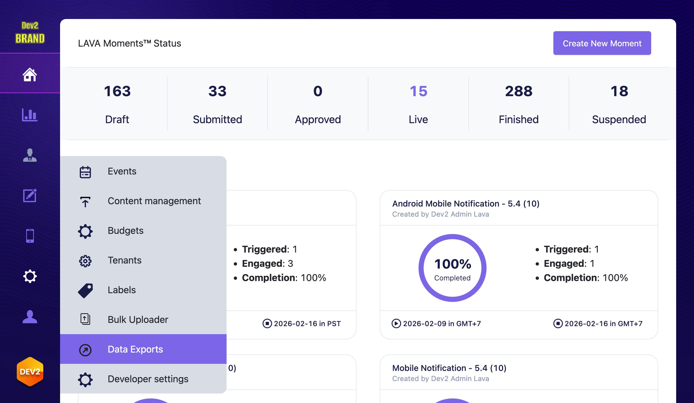
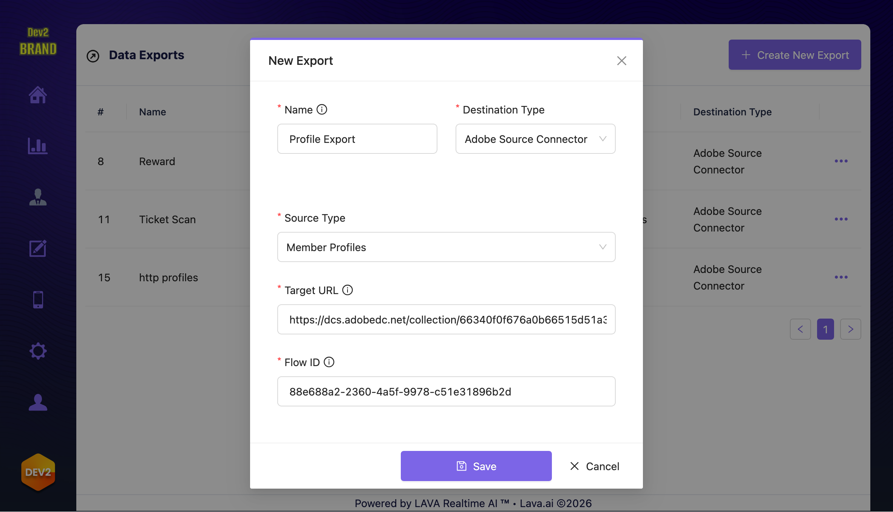

# Créez une connexion source et un flux de données pour diffuser [!DNL LAVA] données à l’aide de l’API [!DNL Flow Service]

## Prise en main

Ce guide nécessite une compréhension professionnelle des composants suivants d’Experience Platform :

* [Sources](../../../../home.md) : utilisez les sources dans Experience Platform pour importer facilement des données provenant de divers systèmes. Les sources vous aident à collecter, organiser et préparer vos données afin de tirer le meilleur parti des fonctionnalités d’Experience Platform.
* [Sandbox](../../../../../sandboxes/home.md) : les sandbox vous permettent de créer, de tester et d’expérimenter en toute sécurité dans Experience Platform sans affecter vos données de production. Ils créent des environnements distincts afin que vous puissiez tester différentes fonctionnalités, développer de nouvelles fonctionnalités ou collaborer sans risque avec votre équipe.

>[!TIP]
>
>Avant de commencer ce tutoriel, consultez la [[!DNL LAVA]  présentation du connecteur source ](../../../../connectors/loyalty/lava.md) pour vous assurer que vous remplissez toutes les conditions préalables.

## Charger le package [!DNL LAVA]

[!DNL LAVA] fournit un package qui inclut nos groupes de champs, schémas, espaces de noms d’identité et jeux de données recommandés pour l’utilisation de [!DNL LAVA] dans Experience Platform. L’utilisation de ces packages est recommandée, mais pas obligatoire.

Lisez cette section pour savoir comment importer ceci dans votre sandbox et obtenir les identifiants requis pour les étapes suivantes.

**Format d’API**

```https
POST /transfer/pullRequest
```

**Requête**

La requête suivante charge le package pour [!DNL LAVA] :

```shell
curl -X POST \
  'https://platform.adobe.io/data/foundation/exim/transfer/pullRequest' \
  -H 'Authorization: Bearer {ACCESS_TOKEN}' \
  -H 'x-api-key: {API_KEY}' \
  -H 'x-gw-ims-org-id: {ORG_ID}' \
  -H 'x-sandbox-name: {SANDBOX_NAME}' \
  -H 'Content-Type: application/json' \
  -d '{
    "imsOrgId": "1EF71E43679AAD1E0A495C77@AdobeOrg",
    "packageId": "416a0c2a32794092aa1a957cbe9a6698"
  }'
```


| Propriété | Description | Type | Obligatoire |
| --- | --- | --- | --- |
| `imsOrgId` | L’identifiant de l’organisation source du package. Doit être `1EF71E43679AAD1E0A495C77@AdobeOrg`. | Chaîne | Oui |
| `packageId` | L’identifiant du package à importer. Doit être `416a0c2a32794092aa1a957cbe9a6698`. | Chaîne | Oui |

**Réponse**

Une réponse réussie renvoie des détails sur le package public importé.

```json
{
    "id": "{ID}",
    "version": 0,
    "createdDate": 1729658890425,
    "modifiedDate": 1729658890425,
    "createdBy": "{CREATED_BY}",
    "modifiedBy": "{MODIFIED_BY}",
    "sourceIMSOrgId": "{ORG_ID}",
    "targetIMSOrgId": "{TARGET_ID}",
    "packageId": "{PACKAGE_ID}",
    "status": "PENDING",
    "initiatedBy": "{INITIATED_BY}",
    "pipelineMessageId": "{MESSAGE_ID}",
    "requestType": "PUBLIC"
}
```

### Récupération des schémas

Après avoir importé le package, récupérez les schémas `LAVA Events` et `LAVA Profile` :

**Requête**

```shell
curl -X GET \
  'https://platform.adobe.io/data/foundation/schemaregistry/tenant/schemas?name=LAVA*' \
  -H 'Authorization: Bearer {{ACCESS_TOKEN}}' \
  -H 'x-api-key: {{API_KEY}}' \
  -H 'x-gw-ims-org-id: {{ORG_ID}}' \
  -H 'x-sandbox-name: {{SANDBOX_NAME}}' \
  -H 'Accept: application/vnd.adobe.xed-id+json'
```

**Réponse**

Une réponse réussie renvoie une liste de schémas. Utilisez ces identifiants comme schémas XDM cibles lors d’une étape ultérieure.

```json
{
  "results": [
    ...
    {
      "$id": "https://ns.adobe.com/{TENANT_ID}/schemas/7ff102f217d394e8beff48dcc2c27baae14e28e210d36492",
      "meta:altId": "_{TENANT_ID}.schemas.7ff102f217d394e8beff48dcc2c27baae14e28e210d36492",
      "version": "1.4",
      "title": "LAVA Events"
    },
    {
      "$id": "https://ns.adobe.com/{TENANT_ID}/schemas/991bed7f1d94ccf47bd392bc345ee51e7e0bd19b1de3dbff",
      "meta:altId": "_{TENANT_ID}.schemas.991bed7f1d94ccf47bd392bc345ee51e7e0bd19b1de3dbff",
      "version": "1.2",
      "title": "LAVA Profile"
    },
    //...
  ]
}
```

### Récupérer des jeux de données

Ensuite, utilisez les appels suivants pour récupérer vos identifiants de jeu de données.

**Requête**

```shell
curl -X GET \
  'https://platform.adobe.io/data/foundation/catalog/dataSets?name=LAVA*' \
  -H 'Authorization: Bearer {{ACCESS_TOKEN}}' \
  -H 'x-api-key: {{API_KEY}}' \
  -H 'x-gw-ims-org-id: {{ORG_ID}}' \
  -H 'x-sandbox-name: {{SANDBOX_NAME}}' \
  -H 'Accept: application/json'
```

**Réponse**

```json
{
  "6920eb494131bfcc10305302": {
    "id": "6920eb494131bfcc10305302",
    "name": "LAVA Member Profiles",
    //...
  },
  "6920eb7565bd3ed93a35cd0e": {
    "id": "6920eb7565bd3ed93a35cd0e",
    "name": "LAVA Member Rewards",
    //...
  },
  "6924aecd8d9c85e2d56261e3": {
    "id": "6924aecd8d9c85e2d56261e3",
    "name": "LAVA Events",
    "schemaRef": {
      "id": "https://ns.adobe.com/{TENANT_ID}/schemas/7ff102f217d394e8beff48dcc2c27baae14e28e210d36492",
      "contentType": "application/vnd.adobe.xed-full+json;version=1"
    },
    //...
  }
}
```

## Connexion de [!DNL LAVA] à Experience Platform à l’aide de l’API [!DNL Flow Service]

Le tutoriel suivant vous guide tout au long des étapes nécessaires à la création d’une connexion source [!DNL LAVA] et d’un flux de données pour importer des données [!DNL LAVA] dans Experience Platform à l’aide de l’[[!DNL Flow Service] API](https://developer.adobe.com/experience-platform-apis/references/flow-service).

### Créer une connexion source {#source-connection}

Créez une connexion source en adressant une requête POST à l’API [!DNL Flow Service], tout en fournissant l’identifiant de spécification de connexion de votre source, des détails tels que le nom et la description, ainsi que le format de vos données.

**Format d’API**

```https
POST /sourceConnections
```

**Requête**

La requête suivante crée une connexion source pour [!DNL LAVA] :

```shell
curl -X POST \
  'https://platform.adobe.io/data/foundation/flowservice/sourceConnections' \
  -H 'Authorization: Bearer {ACCESS_TOKEN}' \
  -H 'x-api-key: {API_KEY}' \
  -H 'x-gw-ims-org-id: {ORG_ID}' \
  -H 'x-sandbox-name: {SANDBOX_NAME}' \
  -H 'Content-Type: application/json' \
  -d '{
      "name": "Streaming Source Connection for a Streaming SDK source",
      "description": "Streaming Source Connection for a Streaming SDK source",
      "connectionSpec": {
          "id": "232dfabe-27aa-41c0-a7cf-9961661dc68b",
          "version": "1.0"
      },
      "data": {
          "format": "json"
      }
    }'
```

| Propriété | Description |
| --- | --- |
| `name` | Nom de votre connexion source. Assurez-vous que le nom de votre connexion source est descriptif, car vous pouvez l’utiliser pour rechercher des informations sur votre connexion source. |
| `description` | Valeur facultative que vous pouvez inclure pour fournir plus d’informations sur votre connexion source. |
| `connectionSpec.id` | Identifiant de spécification de connexion correspondant à votre source. Doit être `232dfabe-27aa-41c0-a7cf-9961661dc68b` pour [!DNL LAVA]. |
| `data.format` | Format des données [!DNL LAVA] que vous souhaitez ingérer. Actuellement, le format de données `json` est le seul à être pris en charge. |

**Réponse**

Une réponse réussie renvoie l’identifiant unique (`id`) de la nouvelle connexion source. Cet identifiant est requis lors d’une étape ultérieure pour créer un flux de données.

```json
{
     "id": "246d052c-da4a-494a-937f-a0d17b1c6cf5",
     "etag": "\"712a8c08-fda7-41c2-984b-187f823293d8\""
}
```

### Créer un schéma XDM cible {#target-schema}

>[!IMPORTANT]
>
>Ignorez cette étape si vous avez importé le package [!DNL LAVA], car il inclut les schémas XDM cibles.

Pour que les données sources soient utilisées dans Experience Platform, un schéma cible doit être créé pour structurer les données sources en fonction de vos besoins. Le schéma cible est ensuite utilisé pour créer un jeu de données Experience Platform contenant les données sources. Si vous utilisez plusieurs jeux de données LAVA, par exemple des soldes de membres et des événements d’analyse de ticket, vous pouvez vouloir ou avoir besoin de plusieurs schémas XDM cibles.

Un schéma XDM cible peut être créé en adressant une requête POST à l’[API Schema Registry](https://developer.adobe.com/experience-platform-apis/references/schema-registry/).

Pour obtenir des instructions détaillées sur la création d’un schéma XDM cible, suivez le tutoriel sur la [création d’un schéma à l’aide de l’API](https://experienceleague.adobe.com/docs/experience-platform/xdm/api/schemas.html#create).

### Créer un jeu de données cible {#target-dataset}

>[!IMPORTANT]
>
>Si vous avez déjà importé le package [!DNL LAVA], vous pouvez ignorer cette étape, car le package fournit un jeu de données XDM cible. Cependant, si vous avez besoin de plusieurs jeux de données [!DNL LAVA] (par exemple, un pour les soldes des membres et un autre pour les événements d’analyse des tickets), vous devez créer d’autres jeux de données cibles, si nécessaire.

Un jeu de données cible peut être créé en adressant une requête POST à l’[API Catalog Service](https://developer.adobe.com/experience-platform-apis/references/catalog/) et en fournissant l’identifiant du schéma cible dans la payload.

Pour obtenir des instructions détaillées sur la création d’un jeu de données cible, suivez le tutoriel sur la [création d’un jeu de données à l’aide de l’API](https://experienceleague.adobe.com/docs/experience-platform/catalog/api/create-dataset.html).

### Créer une connexion cible {#target-connection}

Une connexion cible représente la connexion à la destination où les données ingérées doivent être stockées. Pour créer une connexion cible, vous devez fournir l’identifiant fixe de spécification de connexion qui correspond au lac de données. Cet identifiant est `c604ff05-7f1a-43c0-8e18-33bf874cb11c`.

Vous disposez désormais des identifiants uniques d’un schéma cible, d’un jeu de données cible et de l’identifiant de spécification de connexion pour le lac de données. À lʼaide de ces identifiants, vous pouvez créer une connexion cible à l’aide de l’API [!DNL Flow Service] pour spécifier le jeu de données qui contiendra les données source entrantes.

**Format d’API**

```https
POST /targetConnections
```

**Requête**

La requête suivante crée une connexion cible pour [!DNL LAVA] :


```shell
curl -X POST \
  'https://platform.adobe.io/data/foundation/flowservice/targetConnections' \
  -H 'Authorization: Bearer {ACCESS_TOKEN}' \
  -H 'x-api-key: {API_KEY}' \
  -H 'x-gw-ims-org-id: {ORG_ID}' \
  -H 'x-sandbox-name: {SANDBOX_NAME}' \
  -H 'Content-Type: application/json' \
  -d '{
      "name": "Streaming Target Connection for a Streaming SDK source",
      "description": "Streaming Target Connection for a Streaming SDK source",
      "connectionSpec": {
          "id": "c604ff05-7f1a-43c0-8e18-33bf874cb11c",
          "version": "1.0"
      },
      "data": {
          "format": "json",
          "schema": {
              "id": "{TARGET_XDM_SCHEMA}",
              "version": "application/vnd.adobe.xed-full+json;version=1"
          }
      },
      "params": {
          "dataSetId": "{TARGET_DATASET}"
      }
  }'
```


| Propriété | Description |
| -------- | ----------- |
| `name` | Nom de la connexion cible. Assurez-vous que le nom de votre connexion cible est explicite, car vous pouvez l’utiliser pour rechercher des informations sur votre connexion cible. |
| `description` | Valeur facultative que vous pouvez inclure pour fournir plus d’informations sur votre connexion cible. |
| `connectionSpec.id` | Identifiant de spécification de connexion qui correspond au lac de données. Cet ID fixe est `c604ff05-7f1a-43c0-8e18-33bf874cb11c`. |
| `data.format` | Format des données [!DNL LAVA] que vous souhaitez importer dans Experience Platform. |
| `params.dataSetId` | Identifiant du jeu de données cible récupéré lors d’une étape précédente. |


**Réponse**

Une réponse réussie renvoie l’identifiant unique de la nouvelle connexion cible (`id`). Cet identifiant est requis aux étapes suivantes.

```json
{
     "id": "7c96c827-3ffd-460c-a573-e9558f72f263",
     "etag": "\"a196f685-f5e8-4c4c-bfbd-136141bb0c6d\""
}
```

### Créer un mappage {#mapping}

Pour que les données sources soient ingérées dans un jeu de données cible, elles doivent d’abord être mappées au schéma cible auquel le jeu de données cible se rattache. Pour ce faire, il suffit d’adresser une requête POST à [[!DNL Data Prep] API](https://developer.adobe.com/experience-platform-apis/references/data-prep) avec des mappages de données définis dans la payload de la requête.

Lors de l’utilisation du schéma fourni par [!DNL LAVA], le mappage suivant est recommandé :

>[!BEGINTABS]

>[!TAB Profils de membres]

```json
{
  "version": 0,
  "xdmSchema": "{TARGET_XDM_SCHEMA}",
  "xdmVersion": "1.0",
  "mappings": [
    {
      "destinationXdmPath": "_{TENANT_ID}.lavaId",
      "sourceAttribute": "lavaId",
      "identity": false,
      "version": 0
    },
    {
      "destinationXdmPath": "person.name.firstName",
      "sourceAttribute": "firstName",
      "identity": false,
      "version": 0
    },
    {
      "destinationXdmPath": "person.name.lastName",
      "sourceAttribute": "lastName",
      "identity": false,
      "version": 0
    },
    {
      "destinationXdmPath": "personalEmail.address",
      "sourceAttribute": "email",
      "identity": false,
      "version": 0
    },
    {
      "destinationXdmPath": "mobilePhone.number",
      "sourceAttribute": "phone",
      "identity": false,
      "version": 0
    }
  ]
}
```

>[!TAB Soldes des membres]

```json
{
  "version": 0,
  "xdmSchema": "{TARGET_XDM_SCHEMA}",
  "xdmVersion": "1.0",
  "mappings": [
    {
      "destinationXdmPath": "_{TENANT_ID}.lavaId",
      "sourceAttribute": "lavaId",
      "identity": false,
      "version": 0
    },
    {
      "destinationXdmPath": "_{TENANT_ID}.balances",
      "sourceAttribute": "balances",
      "identity": false,
      "version": 0
    }
  ]
}
```

>[!TAB Événements combinés]

```json
{
  "version": 0,
  "xdmSchema": "{TARGET_XDM_SCHEMA}",
  "xdmVersion": "1.0",
  "mappings": [
    {
      "destinationXdmPath": "identityMap",
      "sourceExpression": "to_map(\"LavaId\",to_array(false,to_object(\"id\",lavaId,\"primary\",true)))",
      "sourceType": "EXPRESSION",
      "identity": false,
      "version": 0
    },
    {
      "destinationXdmPath": "eventType",
      "sourceAttribute": "type",
      "identity": false,
      "version": 0
    },
    {
      "destinationXdmPath": "timestamp",
      "sourceAttribute": "timestamp",
      "identity": false,
      "version": 0
    },
    {
      "destinationXdmPath": "_{TENANT_ID}.ticketScan.eventId",
      "sourceAttribute": "eventId",
      "identity": false,
      "version": 0
    },
    {
      "destinationXdmPath": "_{TENANT_ID}.ticketScan.eventName",
      "sourceAttribute": "eventName",
      "identity": false,
      "version": 0
    },
    {
      "destinationXdmPath": "_{TENANT_ID}.ticketScan.eventLabel",
      "sourceAttribute": "eventLabel",
      "identity": false,
      "version": 0
    },
    {
      "destinationXdmPath": "_{TENANT_ID}.ticketScan.venue",
      "sourceAttribute": "venue",
      "identity": false,
      "version": 0
    },
    {
      "destinationXdmPath": "_{TENANT_ID}.ticketScan.venueLabel",
      "sourceAttribute": "venueLabel",
      "identity": false,
      "version": 0
    },
    {
      "destinationXdmPath": "_{TENANT_ID}.ticketScan.section",
      "sourceAttribute": "section",
      "identity": false,
      "version": 0
    },
    {
      "destinationXdmPath": "_{TENANT_ID}.ticketScan.sectionLabel",
      "sourceAttribute": "sectionLabel",
      "identity": false,
      "version": 0
    },
    {
      "destinationXdmPath": "_{TENANT_ID}.ticketScan.row",
      "sourceAttribute": "row",
      "identity": false,
      "version": 0
    },
    {
      "destinationXdmPath": "_{TENANT_ID}.ticketScan.seat",
      "sourceAttribute": "seat",
      "identity": false,
      "version": 0
    },
    {
      "destinationXdmPath": "_{TENANT_ID}.ticketScan.gate",
      "sourceAttribute": "gate",
      "identity": false,
      "version": 0
    },
    {
      "destinationXdmPath": "_{TENANT_ID}.ticketScan.gateLabel",
      "sourceAttribute": "gateLabel",
      "identity": false,
      "version": 0
    },
    {
      "destinationXdmPath": "_{TENANT_ID}.transaction.transactionId",
      "sourceAttribute": "transactionId",
      "identity": false,
      "version": 0
    },
    {
      "destinationXdmPath": "_{TENANT_ID}.transaction.referenceId",
      "sourceAttribute": "referenceId",
      "identity": false,
      "version": 0
    },
    {
      "destinationXdmPath": "_{TENANT_ID}.transaction.subtotal",
      "sourceAttribute": "subtotal",
      "identity": false,
      "version": 0
    },
    {
      "destinationXdmPath": "_{TENANT_ID}.transaction.total",
      "sourceAttribute": "total",
      "identity": false,
      "version": 0
    },
    {
      "destinationXdmPath": "_{TENANT_ID}.transaction.location",
      "sourceAttribute": "location",
      "identity": false,
      "version": 0
    },
    {
      "destinationXdmPath": "_{TENANT_ID}.transaction.items",
      "sourceAttribute": "items",
      "identity": false,
      "version": 0
    },
    {
      "destinationXdmPath": "_{TENANT_ID}.transaction.redeemedAmount",
      "sourceAttribute": "redeemedAmount",
      "identity": false,
      "version": 0
    },
    {
      "destinationXdmPath": "_{TENANT_ID}.transaction.rewardsApplied",
      "sourceAttribute": "rewardsApplied",
      "identity": false,
      "version": 0
    },
    {
      "destinationXdmPath": "_{TENANT_ID}.ledger.amount",
      "sourceAttribute": "amount",
      "identity": false,
      "version": 0
    },
    {
      "destinationXdmPath": "_{TENANT_ID}.ledger.expiresAt",
      "sourceAttribute": "expiresAt",
      "identity": false,
      "version": 0
    },
    {
      "destinationXdmPath": "_{TENANT_ID}.ledger.rewardId",
      "sourceAttribute": "rewardId",
      "identity": false,
      "version": 0
    },
    {
      "destinationXdmPath": "_{TENANT_ID}.ledger.rewardName",
      "sourceAttribute": "rewardName",
      "identity": false,
      "version": 0
    },
    {
      "destinationXdmPath": "_{TENANT_ID}.ledger.rewardSlug",
      "sourceAttribute": "rewardSlug",
      "identity": false,
      "version": 0
    },
    {
      "destinationXdmPath": "_{TENANT_ID}.ledger.rewardType",
      "sourceAttribute": "rewardType",
      "identity": false,
      "version": 0
    }
  ]
}
```

>[!TAB Événements d’analyse de ticket]

```json
{
  "version": 0,
  "xdmSchema": "{TARGET_XDM_SCHEMA}",
  "xdmVersion": "1.0",
  "mappings": [
    {
      "destinationXdmPath": "identityMap",
      "sourceExpression": "to_map(\"LavaId\",to_array(false,to_object(\"id\",lavaId,\"primary\",true)))",
      "sourceType": "EXPRESSION",
      "identity": false,
      "version": 0
    },
    {
      "destinationXdmPath": "_{TENANT_ID}.ticketScan.eventId",
      "sourceAttribute": "eventId",
      "identity": false,
      "version": 0
    },
    {
      "destinationXdmPath": "_{TENANT_ID}.ticketScan.eventName",
      "sourceAttribute": "eventName",
      "identity": false,
      "version": 0
    },
    {
      "destinationXdmPath": "_{TENANT_ID}.ticketScan.eventLabel",
      "sourceAttribute": "eventLabel",
      "identity": false,
      "version": 0
    },
    {
      "destinationXdmPath": "_{TENANT_ID}.ticketScan.venue",
      "sourceAttribute": "venue",
      "identity": false,
      "version": 0
    },
    {
      "destinationXdmPath": "_{TENANT_ID}.ticketScan.venueLabel",
      "sourceAttribute": "venueLabel",
      "identity": false,
      "version": 0
    },
    {
      "destinationXdmPath": "_{TENANT_ID}.ticketScan.section",
      "sourceAttribute": "section",
      "identity": false,
      "version": 0
    },
    {
      "destinationXdmPath": "_{TENANT_ID}.ticketScan.sectionLabel",
      "sourceAttribute": "sectionLabel",
      "identity": false,
      "version": 0
    },
    {
      "destinationXdmPath": "_{TENANT_ID}.ticketScan.row",
      "sourceAttribute": "row",
      "identity": false,
      "version": 0
    },
    {
      "destinationXdmPath": "_{TENANT_ID}.ticketScan.seat",
      "sourceAttribute": "seat",
      "identity": false,
      "version": 0
    },
    {
      "destinationXdmPath": "_{TENANT_ID}.ticketScan.gate",
      "sourceAttribute": "gate",
      "identity": false,
      "version": 0
    },
    {
      "destinationXdmPath": "_{TENANT_ID}.ticketScan.gateLabel",
      "sourceAttribute": "gateLabel",
      "identity": false,
      "version": 0
    },
    {
      "destinationXdmPath": "eventType",
      "sourceAttribute": "type",
      "identity": false,
      "version": 0
    },
    {
      "destinationXdmPath": "timestamp",
      "sourceAttribute": "timestamp",
      "identity": false,
      "version": 0
    }
  ]
}
```

>[!TAB  Événements de transaction ]

```json
{
  "version": 0,
  "xdmSchema": "{TARGET_XDM_SCHEMA}",
  "xdmVersion": "1.0",
  "mappings": [
    {
      "destinationXdmPath": "identityMap",
      "sourceExpression": "to_map(\"LavaId\",to_array(false,to_object(\"id\",lavaId,\"primary\",true)))",
      "sourceType": "EXPRESSION",
      "identity": false,
      "version": 0
    },
    {
      "destinationXdmPath": "_{TENANT_ID}.transaction.transactionId",
      "sourceAttribute": "transactionId",
      "identity": false,
      "version": 0
    },
    {
      "destinationXdmPath": "_{TENANT_ID}.transaction.referenceId",
      "sourceAttribute": "referenceId",
      "identity": false,
      "version": 0
    },
    {
      "destinationXdmPath": "_{TENANT_ID}.transaction.subtotal",
      "sourceAttribute": "subtotal",
      "identity": false,
      "version": 0
    },
    {
      "destinationXdmPath": "_{TENANT_ID}.transaction.total",
      "sourceAttribute": "total",
      "identity": false,
      "version": 0
    },
    {
      "destinationXdmPath": "_{TENANT_ID}.transaction.location",
      "sourceAttribute": "location",
      "identity": false,
      "version": 0
    },
    {
      "destinationXdmPath": "_{TENANT_ID}.transaction.items",
      "sourceAttribute": "items",
      "identity": false,
      "version": 0
    },
    {
      "destinationXdmPath": "_{TENANT_ID}.transaction.redeemedAmount",
      "sourceAttribute": "redeemedAmount",
      "identity": false,
      "version": 0
    },
    {
      "destinationXdmPath": "_{TENANT_ID}.transaction.rewardsApplied",
      "sourceAttribute": "rewardsApplied",
      "identity": false,
      "version": 0
    },
    {
      "destinationXdmPath": "eventType",
      "sourceAttribute": "type",
      "identity": false,
      "version": 0
    },
    {
      "destinationXdmPath": "timestamp",
      "sourceAttribute": "timestamp",
      "identity": false,
      "version": 0
    }
  ]
}
```

>[!TAB Événements comptables]

```json
{
  "version": 0,
  "xdmSchema": "{TARGET_XDM_SCHEMA}",
  "xdmVersion": "1.0",
  "mappings": [
    {
      "destinationXdmPath": "identityMap",
      "sourceExpression": "to_map(\"LavaId\",to_array(false,to_object(\"id\",lavaId,\"primary\",true)))",
      "sourceType": "EXPRESSION",
      "identity": false,
      "version": 0
    },
    {
      "destinationXdmPath": "_{TENANT_ID}.ledger.amount",
      "sourceAttribute": "amount",
      "identity": false,
      "version": 0
    },
    {
      "destinationXdmPath": "_{TENANT_ID}.ledger.expiresAt",
      "sourceAttribute": "expiresAt",
      "identity": false,
      "version": 0
    },
    {
      "destinationXdmPath": "_{TENANT_ID}.ledger.rewardId",
      "sourceAttribute": "rewardId",
      "identity": false,
      "version": 0
    },
    {
      "destinationXdmPath": "_{TENANT_ID}.ledger.rewardName",
      "sourceAttribute": "rewardName",
      "identity": false,
      "version": 0
    },
    {
      "destinationXdmPath": "_{TENANT_ID}.ledger.rewardSlug",
      "sourceAttribute": "rewardSlug",
      "identity": false,
      "version": 0
    },
    {
      "destinationXdmPath": "_{TENANT_ID}.ledger.rewardType",
      "sourceAttribute": "rewardType",
      "identity": false,
      "version": 0
    },
    {
      "destinationXdmPath": "eventType",
      "sourceAttribute": "type",
      "identity": false,
      "version": 0
    },
    {
      "destinationXdmPath": "timestamp",
      "sourceAttribute": "timestamp",
      "identity": false,
      "version": 0
    }
  ]
}
```

>[!ENDTABS]


**Format d’API**

```http
POST /conversion/mappingSets
```

**Requête**

```shell
curl -X POST \
  'https://platform.adobe.io/data/foundation/mappingSets' \
  -H 'Authorization: Bearer {ACCESS_TOKEN}' \
  -H 'x-api-key: {API_KEY}' \
  -H 'x-gw-ims-org-id: {ORG_ID}' \
  -H 'x-sandbox-name: {SANDBOX_NAME}' \
  -H 'Content-Type: application/json' \
  -d '{
      "version": 0,
      "xdmSchema": "{TARGET_XDM_SCHEMA}",
      "xdmVersion": "1.0",
      "mappings": [
          {
              "destinationXdmPath": "_{TENANT_ID}.lavaId",
              "sourceAttribute": "lavaId",
              "identity": false,
              "version": 0
          },
          {
              "destinationXdmPath": "_{TENANT_ID}.balances",
              "sourceAttribute": "balances",
              "identity": false,
              "version": 0
          }
      ]
  }'
```

| Propriété | Description |
| --- | --- |
| `xdmSchema` | Identifiant du [schéma XDM cible](#target-schema) généré lors d’une étape précédente. |
| `mappings.destinationXdmPath` | Chemin XDM de destination vers lequel l’attribut source est mappé. |
| `mappings.sourceAttribute` | Attribut source qui doit être mappé à un chemin XDM de destination. |
| `mappings.identity` | Valeur booléenne qui indique si le jeu de mappage sera marqué pour [!DNL Identity Service]. |

**Réponse**

Une réponse réussie renvoie les détails du mappage nouvellement créé, y compris son identifiant unique (`id`). Cette valeur est requise lors d’une étape ultérieure pour créer un flux de données.

```json
{
    "id": "bf5286a9c1ad4266baca76ba3adc9366",
    "version": 0,
    "createdDate": 1597784069368,
    "modifiedDate": 1597784069368,
    "createdBy": "{CREATED_BY}",
    "modifiedBy": "{MODIFIED_BY}"
}
```

### Créer un flux {#flow}

La dernière étape pour importer des données de [!DNL LAVA] vers Experience Platform consiste à créer un flux de données. Vous disposez à présent des valeurs requises suivantes :

* [ID de connexion source](#source-connection)
* [ID de connexion cible](#target-connection)
* [Identifiant de mappage](#mapping)

Un flux de données est chargé de planifier et de collecter les données provenant d’une source. Vous pouvez créer un flux de données en exécutant une requête POST et en fournissant les valeurs mentionnées précédemment dans la payload.

**Format d’API**

```http
POST /flows
```

**Requête**

```shell
curl -X POST \
  'https://platform.adobe.io/data/foundation/flowservice/flows' \
  -H 'x-api-key: {API_KEY}' \
  -H 'x-gw-ims-org-id: {ORG_ID}' \
  -H 'x-sandbox-name: {SANDBOX_NAME}' \
  -H 'Content-Type: application/json' \
  -d '{
      "name": "Streaming Dataflow for a Streaming SDK source",
      "description": "Streaming Dataflow for a Streaming SDK source",
      "flowSpec": {
          "id": "e77fde5a-22a8-11ed-861d-0242ac120002",
          "version": "1.0"
      },
      "sourceConnectionIds": [
          "246d052c-da4a-494a-937f-a0d17b1c6cf5"
      ],
      "targetConnectionIds": [
          "7c96c827-3ffd-460c-a573-e9558f72f263"
      ],
      "transformations": [
      {
        "name": "Mapping",
        "params": {
          "mappingId": "bf5286a9c1ad4266baca76ba3adc9366",
          "mappingVersion": 0
        }
      }
    ]
  }'
```

| Propriété | Description |
| --- | --- |
| `name` | Nom du flux de données. Assurez-vous que le nom de votre flux de données est explicite, car vous pouvez l’utiliser pour rechercher des informations sur votre flux de données. |
| `description` | Valeur facultative que vous pouvez inclure pour fournir plus d’informations sur votre flux de données. |
| `flowSpec.id` | Identifiant de spécification de flux requis pour créer un flux de données. Cet ID fixe est `e77fde5a-22a8-11ed-861d-0242ac120002`. |
| `flowSpec.version` | Version correspondante de l’identifiant de spécification de flux. Cette valeur est définie par défaut sur `1.0`. |
| `sourceConnectionIds` | L’[identifiant de connexion source](#source-connection) généré lors d’une étape précédente. |
| `targetConnectionIds` | [Identifiant de connexion cible](#target-connection) généré lors d’une étape précédente. |
| `transformations` | Cette propriété contient les différentes transformations qui doivent être appliquées à vos données. Cette propriété est requise lors de l’importation de données non conformes à XDM dans Experience Platform. |
| `transformations.name` | Nom attribué à la transformation. |
| `transformations.params.mappingId` | [Identifiant de mappage](#mapping) généré lors d’une étape précédente. |
| `transformations.params.mappingVersion` | Version correspondante de l’identifiant de mappage. Ce paramètre est défini par défaut sur `0`. |

**Réponse**

Une réponse réussie renvoie l’identifiant (`id`) du flux de données nouvellement créé. Vous pouvez utiliser cet identifiant pour surveiller, mettre à jour ou supprimer votre flux de données.

```json
{
     "id": "993f908f-3342-4d9c-9f3c-5aa9a189ca1a",
     "etag": "\"510bb1d4-8453-4034-b991-ab942e11dd8a\""
}
```

### Obtention de l’URL du point d’entrée de diffusion en continu

Une fois votre flux de données créé, vous pouvez récupérer votre URL de point d’entrée de diffusion en continu. Vous utiliserez cette URL de point d’entrée pour abonner votre source à un webhook, ce qui permettra à votre source de communiquer avec Experience Platform.

Pour récupérer l’URL de votre point d’entrée de diffusion en continu, envoyez une requête GET au point d’entrée `/flows` et indiquez l’identifiant de votre flux de données.

**Format d’API**

```http
GET /flows/{FLOW_ID}
```

**Requête**

```shell
curl -X GET \
  'https://platform.adobe.io/data/foundation/flowservice/flows/993f908f-3342-4d9c-9f3c-5aa9a189ca1a' \
  -H 'Authorization: Bearer {ACCESS_TOKEN}' \
  -H 'x-api-key: {API_KEY}' \
  -H 'x-gw-ims-org-id: {ORG_ID}' \
  -H 'x-sandbox-name: {SANDBOX_NAME}'
```

**Réponse**

Une réponse réussie renvoie des informations sur votre flux de données, y compris votre URL de point d’entrée, marquée comme `inletUrl`.

```json
{
  "items": [
    {
      "id": "993f908f-3342-4d9c-9f3c-5aa9a189ca1a",
      "createdAt": 1669238699119,
      "updatedAt": 1669238699119,
      "createdBy": "acme@AdobeID",
      "updatedBy": "acme@AdobeID",
      "createdClient": "{CREATED_CLIENT}",
      "updatedClient": "{UPDATED_CLIENT}",
      "sandboxId": "{SANDBOX_ID}",
      "sandboxName": "{SANDBOX_NAME}",
      "imsOrgId": "{ORG_ID}",
      "name": "Streaming Dataflow for a Streaming SDK source",
      "description": "Streaming Dataflow for a Streaming SDK source",
      "flowSpec": {
        "id": "e77fde5a-22a8-11ed-861d-0242ac120002",
        "version": "1.0"
      },
      "state": "enabled",
      "version": "\"a1011225-0000-0200-0000-63c78ae60000\"",
      "etag": "\"a1011225-0000-0200-0000-63c78ae60000\"",
      "sourceConnectionIds": [
        "246d052c-da4a-494a-937f-a0d17b1c6cf5"
      ],
      "targetConnectionIds": [
        "7c96c827-3ffd-460c-a573-e9558f72f263"
      ],
      "inheritedAttributes": {
        "properties": {
          "isSourceFlow": true
        },
        "sourceConnections": [
          {
            "id": "246d052c-da4a-494a-937f-a0d17b1c6cf5",
            "connectionSpec": {
              "id": "bdb5b792-451b-42de-acf8-15f3195821de",
              "version": "1.0"
            }
          }
        ],
        "targetConnections": [
          {
            "id": "7c96c827-3ffd-460c-a573-e9558f72f263",
            "connectionSpec": {
              "id": "c604ff05-7f1a-43c0-8e18-33bf874cb11c",
              "version": "1.0"
            }
          }
        ]
      },
      "options": {
        "errorDiagnosticsEnabled": true,
        "inletUrl": "https://dcs-int.adobedc.net/collection/ab65636c31778fb0455c439ffb48a5433a34d443f4c83c4b5beda9c5688797c5"
      },
      "transformations": [
        {
          "name": "Mapping",
          "params": {
            "mappingVersion": 0,
            "mappingId": "bf5286a9c1ad4266baca76ba3adc9366"
          }
        }
      ],
      "runs": "/runs?property=flowId==e1514b79-f031-43b4-aab5-381a42f86ad4",
      "providerRefId": "c9809ab5-71e0-4c7f-887b-61c95e4e20b5",
      "lastOperation": {
        "started": 0,
        "updated": 0,
        "operation": "enable"
      }
    }
  ]
}
```

### Intégration de [!DNL LAVA] à votre webhook

Dans la console [LAVA](https://app.lava.ai/), accédez à **[!DNL Resources > Data Export]**.



Sélectionnez **[!DNL Create New Export]**. Sélectionnez **[!DNL Adobe Source Connector]** comme type de destination, puis les données source à envoyer. Utilisez l’URL du point d’entrée de diffusion en continu et l’identifiant du flux de données.



## Annexe

La section suivante fournit des informations sur les étapes que vous pouvez suivre pour surveiller, mettre à jour et supprimer votre flux de données.

### Surveiller votre flux de données

Une fois votre flux de données créé, vous pouvez surveiller les données ingérées pour afficher des informations sur les exécutions du flux, le statut d’achèvement et les erreurs. Pour obtenir des exemples d’API complets, consultez le guide sur la [surveillance des flux de données sources à l’aide de l’API](https://experienceleague.adobe.com/docs/experience-platform/sources/api-tutorials/monitor.html).

### Mettre à jour votre flux de données

Mettez à jour les détails de votre flux de données, tels que son nom et sa description, ainsi que son planning d’exécution et les jeux de mappages associés en envoyant une requête PATCH au point d’entrée `/flows` de l’API [!DNL Flow Service], tout en fournissant l’identifiant de votre flux de données. Lors de l’exécution d’une requête PATCH, vous devez fournir le `etag` unique de votre flux de données dans l’en-tête `If-Match`. Pour obtenir des exemples d’API complets, consultez le guide sur la [mise à jour des flux de données sources à l’aide de l’API](https://experienceleague.adobe.com/docs/experience-platform/sources/api-tutorials/update-dataflows.html).

### Mettre à jour votre compte

Mettez à jour le nom, la description et les informations d’identification de votre compte source en adressant une requête PATCH à l’API [!DNL Flow Service] et en fournissant votre identifiant de connexion de base comme paramètre de requête. Lors de l’exécution d’une requête PATCH, vous devez indiquer le `etag` unique de votre compte source dans l’en-tête `If-Match`. Pour obtenir des exemples d’API complets, consultez le guide sur la [mise à jour de votre compte source à l’aide de l’API](https://experienceleague.adobe.com/docs/experience-platform/sources/api-tutorials/update.html).

### Supprimer le flux de données

Supprimez votre flux de données en adressant une requête DELETE à l’API [!DNL Flow Service] et en fournissant l’identifiant du flux de données à supprimer dans le cadre du paramètre de requête. Pour obtenir des exemples d’API complets, consultez le guide sur la [suppression de vos flux de données à l’aide de l’API](https://experienceleague.adobe.com/docs/experience-platform/sources/api-tutorials/delete-dataflows.html).

### Supprimer votre compte

Supprimez votre compte en adressant une requête DELETE à l’API [!DNL Flow Service] et en fournissant l’identifiant de connexion de base du compte que vous souhaitez supprimer. Pour obtenir des exemples d’API complets, consultez le guide sur la [suppression de votre compte source à l’aide de l’API](https://experienceleague.adobe.com/docs/experience-platform/sources/api-tutorials/delete.html).
