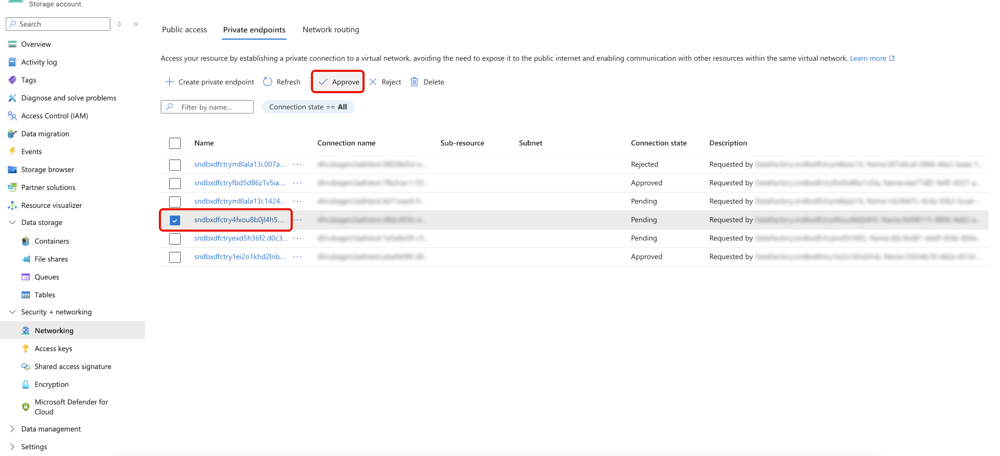

# Prise en charge des liens privés pour les sources dans l’API

>[!AVAILABILITY]
>
>Cette fonctionnalité est prise en charge par les sources suivantes :
>
>* [[!DNL Azure Blob Storage]](../../connectors/cloud-storage/blob.md)
>* [[!DNL ADLS Gen2]](../../connectors/cloud-storage/adls-gen2.md)
>* [[!DNL Azure File Storage]](../../connectors/cloud-storage/azure-file-storage.md)
>
>Actuellement, la prise en charge des liens privés n’est disponible que pour les organisations qui ont acheté Adobe Healthcare Shield ou Adobe Privacy &amp; Security Shield.

Vous pouvez utiliser la fonction Lien privé pour créer des points d’entrée privés auxquels vos sources Adobe Experience Platform peuvent se connecter. Connectez vos sources à un réseau virtuel en toute sécurité à l’aide d’adresses IP privées, éliminant ainsi le besoin d’adresses IP publiques et réduisant votre surface d’attaque. Simplifiez la configuration de votre réseau en supprimant la nécessité de configurations complexes de pare-feu ou de traduction d’adresses réseau, tout en veillant à ce que le trafic de données atteigne uniquement les services approuvés.

Lisez ce guide pour savoir comment utiliser des API pour créer et utiliser un point d’entrée privé.

>[!BEGINSHADEBOX]

## Droits d’utilisation de licence pour la prise en charge des liens privés

Les mesures de droits d’utilisation de licence pour la prise en charge des liens privés dans les sources sont les suivantes :

* Les clients ont droit à un transfert de données allant jusqu’à 2 To par an via des sources prises en charge ([!DNL Azure Blob Storage], [!DNL ADLS Gen2] et [!DNL Azure File Storage]), sur l’ensemble des sandbox et des organisations.
* Chaque organisation peut avoir un maximum de 10 points d’entrée pour tous les sandbox de production.
* Chaque organisation peut avoir un point d’entrée maximum pour tous les sandbox de développement.

>[!ENDSHADEBOX]

## Commencer

Ce guide nécessite une compréhension professionnelle des composants suivants d’Experience Platform :

* [Sources](../../home.md) : Experience Platform permet d’ingérer des données provenant de diverses sources tout en vous offrant la possibilité de structurer, d’étiqueter et d’améliorer les données entrantes à l’aide des services d’Experience Platform.
* [Sandbox](../../../sandboxes/home.md) : Experience Platform fournit des sandbox virtuels qui divisent une instance Experience Platform unique en environnements virtuels distincts pour favoriser le développement et l’évolution d’applications d’expérience digitale.

### Utiliser les API Platform

Pour plus d’informations sur la manière d’effectuer des appels vers les API Platform, consultez le guide [Prise en main des API Platform](../../../landing/api-guide.md).

## Créer un point d’entrée privé {#create-private-endpoint}

Pour créer un point d’entrée privé, envoyez une requête POST à `/privateEndpoints`.

**Format d’API**

```http
POST /privateEndpoints
```

**Requête**

La requête suivante crée un point d’entrée privé :

+++Sélectionner pour afficher l’exemple de requête

```shell
curl -X POST \
  'https://platform.adobe.io/data/foundation/connectors/privateEndpoints/' \
  -H 'Authorization: Bearer {ACCESS_TOKEN}' \
  -H 'x-api-key: {API_KEY}' \
  -H 'x-gw-ims-org-id: {ORG_ID}' \
  -H 'x-sandbox-name: {SANDBOX_NAME}' \
  -H 'Content-Type: application/json' \
  -d '{
      "name": "ACME Private Endpoint",
      "subscriptionId": "4281a16a-696f-4993-a7d3-a3da32b846f3",
      "resourceGroupName": "acme-sources-experience-platform",
      "resourceName": "acmeexperienceplatform",
      "connectionSpec": {
          "id": "4c10e202-c428-4796-9208-5f1f5732b1cf",
          "version": "1.0"
    }
  }'
```

| Propriété | Description |
| --- | --- |
| `name` | Nom de votre point d’entrée privé. |
| `subscriptionId` | ID associé à votre abonnement [!DNL Azure]. Pour plus d’informations, consultez le guide de [!DNL Azure] sur la [récupération des ID d’abonnement et de client de l’ [!DNL Azure Portal]](https://learn.microsoft.com/en-us/azure/azure-portal/get-subscription-tenant-id). |
| `resourceGroupName` | Nom de votre groupe de ressources sur [!DNL Azure]. Un groupe de ressources contient les ressources associées à une solution [!DNL Azure]. Pour plus d’informations, consultez le guide [!DNL Azure] sur [la gestion des groupes de ressources](https://learn.microsoft.com/en-us/azure/azure-resource-manager/management/manage-resource-groups-portal). |
| `resourceName` | Nom de la ressource. Dans [!DNL Azure], une ressource fait référence à des instances telles que des machines virtuelles, des applications web et des bases de données. Pour plus d’informations, consultez le guide [!DNL Azure] sur [présentation du gestionnaire  [!DNL Azure]  ressources](https://learn.microsoft.com/en-us/azure/azure-resource-manager/management/overview). |
| `connectionSpec.id` | Identifiant de spécification de connexion de la source que vous utilisez. |
| `connectionSpec.version` | Version de l’identifiant de spécification de connexion que vous utilisez. |

+++

**Réponse**

Une réponse réussie renvoie les éléments suivants :

+++Sélectionner pour afficher l’exemple de réponse

```json
{
  "id": "2c7f6574-299a-4832-aec5-886e875872e2",
  "name": "ACME Private Endpoint",
  "subscriptionId": "4281a16a-696f-4993-a7d3-a3da32b846f3",
  "resourceGroupName": "acme-sources-experience-platform",
  "resourceName": "acmeexperienceplatform",
  "connectionSpec": {
      "id": "4c10e202-c428-4796-9208-5f1f5732b1cf",
      "version": "1.0"
  },
  "state": "Pending"
}
```

| Propriété | Description |
| --- | --- |
| `id` | L’identifiant du point d’entrée privé que vous venez de créer. |
| `name` | Nom de votre point d’entrée privé. |
| `subscriptionId` | ID associé à votre abonnement [!DNL Azure]. Pour plus d’informations, consultez le guide de [!DNL Azure] sur la [récupération des ID d’abonnement et de client de l’ [!DNL Azure Portal]](https://learn.microsoft.com/en-us/azure/azure-portal/get-subscription-tenant-id). |
| `resourceGroupName` | Nom de votre groupe de ressources sur [!DNL Azure]. Un groupe de ressources contient les ressources associées à une solution [!DNL Azure]. Pour plus d’informations, consultez le guide [!DNL Azure] sur [la gestion des groupes de ressources](https://learn.microsoft.com/en-us/azure/azure-resource-manager/management/manage-resource-groups-portal). |
| `resourceName` | Nom de la ressource. Dans [!DNL Azure], une ressource fait référence à des instances telles que des machines virtuelles, des applications web et des bases de données. Pour plus d’informations, consultez le guide [!DNL Azure] sur [présentation du gestionnaire  [!DNL Azure]  ressources](https://learn.microsoft.com/en-us/azure/azure-resource-manager/management/overview). |
| `connectionSpec.id` | Identifiant de spécification de connexion de la source que vous utilisez. |
| `connectionSpec.version` | Version de l’identifiant de spécification de connexion que vous utilisez. |
| `state` | État actuel de votre point d’entrée privé. Les états valides sont les suivants : <ul><li>`Pending`</li><li>`Failed`</li><li>`Approved`</li><li>`Rejected`</li></ul> |

+++

## Récupération d’une liste de points d’entrée privés {#retrieve-private-endpoints}

Pour récupérer une liste de points d’entrée privés d’un sandbox donné de votre organisation, envoyez une requête GET à `/privateEndpoints`.

**Format d’API**

```http
GET /privateEndpoints
```

**Requête**

La requête suivante récupère une liste de tous les points d’entrée privés qui existent dans votre organisation.

+++Sélectionner pour afficher l’exemple de requête

```shell
curl -X GET \
  'https://platform.adobe.io/data/foundation/connectors/privateEndpoints' \
  -H 'Authorization: Bearer {ACCESS_TOKEN}' \
  -H 'x-api-key: {API_KEY}' \
  -H 'x-gw-ims-org-id: {ORG_ID}' \
  -H 'x-sandbox-name: {SANDBOX_NAME}' \
  -H 'Content-Type: application/json' \
```

+++

**Réponse**

Une réponse réussie renvoie une liste de points d’entrée privés de votre organisation.

+++Sélectionner pour afficher l’exemple de réponse

```json
{
  "items": [
       {
      "id": "ac9eb695-0d1a-42d4-bc45-0842aeaa1eff",
      "name": "TEST_E2E_29_Jan",
      "subscriptionId": "4281a16a-696f-4993-a7d3-a3da32b846f3",
      "resourceGroupName": "acme-noid-experience-platform",
      "resourceName": "acmeprivatelinking",
      "fqdns": [
         
      ],
      "state": "Approved",
      "connectionSpec": {
        "id": "4c10e202-c428-4796-9208-5f1f5732b1cf",
        "version": "1.0"
      }
    },
          {
      "id": "4c9eb695-0d1a-42d4-bc45-0842aeaa1efr",
      "name": "TEST_E2E_29_Jan",
      "subscriptionId": "5a0ff2f3-53d6-47e4-abb5-10a18bd3fff0",
      "resourceGroupName": "acme-sources-experience-platform",
      "resourceName": "acmeexperienceplatform",
      "fqdns": [
         
      ],
      "state": "Pending",
      "connectionSpec": {
        "id": "b3ba5556-48be-44b7-8b85-ff2b69b46dc4",
        "version": "1.0"
      }
    } 
  ]
}
```

+++

## Récupération d’une liste de points d’entrée privés pour une source donnée {#retrieve-private-endpoints-by-source}

Pour récupérer une liste de points d’entrée privés qui correspondent à une source spécifique, envoyez une requête GET au point d’entrée `/privateEndpoints` et indiquez le `connectionSpec.id` de la source.

**Format d’API**

```http
GET /privateEndpoints?property=connectionSpec.id=={CONNECTION_SPEC_ID}
```

| Paramètre de requête | Description |
| --- | --- |
| `{CONNECTION_SPEC_ID}` | Identifiant de spécification de connexion de la source que vous souhaitez rechercher dans les points d’entrée privés. |

**Requête**

La requête suivante récupère une liste de tous les points d’entrée privés qui correspondent à la source avec l’identifiant de spécification de connexion : `4c10e202-c428-4796-9208-5f1f5732b1cf`.

+++Sélectionner pour afficher l’exemple de requête

```shell
curl -X GET \
  'https://platform.adobe.io/data/foundation/connectors/privateEndpoints?property=connectionSpec.id==4c10e202-c428-4796-9208-5f1f5732b1cf' \
  -H 'Authorization: Bearer {ACCESS_TOKEN}' \
  -H 'x-api-key: {API_KEY}' \
  -H 'x-gw-ims-org-id: {ORG_ID}' \
  -H 'x-sandbox-name: {SANDBOX_NAME}' \
  -H 'Content-Type: application/json' \
```

+++

**Réponse**

Une réponse réussie renvoie une liste de tous les points d’entrée privés qui correspondent à la source avec l’identifiant de spécification de connexion : `4c10e202-c428-4796-9208-5f1f5732b1cf`.

+++Sélectionner pour afficher l’exemple de réponse

```json
{
  "items": [
       {
      "id": "ac9eb695-0d1a-42d4-bc45-0842aeaa1eff",
      "name": "TEST_E2E_29_Jan",
      "subscriptionId": "4281a16a-696f-4993-a7d3-a3da32b846f3",
      "resourceGroupName": "acme-noid-experience-platform",
      "resourceName": "acmeprivatelinkhg",
      "fqdns": [
         
      ],
      "state": "Approved",
      "connectionSpec": {
        "id": "4c10e202-c428-4796-9208-5f1f5732b1cf",
        "version": "1.0"
      }
    },
    {
      "id": "4c9eb695-0d1a-42d4-bc45-0842aeaa1efr",
      "name": "TEST_E2E_29_Jan",
      "subscriptionId": "5a0ff2f3-53d6-47e4-abb5-10a18bd3fff0",
      "resourceGroupName": "acme-sources-experience-platform",
      "resourceName": "acmeexperienceplatform",
      "fqdns": [
         
      ],
      "state": "Pending",
      "connectionSpec": {
        "id": "4c10e202-c428-4796-9208-5f1f5732b1cf",
        "version": "1.0"
      }
    } 
  ]
}
```

+++

## Récupérer un point d’entrée privé {#retrieve-specific-private-endpoint}

Pour récupérer un point d’entrée privé spécifique, envoyez une requête GET à `/privateEndpoints` et indiquez l’identifiant du point d’entrée privé que vous souhaitez récupérer.

**Format d’API**

```http
GET /privateEndpoints/{PRIVATE_ENDPOINT_ID}
```

| Paramètre de requête | Description |
| --- | --- |
| `{PRIVATE_ENDPOINT_ID}` | L’identifiant du point d’entrée privé que vous souhaitez récupérer. |

**Requête**

La requête suivante récupère le point d’entrée privé avec l’ID :`2c5699b0-b9b6-486f-8877-ee5e21fe9a9d`.

+++Sélectionner pour afficher l’exemple de requête

```shell
curl -X GET \
  'https://platform.adobe.io/data/foundation/connectors/privateEndpoints/2c5699b0-b9b6-486f-8877-ee5e21fe9a9d' \
  -H 'Authorization: Bearer {ACCESS_TOKEN}' \
  -H 'x-api-key: {API_KEY}' \
  -H 'x-gw-ims-org-id: {ORG_ID}' \
  -H 'x-sandbox-name: {SANDBOX_NAME}' \
  -H 'Content-Type: application/json' \
```

+++

**Réponse**

Une réponse réussie renvoie le point d’entrée privé avec l’identifiant : `2c5699b0-b9b6-486f-8877-ee5e21fe9a9d`

+++Sélectionner pour afficher l’exemple de réponse

```json
{
  "items": [
       {
      "id": "2c5699b0-b9b6-486f-8877-ee5e21fe9a9d",
      "name": "TEST_E2E_29_Jan",
      "subscriptionId": "5a0ff2f3-53d6-47e4-abb5-10a18bd3fff0",
      "resourceGroupName": "acme-noid-experience-platform",
      "resourceName": "acmeprivatelinkhg",
      "fqdns": [
         
      ],
      "state": "Approved",
      "connectionSpec": {
        "id": "4c10e202-c428-4796-9208-5f1f5732b1cf",
        "version": "1.0"
      }
    }
  ]
}
```

+++

## Résoudre un point d’entrée privé {#resolve-private-endpoint}

**Format d’API**

```http
GET /privateEndpoints?op=autoResolve
```

**Requête**

+++Sélectionner pour afficher l’exemple de requête

```shell
curl -X GET \
  'https://platform.adobe.io/data/foundation/connectors/privateEndpoints?op=autoResolve' \
  -H 'Authorization: Bearer {ACCESS_TOKEN}' \
  -H 'x-api-key: {API_KEY}' \
  -H 'x-gw-ims-org-id: {ORG_ID}' \
  -H 'x-sandbox-name: {SANDBOX_NAME}' \
  -H 'Content-Type: application/json' \
  -d '{
      "auth": {
          "specName": "ConnectionString",
          "params": {
              "usePrivateLink": true,
              "connectionString": "{CONNECTION_STRING}"
          }
      },
      "connectionSpec": {
          "id": "4c10e202-c428-4796-9208-5f1f5732b1cf",
          "version": "1.0"
      }
  }'
```

+++

**Réponse**

+++Sélectionner pour afficher l’exemple de réponse

```json
{
  "items": [
        {
      "id": "4c9eb695-0d1a-42d4-bc45-0842aeaa1efr",
      "name": "TEST_E2E_29_Jan",
      "subscriptionId": "5a0ff2f3-53d6-47e4-abb5-10a18bd3fff0",
      "resourceGroupName": "acme-sources-experience-platform",
      "resourceName": "acmeexperienceplatform",
      "fqdns": [
         
      ],
      "state": "Pending",
      "connectionSpec": {
        "id": "4c10e202-c428-4796-9208-5f1f5732b1cf",
        "version": "1.0"
      } 
    }
  ]
}
```

+++

## Activer le [!DNL Interactive Authoring] {#enable-interactive-authoring}

>[!IMPORTANT]
>
>Vous devez activer le [!DNL Interactive Authoring] avant de créer ou de mettre à jour un flux, ainsi qu’avant de créer, mettre à jour ou explorer une connexion.

[!DNL Interactive Authoring] est utilisé pour des fonctionnalités telles que l’exploration d’une connexion ou d’un compte et la prévisualisation de données. Pour [!DNL Interactive Authoring] activer, envoyez une requête POST à `/privateEndpoints/interactiveAuthoring` et spécifiez `enable` en tant qu’opérateur dans vos paramètres de requête.

**Format d’API**

```http
POST /privateEndpoints/interactiveAuthoring?op=enable
```

| Paramètre de requête | Description |
| --- | --- |
| `op` | Opération que vous souhaitez effectuer. Pour [!DNL Interactive Authoring] activer, définissez la valeur `op` sur `enable`. |

**Requête**

La requête suivante active [!DNL Interactive Authoring] pour votre point d’entrée privé et définit la durée de vie sur 60 minutes.

+++Sélectionner pour afficher l’exemple de requête

```shell
curl -X POST \
  'https://platform.adobe.io/data/foundation/connectors/privateEndpoints/interactiveAuthoring?op=enable' \
  -H 'Authorization: Bearer {ACCESS_TOKEN}' \
  -H 'x-api-key: {API_KEY}' \
  -H 'x-gw-ims-org-id: {ORG_ID}' \
  -H 'x-sandbox-name: {SANDBOX_NAME}' \
  -H 'Content-Type: application/json' \
  -d '{
      "autoTerminationMinutes": 60
  }'
```

| Propriété | Description |
| --- | --- |
| `autoTerminationMinutes` | Durée de vie (TTL) [!DNL Interactive Authoring] en minutes. [!DNL Interactive Authoring] est utilisé pour des fonctionnalités telles que l’exploration d’une connexion ou d’un compte et la prévisualisation de données. Vous pouvez définir une durée de vie maximale de 120 minutes. La durée de vie par défaut est de 60 minutes. |

+++

**Réponse**

Une réponse réussie renvoie le statut HTTP 202 (Accepté).

## Récupérer le statut du [!DNL Interactive Authoring] {#retrieve-interactive-authoring-status}

Pour afficher le statut actuel de [!DNL Interactive Authoring] pour votre point d’entrée privé, envoyez une requête GET à `/privateEndpoints/interactiveAuthoring`.

**Format d’API**

```http
GET /privateEndpoints/interactiveAuthoring
```

**Requête**

La requête suivante récupère le statut de [!DNL Interactive Authoring] :

+++Sélectionner pour afficher l’exemple de requête

```shell
curl -X GET \
  'https://platform.adobe.io/data/foundation/connectors/privateEndpoints/interactiveAuthoring' \
  -H 'Authorization: Bearer {ACCESS_TOKEN}' \
  -H 'x-api-key: {API_KEY}' \
  -H 'x-gw-ims-org-id: {ORG_ID}' \
  -H 'x-sandbox-name: {SANDBOX_NAME}' \
  -H 'Content-Type: application/json' \
```

+++

**Réponse**

+++Sélectionner pour afficher l’exemple de réponse

```json
{
    "status": "Disabled"
}
```

| Propriété | Description |
| --- | --- |
| `status` | Statut de [!DNL Interactive Authoring]. Les valeurs valides sont les suivantes : `disabled`, `enabling`, `enabled`. |

+++

## Supprimer le point de terminaison privé {#delete-private-endpoint}

Pour supprimer votre point d’entrée privé, envoyez une requête DELETE à `/privateEndpoints` et indiquez l’identifiant du point d’entrée que vous souhaitez supprimer.

**Format d’API**

```http
DELETE /privateEndpoints/{PRIVATE_ENDPOINT_ID}
```

| Paramètre de requête | Description |
| --- | --- |
| `{PRIVATE_ENDPOINT_ID}` | L’identifiant du point d’entrée privé que vous souhaitez supprimer. |

**Requête**

La requête suivante supprime le point d’entrée privé avec l’ID : `02a74b31-a566-4a86-9cea-309b101a7f24`.

+++Sélectionner pour afficher l’exemple de requête

```shell
curl -X DELETE \
  'https://platform.adobe.io/data/foundation/connectors/privateEndpoints/02a74b31-a566-4a86-9cea-309b101a7f24' \
  -H 'Authorization: Bearer {ACCESS_TOKEN}' \
  -H 'x-api-key: {API_KEY}' \
  -H 'x-gw-ims-org-id: {ORG_ID}' \
  -H 'x-sandbox-name: {SANDBOX_NAME}' \
  -H 'Content-Type: application/json' \
```

+++

**Réponse**

Une réponse réussie renvoie un statut HTTP 200 (Succès). Vous pouvez vérifier la suppression en effectuant une requête GET et en `/privateEndpoints` et en fournissant l’identifiant supprimé comme paramètre de requête.

## Service de flux {#flow-service}

Lisez les sections suivantes pour savoir comment utiliser des points d’entrée privés conjointement avec l’[[!DNL Flow Service] API](https://developer.adobe.com/experience-platform-apis/references/flow-service/).

### Créer une connexion avec un point d’entrée privé {#create-base-connection}

Pour créer une connexion avec un point d’entrée privé dans Experience Platform, envoyez une requête POST au point d’entrée `/connections` de l’API [!DNL Flow Service].

**Format d’API**

```http
POST /connections/
```

**Requête**

La requête suivante crée une connexion de base authentifiée pour [!DNL Azure Blob Storage], tout en utilisant un point d’entrée privé.

+++Sélectionner pour afficher l’exemple de requête

```shell
curl -X POST \
  'https://platform.adobe.io/data/foundation/flowservice/connections/' \
  -H 'Authorization: Bearer {ACCESS_TOKEN}' \
  -H 'x-api-key: {API_KEY}' \
  -H 'x-gw-ims-org-id: {ORG_ID}' \
  -H 'x-sandbox-name: {SANDBOX_NAME}' \
  -H 'Content-Type: application/json' \
  -d '{
      "name": "Azure Blob Storage base connection",
      "description": "A base connection for a Azure Blob Storage source that uses a private link.",
      "auth": {
          "specName": "ConnectionString",
          "params": {
              "connectionString": "{CONNECTION_STRING}",
              "usePrivateLink" : true
          }
      },
      "connectionSpec": {
          "id": "4c10e202-c428-4796-9208-5f1f5732b1cf",
          "version": "1.0"
      }
  }'
```

| Propriété | Description |
| --- | --- |
| `name` | Nom de votre connexion de base. |
| `description` | (Facultatif) Description qui fournit des informations supplémentaires sur votre connexion. |
| `auth.specName` | Authentification utilisée pour connecter votre source à Experience Platform. |
| `auth.params.connectionString` | Chaîne de connexion [!DNL Azure Blob Storage]. Pour plus d’informations, consultez le [[!DNL Azure Blob Storage] guide d’authentification des API](../api/create/cloud-storage/blob.md). |
| `auth.params.usePrivateLink` | Valeur booléenne qui détermine si vous utilisez ou non un point d’entrée privé. Définissez cette valeur sur `true` si vous utilisez un point d’entrée privé. |
| `connectionSpec.id` | Identifiant de spécification de connexion de [!DNL Azure Blob Storage]. |
| `connectionSpec.version` | Version de l’identifiant de spécification de connexion [!DNL Azure Blob Storage]. |

+++

**Réponse**

Une réponse réussie renvoie l’identifiant de connexion de base et l’etag que vous venez de générer.

+++Sélectionner pour afficher l’exemple de réponse

```json
{
  "id": "a59d368a-1152-4673-a46e-bd52e8cdb9a9",
  "etag": "\"f50185ed-0000-0200-0000-637e8fad0000\""
}
```

+++

### Récupérer les connexions liées à un point d’entrée privé donné {#retrieve-connections-by-endpoint}

Pour récupérer des connexions liées à un point d’entrée privé spécifique, envoyez une requête GET au point d’entrée `/connections` et indiquez l’identifiant du point d’entrée privé comme paramètre de requête.

**Format d’API**

```http
GET /connections?property=auth.params.privateEndpointId=={PRIVATE_ENDPOINT_ID}
```

| Paramètre de requête | Description |
| --- | --- |
| {PRIVATE_ENDPOINT_ID} | L’identifiant du point d’entrée privé lié aux connexions que vous souhaitez récupérer. |

**Requête**

La requête suivante récupère les connexions existantes liées à un point d’entrée privé avec l’ID : `02a74b31-a566-4a86-9cea-309b101a7f24`.

+++Sélectionner pour afficher l’exemple de requête

```shell
curl -X GET \
  'https://platform.adobe.io/data/foundation/flowservice/connections?property=auth.params.privateEndpointId==02a74b31-a566-4a86-9cea-309b101a7f24' \
  -H 'Authorization: Bearer {ACCESS_TOKEN}' \
  -H 'x-api-key: {API_KEY}' \
  -H 'x-gw-ims-org-id: {ORG_ID}' \
  -H 'x-sandbox-name: {SANDBOX_NAME}' \
  -H 'Content-Type: application/json' \
```

+++

**Réponse**

Une réponse réussie renvoie une liste de connexions liées au point d’entrée privé interrogé.

+++Sélectionner pour afficher l’exemple de réponse

```json
{
  "items": [
    {
      "id": "42a27b1f-8e3f-48ce-8c29-7e474b29a015",
      "createdAt": 1729154379292,
      "updatedAt": 1729154382031,
      "createdBy": "{CREATED_BY}",
      "updatedBy": "{UPDATED_BY}",
      "createdClient": "{CREATED_CLIENT}",
      "updatedClient": "{UPDATED_CLIENT}",
      "sandboxId": "{SANDBOX_ID}",
      "sandboxName": "{SANDBOX_NAME}",
      "imsOrgId": "{ORG_NAME}",
      "name": "acme-e2e",
      "connectionSpec": {
        "id": "4c10e202-c428-4796-9208-5f1f5732b1cf",
        "version": "1.0"
      },
      "state": "enabled",
      "auth": {
        "specName": "ConnectionString",
        "params": {
          "connectionString": "{CONNECTION_STRING}",
          "usePrivateLink": true,
          "privateEndpointId": "02a74b31-a566-4a86-9cea-309b101a7f24"
        }
      },
      "version": "\"2f01454b-0000-0200-0000-6766749a0000\"",
      "etag": "\"2f01454b-0000-0200-0000-6766749a0000\"",
      "lastOperation": {
        "started": 0,
        "updated": 0,
        "operation": "create"
      }
    },
    {
      "id": "6350311a-664c-4b08-aad4-4065781aac81",
      "createdAt": 1718199941102,
      "updatedAt": 1718199945147,
      "createdBy": "{CREATED_BY}",
      "updatedBy": "{UPDATED_BY}",
      "createdClient": "{CREATED_CLIENT}",
      "updatedClient": "{UPDATED_CLIENT}",
      "sandboxId": "{SANDBOX_ID}",
      "sandboxName": "{SANDBOX_NAME}",
      "imsOrgId": "{ORG_NAME}",
      "name": "acme demo",
      "connectionSpec": {
        "id": "4c10e202-c428-4796-9208-5f1f5732b1cf",
        "version": "1.0"
      },
      "state": "enabled",
      "auth": {
        "specName": "ConnectionString",
        "params": {
          "connectionString": "{CONNECTION_STRING}",
          "usePrivateLink": true,
          "privateEndpointId": "02a74b31-a566-4a86-9cea-309b101a7f24"
        }
      },
      "version": "\"3001307e-0000-0200-0000-6766cf710000\"",
      "etag": "\"3001307e-0000-0200-0000-6766cf710000\"",
      "lastOperation": {
        "started": 0,
        "updated": 0,
        "operation": "create"
      }
    }
  ],
  "_links": {
     
  }
}
```

+++

### Récupérer les connexions associées à un point d’entrée privé {#retrieve-connections}

Pour récupérer les connexions associées à un point d’entrée privé, envoyez une requête GET au point d’entrée `/connections` et indiquez le `property=auth.params.usePrivateLink==true` comme paramètre de requête.

**Format d’API**

```http
GET /connections?property=auth.params.usePrivateLink==true
```

**Requête**

La requête suivante récupère toutes les connexions de votre organisation qui utilisent des points d’entrée privés.

+++Sélectionner pour afficher l’exemple de requête

```shell
curl -X GET \
  'https://platform.adobe.io/data/foundation/flowservice/connections?property=auth.params.usePrivateLink==true' \
  -H 'Authorization: Bearer {ACCESS_TOKEN}' \
  -H 'x-api-key: {API_KEY}' \
  -H 'x-gw-ims-org-id: {ORG_ID}' \
  -H 'x-sandbox-name: {SANDBOX_NAME}' \
  -H 'Content-Type: application/json' \
```

+++

**Réponse**

Une réponse réussie renvoie toutes les connexions liées à des points d’entrée privés.

+++Sélectionner pour afficher l’exemple de réponse

```json
{
  "items": [
    {
      "id": "42a27b1f-8e3f-48ce-8c29-7e474b29a015",
      "createdAt": 1729154379292,
      "updatedAt": 1729154382031,
      "createdBy": "{CREATED_BY}",
      "updatedBy": "{UPDATED_BY}",
      "createdClient": "{CREATED_CLIENT}",
      "updatedClient": "{UPDATED_CLIENT}",
      "sandboxId": "{SANDBOX_ID}",
      "sandboxName": "{SANDBOX_NAME}",
      "imsOrgId": "{ORG_NAME}",
      "name": "acme-e2e",
      "connectionSpec": {
        "id": "4c10e202-c428-4796-9208-5f1f5732b1cf",
        "version": "1.0"
      },
      "state": "enabled",
      "auth": {
        "specName": "ConnectionString",
        "params": {
          "connectionString": "{CONNECTION_STRING}",
          "usePrivateLink": true,
          "privateEndpointId": "02a74b31-a566-4a86-9cea-309b101a7f24"
        }
      },
      "version": "\"2f01454b-0000-0200-0000-6766749a0000\"",
      "etag": "\"2f01454b-0000-0200-0000-6766749a0000\"",
      "lastOperation": {
        "started": 0,
        "updated": 0,
        "operation": "create"
      }
    },
    {
      "id": "6350311a-664c-4b08-aad4-4065781aac81",
      "createdAt": 1718199941102,
      "updatedAt": 1718199945147,
      "createdBy": "{CREATED_BY}",
      "updatedBy": "{UPDATED_BY}",
      "createdClient": "{CREATED_CLIENT}",
      "updatedClient": "{UPDATED_CLIENT}",
      "sandboxId": "{SANDBOX_ID}",
      "sandboxName": "{SANDBOX_NAME}",
      "imsOrgId": "{ORG_NAME}",
      "name": "acme demo",
      "connectionSpec": {
        "id": "b2e08744-4f1a-40ce-af30-7abac3e23cf3",
        "version": "1.0"
      },
      "state": "enabled",
      "auth": {
        "specName": "ConnectionString",
        "params": {
          "connectionString": "{CONNECTION_STRING}",
          "usePrivateLink": true
        }
      },
      "version": "\"3001307e-0000-0200-0000-6766cf710000\"",
      "etag": "\"3001307e-0000-0200-0000-6766cf710000\"",
      "lastOperation": {
        "started": 0,
        "updated": 0,
        "operation": "create"
      }
    }
  ],
  "_links": {
     
  }
}
```

+++

## Annexe

Lisez cette section pour plus d’informations sur l’utilisation de liens privés [!DNL Azure] dans l’API.

### Approuver un point d’entrée privé pour [!DNL Azure Blob] et [!DNL Azure Data Lake Gen2]

Pour approuver une demande de point d’entrée privé pour les sources [!DNL Azure Blob] et [!DNL Azure Data Lake Gen2], connectez-vous au [!DNL Azure Portal] . Dans le volet de navigation de gauche, sélectionnez **[!DNL Data storage]**, puis accédez à l’onglet **[!DNL Security + networking]** et choisissez **[!DNL Networking]**. Sélectionnez ensuite **[!DNL Private endpoints]** pour afficher la liste des points d’entrée privés associés à votre compte et leurs états de connexion actuels. Pour approuver une demande en attente, sélectionnez le point d’entrée souhaité, puis cliquez sur **[!DNL Approve]**.



<!--

### Configure your [!DNL Snowflake] account to connect to private links

You must complete the following prerequisite steps in order to use the [!DNL Snowflake] source with private links.

First, you must raise a support ticket in [!DNL Snowflake] and request for the **endpoint service resource ID** of the [!DNL Azure] region of your [!DNL Snowflake] account. Follow the steps below to raise a [!DNL Snowflake] ticket:

1. Navigate to the [[!DNL Snowflake] UI](https://app.snowflake.com) and sign in with your email account. During this step, you must ensure that your email is verified in profile settings.
2. Select your **user menu** and then select **support** to access [!DNL Snowflake] support.
3. To create a support case, select **[!DNL + Support Case]**. Then, fill out the form with relevant details and attach any necessary files.
4. When finished, submit the case.

The endpoint resource ID is formatted as follows:

```shell
subscriptions/{SUBSCRIPTION_ID}/resourceGroups/az{REGION}-privatelink/providers/microsoft.network/privatelinkservices/sf-pvlinksvc-az{REGION}
```

+++Select to view example

```shell
/subscriptions/4575fb04-6859-4781-8948-7f3a92dc06a3/resourceGroups/azwestus2-privatelink/providers/microsoft.network/privatelinkservices/sf-pvlinksvc-azwestus2
```

+++

| Parameter | Description | Example |
| --- | --- | --- |
| `{SUBSCRIPTION_ID}` | The unique ID that identifies your [!DNL Azure] subscription. | `a1b2c3d4-5678-90ab-cdef-1234567890ab` |
| `{REGION}` | The [!DNL Azure] region of your [!DNL Snowflake] account. | `azwestus2` |

### Retrieve your private link configuration details

To retrieve your private link configuration details, you must run the following command in [!DNL Snowflake]:

```sql
USE ROLE accountadmin;
SELECT key, value::varchar
FROM TABLE(FLATTEN(input => PARSE_JSON(SYSTEM$GET_PRIVATELINK_CONFIG())));
```

Next, retrieve values for the following properties:

* `privatelink-account-url`
* `regionless-privatelink-account-url`
* `privatelink_ocsp-url`

Once you have retrieved the values, you can make the following call to create a private link for [!DNL Snowflake].

**Request**

The following request creates a private endpoint for [!DNL Snowflake]:

>[!BEGINTABS]

>[!TAB Template]

```shell
curl -X POST \
  'https://platform.adobe.io/data/foundation/connectors/privateEndpoints/' \
  -H 'Authorization: Bearer {ACCESS_TOKEN}' \
  -H 'x-api-key: {API_KEY}' \
  -H 'x-gw-ims-org-id: {ORG_ID}' \
  -H 'x-sandbox-name: {SANDBOX_NAME}' \
  -H 'Content-Type: application/json' \
  -d '{
    "name": "{ENDPOINT_NAME}",
    "subscriptionId": "{AZURE_SUBSCRIPTION_ID}",
    "resourceGroupName": "{RESOURCE_GROUP_NAME}",
    "resourceName": "{SNOWFLAKE_ENDPOINT_SERVICE_NAME}",
    "fqdns": [
      "{PRIVATELINK_ACCOUNT_URL}",
      "{REGIONLESS_PRIVATELINK_ACCOUNT_URL}",
      "{PRIVATELINK_OCSP_URL}"
    ],
    "connectionSpec": {
      "id": "b2e08744-4f1a-40ce-af30-7abac3e23cf3",
      "version": "1.0"
    }
  }'
```

>[!TAB Example]

```shell
curl -X POST \
  'https://platform.adobe.io/data/foundation/connectors/privateEndpoints/' \
  -H 'Authorization: Bearer {ACCESS_TOKEN}' \
  -H 'x-api-key: {API_KEY}' \
  -H 'x-gw-ims-org-id: {ORG_ID}' \
  -H 'x-sandbox-name: {SANDBOX_NAME}' \
  -H 'Content-Type: application/json' \
  -d '{
    "name": "TEST_Snowflake_PE",
    "subscriptionId": "4575fb04-6859-4781-8948-7f3a92dc06a3",
    "resourceGroupName": "azwestus2-privatelink",
    "resourceName": "sf-pvlinksvc-azwestus2",
    "fqdns": [
      "hf06619.west-us-2.privatelink.snowflakecomputing.com",
      "adobe-segmentationdbint.privatelink.snowflakecomputing.com",
      "ocsp.hf06619.west-us-2.privatelink.snowflakecomputing.com"
    ],
    "connectionSpec": {
      "id": "b2e08744-4f1a-40ce-af30-7abac3e23cf3",
      "version": "1.0"
    }
  }'
```

>[!ENDTABS]

-->