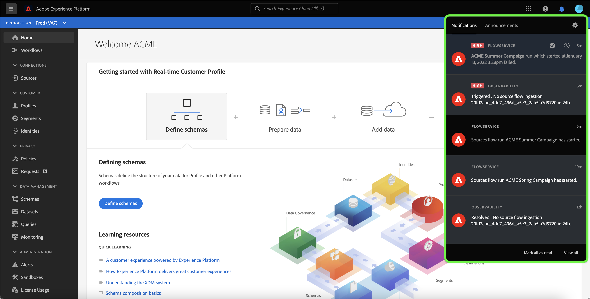

# S’abonner aux alertes pour les flux de données sources dans l’interface utilisateur

Adobe Experience Platform vous permet de vous abonner à des alertes basées sur des événements concernant les activités Adobe Experience Platform. Les alertes réduisent ou éliminent la nécessité d’interroger l’[[!DNL Observability Insights] API](../../../observability/api/overview.md) afin de vérifier si une tâche est terminée, si un certain jalon a été atteint dans un processus ou si des erreurs se sont produites.

Vous pouvez vous abonner à des alertes lors de la création d’un flux de données pour recevoir des messages d’alerte concernant le statut, le succès ou l’échec de l’exécution de votre flux.

Ce document décrit la procédure à suivre pour s’abonner et recevoir des messages d’alerte pour vos flux de données sources.

## Commencer

Ce document nécessite une compréhension du fonctionnement des composants suivants de Adobe Experience Platform :

* [Sources](../../home.md) : [!DNL Experience Platform] permet d’ingérer des données provenant de diverses sources tout en vous offrant la possibilité de structurer, d’étiqueter et d’améliorer les données entrantes à l’aide des services [!DNL Experience Platform].
* [Observability](../../../observability/home.md) : [!DNL Observability Insights] permet de surveiller les activités d’Experience Platform à l’aide de mesures statistiques et de notifications d’événement.
   * [Alertes](../../../observability/alerts/overview.md) : lorsqu’un certain ensemble de conditions de vos opérations Experience Platform est atteint (par exemple, un problème potentiel lorsque le système dépasse un certain seuil), Experience Platform peut envoyer des messages d’alerte à tous les utilisateurs de votre organisation qui se sont abonnés à ces messages.

## S’abonner aux alertes dans l’interface utilisateur {#subscribe-sources-alerts}

>[!CONTEXTUALHELP]
>id="platform_sources_alerts_subscribe"
>title="S’abonner aux alertes sur les sources"
>abstract="Les alertes vous permettent de recevoir des notifications en fonction du statut de vos flux de données sources. Vous pouvez définir des notifications d&#39;alerte pour obtenir des mises à jour si votre flux de données a commencé, a réussi, a échoué ou n&#39;a ingéré aucune donnée."
>text="Learn more in documentation"

>[!IMPORTANT]
>
>Vous devez activer les notifications instantanées d’e-mails pour votre compte Experience Platform afin de recevoir des notifications d’alerte par e-mail pour vos flux de données.

Vous pouvez activer les alertes pour vos flux de données pendant l’étape de [!UICONTROL Dataflow detail] du workflow des sources dans l’espace de travail des sources.

Les alertes disponibles pour les flux de données sources sont les suivantes :

>[!NOTE]
>
>Les sources en flux continu ne sont actuellement pas prises en charge par les alertes. Vous pouvez uniquement vous abonner aux notifications d’alerte pour les sources de lots.

| Alertes | Description |
| --- | --- |
| Début d’exécution du flux de sources | Cette alerte vous envoie un message lorsque votre flux de données source a démarré. |
| Succès de l’exécution du flux de sources | Cette alerte vous envoie un message lorsque les données de votre source sont correctement ingérées par Experience Platform. |
| Échec de l’exécution du flux des sources | Cette alerte vous envoie un message si une erreur se produit dans votre flux de données. |

Sélectionnez les alertes auxquelles vous souhaitez vous abonner, puis sélectionnez **[!UICONTROL Next]** pour vérifier et terminer votre flux de données.

Consultez les guides suivants pour obtenir des instructions détaillées sur la création d’un flux de données sources dans l’interface utilisateur :

* [Advertising](./dataflow/advertising.md)
* [Stockage cloud](./dataflow/batch/cloud-storage.md)
* [Intégration des systèmes de gestion des relations clients](./dataflow/crm.md)
* [Base de données](./dataflow/databases.md)
* [E-commerce](./dataflow/ecommerce.md)
* [Fichiers locaux](./create/local-system/local-file-upload.md)
* [Automatisation du marketing](./dataflow/marketing-automation.md)
* [Paiements](./dataflow/payments.md)
* [Protocoles](./dataflow/protocols.md)

## Recevoir des alertes

Une fois votre flux de données exécuté, vous pouvez recevoir des alertes par le biais de l’interface utilisateur ou par e-mail.

### Dans l’interface utilisateur

Les alertes sont représentées dans l’interface utilisateur par une icône de notification dans l’en-tête supérieur de l’interface utilisateur d’Experience Platform. Sélectionnez l’icône de notification pour afficher des messages d’alerte spécifiques concernant vos flux de données.

Le panneau de notifications s’affiche. Il présente la liste des mises à jour de statut du flux de données que vous avez créé.

Vous pouvez pointer sur un message d’alerte pour le marquer comme lu ou vous pouvez sélectionner l’icône d’horloge pour définir les rappels futurs sur le statut de votre flux de données.

Sélectionnez le message d’alerte pour afficher des informations spécifiques sur votre flux de données.

La page [!UICONTROL Dataflow run overview] s’affiche. La moitié supérieure de l’écran affiche un aperçu de votre flux de données, y compris des informations sur ses attributs, l’identifiant d’exécution de flux de données correspondant et le résumé des erreurs de haut niveau.

La moitié inférieure de la page affiche les [!UICONTROL Dataflow run errors] qui se sont produites pendant l’étape d’exécution du flux de données. À partir de là, vous pouvez prévisualiser les diagnostics d’erreur ou utiliser l’[[!DNL Data Access] API](https://www.adobe.io/experience-platform-apis/references/data-access/) pour télécharger les diagnostics d’erreur ou le manifeste de fichier qui correspond à votre flux de données.

Pour plus d’informations sur la gestion des erreurs de flux de données, consultez le guide sur la [surveillance des flux de données sources dans l’interface utilisateur](../../../dataflows/ui/monitor-sources.md).

### Par email

Des alertes pour vos flux de données vous sont également diffusées par e-mail. Sélectionnez le nom du flux de données dans le corps de l’e-mail pour afficher plus d’informations sur votre flux de données.

Tout comme l’alerte de l’interface utilisateur, la page [!UICONTROL Dataflow run overview] s’affiche, vous fournissant une interface pour enquêter sur les erreurs associées à votre flux de données.

## Abonnement et désabonnement aux alertes

Vous pouvez vous abonner à d’autres alertes ou vous désabonner des alertes établies pour un flux de données existant dans la page de [!UICONTROL Dataflows]. Recherchez le flux de données que vous créez dans la liste, puis sélectionnez les points de suspension (`...`) pour afficher un menu déroulant d’options. Sélectionnez ensuite **[!UICONTROL Subscribe alerts]** pour modifier les paramètres d’alerte de votre flux de données.

Une fenêtre pop-up s’affiche, vous fournissant une liste des alertes de sources. Sélectionnez les alertes auxquelles vous souhaitez vous abonner ou désélectionnez les alertes auxquelles vous souhaitez vous désabonner. Lorsque vous avez terminé, sélectionnez **[!UICONTROL Save]**.

## Étapes suivantes

Ce document fournit un guide détaillé sur la manière de vous abonner à des alertes contextuelles pour vos flux de données sources. Pour plus d’informations, consultez le [guide de l’interface utilisateur des alertes](../../../observability/alerts/ui.md).