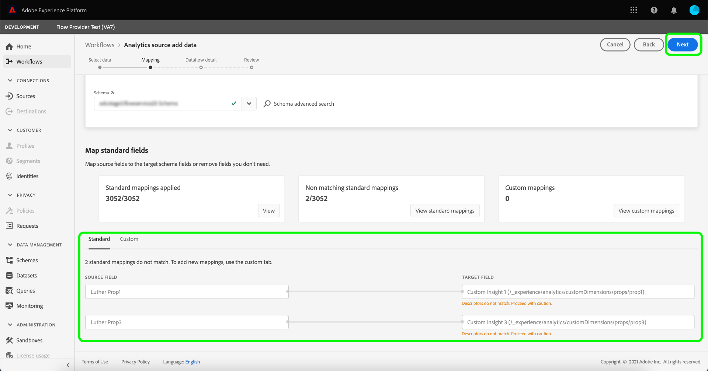

# Créer une connexion source Adobe Analytics dans l’interface utilisateur

Ce tutoriel décrit les étapes à suivre pour créer une connexion source Adobe Analytics dans l’interface utilisateur afin d’importer les données de suite de rapports [!DNL Analytics] dans Adobe Experience Platform.

## Prise en main

Ce tutoriel nécessite une compréhension du fonctionnement des composants suivants d’Adobe Experience Platform :

* [Système de modèle de données d’expérience (XDM)](../../../../../xdm/home.md) : cadre normalisé selon lequel Experience Platform organise les données d’expérience client.
* [Real-time Customer Profile](../../../../../profile/home.md) : fournit un profil client en temps réel unifié basé sur des données agrégées issues de plusieurs sources.
* [Sandboxes](../../../../../sandboxes/home.md) : Experience Platform fournit des sandbox virtuelles qui divisent une instance de Platform unique en environnements virtuels distincts pour favoriser le développement et l’évolution d’applications d’expérience numérique.

### Terminologie clé

Il est important de comprendre les termes clés suivants utilisés dans ce document :

* **Attribut standard :** les attributs standard sont tous les attributs prédéfinis par Adobe. Ils renferment la même signification pour tous les clients et sont disponibles dans les groupes de champs des données sources [!DNL Analytics] et du schéma [!DNL Analytics].
* **Attribut personnalisé :** les attributs personnalisés sont tout attribut de la hiérarchie des variables personnalisées dans [!DNL Analytics]. Les attributs personnalisés sont utilisés dans le cadre dʼune implémentation Adobe Analytics pour capturer des informations spécifiques dans une suite de rapports. Leur utilisation peut varier d’une suite de rapports à l’autre. Les attributs personnalisés comprennent les eVars, les props et les listes. Pour plus d’informations sur les eVars, consultez la [[!DNL Analytics] documentation sur les variables de conversion](https://experienceleague.adobe.com/docs/analytics/admin/admin-tools/conversion-variables/conversion-var-admin.html?lang=fr).
* **Tout attribut dans les groupes de champs personnalisés :** les attributs qui proviennent de groupes de champs créés par les clients sont tous définis par l’utilisateur et sont considérés comme des attributs ni standard ni personnalisés.
* **Noms conviviaux :** les noms conviviaux sont des libellés fournis par l’utilisateur pour les variables personnalisées dans le cadre dʼune implémentation [!DNL Analytics]. Pour plus d’informations sur les noms conviviaux, consultez la [[!DNL Analytics] documentation sur les variables de conversion](https://experienceleague.adobe.com/docs/analytics/admin/admin-tools/conversion-variables/conversion-var-admin.html?lang=en).

## Créer une connexion source avec Adobe Analytics

Dans l’interface utilisateur de Platform, sélectionnez **[!UICONTROL Sources]** dans le volet de navigation de gauche pour accéder à l’espace de travail [!UICONTROL Sources]. L’écran [!UICONTROL Catalogue] affiche diverses sources avec lesquelles vous pouvez créer un compte.

Vous pouvez sélectionner la catégorie appropriée dans le catalogue sur le côté gauche de votre écran. Vous pouvez également utiliser la barre de recherche pour réduire les sources affichées.

Dans la catégorie des **[!UICONTROL applications Adobe]**, sélectionnez **[!UICONTROL Adobe Analytics]**, puis **[!UICONTROL Ajouter des données]**.

### Sélectionner les données

Le **[!UICONTROL Ajout de données à la source Analytics]** vous fournit une liste de [!DNL Analytics] données de la suite de rapports avec laquelle créer une connexion source.

Une suite de rapports ne peut être ingérée qu’à l’aide d’un seul principal flux de données. Il ne peut pas être utilisé dans plusieurs flux de données. En outre, une suite de rapports doit appartenir à la même région que l’instance sandbox Platform dans laquelle la connexion source est créée. Une suite de rapports qui n’est pas sélectionnable a déjà été ingérée, que ce soit dans cet environnement de test ou dans un autre environnement de test.

Plusieurs connexions entrantes peuvent être établies pour importer plusieurs suites de rapports dans le même environnement de test. Si les suites de rapports comportent des schémas différents pour les variables (comme les eVars ou les événements), elles doivent être mappées à des champs spécifiques dans les groupes de champs personnalisés et éviter les conflits de données à l’aide de [Préparation de données](../../../../../data-prep/ui/mapping.md). Les suites de rapports ne peuvent être ajoutées qu’à un seul environnement de test.

>[!NOTE]
>
>Les données de plusieurs suites de rapports ne peuvent être activées pour Real-time Customer Data Profile que s’il n’existe aucun conflit de données, comme deux propriétés personnalisées (eVars, listes et props) ayant une signification différente, ne peuvent pas être mappées sur le même attribut dans XDM.

Pour créer une [!DNL Analytics] connexion source, sélectionnez une suite de rapports, puis sélectionnez **[!UICONTROL Suivant]** pour continuer.

<!---Analytics Report Suites can be configured for one sandbox at a time. To import the same Report Suite into a different sandbox, the dataset flow will have to be deleted and instantiated again via configuration for a different sandbox.--->

### Mappage

>[!IMPORTANT]
>
>Les transformations de préparation des données peuvent ajouter une latence au flux de données global. La latence supplémentaire ajoutée varie en fonction de la complexité de la logique de transformation.

Avant de pouvoir mapper vos données [!DNL Analytics] à un schéma XDM cible, vous devez d’abord déterminer si vous utilisez un schéma par défaut ou un schéma personnalisé.

Un schéma par défaut crée un schéma à votre place, contenant le groupe de champs [!DNL Adobe Analytics ExperienceEvent Template]. Pour utiliser un schéma par défaut, sélectionnez **[!UICONTROL Schéma par défaut]**.

Un schéma personnalisé vous permet de choisir n’importe quel schéma disponible pour vos données [!DNL Analytics], à condition que ce schéma contienne le groupe de champs [!DNL Adobe Analytics ExperienceEvent Template]. Pour utiliser un schéma personnalisé, sélectionnez **[!UICONTROL Schéma personnalisé]**.

La page [!UICONTROL Mappage] fournit une interface permettant de mapper les champs source aux champs de schéma cible appropriés. Dans cette interface, vous pouvez mapper des variables personnalisées à de nouveaux groupes de champs de schéma et appliquer des calculs pris en charge par la préparation des données. Sélectionnez un schéma cible pour démarrer le processus de mappage.

>[!TIP]
>
>Seuls les schémas comportant le groupe de champs [!DNL Adobe Analytics ExperienceEvent Template] s’affichent dans le menu de sélection des schémas. Les autres schémas sont ignorés. Si aucun schéma approprié n’est disponible pour vos données de suite de rapports, vous devez créer un schéma. Pour obtenir des instructions détaillées sur la création de schémas, consultez le guide de [création et de modification des schémas dans l’interface utilisateur](../../../../../xdm/ui/resources/schemas.md).

La section [!UICONTROL Mappage des champs standard] affiche des panneaux pour les [!UICONTROL Mappages standard appliqués], les [!UICONTROL Mappages standard non correspondants] et les [!UICONTROL Mappages personnalisés]. Consultez le tableau suivant pour obtenir des informations spécifiques sur chaque catégorie :

| Mappage des champs standard | Description |
| --- | --- |
| [!UICONTROL Mappages standard appliqués] | Le panneau [!UICONTROL Mappages standard appliqués] affiche le nombre total d’attributs mappés. Les mappages standard font référence aux jeux de mappages entre tous les attributs des données sources [!DNL Analytics] et les attributs correspondants du groupe de champs [!DNL Analytics]. Ils sont prémappés et ne peuvent pas être modifiés. |
| [!UICONTROL Mappages standard non correspondants] | Le panneau [!UICONTROL Mappages standard non correspondants] fait référence au nombre d’attributs mappés contenant des conflits de noms conviviaux. Ces conflits apparaissent lorsque vous réutilisez un schéma qui contient déjà un jeu de descripteurs de champs provenant d’une autre suite de rapports. Vous pouvez continuer à utiliser votre flux de données [!DNL Analytics] malgré la présence de conflits de noms conviviaux. |
| [!UICONTROL Mappages personnalisés] | Le panneau [!UICONTROL Mappages personnalisés] affiche le nombre d’attributs personnalisés mappés, y compris les eVars, les props et les listes. Les mappages personnalisés font référence aux jeux de mappages entre les attributs personnalisés des données sources [!DNL Analytics] et les attributs des groupes de champs personnalisés inclus dans le schéma sélectionné. |

Pour prévisualiser le groupe de champs de schéma de modèle [!DNL Analytics] ExperienceEvent, sélectionnez **[!UICONTROL Affichage]** dans le panneau [!UICONTROL Mappages standard appliqués].

La page [!UICONTROL Groupe de champs de schéma de modèle Adobe Analytics ExperienceEvent] fournit une interface permettant dʼexaminer la structure de votre schéma. Lorsque vous avez terminé, sélectionnez **[!UICONTROL Fermer]**.

Platform détecte automatiquement tout conflit de noms conviviaux dans vos jeux de mappages. Si aucun conflit nʼest détecté, sélectionnez **[!UICONTROL Suivant]** pour continuer.

Si des conflits de noms conviviaux existent entre votre suite de rapports source et votre schéma sélectionné, vous pouvez tout de même continuer à utiliser votre flux de données [!DNL Analytics], mais les descripteurs de champ ne seront pas modifiés. Vous pouvez également choisir de créer un autre schéma avec un jeu de descripteurs vierge.

Sélectionnez **[!UICONTROL Suivant]** pour continuer.

#### Mappings personnalisés

Pour utiliser les fonctions de préparation de données et ajouter un nouveau mappage ou des champs calculés pour les attributs personnalisés, sélectionnez **[!UICONTROL Affichage des mappages personnalisés]**.

Sélectionnez ensuite **[!UICONTROL Ajouter un nouveau mappage]**.

Selon vos besoins, vous pouvez sélectionner l’une des options suivantes : **[!UICONTROL Ajouter un nouveau mappage]** ou **[!UICONTROL Ajouter un champ calculé]**.

Un jeu de mappages vide s’affiche. Sélectionnez l’icône de mappage pour ajouter un champ source.

Vous pouvez utiliser l’interface pour parcourir la structure du schéma source et identifier le nouveau champ source que vous souhaitez utiliser. Une fois que vous avez sélectionné le champ source à mapper, cliquez sur **[!UICONTROL Sélectionner]**.

Sélectionnez ensuite l’icône de mappage sous [!UICONTROL Champ cible] pour mapper le champ source sélectionné à son champ cible correspondant.

Tout comme pour le schéma source, vous pouvez utiliser l’interface pour parcourir la structure du schéma cible et sélectionner le champ cible à mapper. Une fois que vous avez sélectionné le champ cible correspondant, cliquez sur **[!UICONTROL Sélectionner]**.

Une fois votre jeu de mappages personnalisé terminé, sélectionnez **[!UICONTROL Suivant]** pour continuer.

La documentation suivante fournit d’autres ressources sur la compréhension de la préparation des données, des champs calculés et des fonctions de mappage :

* [Présentation de la préparation des données](../../../../../data-prep/home.md)
* [Fonctions de mappage de la préparation des données](../../../../../data-prep/functions.md)
* [Ajouter des champs calculés](../../../../../data-prep/ui/mapping.md#calculated-fields)

### Fournir des détails sur le flux de données

Dans lʼécran des **[!UICONTROL Détails du flux de données]** qui s’affiche, vous devez fournir un nom et une description facultative du flux de données. Lorsque vous avez terminé, cliquez sur **[!UICONTROL Suivant]**.

### Révision

L’écran de [!UICONTROL Révision] s’affiche, vous permettant dʼexaminer votre nouveau flux de données Analytics avant sa création. Les détails de la connexion sont regroupés par catégories, notamment :

* [!UICONTROL Connexion] : affiche la plateforme source de la connexion.
* [!UICONTROL Type de données] : affiche la suite de rapports sélectionnée et l’identifiant de suite de rapports correspondant.

### Surveiller votre flux de données

Une fois votre flux de données créé, vous pouvez surveiller les données ingérées par celui-ci. Sur l’écran [!UICONTROL Catalogue], sélectionnez **[!UICONTROL Flux de données]** pour afficher la liste des flux établis associés à votre compte Analytics.

L’écran **Flux de données** s’affiche. Sur cette page, vous trouverez plusieurs flux de jeux de données, y compris des informations sur leur nom, les données sources, l’heure de création et le statut.

Le connecteur instancie deux flux de jeux de données. L’un représente les données de renvoi, l’autre les données actives. Les données de renvoi ne sont pas configurées pour le Profil, mais sont envoyées au lac de données à des fins d’analyse et de cas d’utilisation en science des données.

Pour plus d’informations sur le renvoi, les données actives et leurs latences respectives, consultez la section [Présentation du connecteur Analytics](../../../../connectors/adobe-applications/analytics.md).

Sélectionnez dans la liste le flux de jeu de données à afficher.

La page **[!UICONTROL Activité du jeu de données]** s’affiche. Cette page affiche le taux de consommation des messages sous la forme dʼun graphique. Sélectionnez **[!UICONTROL Gouvernance des données]** à partir de l’en-tête supérieur pour accéder aux champs de labellisation.

Vous pouvez afficher les libellés hérités d’un flux de jeux de données à partir de l’écran [!UICONTROL Gouvernance des données]. Pour plus d’informations sur la manière d’étiqueter les données provenant d’Analytics, consultez la page [Guide des libellés d’utilisation des données](../../../../../data-governance/labels/user-guide.md).

Pour supprimer un flux de données, accédez à la page [!UICONTROL Flux de données], puis sélectionnez les ellipses (`...`) en regard du nom du flux de données et cliquez sur [!UICONTROL Supprimer].

## Étapes suivantes et ressources supplémentaires

Une fois la connexion créée, le flux de données est automatiquement créé pour contenir les données entrantes et renseigner un jeu de données avec votre schéma sélectionné. En outre, un remplissage de données se produit et ingeste jusqu’à 13 mois de données historiques. Une fois l’ingestion initiale terminée, les données [!DNL Analytics] peuvent être utilisées par les services de Platform en aval, tels que [!DNL Real-time Customer Profile] et Segmentation Service. Consultez les documents suivants pour plus d’informations :

* [Présentation de [!DNL Real-time Customer Profile]](../../../../../profile/home.md)
* [Présentation de [!DNL Segmentation Service]](../../../../../segmentation/home.md)
* [Présentation de [!DNL Data Science Workspace]](../../../../../data-science-workspace/home.md)
* [Présentation de [!DNL Query Service]](../../../../../query-service/home.md)

La vidéo suivante est destinée à vous aider à comprendre l’ingestion de données à l’aide du connecteur source Adobe Analytics :

>[!WARNING]
>
> Lʼinterface utilisateur de [!DNL Platform] affichée dans la vidéo suivante est obsolète. Consultez la documentation pour découvrir les dernières captures dʼécran et fonctionnalités de lʼinterface utilisateur.

>[!VIDEO](https://video.tv.adobe.com/v/29687?quality=12&learn=on)
