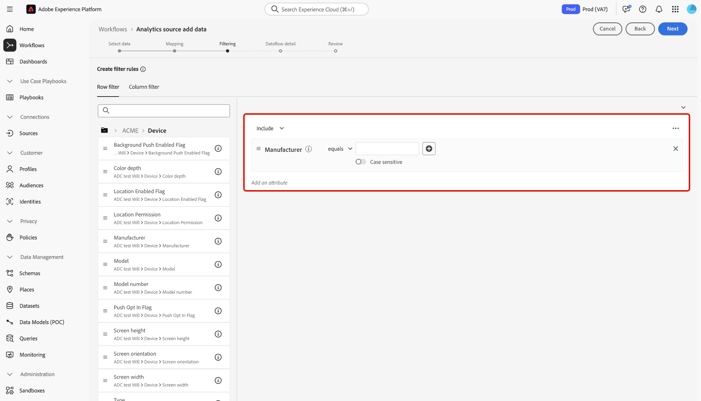

# Créer une connexion source Adobe Analytics dans l’interface utilisateur

Ce tutoriel décrit les étapes à suivre pour créer une connexion source Adobe Analytics dans l’interface utilisateur afin d’importer les données de suite de rapports Adobe Analytics dans Adobe Experience Platform.

## Prise en main

Ce tutoriel nécessite une compréhension du fonctionnement des composants suivants d’Adobe Experience Platform : 

* [Système de modèle de données d’expérience (XDM)](../../../../../xdm/home.md) : cadre normalisé selon lequel Experience Platform organise les données d’expérience client.
* [Profil client en temps réel](../../../../../profile/home.md) : fournit un profil client en temps réel unifié basé sur des données agrégées issues de plusieurs sources.
* [Sandbox](../../../../../sandboxes/home.md) : Experience Platform fournit des sandbox virtuels qui divisent une instance de plateforme unique en environnements virtuels distincts pour favoriser le développement et l’évolution d’applications d’expérience digitale.

### Terminologie clé

Il est important de comprendre les termes clés suivants utilisés dans ce document :

* **Attribut standard :** les attributs standard sont tous les attributs prédéfinis par Adobe. Ils renferment la même signification pour tous les clients et sont disponibles dans les groupes de champs des données sources [!DNL Analytics] et du schéma [!DNL Analytics].
* **Attribut personnalisé :** les attributs personnalisés sont tout attribut de la hiérarchie des variables personnalisées dans [!DNL Analytics]. Les attributs personnalisés sont utilisés dans une mise en oeuvre Adobe Analytics pour capturer des informations spécifiques dans une suite de rapports. Leur utilisation peut différer d’une suite de rapports à l’autre. Les attributs personnalisés comprennent les eVars, les props et les listes. Pour plus d’informations sur les eVars, consultez la [[!DNL Analytics] documentation sur les variables de conversion](https://experienceleague.adobe.com/docs/analytics/admin/admin-tools/conversion-variables/conversion-var-admin.html?lang=fr).
* **Tout attribut dans les groupes de champs personnalisés :** les attributs qui proviennent de groupes de champs créés par les clients sont tous définis par l’utilisateur et sont considérés comme des attributs ni standard ni personnalisés.
* **Noms conviviaux :** les noms conviviaux sont des libellés fournis par l’utilisateur pour les variables personnalisées dans le cadre dʼune implémentation [!DNL Analytics]. Pour plus d’informations sur les noms conviviaux, consultez la [[!DNL Analytics] documentation sur les variables de conversion](https://experienceleague.adobe.com/docs/analytics/admin/admin-tools/conversion-variables/conversion-var-admin.html?lang=fr).

## Créer une connexion source avec Adobe Analytics

>[!NOTE]
>
>Lorsque vous créez un flux de données source Analytics dans un environnement de test de production, deux flux de données sont créés :
>
>* Flux de données qui effectue un renvoi de 13 mois des données de suite de rapports historiques dans le lac de données. Ce flux de données se termine une fois le renvoi terminé.
>* Flux de données qui envoie des données actives au lac de données et à [!DNL Real-Time Customer Profile]. Ce flux de données s’exécute en continu.

Dans l’interface utilisateur de Platform, sélectionnez **[!UICONTROL Sources]** dans le volet de navigation de gauche pour accéder à l’espace de travail [!UICONTROL Sources]. L’écran [!UICONTROL Catalogue] affiche diverses sources avec lesquelles vous pouvez créer un compte.

Vous pouvez sélectionner la catégorie appropriée dans le catalogue sur le côté gauche de votre écran. Vous pouvez également utiliser la barre de recherche pour réduire les sources affichées.

Dans la catégorie des **[!UICONTROL applications Adobe]**, sélectionnez **[!UICONTROL Adobe Analytics]**, puis **[!UICONTROL Ajouter des données]**.

### Sélectionner les données

>[!IMPORTANT]
>
>Les suites de rapports répertoriées à l’écran peuvent provenir de différentes régions. Il vous incombe de comprendre les limites et les obligations de vos données, ainsi que la manière dont vous utilisez ces données dans Adobe Experience Platform entre les régions. Assurez-vous que votre entreprise l’autorise.

La variable **[!UICONTROL Ajout de données à la source Analytics]** vous fournit une liste de [!DNL Analytics] données de la suite de rapports avec laquelle créer une connexion source.

Une suite de rapports est un conteneur de données qui constitue la base de [!DNL Analytics] création de rapports. Une organisation peut comporter de nombreuses suites de rapports, chacune contenant différents jeux de données.

Vous pouvez ingérer des suites de rapports provenant de n’importe quelle région (États-Unis, Royaume-Uni ou Singapour) tant qu’elles sont mappées à la même organisation que l’instance de sandbox Experience Platform dans laquelle la connexion source est créée. Une suite de rapports peut être ingérée à l’aide d’un seul flux de données actif. Une suite de rapports qui n’est pas sélectionnable a déjà été ingérée, que ce soit dans l’environnement de test que vous utilisez ou dans un autre environnement de test.

Plusieurs connexions entrantes peuvent être établies pour importer plusieurs suites de rapports dans le même environnement de test. Si les suites de rapports comportent des schémas différents pour les variables (comme les eVars ou les événements), elles doivent être mappées à des champs spécifiques dans les groupes de champs personnalisés et éviter les conflits de données en utilisant [Préparation de données](../../../../../data-prep/ui/mapping.md). Les suites de rapports ne peuvent être ajoutées qu’à un seul environnement de test.

>[!NOTE]
>
>Les données de plusieurs suites de rapports ne peuvent être activées pour Real-Time Customer Profile que s’il n’existe aucun conflit de données, comme deux propriétés personnalisées (eVars, listes et props) ayant une signification différente.

Pour créer une [!DNL Analytics] connexion source, sélectionnez une suite de rapports, puis sélectionnez **[!UICONTROL Suivant]** pour continuer.

&lt;!: les suites de rapports Analytics peuvent être configurées pour un environnement de test à la fois. Pour importer la même suite de rapports dans un environnement de test différent, le flux du jeu de données doit être supprimé et instancié à nouveau via la configuration pour un autre environnement de test.—>

### Mappage

>[!IMPORTANT]
>
>Les transformations de préparation des données peuvent ajouter une latence au flux de données global. La latence supplémentaire ajoutée varie en fonction de la complexité de la logique de transformation.

Avant de pouvoir mapper vos données [!DNL Analytics] à un schéma XDM cible, vous devez d’abord déterminer si vous utilisez un schéma par défaut ou un schéma personnalisé.

Un schéma par défaut crée un schéma à votre place, contenant le groupe de champs [!DNL Adobe Analytics ExperienceEvent Template]. Pour utiliser un schéma par défaut, sélectionnez **[!UICONTROL Schéma par défaut]**.

Un schéma personnalisé vous permet de choisir n’importe quel schéma disponible pour vos données [!DNL Analytics], à condition que ce schéma contienne le groupe de champs [!DNL Adobe Analytics ExperienceEvent Template]. Pour utiliser un schéma personnalisé, sélectionnez **[!UICONTROL Schéma personnalisé]**.

La page [!UICONTROL Mappage] fournit une interface permettant de mapper les champs source aux champs de schéma cible appropriés. Dans cette interface, vous pouvez mapper des variables personnalisées à de nouveaux groupes de champs de schéma et appliquer des calculs pris en charge par la préparation des données. Sélectionnez un schéma cible pour démarrer le processus de mappage.

>[!TIP]
>
>Seuls les schémas comportant le groupe de champs [!DNL Adobe Analytics ExperienceEvent Template] s’affichent dans le menu de sélection des schémas. Les autres schémas sont ignorés. Si aucun schéma approprié n’est disponible pour vos données de suite de rapports, vous devez créer un schéma. Pour obtenir des instructions détaillées sur la création de schémas, consultez le guide de [création et de modification des schémas dans l’interface utilisateur](../../../../../xdm/ui/resources/schemas.md).

La section [!UICONTROL Mappage des champs standard] affiche des panneaux pour les [!UICONTROL Mappages standard appliqués], les [!UICONTROL Mappages standard non correspondants] et les [!UICONTROL Mappages personnalisés]. Consultez le tableau suivant pour obtenir des informations spécifiques sur chaque catégorie :

| Mappage des champs standard | Description |
| --- | --- |
| [!UICONTROL Mappages standard appliqués] | Le panneau [!UICONTROL Mappages standard appliqués] affiche le nombre total d’attributs mappés. Les mappages standard font référence aux jeux de mappages entre tous les attributs des données sources [!DNL Analytics] et les attributs correspondants du groupe de champs [!DNL Analytics]. Ils sont prémappés et ne peuvent pas être modifiés. |
| [!UICONTROL Mappages standard non correspondants] | Le panneau [!UICONTROL Mappages standard non correspondants] fait référence au nombre d’attributs mappés contenant des conflits de noms conviviaux. Ces conflits apparaissent lorsque vous réutilisez un schéma qui contient déjà un jeu de descripteurs de champs provenant d’une autre suite de rapports. Vous pouvez continuer à utiliser votre flux de données [!DNL Analytics] malgré la présence de conflits de noms conviviaux. |
| [!UICONTROL Mappages personnalisés] | Le panneau [!UICONTROL Mappages personnalisés] affiche le nombre d’attributs personnalisés mappés, y compris les eVars, les props et les listes. Les mappages personnalisés font référence aux jeux de mappages entre les attributs personnalisés des données sources [!DNL Analytics] et les attributs des groupes de champs personnalisés inclus dans le schéma sélectionné. |

Pour prévisualiser le groupe de champs de schéma de modèle [!DNL Analytics] ExperienceEvent, sélectionnez **[!UICONTROL Affichage]** dans le panneau [!UICONTROL Mappages standard appliqués].

La page [!UICONTROL Groupe de champs de schéma de modèle Adobe Analytics ExperienceEvent] fournit une interface permettant dʼexaminer la structure de votre schéma. Lorsque vous avez terminé, sélectionnez **[!UICONTROL Fermer]**.

Platform détecte automatiquement tout conflit de noms conviviaux dans vos jeux de mappages. Si aucun conflit nʼest détecté, sélectionnez **[!UICONTROL Suivant]** pour continuer.

>[!TIP]
>
>Si des conflits de noms conviviaux existent entre votre suite de rapports source et votre schéma sélectionné, vous pouvez tout de même continuer à utiliser votre flux de données [!DNL Analytics], mais les descripteurs de champ ne seront pas modifiés. Vous pouvez également choisir de créer un autre schéma avec un jeu de descripteurs vierge.

#### Mappings personnalisés

Vous pouvez utiliser les fonctions de préparation de données pour ajouter un nouveau mappage personnalisé ou des champs calculés pour les attributs personnalisés. Pour ajouter des mappages personnalisés, sélectionnez **[!UICONTROL Personnalisé]**.

Selon vos besoins, vous pouvez sélectionner l’une des options suivantes : **[!UICONTROL Ajouter un nouveau mappage]** ou **[!UICONTROL Ajouter un champ calculé]** et créez des mappages personnalisés pour vos attributs personnalisés. Pour obtenir des instructions complètes sur l’utilisation des fonctions de préparation de données, veuillez lire la section [Guide de l’interface utilisateur de la préparation de données](../../../../../data-prep/ui/mapping.md).

La documentation suivante fournit d’autres ressources sur la compréhension de la préparation des données, des champs calculés et des fonctions de mappage :

* [Présentation de la préparation des données](../../../../../data-prep/home.md)
* [Fonctions de mappage de la préparation des données](../../../../../data-prep/functions.md)
* [Ajouter des champs calculés](../../../../../data-prep/ui/mapping.md#calculated-fields)

<!-- 
To use Data Prep functions and add new mapping or calculated fields for custom attributes, select **[!UICONTROL View custom mappings]**.

Next, select **[!UICONTROL Add new mapping]**.

Depending on your needs, you can select either **[!UICONTROL Add new mapping]** or **[!UICONTROL Add calculated field]** from the options that appear. 

An empty mapping set appears. Select the mapping icon to add a source field.

You can use the interface to navigate through the source schema structure and identify the new source field that you want to use. Once you have selected the source field that you want to map, select **[!UICONTROL Select]**.

Next, select the mapping icon under [!UICONTROL Target Field] to map your selected source field to its appropriate target field.

Similar to the source schema, you can use the interface to navigate through the target schema structure and select the target field you want to map to. Once you have selected the appropriate target field, select **[!UICONTROL Select]**.

With your custom mapping set completed, select **[!UICONTROL Next]** to proceed.

 -->

### Filtrage pour Real-time Customer Profile {#filtering-for-profile}

>[!CONTEXTUALHELP]
>id="platform_data_prep_analytics_filtering"
>title="Créer des règles de filtrage"
>abstract="Définissez des règles de filtrage au niveau des lignes et des colonnes lors de l&#39;envoi de données au profil client en temps réel. Utilisez le filtrage au niveau des lignes pour appliquer des conditions et dicter les données à **inclure lors de l&#39;ingestion de profils**. Utilisez le filtrage au niveau des colonnes pour sélectionner les colonnes de données à **exclure lors de l&#39;ingestion de profils**. Les règles de filtrage ne s&#39;appliquent pas aux données envoyées au lac de données."

Une fois que vous avez terminé les mappages pour vos [!DNL Analytics] données de suite de rapports, vous pouvez appliquer des règles et des conditions de filtrage pour inclure ou exclure de manière sélective des données de l’ingestion dans Real-time Customer Profile. La prise en charge du filtrage est uniquement disponible pour [!DNL Analytics] Les données et les données ne sont filtrées que lors de la saisie de [!DNL Profile.] Toutes les données sont ingérées dans le lac de données.

#### Filtrage au niveau de la ligne

>[!IMPORTANT]
>
>Utilisez le filtrage au niveau des lignes pour appliquer des conditions et dicter les données à **inclure lors de l&#39;ingestion de profils**. Utilisez le filtrage au niveau des colonnes pour sélectionner les colonnes de données à **exclure lors de l&#39;ingestion de profils**.

Vous pouvez filtrer les données pour [!DNL Profile] ingestion au niveau des lignes et des colonnes. Le filtrage au niveau des lignes vous permet de définir des critères tels que chaîne contenant, égal à, commence ou se termine par. Vous pouvez également utiliser le filtrage au niveau des lignes pour joindre des conditions à l’aide de `AND` ainsi que `OR`et annuler les conditions à l’aide de `NOT`.

Pour filtrer votre [!DNL Analytics] données au niveau de la ligne, sélectionnez **[!UICONTROL Filtre de lignes]**.

Utilisez le rail de gauche pour parcourir la hiérarchie de schémas et sélectionnez l’attribut de schéma de votre choix pour approfondir l’analyse d’un schéma particulier.

Une fois que vous avez identifié l’attribut que vous souhaitez configurer, sélectionnez-le et faites glisser l’attribut du rail de gauche vers le panneau de filtrage.

Pour configurer différentes conditions, sélectionnez **[!UICONTROL est égal à]** puis sélectionnez une condition dans la fenêtre déroulante qui s’affiche.

La liste des conditions configurables inclut :

* [!UICONTROL est égal à]
* [!UICONTROL n’est pas égal à]
* [!UICONTROL commence par]
* [!UICONTROL se termine par]
* [!UICONTROL ne se termine pas par]
* [!UICONTROL contient]
* [!UICONTROL ne contient pas]
* [!UICONTROL existe]
* [!UICONTROL n’existe pas]

Saisissez ensuite les valeurs à inclure en fonction de l’attribut que vous avez sélectionné. Dans l’exemple ci-dessous, [!DNL Apple] et [!DNL Google] sont sélectionnés pour l’ingestion dans le cadre de la fonction **[!UICONTROL Fabricant]** attribut.

Pour préciser davantage vos conditions de filtrage, ajoutez un autre attribut du schéma, puis ajoutez des valeurs basées sur cet attribut. Dans l’exemple ci-dessous, la variable **[!UICONTROL Modèle]** est ajouté et des modèles tels que [!DNL iPhone 13] et [!DNL Google Pixel 6] sont filtrées pour l’ingestion.

Pour ajouter un nouveau conteneur, sélectionnez les ellipses (`...`) en haut à droite de l’interface de filtrage, puis sélectionnez **[!UICONTROL Ajouter un conteneur]**.

Une fois un nouveau conteneur ajouté, sélectionnez **[!UICONTROL Inclure]** puis sélectionnez **[!UICONTROL Exclure]** dans la fenêtre déroulante qui s’affiche.

Suivez la même procédure en faisant glisser les attributs de schéma et en ajoutant les valeurs correspondantes que vous souhaitez exclure du filtrage. Dans l’exemple ci-dessous, la variable [!DNL iPhone 12], [!DNL iPhone 12 mini], et [!DNL Google Pixel 5] sont tous filtrés à partir de l’exclusion de la variable **[!UICONTROL Modèle]** , paysage est exclu de la variable **[!UICONTROL Orientation de l’écran]**, et numéro de modèle [!DNL A1633] est exclu de **[!UICONTROL Numéro de modèle]**.

Lorsque vous avez terminé, sélectionnez **[!UICONTROL Suivant]**.

#### Filtrage au niveau des colonnes

Sélectionner **[!UICONTROL Filtre Colonnes]** à partir de l’en-tête pour appliquer un filtrage au niveau des colonnes.

La page se met à jour dans une arborescence de schéma interactive, affichant vos attributs de schéma au niveau de la colonne. À partir de là, vous pouvez sélectionner les colonnes de données que vous souhaitez exclure de [!DNL Profile] ingestion. Vous pouvez également développer une colonne et sélectionner des attributs spécifiques à exclure.

Par défaut, tous les [!DNL Analytics] accéder à [!DNL Profile] et ce processus permet d’exclure des branches de données XDM [!DNL Profile] ingestion.

Lorsque vous avez terminé, sélectionnez **[!UICONTROL Suivant]**.

### Fournir des détails sur le flux de données

Dans lʼécran des **[!UICONTROL Détails du flux de données]** qui s’affiche, vous devez fournir un nom et une description facultative du flux de données. Lorsque vous avez terminé, cliquez sur **[!UICONTROL Suivant]**.

### Révision

L’écran de [!UICONTROL Révision] s’affiche, vous permettant dʼexaminer votre nouveau flux de données Analytics avant sa création. Les détails de la connexion sont regroupés par catégories, notamment :

* [!UICONTROL Connexion] : affiche la plateforme source de la connexion.
* [!UICONTROL Type de données] : affiche la suite de rapports sélectionnée et l’identifiant de suite de rapports correspondant.

## Surveiller votre flux de données {#monitor-your-dataflow}

Une fois le flux de données terminé, sélectionnez **[!UICONTROL Flux de données]** dans le catalogue des sources pour surveiller l’activité et l’état de vos données.

Une liste des flux de données Analytics existants dans votre organisation s’affiche. À partir de là, sélectionnez un jeu de données cible pour afficher son activité d’ingestion respective.

La variable [!UICONTROL Activité du jeu de données] fournit des informations sur la progression des données envoyées d’Analytics à Experience Platform. L’interface affiche des mesures telles que le nombre d’enregistrements ingérés, le nombre de lots ingérés et le nombre de lots en échec.

La source instancie deux flux de jeux de données. L’un représente les données de renvoi, l’autre les données actives. Les données de renvoi ne sont pas configurées pour être ingérées dans Real-Time Customer Profile, mais sont envoyées au lac de données à des fins d’analyse et de cas d’utilisation en science des données.

Pour plus d’informations sur le renvoi, les données actives et leurs latences respectives, consultez la section [Présentation de la source Analytics](../../../../connectors/adobe-applications/analytics.md).

+++Affichage de lots individuels à l’aide de l’interface de surveillance héritée

La page d’activité du jeu de données n’affiche pas de liste de lots individuels. Pour afficher une liste de lots individuels, sélectionnez un graphique dans l’interface de l’activité du jeu de données.

Vous accédez au tableau de bord Surveillance . Ensuite, sélectionnez **[!UICONTROL SEULS LES ÉCHECS D’INGÉRATION : OUI]** pour effacer le filtre et afficher une liste de lots individuels.

L’interface se met à jour vers une liste de lots individuels, y compris des informations sur leurs mesures respectives.

| Mesures | Description |
| --- | --- |
| ID de lot | L’identifiant d’un lot donné. Cette valeur est générée en interne. |
| Nom du jeu de données | Nom d’un jeu de données donné utilisé pour les données Analytics. |
| Source | Source des données ingérées. |
| Mis à jour | Date de l’itération d’exécution de flux la plus récente. |
| Enregistrements dans un jeu de données | Nombre total d’enregistrements dans le jeu de données. **Remarque**: ce paramètre affiche parfois l’état de `in-progress`. Ce statut indique que le processus d’ingestion des enregistrements n’est pas encore terminé. |
| Nouveaux fragments de profil | Nombre total de nouveaux fragments de profil qui ont été ingérés. |
| Fragments de profil existants | Comptage total des fragments de profil existants. |
| Enregistrements d’identité assemblés | Comptage total des enregistrements d’identité assemblés après ingestion. |
| Enregistrements dans le profil | Nombre total d’enregistrements ingérés dans Real-Time Customer Profile. |

{style="table-layout:auto"}

+++

## Étapes suivantes et ressources supplémentaires

Une fois la connexion créée, le flux de données est automatiquement créé pour contenir les données entrantes et renseigner un jeu de données avec votre schéma sélectionné. En outre, un remplissage de données se produit et ingeste jusqu’à 13 mois de données historiques. Une fois l’ingestion initiale terminée, les données [!DNL Analytics] peuvent être utilisées par les services de Platform en aval, tels que [!DNL Real-Time Customer Profile] et Segmentation Service. Consultez les documents suivants pour plus d’informations :

* [Présentation de [!DNL Real-Time Customer Profile]](../../../../../profile/home.md)
* [Présentation de [!DNL Segmentation Service]](../../../../../segmentation/home.md)
* [Présentation de [!DNL Data Science Workspace]](../../../../../data-science-workspace/home.md)
* [Présentation de [!DNL Query Service]](../../../../../query-service/home.md)

La vidéo suivante est destinée à vous aider à comprendre l’ingestion de données à l’aide du connecteur source Adobe Analytics :

>[!WARNING]
>
> Lʼinterface utilisateur de [!DNL Platform] affichée dans la vidéo suivante est obsolète. Consultez la documentation pour découvrir les dernières captures dʼécran et fonctionnalités de lʼinterface utilisateur.

>[!VIDEO](https://video.tv.adobe.com/v/29687?quality=12&learn=on)
