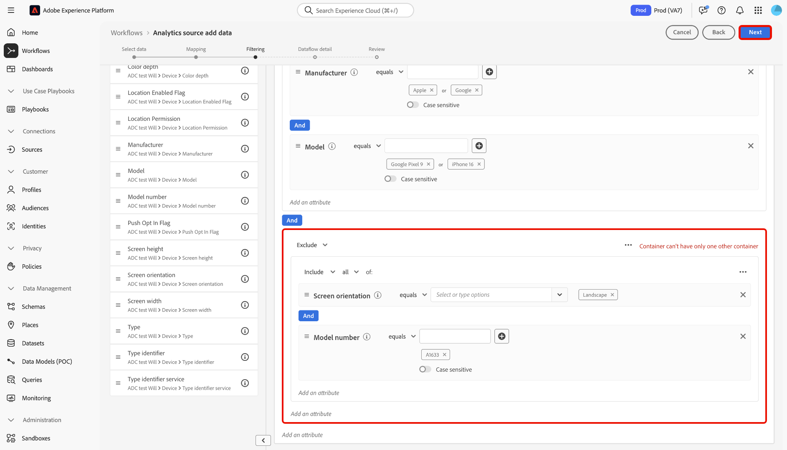

# Créer une connexion source Adobe Analytics dans l’interface utilisateur

Ce tutoriel décrit les étapes à suivre pour créer une connexion source Adobe Analytics dans l’interface utilisateur afin d’importer les données de suite de rapports Adobe Analytics dans Adobe Experience Platform.

## Prise en main

Ce tutoriel nécessite une compréhension du fonctionnement des composants suivants d’Adobe Experience Platform : 

* [Système de modèle de données d’expérience (XDM)](../../../../../xdm/home.md) : cadre normalisé selon lequel Experience Platform organise les données d’expérience client.
* [Profil client en temps réel](../../../../../profile/home.md) : fournit un profil client en temps réel unifié basé sur des données agrégées issues de plusieurs sources.
* [Sandbox](../../../../../sandboxes/home.md) : Experience Platform fournit des sandbox virtuels qui divisent une instance Experience Platform unique en environnements virtuels distincts pour favoriser le développement et l’évolution d’applications d’expérience digitale.

### Terminologie clé

Il est important de comprendre les termes clés suivants utilisés dans ce document :

* **Attribut standard :** les attributs standard sont tous les attributs prédéfinis par Adobe. Ils renferment la même signification pour tous les clients et sont disponibles dans les groupes de champs des données sources [!DNL Analytics] et du schéma [!DNL Analytics].
* **Attribut personnalisé :** les attributs personnalisés sont tout attribut de la hiérarchie des variables personnalisées dans [!DNL Analytics]. Les attributs personnalisés sont utilisés dans une implémentation d’Adobe Analytics pour capturer des informations spécifiques dans une suite de rapports. Leur utilisation peut varier d’une suite de rapports à l’autre. Les attributs personnalisés comprennent les eVars, les props et les listes. Pour plus d’informations sur les eVars, consultez la [[!DNL Analytics] documentation sur les variables de conversion](https://experienceleague.adobe.com/docs/analytics/admin/admin-tools/conversion-variables/conversion-var-admin.html?lang=fr).
* **Tout attribut dans les groupes de champs personnalisés :** les attributs qui proviennent de groupes de champs créés par les clients sont tous définis par l’utilisateur et sont considérés comme des attributs ni standard ni personnalisés.
* **Noms conviviaux :** les noms conviviaux sont des libellés fournis par l’utilisateur pour les variables personnalisées dans le cadre dʼune implémentation [!DNL Analytics]. Pour plus d’informations sur les noms conviviaux, consultez la [[!DNL Analytics] documentation sur les variables de conversion](https://experienceleague.adobe.com/docs/analytics/admin/admin-tools/conversion-variables/conversion-var-admin.html?lang=fr).

## Créer une connexion source avec Adobe Analytics

>[!NOTE]
>
>Lorsque vous créez un flux de données source Analytics dans un sandbox de production, deux flux de données sont créés :
>
>* Flux de données qui renvoie pendant 13 mois les données historiques de la suite de rapports dans le lac de données. Ce flux de données se termine lorsque le renvoi est terminé.
>* Flux de données qui envoie des données actives au lac de données et à [!DNL Real-Time Customer Profile]. Ce flux de données s’exécute en continu.

Dans l’interface utilisateur d’Experience Platform, sélectionnez **[!UICONTROL Sources]** dans le volet de navigation de gauche pour accéder à l’espace de travail [!UICONTROL Sources]. L’écran [!UICONTROL Catalogue] affiche diverses sources avec lesquelles vous pouvez créer un compte.

Vous pouvez sélectionner la catégorie appropriée dans le catalogue sur le côté gauche de votre écran. Vous pouvez également utiliser la barre de recherche pour réduire les sources affichées.

Dans la catégorie des **[!UICONTROL applications Adobe]**, sélectionnez **[!UICONTROL Adobe Analytics]**, puis **[!UICONTROL Ajouter des données]**.

### Sélectionner les données

>[!IMPORTANT]
>
>Les suites de rapports répertoriées à l’écran peuvent provenir de différentes régions. Il vous incombe de connaître les limites et obligations relatives à vos données et la manière dont vous les utilisez dans Adobe Experience Platform d’une région à l’autre. Assurez-vous que votre entreprise l’autorise.

L’étape **[!UICONTROL Ajouter des données à la source Analytics]** vous fournit une liste des données de [!DNL Analytics] suite de rapports avec lesquelles créer une connexion source.

Une suite de rapports est un conteneur de données qui forme la base des rapports [!DNL Analytics]. Une organisation peut avoir de nombreuses suites de rapports, chacune contenant des jeux de données différents.

Vous pouvez ingérer des suites de rapports à partir de n’importe quelle région (États-Unis, Royaume-Uni ou Singapour), à condition qu’elles soient mappées à la même organisation que l’instance sandbox Experience Platform dans laquelle la connexion source est en cours de création. Une suite de rapports peut être ingérée à l’aide d’un seul flux de données actif. Une suite de rapports déjà ingérée dans le sandbox que vous utilisez ou dans un autre sandbox ne peut pas être sélectionnée.

Il est possible d’établir plusieurs connexions entrantes pour importer plusieurs suites de rapports dans le même sandbox. Si les suites de rapports comportent des schémas différents pour les variables (telles que des eVars ou des événements), elles doivent être mappées à des champs spécifiques dans les groupes de champs personnalisés et éviter les conflits de données à l’aide de [Préparation de données](../../../../../data-prep/ui/mapping.md). Les suites de rapports ne peuvent être ajoutées qu’à un seul sandbox.

>[!NOTE]
>
>Les données provenant de plusieurs suites de rapports ne peuvent être activées pour le profil client en temps réel que s’il n’existe aucun conflit de données, comme deux propriétés personnalisées (eVars, listes et props) ayant une signification différente.

Pour créer une connexion source [!DNL Analytics], sélectionnez une suite de rapports, puis sélectionnez **[!UICONTROL Suivant]** pour continuer.

&lt;!: les suites de rapports Analytics peuvent être configurées pour un sandbox à la fois. Pour importer la même suite de rapports dans un autre sandbox, le flux du jeu de données devra être supprimé et instancié à nouveau via la configuration pour un autre sandbox.—>

### Mappage

>[!IMPORTANT]
>
>Les transformations de la préparation des données peuvent ajouter de la latence au flux de données global. La latence supplémentaire ajoutée varie en fonction de la complexité de la logique de transformation.

Avant de pouvoir mapper vos données [!DNL Analytics] à un schéma XDM cible, vous devez d’abord déterminer si vous utilisez un schéma par défaut ou un schéma personnalisé.

Un schéma par défaut crée un schéma à votre place, contenant le groupe de champs [!DNL Adobe Analytics ExperienceEvent Template]. Pour utiliser un schéma par défaut, sélectionnez **[!UICONTROL Schéma par défaut]**.

Un schéma personnalisé vous permet de choisir n’importe quel schéma disponible pour vos données [!DNL Analytics], à condition que ce schéma contienne le groupe de champs [!DNL Adobe Analytics ExperienceEvent Template]. Pour utiliser un schéma personnalisé, sélectionnez **[!UICONTROL Schéma personnalisé]**.

La page [!UICONTROL Mappage] fournit une interface permettant de mapper les champs source aux champs de schéma cible appropriés. Dans cette interface, vous pouvez mapper des variables personnalisées à de nouveaux groupes de champs de schéma et appliquer des calculs pris en charge par la préparation des données. Sélectionnez un schéma cible pour démarrer le processus de mappage.

>[!TIP]
>
>Seuls les schémas comportant le groupe de champs [!DNL Adobe Analytics ExperienceEvent Template] s’affichent dans le menu de sélection des schémas. Les autres schémas sont ignorés. Si aucun schéma approprié n’est disponible pour vos données de suite de rapports, vous devez créer un schéma. Pour obtenir des instructions détaillées sur la création de schémas, consultez le guide de [création et de modification des schémas dans l’interface utilisateur](../../../../../xdm/ui/resources/schemas.md).

La section [!UICONTROL Mappage des champs standard] affiche des panneaux pour les [!UICONTROL Mappages standard appliqués], les [!UICONTROL Mappages standard non correspondants] et les [!UICONTROL Mappages personnalisés]. Consultez le tableau suivant pour obtenir des informations spécifiques sur chaque catégorie :

| Mappage des champs standard | Description |
| --- | --- |
| [!UICONTROL Mappages standard appliqués] | Le panneau [!UICONTROL Mappages standard appliqués] affiche le nombre total d’attributs mappés. Les mappages standard font référence aux jeux de mappages entre tous les attributs des données sources [!DNL Analytics] et les attributs correspondants du groupe de champs [!DNL Analytics]. Ils sont prémappés et ne peuvent pas être modifiés. |
| [!UICONTROL Mappages standard non correspondants] | Le panneau [!UICONTROL Mappages standard non correspondants] fait référence au nombre d’attributs mappés contenant des conflits de noms conviviaux. Ces conflits apparaissent lorsque vous réutilisez un schéma qui contient déjà un jeu de descripteurs de champs provenant d’une autre suite de rapports. Vous pouvez continuer à utiliser votre flux de données [!DNL Analytics] malgré la présence de conflits de noms conviviaux. |
| [!UICONTROL Mappages personnalisés] | Le panneau [!UICONTROL Mappages personnalisés] affiche le nombre d’attributs personnalisés mappés, y compris les eVars, les props et les listes. Les mappages personnalisés font référence aux jeux de mappages entre les attributs personnalisés des données sources [!DNL Analytics] et les attributs des groupes de champs personnalisés inclus dans le schéma sélectionné. |

Pour prévisualiser le groupe de champs de schéma de modèle [!DNL Analytics] ExperienceEvent, sélectionnez **[!UICONTROL Affichage]** dans le panneau [!UICONTROL Mappages standard appliqués].

La page [!UICONTROL Groupe de champs de schéma de modèle Adobe Analytics ExperienceEvent] fournit une interface permettant dʼexaminer la structure de votre schéma. Lorsque vous avez terminé, sélectionnez **[!UICONTROL Fermer]**.

Experience Platform détecte automatiquement tout conflit de noms conviviaux dans vos jeux de mappages. Si aucun conflit nʼest détecté, sélectionnez **[!UICONTROL Suivant]** pour continuer.

>[!TIP]
>
>Si des conflits de noms conviviaux existent entre votre suite de rapports source et votre schéma sélectionné, vous pouvez tout de même continuer à utiliser votre flux de données [!DNL Analytics], mais les descripteurs de champ ne seront pas modifiés. Vous pouvez également choisir de créer un autre schéma avec un jeu de descripteurs vierge.

#### Mappings personnalisés

Vous pouvez utiliser les fonctions de préparation de données pour ajouter un nouveau mappage personnalisé ou des champs calculés pour les attributs personnalisés. Pour ajouter des mappages personnalisés, sélectionnez **[!UICONTROL Personnalisé]**.

Selon vos besoins, vous pouvez sélectionner **[!UICONTROL Ajouter un nouveau mappage]** ou **[!UICONTROL Ajouter un champ calculé]** et créer des mappages personnalisés pour vos attributs personnalisés. Pour obtenir des instructions complètes sur l’utilisation des fonctions de préparation des données, consultez le [Guide de l’interface utilisateur de la préparation des données](../../../../../data-prep/ui/mapping.md).

La documentation suivante fournit d’autres ressources sur la compréhension de la préparation des données, des champs calculés et des fonctions de mappage :

* [Présentation de la préparation des données](../../../../../data-prep/home.md)
* [Fonctions de mappage de la préparation des données](../../../../../data-prep/functions.md)
* [Ajouter des champs calculés](../../../../../data-prep/ui/mapping.md#calculated-fields)

<!-- 
To use Data Prep functions and add new mapping or calculated fields for custom attributes, select **[!UICONTROL View custom mappings]**.

Next, select **[!UICONTROL Add new mapping]**.

Depending on your needs, you can select either **[!UICONTROL Add new mapping]** or **[!UICONTROL Add calculated field]** from the options that appear. 

An empty mapping set appears. Select the mapping icon to add a source field.

You can use the interface to navigate through the source schema structure and identify the new source field that you want to use. Once you have selected the source field that you want to map, select **[!UICONTROL Select]**.

Next, select the mapping icon under [!UICONTROL Target Field] to map your selected source field to its appropriate target field.

Similar to the source schema, you can use the interface to navigate through the target schema structure and select the target field you want to map to. Once you have selected the appropriate target field, select **[!UICONTROL Select]**.

With your custom mapping set completed, select **[!UICONTROL Next]** to proceed.

 -->

## Filtrage pour le profil client en temps réel {#filtering-for-profile}

>[!CONTEXTUALHELP]
>id="platform_data_prep_analytics_filtering"
>title="Créer des règles de filtrage"
>abstract="Définissez des règles de filtrage au niveau des lignes et des colonnes lors de l&#39;envoi de données au profil client en temps réel. Utilisez le filtrage au niveau des lignes pour appliquer des conditions et dicter les données à **inclure lors de l&#39;ingestion de profils**. Utilisez le filtrage au niveau des colonnes pour sélectionner les colonnes de données à **exclure lors de l&#39;ingestion de profils**. Les règles de filtrage ne s&#39;appliquent pas aux données envoyées au lac de données."

Une fois que vous avez terminé les mappages pour vos données de suite de rapports [!DNL Analytics], vous pouvez appliquer des règles et des conditions de filtrage pour inclure ou exclure de manière sélective des données de l’ingestion vers le profil client en temps réel. La prise en charge du filtrage n’est disponible que pour les données [!DNL Analytics] et les données ne sont filtrées qu’avant leur entrée [!DNL Profile.] Toutes les données sont ingérées dans le lac de données.

>[!BEGINSHADEBOX]

**Informations supplémentaires sur la préparation et le filtrage des données Analytics pour le profil client en temps réel**

* Vous pouvez utiliser la fonctionnalité de filtrage pour les données qui vont dans Profil, mais pas pour celles qui vont dans le lac de données.
* Vous pouvez utiliser le filtrage pour les données actives, mais vous ne pouvez pas filtrer les données de renvoi.
   * La source de [!DNL Analytics] ne renvoie pas les données dans le profil.
* Si vous utilisez des configurations de préparation de données lors de la configuration initiale d’un flux de [!DNL Analytics], ces modifications sont également appliquées au renvoi automatique de 13 mois.
   * Ce n’est toutefois pas le cas pour le filtrage, car celui-ci est réservé aux données actives.
* La préparation des données est appliquée aux chemins d’ingestion en flux continu et par lots. Si vous modifiez une configuration de préparation de données existante, ces modifications sont ensuite appliquées aux nouvelles données entrantes sur les chemins d’ingestion par lots et par flux.
   * Toutefois, les configurations de préparation de données ne s’appliquent pas aux données déjà ingérées dans Experience Platform, qu’il s’agisse de données en flux continu ou de données par lots.
* Les attributs standard d’Analytics sont toujours mappés automatiquement. Par conséquent, vous ne pouvez pas appliquer de transformations aux attributs standard.
   * Cependant, vous pouvez filtrer les attributs standard tant qu’ils ne sont pas obligatoires dans le service d’identités ou le profil.
* Vous ne pouvez pas utiliser le filtrage au niveau des colonnes pour filtrer les champs obligatoires et les champs d’identité.
* Bien que vous puissiez filtrer les identités secondaires, en particulier AAID et AACustomID, vous ne pouvez pas exclure l’ECID.
* Lorsqu’une erreur de transformation se produit, la colonne correspondante donne la valeur NULL.

>[!ENDSHADEBOX]

### Filtrage au niveau des lignes

>[!IMPORTANT]
>
>Utilisez le filtrage au niveau des lignes pour appliquer des conditions et dicter les données à **inclure lors de l&#39;ingestion de profils**. Utilisez le filtrage au niveau des colonnes pour sélectionner les colonnes de données à **exclure lors de l&#39;ingestion de profils**.

Vous pouvez filtrer les données pour l’ingestion de [!DNL Profile] au niveau des lignes et des colonnes. Le filtrage au niveau des lignes vous permet de définir des critères tels que la chaîne contient, est égal à, commence ou se termine par. Vous pouvez également utiliser le filtrage au niveau des lignes pour joindre des conditions à l’aide de `AND` et de `OR`, et annuler des conditions à l’aide de `NOT`.

Pour filtrer les données [!DNL Analytics] au niveau des lignes, sélectionnez **[!UICONTROL Filtre de ligne]**.

Utilisez le rail de gauche pour parcourir la hiérarchie des schémas et sélectionner l’attribut de schéma de votre choix pour analyser plus en détail un schéma particulier.

Une fois que vous avez identifié l’attribut à configurer, sélectionnez-le et faites-le glisser du rail de gauche vers le panneau de filtrage.

Pour configurer différentes conditions, sélectionnez **[!UICONTROL égal à]** puis sélectionnez une condition dans la fenêtre déroulante qui s’affiche.

La liste des conditions configurables comprend :

* [!UICONTROL égal à]
* [!UICONTROL différent de]
* [!UICONTROL commence par]
* [!UICONTROL se termine par]
* [!UICONTROL &#x200B; ne se termine pas par &#x200B;]
* [!UICONTROL contient &#x200B;]
* [!UICONTROL ne contient pas &#x200B;]
* [!UICONTROL existe]
* [!UICONTROL &#x200B; n’existe pas &#x200B;]

Saisissez ensuite les valeurs à inclure en fonction de l’attribut que vous avez sélectionné. Dans l’exemple ci-dessous, [!DNL Apple] et [!DNL Google] sont sélectionnés pour l’ingestion dans le cadre de l’attribut **[!UICONTROL Fabricant]**.

Pour spécifier davantage vos conditions de filtrage, ajoutez un autre attribut du schéma, puis ajoutez des valeurs basées sur cet attribut. Dans l’exemple ci-dessous, l’attribut **[!UICONTROL Model]** est ajouté et les modèles tels que [!DNL iPhone 13] et [!DNL Google Pixel 6] sont filtrés pour l’ingestion.

Pour ajouter un nouveau conteneur, sélectionnez les points de suspension (`...`) en haut à droite de l’interface de filtrage, puis sélectionnez **[!UICONTROL Ajouter un conteneur]**.

Une fois qu’un nouveau conteneur est ajouté, sélectionnez **[!UICONTROL Inclure]** puis **[!UICONTROL Exclure]** dans la fenêtre déroulante qui s’affiche.

Ensuite, effectuez le même processus en faisant glisser les attributs de schéma et en ajoutant leurs valeurs correspondantes que vous souhaitez exclure du filtrage. Dans l’exemple ci-dessous, les [!DNL iPhone 12], [!DNL iPhone 12 mini] et [!DNL Google Pixel 5] sont tous filtrés de l’exclusion de l’attribut **[!UICONTROL Modèle]**, le paysage est exclu de l’attribut **[!UICONTROL Orientation de l’écran]** et le numéro de modèle [!DNL A1633] est exclu de l’attribut **[!UICONTROL Numéro de modèle]**.

Lorsque vous avez terminé, sélectionnez **[!UICONTROL Suivant]**.

### Filtrage au niveau des colonnes

Sélectionnez **[!UICONTROL Filtre de colonne]** dans l’en-tête pour appliquer un filtrage au niveau des colonnes.

La page se met à jour dans une arborescence de schéma interactif, affichant les attributs de votre schéma au niveau de la colonne. À partir de là, vous pouvez sélectionner les colonnes de données que vous souhaitez exclure de l’ingestion de [!DNL Profile]. Vous pouvez également développer une colonne et sélectionner des attributs spécifiques à exclure.

Par défaut, tous les [!DNL Analytics] vont dans [!DNL Profile] et ce processus permet d’exclure des branches des données XDM de l’ingestion [!DNL Profile].

Lorsque vous avez terminé, sélectionnez **[!UICONTROL Suivant]**.

### Filtrer les identités secondaires

Utilisez un filtre de colonne pour exclure les identités secondaires de l’ingestion de profils. Pour filtrer les identités secondaires, sélectionnez **[!UICONTROL Filtre de colonne]** puis sélectionnez **[!UICONTROL _identities]**.

Le filtre s’applique uniquement lorsqu’une identité est marquée comme secondaire. Si des identités sont sélectionnées, mais qu’un événement arrive avec l’une des identités marquées comme principales, elles ne sont pas filtrées.

### Fournir des détails sur le flux de données

Dans lʼécran des **[!UICONTROL Détails du flux de données]** qui s’affiche, vous devez fournir un nom et une description facultative du flux de données. Lorsque vous avez terminé, cliquez sur **[!UICONTROL Suivant]**.

### Révision

L’écran de [!UICONTROL Révision] s’affiche, vous permettant dʼexaminer votre nouveau flux de données Analytics avant sa création. Les détails de la connexion sont regroupés par catégories, notamment :

* [!UICONTROL Connexion] : affiche la plateforme source de la connexion.
* [!UICONTROL Type de données] : affiche la suite de rapports sélectionnée et l’identifiant de suite de rapports correspondant.

## Surveiller votre flux de données {#monitor-your-dataflow}

Une fois votre flux de données terminé, sélectionnez **[!UICONTROL Flux de données]** dans le catalogue des sources pour surveiller l’activité et le statut de vos données.

Une liste des flux de données Analytics existants dans votre organisation s’affiche. À partir de là, sélectionnez un jeu de données cible pour afficher son activité d’ingestion respective.

La page [!UICONTROL Activité du jeu de données] fournit des informations sur la progression des données envoyées d’Analytics vers Experience Platform. L’interface affiche des mesures telles que le total des enregistrements du mois précédent, le total des enregistrements ingérés au cours des sept derniers jours et la taille des données du mois précédent.

La source instancie deux flux de jeux de données. L’un représente les données de renvoi, l’autre les données actives. Les données de renvoi ne sont pas configurées pour l’ingestion dans le profil client en temps réel, mais sont envoyées au lac de données à des fins d’analyse et de cas d’utilisation en science des données.

Pour plus d’informations sur le renvoi, les données actives et leurs latences respectives, consultez la [présentation de la source Analytics](../../../../connectors/adobe-applications/analytics.md).

>[!NOTE]
>
>La page d’activité du jeu de données n’affiche pas d’informations sur les lots, car le connecteur source Analytics est entièrement géré par Adobe. Vous pouvez surveiller le flux de données en examinant les mesures relatives aux enregistrements ingérés.

## Supprimer le flux de données {#delete-dataflow}

Pour supprimer votre flux de données Analytics, sélectionnez **[!UICONTROL Flux de données]** dans l’en-tête supérieur de l’espace de travail des sources. Utilisez la page Flux de données pour localiser le flux de données Analytics à supprimer, puis sélectionnez les points de suspension (`...`) en regard. Utilisez ensuite le menu déroulant et sélectionnez **[!UICONTROL Supprimer]**.

* La suppression du flux de données Analytics actif supprimera également son jeu de données sous-jacent.
* La suppression du flux de données d’analyse de renvoi ne supprime pas le jeu de données sous-jacent, mais arrête le processus de renvoi de la suite de rapports correspondante. Si vous supprimez le flux de données de renvoi, les données ingérées peuvent toujours être consultées via le jeu de données.

## Étapes suivantes et ressources supplémentaires

Une fois la connexion créée, le flux de données est automatiquement créé pour contenir les données entrantes et renseigner un jeu de données avec votre schéma sélectionné. En outre, un remplissage de données se produit et ingeste jusqu’à 13 mois de données historiques. Une fois l’ingestion initiale terminée, [!DNL Analytics] les données peuvent être utilisées par les services Experience Platform en aval, tels que [!DNL Real-Time Customer Profile] et Segmentation Service. Consultez les documents suivants pour plus d’informations :

* [Présentation de [!DNL Real-Time Customer Profile]](../../../../../profile/home.md)
* [Présentation de [!DNL Segmentation Service]](../../../../../segmentation/home.md)
* [Présentation de [!DNL Data Science Workspace]](../../../../../data-science-workspace/home.md)
* [Présentation de [!DNL Query Service]](../../../../../query-service/home.md)

La vidéo suivante est destinée à vous aider à comprendre l’ingestion de données à l’aide du connecteur source Adobe Analytics :

>[!WARNING]
>
> Lʼinterface utilisateur de [!DNL Experience Platform] affichée dans la vidéo suivante est obsolète. Consultez la documentation pour découvrir les dernières captures dʼécran et fonctionnalités de lʼinterface utilisateur.

>[!VIDEO](https://video.tv.adobe.com/v/3430255?quality=12&learn=on&captions=fre_fr)
