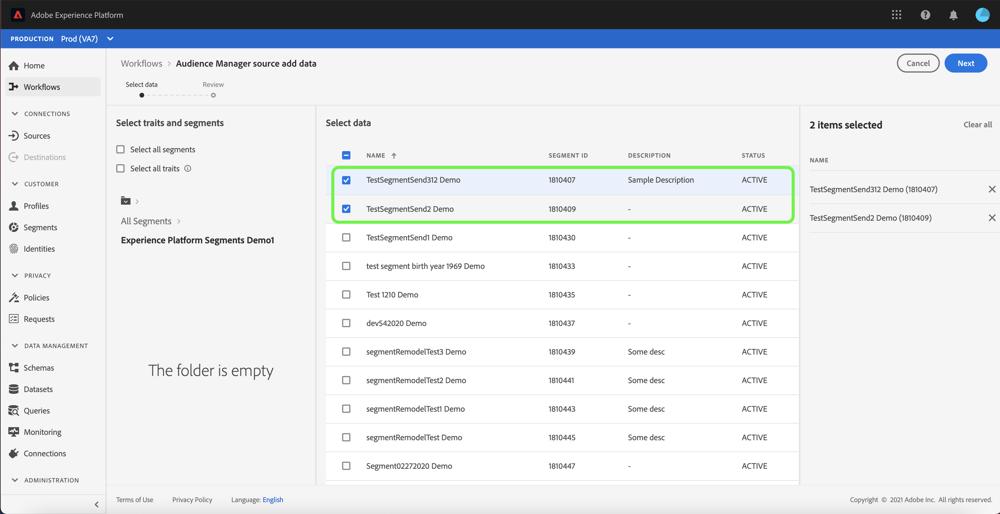

# Créer une connexion source Adobe Audience Manager dans l’interface utilisateur

Ce tutoriel vous guide tout au long des étapes de création d’un connecteur source pour Adobe Audience Manager afin d’importer des données d’événement d’expérience client dans Experience Platform à l’aide de l’interface utilisateur.

## Création d’une connexion source avec Adobe Audience Manager

Dans l’interface utilisateur d’Experience Platform, sélectionnez **[!UICONTROL Sources]** dans le volet de navigation de gauche pour accéder à l’espace de travail [!UICONTROL Sources]. L’écran [!UICONTROL Catalogue] affiche diverses sources avec lesquelles vous pouvez créer un compte.

Vous pouvez sélectionner la catégorie appropriée dans le catalogue sur le côté gauche de votre écran. Vous pouvez également sélectionner la source de votre choix à l’aide de la barre de recherche.

Sous [!UICONTROL Application Adobe], sélectionnez **[!UICONTROL Adobe Audience Manager]** puis **[!UICONTROL Configurer]**.

### Sélectionner les caractéristiques et les segments

>[!NOTE]
>
>Vous ne pouvez pas ingérer de données régionales de la source Audience Manager vers Experience Platform. Si des cas d’utilisation Analytics nécessitent des données régionales, utilisez le [connecteur source Analytics](../adobe-applications/analytics.md).

L’étape [!UICONTROL Sélectionner des caractéristiques et des segments] s’affiche, vous fournissant une interface interactive pour explorer et sélectionner vos caractéristiques, segments et données.

* Le panneau de gauche de l’interface contient les options [!UICONTROL Sélectionner des caractéristiques et des segments], ainsi qu’un répertoire hiérarchique de tous les segments disponibles.
* La moitié droite de l’interface vous permet d’interagir avec les segments sélectionnés et de sélectionner des données spécifiques que vous souhaitez utiliser.

Pour parcourir les segments disponibles, sélectionnez le dossier auquel vous souhaitez accéder dans le panneau [!UICONTROL Tous les segments]. La sélection d’un dossier vous permet de parcourir la hiérarchie d’un dossier et vous fournit une liste de segments à filtrer.

Une fois que vous avez identifié et sélectionné les segments que vous souhaitez utiliser, un nouveau panneau s’affiche à droite, affichant votre liste d’éléments sélectionnés. Vous pouvez continuer à accéder à différents dossiers et à sélectionner différents segments pour votre connexion. La sélection d’autres segments met à jour le panneau sur la droite.

Vous pouvez également sélectionner les zones **[!UICONTROL Sélectionner tous les segments]** et **[!UICONTROL Sélectionner toutes les caractéristiques]**. La sélection de tous les segments amènera les segments Audience Manager dans Experience Platform, tandis que la sélection de toutes les caractéristiques active toutes les caractéristiques propriétaires d’Audience Manager.

>[!WARNING]
>
>L’ingestion de populations de segments Audience Manager importantes a un impact direct sur le nombre total de profils lorsque vous envoyez un segment Audience Manager pour la première fois à Experience Platform à l’aide de la source Audience Manager. Cela signifie que la sélection de tous les segments peut potentiellement entraîner un nombre de profils excédant vos droits d’utilisation de licence. Veuillez vérifier votre [allocation d’utilisation de licence](../../../../../dashboards/guides/license-usage.md) avant de continuer.

Une fois que vous avez terminé, sélectionnez **[!UICONTROL Suivant]**

L’étape [!UICONTROL Révision] s’affiche, vous permettant de passer en revue les caractéristiques et les segments sélectionnés avant qu’ils ne soient connectés à Experience Platform. Les détails sont regroupés dans les catégories suivantes :

* **[!UICONTROL Connexion]** : affiche la plateforme source et le statut de la connexion.
* **[!UICONTROL Données sélectionnées]** : affiche le nombre de segments sélectionnés et de caractéristiques activées.

Une fois que vous avez vérifié votre flux de données, sélectionnez **[!UICONTROL Terminer]** et patientez quelques instants le temps que le flux de données soit créé.

## Étapes suivantes

Lorsqu’un flux de données Audience Manager est actif, les données entrantes sont automatiquement ingérées dans les profils clients en temps réel. Vous pouvez désormais utiliser ces données entrantes et créer des segments d’audience à l’aide du service de segmentation d’Experience Platform. Consultez les documents suivants pour plus d’informations :

* [Vue d’ensemble du profil client en temps réel](../../../../../profile/home.md)
* [Présentation de Segmentation Service](../../../../../segmentation/home.md)
