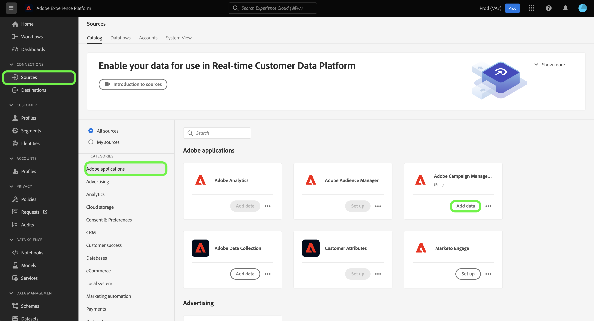
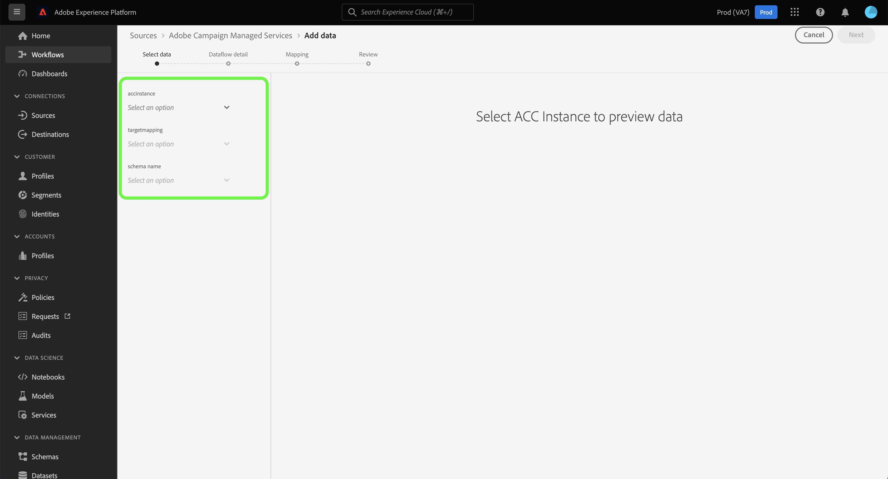

# Créer une connexion source Adobe Campaign Managed Cloud Services à l’aide de l’interface utilisateur d’Experience Platform

Ce tutoriel décrit les étapes à suivre pour créer une connexion source afin d’importer vos données Adobe Campaign Managed Cloud Services dans Adobe Experience Platform.

## Prise en main

Ce guide nécessite une compréhension professionnelle des composants suivants d’Experience Platform :

* [Sources](../../../../home.md) : Experience Platform permet d’ingérer des données provenant de diverses sources tout en vous offrant la possibilité de structurer, d’étiqueter et d’améliorer les données entrantes à l’aide des services d’Experience Platform.
* [[!DNL Experience Data Model (XDM)] Système](../../../../../xdm/home.md) : Cadre normalisé selon lequel Experience Platform organise les données d’expérience client. 
   * [Principes de base de la composition des schémas](../../../../../xdm/schema/composition.md) : découvrez les blocs de création de base des schémas XDM, y compris les principes clés et les bonnes pratiques en matière de composition de schémas.
   * [Tutoriel sur l’éditeur de schémas](../../../../../xdm/tutorials/create-schema-ui.md) : découvrez comment créer des schémas personnalisés à l’aide de l’interface utilisateur de l’éditeur de schémas.
* [Sandbox](../../../../../sandboxes/home.md) : Experience Platform fournit des sandbox virtuels qui divisent une instance Experience Platform unique en environnements virtuels distincts pour favoriser le développement et l’évolution d’applications d’expérience digitale.

## Connexion de Adobe Campaign Managed Cloud Services à Experience Platform

Dans l’interface utilisateur d’Experience Platform, sélectionnez **[!UICONTROL Sources]** dans le volet de navigation de gauche pour accéder à l’espace de travail [!UICONTROL Sources]. L’écran [!UICONTROL Catalog] affiche diverses sources avec lesquelles vous pouvez créer un compte.

Vous pouvez sélectionner la catégorie appropriée dans le catalogue sur le côté gauche de votre écran. Vous pouvez également utiliser la barre de recherche pour réduire les sources affichées.

Sous la catégorie **[!UICONTROL Adobe applications]** , sélectionnez **[!UICONTROL Adobe Campaign Managed Cloud Services]** puis **[!UICONTROL Add data]**.

### Sélectionner les données {#select-data}

>[!CONTEXTUALHELP]
>id="platform_sources_campaign_instance"
>title="Instance d&#39;environnement Adobe Campaign"
>abstract="Nom de l&#39;environnement Adobe Campaign que vous souhaitez utiliser."
>text="Learn more in documentation"

>[!CONTEXTUALHELP]
>id="platform_sources_campaign_mapping"
>title="Mapping de ciblage"
>abstract="Les mappings de ciblage sont des objets techniques utilisés par Campaign pour diffuser des messages. Ils contiennent tous les paramètres techniques nécessaires à l’envoi de diffusions (adresses, numéros de téléphone, indicateurs d’accord préalable, identifiants additionnels, etc.)."
>text="Learn more in documentation"

>[!CONTEXTUALHELP]
>id="platform_sources_campaign_schema"
>title="Nom du schéma"
>abstract="Nom de l’entité définie dans la base de données Adobe Campaign."
>text="Learn more in documentation"

L’étape [!UICONTROL Select data] s’affiche, vous fournissant une interface pour configurer vos [!UICONTROL Adobe Campaign instance], [!UICONTROL Target mapping] et [!UICONTROL Schema name].

| Propriété | Description |
| --- | --- |
| Instance Adobe Campaign | Nom de l’instance d’environnement Adobe Campaign que vous utilisez. |
| Mapping de ciblage | Les objets techniques utilisés par Campaign pour diffuser des messages, et contenant tous les paramètres techniques requis pour envoyer des diffusions. |
| Nom du schéma | Nom de l’entité de schéma que vous apportez à Experience Platform. Les options incluent le log de diffusion et le log de tracking. |

Une fois que vous avez fourni des valeurs pour votre instance Campaign, le mapping de ciblage et le nom du schéma, l’écran se met à jour pour afficher un aperçu de votre schéma ainsi qu’un exemple de jeu de données. Lorsque vous avez terminé, sélectionnez **[!UICONTROL Next]**.

### Utiliser un jeu de données existant

La page [!UICONTROL Dataflow detail] vous permet de choisir si vous souhaitez utiliser un jeu de données existant ou configurer un nouveau jeu de données pour votre flux de données.

Pour utiliser un jeu de données existant, sélectionnez **[!UICONTROL Existing dataset]**. Vous pouvez soit récupérer un jeu de données existant à l’aide de l’option [!UICONTROL Advanced search] , soit faire défiler la liste des jeux de données existants dans le menu déroulant.

Une fois un jeu de données sélectionné, donnez un nom à votre flux de données et une description facultative.

### Utiliser un nouveau jeu de données

Pour utiliser un nouveau jeu de données, sélectionnez **[!UICONTROL New dataset]**, puis fournissez un nom de jeu de données de sortie et une description facultative. Sélectionnez ensuite un schéma à mapper à l’aide de l’option [!UICONTROL Advanced search] ou en faisant défiler la liste des schémas existants dans le menu déroulant. Lorsque vous avez terminé, sélectionnez **[!UICONTROL Next]**.

### Activer les alertes

Vous pouvez activer les alertes pour recevoir des notifications sur le statut de votre flux de données. Sélectionnez une alerte dans la liste pour vous abonner et recevoir des notifications sur le statut de votre flux de données. Pour plus d’informations sur les alertes, consultez le guide sur l’[abonnement aux alertes des sources dans l’interface utilisateur](../../alerts.md).

Lorsque vous avez terminé de renseigner votre flux de données, sélectionnez **[!UICONTROL Next]**.

### Mappage des champs de données à un schéma XDM

L’étape [!UICONTROL Mapping] s’affiche, vous fournissant une interface pour mapper les champs source de votre schéma source à leurs champs XDM cibles appropriés dans le schéma cible.

Experience Platform fournit des recommandations intelligentes pour les champs mappés automatiquement en fonction du schéma ou du jeu de données cible que vous avez sélectionné. Vous pouvez ajuster manuellement les règles de mappage en fonction de vos cas d’utilisation. Selon vos besoins, vous pouvez choisir de mapper directement des champs ou d’utiliser des fonctions de préparation de données pour transformer les données sources afin d’obtenir des valeurs informatisées ou calculées. Pour obtenir des instructions complètes sur l’utilisation de l’interface du mappeur et des champs calculés, consultez le [&#x200B; Guide de l’interface utilisateur de la préparation des données &#x200B;](../../../../../data-prep/ui/mapping.md).

>[!IMPORTANT]
>
>Lors du mappage de vos champs source aux champs XDM cibles, vous devez vous assurer de mapper le champ d’identité principale désigné à son champ XDM cible approprié.
>
>Pour chaque audience, vous pouvez ajouter jusqu’à 20 champs à mapper à Adobe Campaign. Vous pouvez modifier cette limite en mettant à jour la valeur de l’option `NmsCdp_Aep_Sources_Max_Columns` dans le dossier Administration > Plateforme > Options de l’explorateur Campaign.

Une fois les données sources mappées, sélectionnez **[!UICONTROL Next]**.

### Vérifier le flux de données

L’étape **[!UICONTROL Review]** s’affiche, vous permettant de vérifier votre nouveau flux de données avant sa création. Les détails sont regroupés dans les catégories suivantes :

* **[!UICONTROL Connection]** : affiche le type de source, le chemin d’accès correspondant au fichier source choisi et le nombre de colonnes au sein de ce fichier source.
* **[!UICONTROL Assign dataset & map fields]** : affiche le jeu de données dans lequel les données sources sont ingérées, y compris le schéma auquel le jeu de données se conforme.

Une fois que vous avez révisé votre flux de données, sélectionnez **[!UICONTROL Finish]** et patientez quelques instants le temps que le flux de données soit créé.

### Surveillance de l’activité du jeu de données

Une fois votre flux de données créé, vous pouvez surveiller les données ingérées et afficher les informations sur les taux d’ingestion, ainsi que sur les lots réussis et en échec.

Pour commencer à afficher votre activité de jeu de données, sélectionnez **[!UICONTROL Dataflows]** dans le catalogue de sources.

Sélectionnez ensuite le jeu de données cible dans la liste des flux de données qui s’affichent.

La page d’activité du jeu de données s’affiche. À partir de là, vous pouvez afficher des informations sur les performances de votre flux de données, notamment le taux d’ingestion, les lots réussis et les lots en échec.

Cette page vous fournit également une interface pour mettre à jour la description des métadonnées de votre flux de données, activer les diagnostics d’ingestion partielle et d’erreur, ainsi qu’ajouter de nouvelles données à votre jeu de données.

>[!IMPORTANT]
>
>Vous ne pouvez pas renvoyer d’anciens journaux d’événements avec la source Adobe Campaign Managed Cloud Services. Si un renvoi est requis, utilisez un workflow ou une implémentation personnalisés pour exporter des données vers Amazon S3 ou Azure Blob, ou depuis Amazon S3 ou Azure Blob vers un jeu de données Adobe Experience Platform.

## Étapes suivantes

Ce tutoriel vous a permis de créer un flux de données pour importer les données de vos logs de diffusion et logs de tracking Campaign v8 dans Experience Platform. Ces données entrantes peuvent désormais être utilisées par les services Experience Platform en aval tels que [!DNL Real-Time Customer Profile] et [!DNL Data Science Workspace]. Consultez les documents suivants pour plus d’informations :

* [Présentation de [!DNL Real-Time Customer Profile]](../../../../../profile/home.md)
* [Présentation de [!DNL Data Science Workspace]](../../../../../data-science-workspace/home.md)
