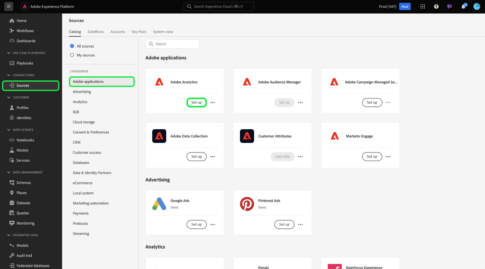

# Créer une connexion source Adobe Analytics pour les données de classification dans l’interface utilisateur

>[!TIP]
>
>Par défaut, les données de classification Adobe Analytics sont mises à jour chaque semaine. L’ingestion des données de vos classifications sera traitée sept jours après la configuration initiale de votre flux de données. La première charge ingère l’ensemble des données et l’ingestion hebdomadaire suivante exécute des données incrémentielles.

Lisez ce tutoriel pour savoir comment ingérer vos données de classification Adobe Analytics dans Adobe Experience Platform par le biais de l’interface utilisateur.

## Commencer

Ce tutoriel nécessite une compréhension du fonctionnement des composants suivants d’Adobe Experience Platform :

* [[!DNL Experience Data Model (XDM)] Système](../../../../../xdm/home.md) : Cadre normalisé selon lequel Experience Platform organise les données d’expérience client.
* [[!DNL Real-Time Customer Profile]](../../../../../profile/home.md) : fournit un profil de consommateur unifié en temps réel, basé sur des données agrégées provenant de plusieurs sources.
* [[!DNL Sandboxes]](../../../../../sandboxes/home.md) : Experience Platform fournit des sandbox virtuels qui divisent une instance Experience Platform unique en environnements virtuels distincts pour favoriser le développement et l’évolution d’applications d’expérience digitale.

Le connecteur source des classifications Analytics nécessite que vos données aient été migrées vers la nouvelle infrastructure de classifications d’Adobe Analytics avant utilisation. Pour confirmer le statut de migration de vos données, contactez l’équipe de votre compte Adobe.

## Sélectionnez vos classifications

Dans l’interface utilisateur d’Experience Platform, sélectionnez **[!UICONTROL Sources]** dans le volet de navigation de gauche pour accéder à l’espace de travail [!UICONTROL Sources]. Vous pouvez sélectionner la catégorie appropriée dans le catalogue sur le côté gauche de votre écran. Vous pouvez également trouver la source spécifique à utiliser à l’aide de l’option de recherche.

Dans la catégorie *Applications Adobe*, sélectionnez **[!UICONTROL Adobe Analytics]**, puis **[!UICONTROL Configurer]**.

>[!TIP]
>
>Les sources du catalogue de sources affichent l’option **[!UICONTROL Configurer]** s’il n’existe aucun compte authentifié. Une fois un compte authentifié, l’option est remplacée par **[!UICONTROL Ajouter des données]**.

Sélectionnez ensuite [!UICONTROL Classifications] puis sélectionnez les jeux de données de classifications à ingérer dans Experience Platform.

Vous pouvez sélectionner jusqu’à 30 jeux de données de classifications différents à importer dans Experience Platform. Tous les jeux de données que vous sélectionnez s’affichent dans le rail de droite. Lorsque vous avez terminé, sélectionnez [!UICONTROL Suivant] pour continuer.

## Vérifier vos classifications

L’étape **[!UICONTROL Réviser]** s’affiche, vous permettant de réviser les jeux de données de classifications sélectionnés avant leur création. Les détails sont regroupés dans les catégories suivantes :

* **[!UICONTROL Connexion]** : affiche la plateforme source et le statut de la connexion.
* **[!UICONTROL Type de données]** : affiche le nombre de classifications sélectionnées.
* **[!UICONTROL Planification]** : affiche la fréquence de synchronisation des données de classification. **Remarque** : les données de classification sont mises à jour chaque semaine.

Une fois que vous avez révisé votre flux de données, cliquez sur **[!UICONTROL Terminer]** et patientez quelques instants le temps que le flux de données soit créé.

## Étapes suivantes

Ce tutoriel vous a permis de créer un connecteur de données de classifications Analytics qui apporte des données de classification à Experience Platform. Consultez les documents suivants pour plus d’informations sur les données de [!DNL Analytics] et de classification :

* [Présentation du connecteur source Adobe Analytics](../../../../connectors/adobe-applications/analytics.md)
* [Créer une connexion source Analytics pour les données de suite de rapports dans l’interface utilisateur](./analytics.md)
* [À propos des classifications](https://experienceleague.adobe.com/docs/analytics/components/classifications/c-classifications.html)
