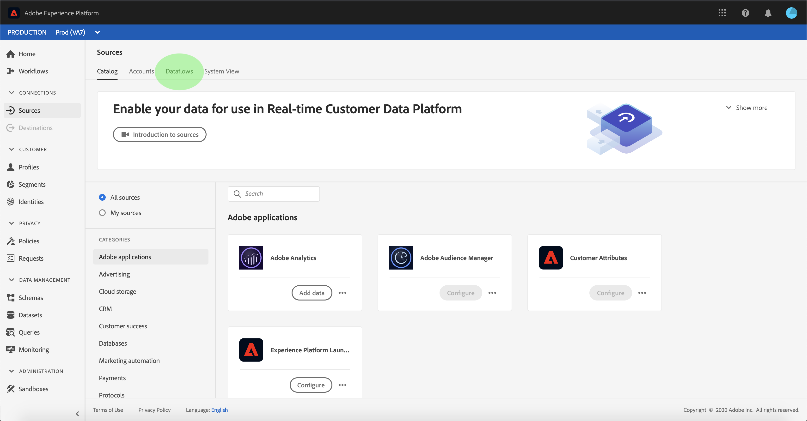

# Créer une connexion source Adobe Analytics pour les données de classification dans l’interface utilisateur

Ce tutoriel décrit les étapes à suivre pour créer une connexion à la source de données Adobe Analytics Classifications dans l’interface utilisateur afin d’importer des données de classification dans Adobe Experience Platform.

## Prise en main

Ce tutoriel nécessite une compréhension du fonctionnement des composants suivants d’Adobe Experience Platform :

* [[!DNL Experience Data Model (XDM)] Système](../../../../../xdm/home.md) : Cadre normalisé selon lequel Experience Platform organise les données d’expérience client.
* [[!DNL Real-Time Customer Profile]](../../../../../profile/home.md) : fournit un profil de consommateur unifié en temps réel, basé sur des données agrégées provenant de plusieurs sources.
* [[!DNL Sandboxes]](../../../../../sandboxes/home.md) : Experience Platform fournit des environnements de test virtuels qui divisent une instance de plateforme unique en environnements virtuels distincts pour favoriser le développement et l’évolution d’applications d’expérience numérique.

Le connecteur de données des classifications Analytics requiert la migration de vos données vers la nouvelle infrastructure [!DNL Classifications] d’Adobe Analytics avant son utilisation. Pour confirmer l’état de migration de vos données, contactez votre équipe de compte d’Adobe.

## Sélectionner vos classifications

Connectez-vous à [Adobe Experience Platform](https://platform.adobe.com), puis sélectionnez **[!UICONTROL Sources]** dans la barre de navigation de gauche pour accéder à l’espace de travail des sources. L’écran **[!UICONTROL Catalogue]** affiche les sources disponibles pour créer des connexions entrantes avec . Chaque carte source affiche une option permettant de configurer un nouveau compte ou d’ajouter des données à un compte existant.

Vous pouvez sélectionner la catégorie appropriée dans le catalogue sur le côté gauche de votre écran. Vous pouvez également trouver la source spécifique à utiliser à l’aide de l’option de recherche.

Sous la catégorie **[!UICONTROL Adobe d’applications]**, sélectionnez la carte **[!UICONTROL Adobe Analytics]**, puis sélectionnez **[!UICONTROL Ajouter des données]** pour commencer à utiliser les données des classifications Analytics.

L’écran permettant dʼ&#x200B;**[!UICONTROL Ajouter des données à la source Analytics]** s’affiche. Sélectionnez **[!UICONTROL Classifications]** dans l’en-tête supérieur pour afficher une liste de [!DNL Classifications] jeux de données, y compris des informations sur leur ID de dimension, le nom de la suite de rapports et l’identifiant de la suite de rapports.

Chaque page affiche jusqu’à dix jeux de données [!DNL Classifications] différents parmi lesquels vous pouvez choisir. Sélectionnez **[!UICONTROL Suivant]** au bas de la page pour rechercher d’autres options. Le panneau de droite affiche le nombre total de [!DNL Classifications] jeux de données que vous avez sélectionnés, ainsi que leurs noms. Ce panneau vous permet également de supprimer tous les jeux de données [!DNL Classifications] que vous avez peut-être sélectionnés par erreur ou d’effacer toutes les sélections avec une seule action.

Vous pouvez sélectionner jusqu’à 30 jeux de données [!DNL Classifications] différents à importer dans [!DNL Platform].

Une fois que vous avez sélectionné vos jeux de données [!DNL Classifications], sélectionnez **[!UICONTROL Suivant]** en haut à droite de la page.

## Vérification des classifications

L’étape **[!UICONTROL Réviser]** s’affiche, ce qui vous permet de revoir vos jeux de données [!DNL Classifications] sélectionnés avant qu’ils ne soient créés. Les détails sont regroupés dans les catégories suivantes :

* **[!UICONTROL Connexion]** : affiche la plateforme source et l’état de la connexion.
* **[!UICONTROL Type de données]** : affiche le nombre de [!DNL Classifications] sélectionnés.
* **[!UICONTROL Planification]** : affiche la fréquence de synchronisation des données [!DNL Classifications].

Une fois que vous avez examiné votre flux de données, cliquez sur **[!UICONTROL Terminer]** et laissez un certain temps pour créer le flux de données.

## Surveillance du flux de données des classifications

Une fois votre flux de données créé, vous pouvez surveiller les données ingérées par celui-ci. Dans l’écran **[!UICONTROL Catalogue]**, sélectionnez **[!UICONTROL Flux de données]** pour afficher la liste des flux établis associés à votre compte [!DNL Classifications].

L’écran **[!UICONTROL Flux de données]** s’affiche. Cette page contient une liste de flux de données, y compris des informations sur leur nom, les données source et l’état d’exécution de flux de données. À droite, se trouve le panneau **[!UICONTROL Propriétés]** qui contient des métadonnées concernant votre flux de données [!DNL Classifications].

Sélectionnez le **[!UICONTROL jeu de données Target]** auquel vous souhaitez accéder.

La page **[!UICONTROL Activité du jeu de données]** affiche des informations sur le jeu de données cible que vous avez sélectionné, y compris des détails sur son état de lot, son identifiant de jeu de données et son schéma.

## Étapes suivantes

En suivant ce tutoriel, vous avez créé un connecteur de données Analytics Classifications qui apporte [!DNL Classifications] données dans [!DNL Platform]. Consultez les documents suivants pour plus d’informations sur les données [!DNL Analytics] et [!DNL Classifications] :

* [Présentation du connecteur de données Analytics](../../../../connectors/adobe-applications/analytics.md)
* [Créer une connexion aux données Analytics dans l’interface utilisateur](./analytics.md)
* [À propos des classifications](https://experienceleague.adobe.com/docs/analytics/components/classifications/c-classifications.html)
