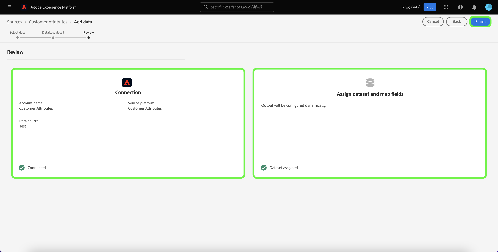

# Créer une connexion source Attributs du client dans l’interface utilisateur

Ce tutoriel décrit les étapes à suivre pour créer une connexion source dans l’interface utilisateur afin d’importer les données de profil Attributs du client dans Adobe Experience Platform. Pour plus d’informations sur les attributs du client, consultez la [présentation des attributs du client](https://experienceleague.adobe.com/docs/core-services/interface/customer-attributes/attributes.html?lang=fr).

>[!IMPORTANT]
>
>La source Attributs du client ne prend actuellement pas en charge l’activation ou la désactivation des flux de données.

## Créer une connexion source

>[!NOTE]
>
>Si vous avez déjà établi une connexion source pour les données de profil Attributs du client, l’option de connexion à la source est désactivée.

Dans l’interface utilisateur de Platform, sélectionnez **[!UICONTROL Sources]** dans le volet de navigation de gauche pour accéder à l’espace de travail [!UICONTROL Sources]. L’écran [!UICONTROL Catalogue] affiche diverses sources avec lesquelles vous pouvez créer une connexion.

Vous pouvez sélectionner la catégorie appropriée dans le catalogue sur le côté gauche de votre écran. Vous pouvez également sélectionner la source de votre choix à l’aide de la barre de recherche.

Dans la catégorie [!UICONTROL  Adobe applications], sélectionnez **[!UICONTROL Attributs du client]**, puis **[!UICONTROL Ajouter des données]**.

### Sélectionner la source de données des attributs du client

L’écran [!UICONTROL Ajouter des données] répertorie toutes les sources de données disponibles pour les attributs du client. Un seul jeu de données peut être sélectionné par connexion source Attributs du client.

>[!NOTE]
>
>Les groupes de champs, les schémas et les jeux de données sont créés d’usine dans le cadre de l’approvisionnement du flux. Ils resteront inchangés et vous devrez les supprimer manuellement, si nécessaire.

L’évolution du schéma n’est pas prise en charge par la source des attributs du client. Si l’entrée de schéma d’une source de données d’attributs du client est modifiée, elle deviendra incompatible avec Platform. Pour pallier ce problème, vous pouvez supprimer un flux de données d’attributs du client existant, ainsi que son jeu de données, son schéma et son groupe de champs associés, puis en créer un nouveau avec le schéma et la source de données mis à jour.

>[!IMPORTANT]
>
>Bien que vous puissiez supprimer un flux de données d’attributs du client, son jeu de données correspondant restera même après la suppression du flux de données. Consultez le guide sur la [suppression d’un jeu de données](../../../../../catalog/datasets/user-guide.md) pour savoir comment supprimer manuellement un jeu de données.

Pour créer une nouvelle connexion, sélectionnez une source de données dans la liste, puis sélectionnez **[!UICONTROL Suivant]**.

### Fournir des détails sur le flux de données

L’étape [!UICONTROL Détails du flux de données] s’affiche, ce qui vous permet de fournir un nom et une brève description de votre flux de données. Au cours de ce processus, vous pouvez également configurer les paramètres pour les [!UICONTROL diagnostics d’erreur], l’ [!UICONTROL ingestion partielle] et les [!UICONTROL alertes].

Le [!UICONTROL diagnostic d’erreur] permet de générer un message d’erreur détaillé pour tout enregistrement erroné survenant dans votre flux de données, tandis que l’[!UICONTROL ingestion partielle] vous permet d’ingérer des données contenant des erreurs, jusqu’à un certain seuil que vous définissez manuellement. Pour plus d’informations, consultez la [présentation de l’ingestion par lots partiels](../../../../../ingestion/batch-ingestion/partial.md).

Vous pouvez activer les alertes pour recevoir des notifications sur le statut de votre flux de données. Sélectionnez une alerte dans la liste et abonnez-vous à des notifications concernant le statut de votre flux de données. Pour plus d’informations sur les alertes, consultez le guide sur l’[abonnement aux alertes des sources dans l’interface utilisateur](../../alerts.md).

Lorsque vous avez terminé de renseigner votre flux de données, sélectionnez **[!UICONTROL Suivant]**.

### Vérification du flux de données

L’écran de [!UICONTROL Révision] s’affiche, vous permettant dʼexaminer votre nouveau flux de données avant sa création. Les détails sont regroupés dans les catégories suivantes :

* **[!UICONTROL Connexion]** : indique le type de source, le chemin d’accès approprié du fichier source sélectionné et le nombre de colonnes dans ce fichier source.
* **[!UICONTROL Attribuer des champs de jeu de données et de mappage]** : affiche le jeu de données dans lequel les données sources sont ingérées, y compris le schéma auquel le jeu de données se conforme.

## Étapes suivantes

Une fois la connexion créée, un schéma et un jeu de données cibles sont automatiquement créés pour contenir les données entrantes. Une fois l’ingestion initiale terminée, les données de profil d’attributs du client peuvent être utilisées par les services Platform en aval tels que [!DNL Real-Time Customer Profile] et [!DNL Segmentation Service]. Consultez les documents suivants pour plus d’informations :

* [Présentation de [!DNL Real-Time Customer Profile]](../../../../../profile/home.md)
* [Présentation de [!DNL Segmentation Service]](../../../../../segmentation/home.md)
