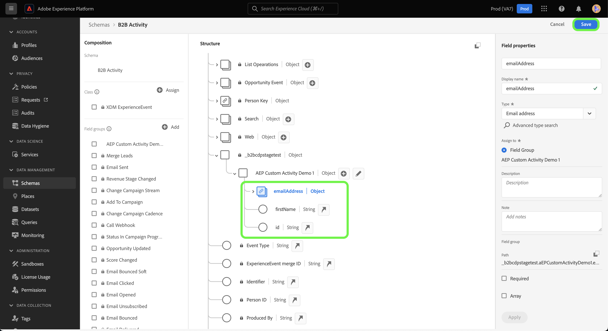
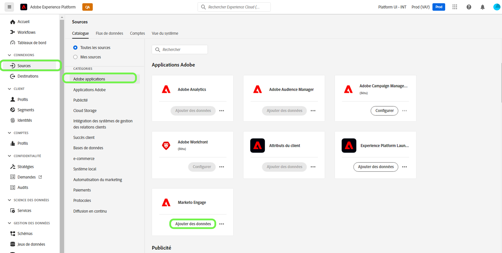
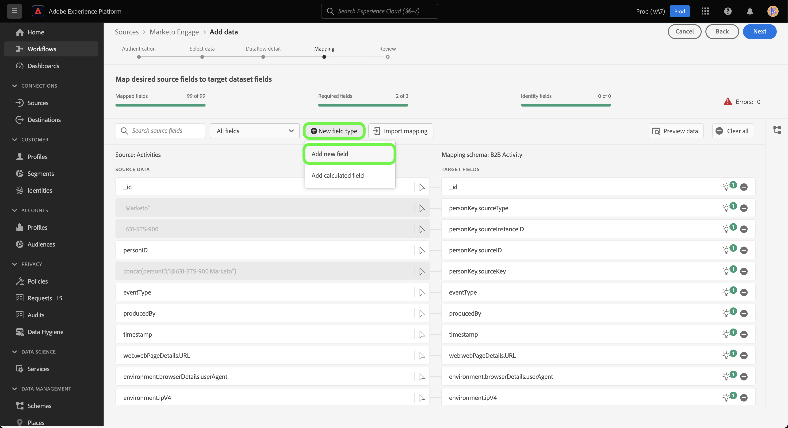

# Créer une connexion source et un flux de données [!DNL Marketo Engage] pour les données d’activité personnalisées dans l’interface utilisateur

>[!NOTE]
>
>Ce tutoriel décrit des étapes spécifiques pour configurer et importer des données **d’activité personnalisée** de [!DNL Marketo] vers Experience Platform. Pour savoir comment importer des données **d’activité standard**, consultez le [[!DNL Marketo] guide de l’interface utilisateur](./marketo.md).

Outre les [activités standard](../../../../connectors/adobe-applications/mapping/marketo.md#activities), vous pouvez également utiliser la source [!DNL Marketo] pour importer des données d’activités personnalisées dans Adobe Experience Platform. Ce document décrit les étapes à suivre pour créer une connexion source et un flux de données pour les données d’activité personnalisées à l’aide de la source [!DNL Marketo] dans l’interface utilisateur.

## Prise en main

Ce tutoriel nécessite une compréhension du fonctionnement des composants suivants d’Adobe Experience Platform :

* [Espaces de noms B2B et utilitaire de génération automatique de schéma](../../../../connectors/adobe-applications/marketo/marketo-namespaces.md) : les espaces de noms B2B et l’utilitaire de génération automatique de schémas vous permettent d’utiliser [!DNL Postman] pour générer automatiquement des valeurs pour vos espaces de noms et schémas B2B. Vous devez d’abord renseigner vos espaces de noms et schémas B2B, avant de créer une connexion source et un flux de données [!DNL Marketo].
* [Sources](../../../../home.md) : Experience Platform permet d’ingérer des données provenant de diverses sources tout en vous offrant la possibilité de structurer, d’étiqueter et d’améliorer les données entrantes à l’aide des services de Platform.
* [Modèle de données d’expérience (XDM)](../../../../../xdm/home.md) : framework normalisé selon lequel Experience Platform organise les données d’expérience client.
   * [Créer et modifier des schémas dans l’interface utilisateur](../../../../../xdm/ui/resources/schemas.md) : découvrez comment créer et modifier des schémas dans l’interface utilisateur.
* [Espaces de noms d’identité](../../../../../identity-service/features/namespaces.md) : les espaces de noms d’identité sont des composants d’[!DNL Identity Service] qui servent d’indicateurs du contexte auquel une identité se rapporte. Une identité complète est composée d’une valeur d’identifiant et d’un espace de noms.
* [[!DNL Real-Time Customer Profile]](/help/profile/home.md) : fournit un profil de consommateur unifié en temps réel, basé sur des données agrégées provenant de plusieurs sources.
* [Sandbox](../../../../../sandboxes/home.md) : Experience Platform fournit des sandbox virtuels qui divisent une instance de plateforme unique en environnements virtuels distincts pour favoriser le développement et l’évolution d’applications d’expérience digitale.

## Récupération des détails de votre activité personnalisée

La première étape pour apporter des données d’activité personnalisées de [!DNL Marketo] à l’Experience Platform consiste à récupérer le nom de l’API et le nom d’affichage de votre activité personnalisée.

Connectez-vous à votre compte à l’aide de l’interface [[!DNL Marketo]](https://app-sjint.marketo.com/#MM0A1) . Dans le volet de navigation de gauche, sous [!DNL Database Management], sélectionnez **Marketo Custom Activities**.

L’interface se met à jour pour afficher vos activités personnalisées, y compris des informations sur leurs noms d’affichage et noms d’API respectifs. Vous pouvez également utiliser le rail droit pour sélectionner et afficher d’autres activités personnalisées à partir de votre compte.


Sélectionnez **Champs** dans l’en-tête supérieur pour afficher les champs associés à votre activité personnalisée. Dans cette page, vous pouvez afficher les noms, les noms d’API, les descriptions et les types de données des champs de votre activité personnalisée. Les détails relatifs aux champs individuels seront utilisés ultérieurement lors de la création d’un schéma.


## Configuration de groupes de champs pour les activités personnalisées dans le schéma des activités B2B

Dans le tableau de bord *[!UICONTROL Schémas]* de l’interface utilisateur de l’Experience Platform, sélectionnez **[!UICONTROL Parcourir]**, puis **[!UICONTROL Activité B2B]** dans la liste des schémas.

>[!TIP]
>
>Utilisez la barre de recherche pour accélérer la navigation dans la liste des schémas.


### Création d’un groupe de champs pour une activité personnalisée

Ajoutez ensuite un nouveau groupe de champs au schéma [!DNL B2B Activity]. Ce groupe de champs doit correspondre à l’activité personnalisée que vous souhaitez ingérer et doit utiliser le nom d’affichage de l’activité personnalisée que vous avez récupéré précédemment.

Pour ajouter un nouveau groupe de champs, sélectionnez **[!UICONTROL + Ajouter]** à côté du panneau *[!UICONTROL Groupes de champs]* sous *[!UICONTROL Composition]*.


La fenêtre *[!UICONTROL Ajouter des groupes de champs]* s’affiche. Sélectionnez **[!UICONTROL Créer un groupe de champs]** , puis indiquez le même nom d’affichage pour l’activité personnalisée que vous avez récupérée à une étape précédente et fournissez une description facultative pour votre nouveau groupe de champs. Lorsque vous avez terminé, sélectionnez **[!UICONTROL Ajouter des groupes de champs]**.


Une fois créé, le nouveau groupe de champs pour l’activité personnalisée apparaît dans le catalogue [!UICONTROL Groupes de champs].


### Ajouter un nouveau champ à la structure de votre schéma

Ajoutez ensuite un nouveau champ à votre schéma. Ce nouveau champ doit être défini sur `type: object` et contiendra les champs individuels de l’activité personnalisée.

Pour ajouter un nouveau champ, sélectionnez le signe plus (`+`) à côté du nom du schéma. Une entrée pour le champ sans titre *[!UICONTROL | Type]* s’affiche. Ensuite, configurez les propriétés de votre champ à l’aide du panneau *[!UICONTROL Propriétés du champ]*. Définissez le nom du champ comme nom d’API de votre activité personnalisée et définissez le nom d’affichage comme nom d’affichage de votre activité personnalisée. Ensuite, définissez le type sur `object` et affectez le groupe de champs à celui de l’activité personnalisée que vous avez créé à l’étape précédente. Lorsque vous avez terminé, sélectionnez **[!UICONTROL Appliquer]**.


Le nouveau champ apparaît dans votre schéma.


### Ajouter des sous-champs au champ d’objet {#add-sub-fields-to-the-object-field}

La dernière étape de la préparation de votre schéma consiste à ajouter des champs individuels dans le champ que vous avez créé à l’étape précédente.



## Créer un flux de données

Une fois la configuration de votre schéma terminée, vous pouvez créer un flux de données pour vos données d’activité personnalisées.

Dans l’interface utilisateur de Platform, sélectionnez **[!UICONTROL Sources]** à partir de la barre de navigation de gauche pour accéder à l’espace de travail [!UICONTROL Sources]. L’écran [!UICONTROL Catalogue] affiche diverses sources avec lesquelles vous pouvez créer un compte.

Vous pouvez sélectionner la catégorie appropriée dans le catalogue sur le côté gauche de votre écran. Vous pouvez également sélectionner la source de votre choix à l’aide de la barre de recherche.

Dans la catégorie [!UICONTROL Applications Adobe], sélectionnez **[!UICONTROL Marketo Engage]**. Sélectionnez ensuite **[!UICONTROL Ajouter des données]** pour créer un flux de données [!DNL Marketo].



### Sélectionner les données

Sélectionnez **[!UICONTROL Activities]** dans la liste des [!DNL Marketo] jeux de données, puis **[!UICONTROL Next]**.


### Détails du flux de données

Ensuite, [ fournissez des informations pour votre flux de données ](./marketo.md#provide-dataflow-details), notamment des noms et descriptions pour votre jeu de données et votre flux de données, le schéma que vous utiliserez, ainsi que des configurations pour l’ingestion [!DNL Profile], les diagnostics d’erreur et l’ingestion partielle.


### Mappage

Les mappages des champs d’activité standard sont automatiquement renseignés, mais les champs d’activité personnalisés doivent être mappés manuellement à leurs champs cibles correspondants.

Pour commencer à mapper vos champs d’activité personnalisés, sélectionnez **[!UICONTROL Nouveau type de champ]**, puis sélectionnez **[!UICONTROL Ajouter un nouveau champ]**.



Parcourez la structure de données source et recherchez le champ d’activité personnalisé à ingérer. Lorsque vous avez terminé, sélectionnez **[!UICONTROL Select]**.

>[!TIP]
>
>Pour éviter toute confusion et gérer les noms de champ en double, les champs d’activité personnalisés sont précédés du préfixe du nom de l’API.


Pour ajouter un champ cible, sélectionnez l’icône de schéma  , puis sélectionnez les champs d’activité personnalisés dans le schéma cible.


Répétez les étapes pour ajouter le reste de vos champs de mappage d’activité personnalisés. Lorsque vous avez terminé, sélectionnez **[!UICONTROL Suivant]**.


### Révision

L’écran de *[!UICONTROL Révision]* s’affiche, vous permettant dʼexaminer votre nouveau flux de données avant sa création. Les détails sont regroupés dans les catégories suivantes :

* **[!UICONTROL Connexion]** : affiche le type de source, le chemin d’accès correspondant de l’entité source choisie et le nombre de colonnes au sein de cette entité source.
* **[!UICONTROL Attribuer des champs de jeu de données et de mappage]** : affiche le jeu de données dans lequel les données sources sont ingérées, y compris le schéma auquel le jeu de données se conforme.

Une fois que vous avez révisé votre flux de données, sélectionnez **[!UICONTROL Enregistrer et ingérer]** et patientez quelques instants le temps que le flux de données soit créé.


### Ajout d’activités personnalisées à un flux de données d’activités existant {#add-to-existing-dataflows}

Pour ajouter des données d’activité personnalisées à un flux de données existant, modifiez les mappages d’un flux de données d’activité existant avec les données d’activité personnalisées que vous souhaitez ingérer. Vous pouvez ainsi ingérer une activité personnalisée dans le même jeu de données d’activités existant. Pour plus d’informations sur la mise à jour des mappages d’un flux de données existant, consultez le guide sur la [mise à jour des flux de données dans l’interface utilisateur](../../update-dataflows.md).

### Utiliser [!DNL Query Service] pour filtrer les activités pour les activités personnalisées {#query-service-filter}

Une fois votre flux de données terminé, vous pouvez utiliser [Query Service](../../../../../query-service/home.md) pour filtrer les activités pour vos données d’activité personnalisées.

Lorsque des activités personnalisées sont ingérées dans Platform, le nom de l’API de l’activité personnalisée devient automatiquement son `eventType`. Utilisez `eventType={API_NAME}` pour filtrer les données d’activité personnalisées.

```sql
SELECT * FROM with_custom_activities_ds_today WHERE eventType='aepCustomActivityDemo1' 
```

Utilisez la clause `IN` pour filtrer plusieurs activités personnalisées :

```sql
SELECT * FROM $datasetName WHERE eventType='{API_NAME}'
SELECT * FROM $datasetName WHERE eventType IN ('aepCustomActivityDemo1', 'aepCustomActivityDemo2')
```

L’image ci-dessous illustre un exemple d’instruction SQL dans l’ [éditeur de requêtes](../../../../../query-service/ui/user-guide.md) qui filtre les données d’activité personnalisées.


## Étapes suivantes

En suivant ce tutoriel, vous avez configuré un schéma Platform pour les données d’activité personnalisées [!DNL Marketo] et créé un flux de données pour importer ces données dans Platform. Pour des informations générales sur la source [!DNL Marketo], consultez la [[!DNL Marketo] présentation de la source](../../../../connectors/adobe-applications/marketo/marketo.md).
