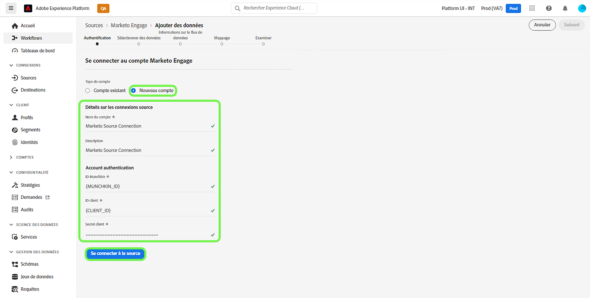
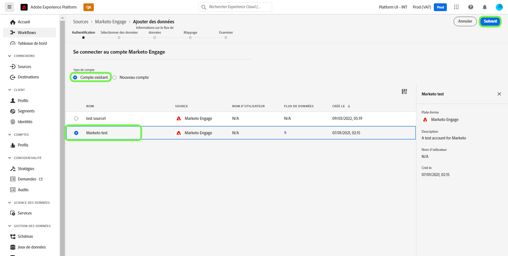
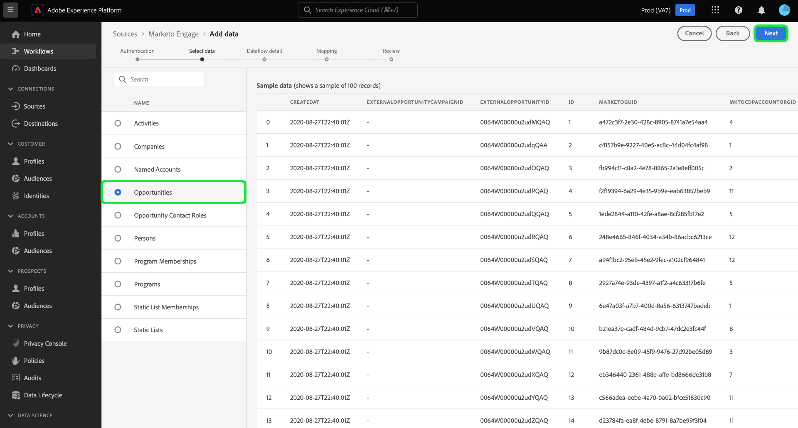
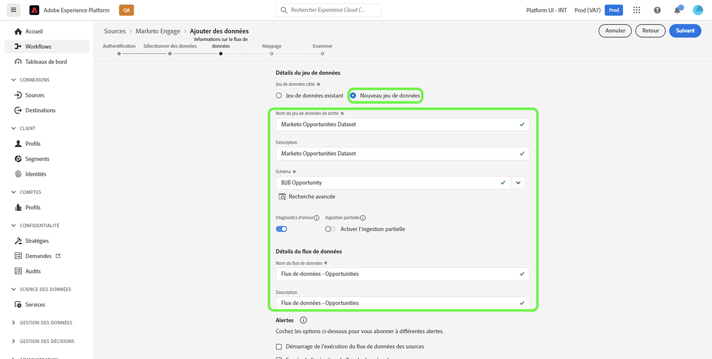
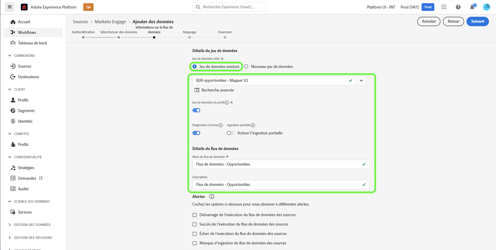
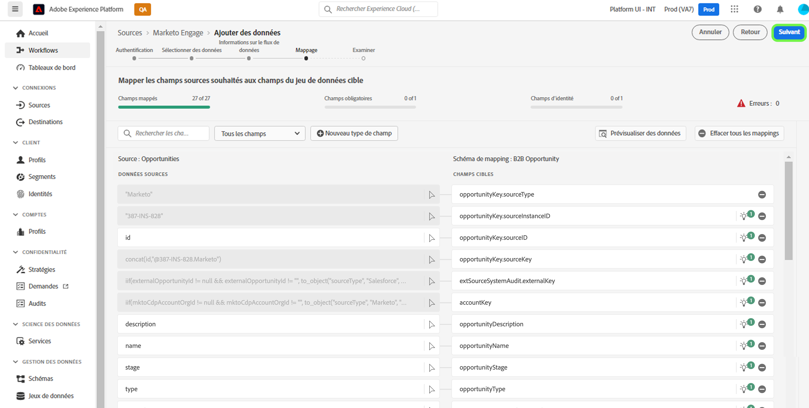
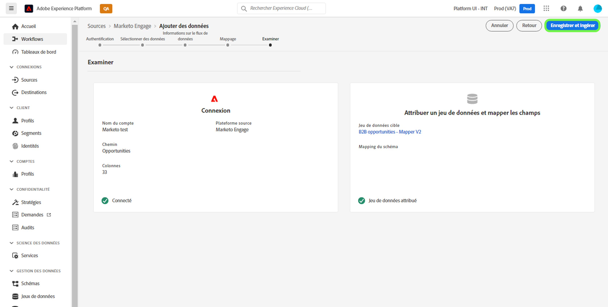

# Créer une connexion source [!DNL Marketo Engage] et un flux de données dans l’interface utilisateur

>[!IMPORTANT]
>
>Avant de créer une connexion source [!DNL Marketo Engage] et un flux de données, vous devez d’abord vous assurer que vous avez [mappé votre ID d’organisation Adobe](https://experienceleague.adobe.com/docs/marketo/using/product-docs/core-marketo-concepts/miscellaneous/set-up-adobe-organization-mapping.html?lang=fr) dans [!DNL Marketo]. En outre, vous devez également vous assurer que vous avez terminé [ [!DNL Marketo]  remplissage automatique de vos espaces de noms et schémas B2B](../../../../connectors/adobe-applications/marketo/marketo-namespaces.md) avant de créer une connexion source et un flux de données.

Ce tutoriel décrit les étapes à suivre pour créer un connecteur source [!DNL Marketo Engage] (ci-après dénommé « [!DNL Marketo] ») dans l’interface utilisateur pour importer des données B2B dans Adobe Experience Platform.

## Commencer

Ce tutoriel nécessite une compréhension du fonctionnement des composants suivants d’Adobe Experience Platform :

* [Utilitaire de génération automatique de schémas et d’espaces de noms B2B ](../../../../connectors/adobe-applications/marketo/marketo-namespaces.md) : l’utilitaire de génération automatique de schémas et d’espaces de noms B2B vous permet d’utiliser [!DNL Postman] pour générer automatiquement des valeurs pour vos schémas et espaces de noms B2B. Vous devez d’abord terminer vos espaces de noms et schémas B2B, avant de créer une connexion source [!DNL Marketo] et un flux de données.
* [Sources](../../../../home.md) : Experience Platform permet d’ingérer des données provenant de diverses sources tout en vous offrant la possibilité de structurer, d’étiqueter et d’améliorer les données entrantes à l’aide des services d’Experience Platform.
* [Modèle de données d’expérience (XDM)](../../../../../xdm/home.md) : framework normalisé selon lequel Experience Platform organise les données d’expérience client.
   * [Créer et modifier des schémas dans l’interface utilisateur](../../../../../xdm/ui/resources/schemas.md) : découvrez comment créer et modifier des schémas dans l’interface utilisateur.
* [Espaces de noms d’identité](../../../../../identity-service/features/namespaces.md) : les espaces de noms d’identité sont des composants d’[!DNL Identity Service] qui servent d’indicateurs du contexte auquel une identité se rapporte. Une identité complète est composée d’une valeur d’identifiant et d’un espace de noms.
* [[!DNL Real-Time Customer Profile]](/help/profile/home.md) : fournit un profil de consommateur unifié en temps réel, basé sur des données agrégées provenant de plusieurs sources.
* [Sandbox](../../../../../sandboxes/home.md) : Experience Platform fournit des sandbox virtuels qui divisent une instance Experience Platform unique en environnements virtuels distincts pour favoriser le développement et l’évolution d’applications d’expérience digitale.

### Collecter les informations d’identification requises

Pour accéder au compte [!DNL Marketo] sur Experience Platform, vous devez fournir les valeurs suivantes :

| Informations d’identification | Description |
| ---- | ---- |
| `munchkinId` | L’identifiant Munchkin est l’identifiant unique d’une instance [!DNL Marketo] spécifique. |
| `clientId` | Identifiant client unique de l’instance [!DNL Marketo]. |
| `clientSecret` | Secret client unique de l’instance [!DNL Marketo]. |

Pour plus d’informations sur l’acquisition de ces valeurs, consultez le [[!DNL Marketo] guide dʼauthentification](../../../../connectors/adobe-applications/marketo/marketo-auth.md).

Une fois que vous avez rassemblé les informations d’identification requises, vous pouvez suivre les étapes de la section suivante.

## Connecter votre compte [!DNL Marketo]

Dans l’interface utilisateur d’Experience Platform, sélectionnez **[!UICONTROL Sources]** dans le volet de navigation de gauche pour accéder à l’espace de travail [!UICONTROL Sources]. Vous pouvez sélectionner la catégorie appropriée dans le catalogue sur le côté gauche de votre écran. Vous pouvez également trouver la source spécifique à utiliser à l’aide de l’option de recherche.

Dans la catégorie *Applications Adobe*, sélectionnez **[!UICONTROL Marketo Engage]**, puis **[!UICONTROL Ajouter des données]**.

>[!TIP]
>
>Les sources du catalogue affichent l’option **[!UICONTROL Configurer]** lorsqu’une source donnée ne dispose pas encore d’un compte authentifié. Une fois qu’un compte authentifié existe, cette option devient **[!UICONTROL Ajouter des données]**.

La page **[!UICONTROL Connexion au compte Marketo Engage]** s’affiche. Sur cette page, vous pouvez utiliser un nouveau compte ou accéder à un compte existant.

>[!BEGINTABS]

>[!TAB Créer un compte]

Pour créer un compte, sélectionnez **[!UICONTROL Nouveau compte]** et indiquez un nom, une description facultative et vos informations d’identification.

Lorsque vous avez terminé, sélectionnez **[!UICONTROL Se connecter à la source]** puis attendez que la nouvelle connexion s’établisse.

>[!TAB Utiliser un compte existant]

Pour utiliser un compte existant, sélectionnez **[!UICONTROL Compte existant]** puis sélectionnez le compte à utiliser dans le catalogue des comptes existants.

Cliquez sur **[!UICONTROL Suivant]** pour continuer.

>[!ENDTABS]

## Sélectionner un jeu de données

Une fois le compte [!DNL Marketo] créé, une interface sʼaffiche pour explorer les jeux de données [!DNL Marketo].

La moitié gauche de l’interface est un navigateur de répertoire qui affiche les 10 jeux de données [!DNL Marketo]. Une connexion source [!DNL Marketo] pleinement fonctionnelle nécessite l’ingestion des neuf jeux de données différents. Si vous utilisez également la fonctionnalité Account-Based Marketing (ABM) [!DNL Marketo], vous devez créer un 10e flux de données pour ingérer le jeu de données [!UICONTROL Comptes nommés].

>[!NOTE]
>
>À des fins de concision, le tutoriel suivant utilise [!UICONTROL Opportunités] comme exemple, mais les étapes décrites ci-dessous s’appliquent aux 10 jeux de données [!DNL Marketo].

Sélectionnez le jeu de données à ingérer. Cette opération met à jour l’interface pour afficher un aperçu de votre jeu de données. Lorsque vous avez terminé, sélectionnez **[!UICONTROL Suivant]**.

## Fournir des détails sur le jeu de données et le flux de données {#provide-dataset-and-dataflow-details}

Ensuite, vous devez fournir des informations sur votre jeu de données et votre flux de données.

### Détails du jeu de données {#dataset-details}

Un jeu de données est une structure de stockage et de gestion pour une collection de données, généralement sous la forme d’un tableau, qui contient un schéma (des colonnes) et des champs (des lignes). Les données correctement ingérées par Experience Platform sont stockées dans le lac de données sous forme de jeux de données. Au cours de cette étape, vous pouvez créer un jeu de données ou utiliser un jeu de données existant.

>[!BEGINTABS]

>[!TAB Utiliser un nouveau jeu de données]

Pour utiliser un nouveau jeu de données, sélectionnez **[!UICONTROL Nouveau jeu de données]** puis indiquez un nom et une description facultative pour votre jeu de données. Vous devez également sélectionner un schéma de modèle de données d’expérience (XDM) auquel votre jeu de données adhère.

>[!TAB Utiliser un jeu de données existant]

Si vous disposez déjà d’un jeu de données, sélectionnez **[!UICONTROL Jeu de données existant]** puis utilisez l’option **[!UICONTROL Recherche avancée]** pour afficher une fenêtre de tous les jeux de données de votre organisation, y compris leurs détails respectifs, par exemple s’ils sont activés pour l’ingestion dans le profil client en temps réel ou non.

>[!ENDTABS]

### Configurations du flux de données {#dataflow-configurations}

>[!IMPORTANT]
>
>La source [!DNL Marketo] utilise l’ingestion par lots pour ingérer tous les enregistrements historiques et l’ingestion par flux pour les mises à jour en temps réel. Cela permet à la source de continuer la diffusion en continu tout en ingérant les enregistrements erronés. Activez le bouton (bascule) **[!UICONTROL Ingestion partielle]**, puis définissez le [!UICONTROL Seuil d’erreur %] au maximum pour empêcher l’échec du flux de données.

Si votre jeu de données est activé pour le profil client en temps réel, au cours de cette étape, vous pouvez activer/désactiver le **[!UICONTROL jeu de données de profil]** pour activer vos données pour l’ingestion de profil. Vous pouvez également utiliser cette étape pour activer les **[!UICONTROL diagnostics d’erreur]** et **[!UICONTROL ingestion partielle]**.

* **[!UICONTROL Diagnostics d’erreur]** : sélectionnez **[!UICONTROL Diagnostics d’erreur]** pour demander à la source de générer des diagnostics d’erreur que vous pourrez référencer ultérieurement lors de la surveillance de l’activité du jeu de données et du statut du flux de données.
* **[!UICONTROL Ingestion partielle]** : l’[ingestion par lots partielle](../../../../../ingestion/batch-ingestion/partial.md) permet d’ingérer des données contenant des erreurs, jusqu’à un certain seuil configurable. Cette fonctionnalité vous permet d’ingérer toutes vos données exactes dans Experience Platform, tandis que toutes vos données incorrectes sont traitées par lots séparément avec des informations sur les raisons de leur non-validité.

Au cours de cette étape, vous pouvez activer **[!UICONTROL Flux de données d’exemple]** pour limiter l’ingestion des données et éviter les coûts supplémentaires liés à l’ingestion de toutes les données historiques, y compris les identités de personne.

>[!BEGINSHADEBOX]

**Guide rapide sur l’utilisation d’un exemple de flux de données**

L’exemple de flux de données est une configuration que vous pouvez définir pour votre flux de données [!DNL Marketo] afin de limiter votre taux d’ingestion, puis d’essayer les fonctionnalités d’Experience Platform sans avoir à ingérer de grandes quantités de données.

* Activez l’exemple de flux de données pour limiter les données historiques en ingérant jusqu’à 100 000 enregistrements (à partir de l’ID d’enregistrement le plus volumineux) ou jusqu’aux 10 derniers jours d’activité pendant la tâche de renvoi.
* Lors de l’utilisation de l’exemple de configuration de flux de données pour toutes les entités B2B, vous devez tenir compte du fait qu’il est possible que certains enregistrements associés soient manquants, car l’historique complet des données source n’est pas ingéré.

>[!ENDSHADEBOX]

En outre, si vous ingérez des données à partir du jeu de données d’entreprises, vous pouvez activer l’option **[!UICONTROL Exclure les comptes non réclamés]** pour exclure les comptes non réclamés de l’ingestion.

Lorsque des personnes remplissent un formulaire, [!DNL Marketo] crée un enregistrement de compte fantôme basé sur le nom de la société qui ne contient aucune autre donnée. Pour les nouveaux flux de données, le bouton (bascule) d’exclusion des comptes non réclamés est activé par défaut. Pour les flux de données existants, vous pouvez activer ou désactiver la fonction, les modifications s’appliquant aux données nouvellement ingérées et non aux données existantes.

## Mappez vos champs sources du jeu de données [!DNL Marketo] aux champs XDM cibles.

L’interface de [!UICONTROL mappage] fournit un outil complet pour mapper les champs sources de votre schéma source aux champs XDM cibles correspondants dans le schéma cible.

Chaque jeu de données [!DNL Marketo] comporte ses propres règles de mappage spécifiques à suivre. Pour plus d’informations sur le mappage de jeux de données [!DNL Marketo] à XDM, consultez les sections suivantes :

* [Activités](../../../../connectors/adobe-applications/mapping/marketo.md#activities)
* [Programmes](../../../../connectors/adobe-applications/mapping/marketo.md#programs)
* [Abonnements au programme](../../../../connectors/adobe-applications/mapping/marketo.md#program-memberships)
* [Sociétés](../../../../connectors/adobe-applications/mapping/marketo.md#companies)
* [Listes statiques](../../../../connectors/adobe-applications/mapping/marketo.md#static-lists)
* [Abonnements à des listes statiques](../../../../connectors/adobe-applications/mapping/marketo.md#static-list-memberships)
* [Comptes désignés](../../../../connectors/adobe-applications/mapping/marketo.md#named-accounts)
* [Opportunités](../../../../connectors/adobe-applications/mapping/marketo.md#opportunities)
* [Rôles de contact d’opportunité](../../../../connectors/adobe-applications/mapping/marketo.md#opportunity-contact-roles)
* [Personnes](../../../../connectors/adobe-applications/mapping/marketo.md#persons)

Selon vos besoins, vous pouvez choisir de mapper directement des champs ou d’utiliser des fonctions de préparation de données pour transformer les données sources afin d’obtenir des valeurs informatisées ou calculées. Pour obtenir des instructions complètes sur l’utilisation de l’interface de mappage, consultez le [Guide de l’interface utilisateur de la préparation de données](../../../../../data-prep/ui/mapping.md).

Une fois vos jeux de mappages prêts, cliquez sur **[!UICONTROL Suivant]** et patientez quelques instants le temps que le flux de données soit créé.

## Vérifier le flux de données

L’écran de **[!UICONTROL Révision]** s’affiche, vous permettant dʼexaminer votre nouveau flux de données avant sa création. Les détails sont regroupés dans les catégories suivantes :

* **[!UICONTROL Connexion]** : affiche le type de source, le chemin d’accès correspondant de l’entité source choisie et le nombre de colonnes au sein de cette entité source.
* **[!UICONTROL Attribuer des champs de jeu de données et de mappage]** : affiche le jeu de données dans lequel les données sources sont ingérées, y compris le schéma auquel le jeu de données se conforme.

Une fois que vous avez révisé votre flux de données, sélectionnez **[!UICONTROL Enregistrer et ingérer]** et patientez quelques instants le temps que le flux de données soit créé.

## Surveiller votre flux de données

Une fois votre flux de données créé, vous pouvez surveiller les données ingérées et afficher les informations relatives au taux d’ingestion, aux succès et aux erreurs. Pour plus d’informations sur la surveillance des flux de données, suivez le tutoriel sur la [surveillance des flux de données dans l’interface utilisateur](../../../../../dataflows/ui/monitor-sources.md).

## Supprimer les attributs

Les attributs personnalisés des jeux de données ne peuvent pas être masqués ni supprimés rétroactivement. Si vous souhaitez masquer ou supprimer un attribut personnalisé d’un jeu de données existant, vous devez créer un nouveau jeu de données sans cet attribut personnalisé, un nouveau schéma XDM et configurer un nouveau flux de données pour le nouveau jeu de données que vous souhaitez créer. Vous devez également désactiver ou supprimer le flux de données d’origine constitué du jeu de données et de l’attribut personnalisé que vous souhaitez masquer ou supprimer.

## Supprimer le flux de données

Vous pouvez supprimer les flux de données qui ne sont plus nécessaires ou qui ont été créés de manière incorrecte à l’aide de la fonction **[!UICONTROL Supprimer]**, disponible dans l’espace de travail [!UICONTROL Flux de données]. Pour plus d’informations sur la suppression des flux de données, consultez le tutoriel sur la [suppression de flux de données dans l’interface utilisateur](../../delete.md).

## Étapes suivantes

Ce tutoriel vous a permis de créer un flux de données pour ingérer des données B2B de votre source de [!DNL Marketo Engage] vers Experience Platform.

## Annexe {#appendix}

Les sections suivantes fournissent des instructions supplémentaires que vous pouvez suivre lors de l’utilisation de la source [!DNL Marketo].

### Messages d’erreur dans l’interface utilisateur {#error-messages}

Les messages d’erreur suivants s’affichent dans l’interface utilisateur lorsqu’Experience Platform détecte des problèmes liés à votre configuration :

#### [!DNL Munchkin ID] n’est pas mappé à l’organisation appropriée

L’authentification sera refusée si votre [!DNL Munchkin ID] n’est pas mappé à l’organisation Experience Platform que vous utilisez. Configurez le mappage entre votre [!DNL Munchkin ID] et votre organisation à l’aide de l’[[!DNL Marketo] interface](https://app-sjint.marketo.com/#MM0A1).

#### Identité du Principal manquante

L’enregistrement et l’ingestion d’un flux de données échouent si une identité principale est manquante. Assurez-vous qu’[une identité principale existe dans votre schéma XDM](../../../../../xdm/tutorials/create-schema-ui.md), avant de tenter de configurer un flux de données.

