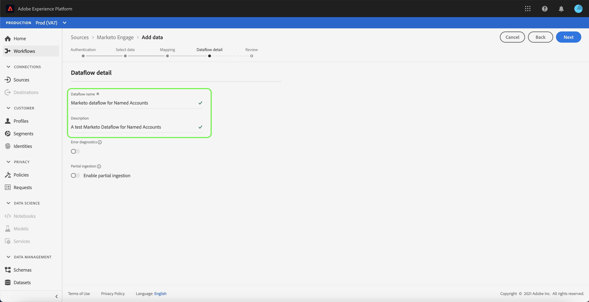

# (bêta) Créez un connecteur source [!DNL Marketo Engage] dans l’interface utilisateur.

>[!IMPORTANT]
>
>La source [!DNL Marketo Engage] est actuellement en version bêta. La fonction et la documentation sont des sujets de modification. En outre, vous devez vous assurer que vous utilisez un sandbox hors production lorsque vous utilisez le connecteur pendant le programme bêta. Pour plus d&#39;informations sur les sandbox, consultez la [documentation sur les sandbox](https://experienceleague.adobe.com/docs/experience-platform/sandbox/home.html?lang=en#understanding-sandboxes).

Ce didacticiel décrit les étapes à suivre pour créer un connecteur source [!DNL Marketo Engage] (ci-après dénommé &quot;[!DNL Marketo]&quot;) dans l’interface utilisateur afin d’importer des données de consommation dans Adobe Experience Platform.

## Prise en main

Ce tutoriel nécessite une compréhension du fonctionnement des composants suivants d’Adobe Experience Platform :

* [Sources](../../../../home.md) : Experience Platform permet l’assimilation de données à partir de diverses sources tout en vous permettant de structurer, d’étiqueter et d’améliorer les données entrantes à l’aide des services de plate-forme.
* [Modèle de données d’expérience (XDM)](../../../../../xdm/home.md) : Cadre normalisé selon lequel l’Experience Platform organise les données d’expérience client.
   * [Créez et modifiez des schémas dans l’interface utilisateur](../../../../../xdm/ui/resources/schemas.md) : Découvrez comment créer et modifier des schémas dans l’interface utilisateur.
* [Espaces de nommage](../../../../../identity-service/namespaces.md) d&#39;identité : Les espaces de nommage d&#39;identité sont un élément de  [!DNL Identity Service] ce qui sert d&#39;indicateur du contexte auquel une identité se rapporte. Une identité complète est composée d’une valeur d’identifiant et d’un espace de noms.
* [[!DNL Real-time Customer Profile]](../../../../../profile/home.md) : fournit un profil client en temps réel unifié basé sur des données agrégées issues de plusieurs sources.
* [Environnements de test](../../../../../sandboxes/home.md) : Experience Platform fournit des environnements de test virtuels qui divisent une instance de plateforme unique en environnements virtuels distincts pour favoriser le développement et l’évolution d’applications d’expérience numérique.

### Collecte des informations d’identification requises

Pour accéder à votre compte [!DNL Marketo] sur la plate-forme, vous devez fournir les valeurs suivantes :

| Informations d’identification | Description |
| ---------- | ----------- |
| `munchkinId` | L&#39;identifiant Munchkin est l&#39;identifiant unique d&#39;une instance [!DNL Marketo] spécifique. |
| `clientId` | ID client unique de votre instance [!DNL Marketo]. |
| `clientSecret` | Le secret client unique de votre instance [!DNL Marketo]. |

Pour plus d&#39;informations sur l&#39;acquisition de ces valeurs, consultez le [[!DNL Marketo] guide d&#39;authentification](../../../../connectors/adobe-applications/marketo/marketo-auth.md).

Une fois que vous avez rassemblé les informations d’identification requises, vous pouvez suivre les étapes de la section suivante.

## Connectez votre compte [!DNL Marketo]

Dans l’interface utilisateur de la plate-forme, sélectionnez **[!UICONTROL Sources]** dans la barre de navigation de gauche pour accéder à l’espace de travail [!UICONTROL Sources]. L’écran [!UICONTROL Catalogue] affiche diverses sources pour lesquelles vous pouvez créer un compte.

Vous pouvez sélectionner la catégorie appropriée dans le catalogue sur le côté gauche de l’écran. Vous pouvez également trouver la source spécifique avec laquelle vous souhaitez travailler à l&#39;aide de la barre de recherche.

Sous la catégorie [!UICONTROL Adobe applications], sélectionnez **[!UICONTROL Marketo Engage]**. Sélectionnez ensuite **[!UICONTROL Ajouter les données]** pour créer un nouveau flux de données [!DNL Marketo].

La page **[!UICONTROL Se connecter au Marketo Engage]** s&#39;affiche. Sur cette page, vous pouvez soit utiliser un nouveau compte, soit accéder à un compte existant.

### Nouveau compte

Si vous créez un nouveau compte, sélectionnez **[!UICONTROL Nouveau compte]**. Dans le formulaire d&#39;entrée qui s&#39;affiche, indiquez un nom de compte, une description facultative et vos informations d&#39;authentification [!DNL Marketo]. Une fois terminé, sélectionnez **[!UICONTROL Se connecter à la source]**, puis attendez un certain temps pour que la nouvelle connexion s&#39;établisse.

### Compte existant

Pour créer un flux de données avec un compte existant, sélectionnez **[!UICONTROL Compte existant]**, puis sélectionnez le compte [!DNL Marketo] à utiliser. Sélectionnez **[!UICONTROL Suivant]** pour continuer.

## Sélection d’un jeu de données

Après avoir créé votre compte [!DNL Marketo], l&#39;étape suivante fournit une interface vous permettant d&#39;explorer les jeux de données [!DNL Marketo].

La moitié gauche de l&#39;interface est un navigateur d&#39;annuaire qui affiche les jeux de données 10 [!DNL Marketo]. Une connexion source [!DNL Marketo] pleinement opérationnelle nécessite l&#39;assimilation des neuf jeux de données différents. Si vous utilisez également la fonction [!DNL Marketo's] marketing basé sur le compte (ABM), vous devez également créer un 10e flux de données pour assimiler le jeu de données [!UICONTROL Comptes nommés].

>[!NOTE]
>
>Pour des raisons de concision, le didacticiel suivant utilise [!UICONTROL les comptes nommés] comme exemple, mais les étapes décrites ci-dessous s&#39;appliquent à l&#39;un des 10 jeux de données [!DNL Marketo].

Sélectionnez le jeu de données à importer en premier, puis **[!UICONTROL Suivant]**.

## Mappage des champs de données à un schéma XDM

L&#39;étape [!UICONTROL Mappage] s&#39;affiche, fournissant une interface permettant de mapper le jeu de données [!DNL Marketo] à un jeu de données de plateforme.

Choisissez un jeu de données dans lequel les données entrantes doivent être assimilées. Vous pouvez utiliser un jeu de données existant ou en créer un nouveau.

### Utilisation d’un jeu de données existant

Pour importer des données dans un jeu de données existant, sélectionnez **[!UICONTROL Utiliser un jeu de données existant]**, puis sélectionnez l&#39;icône du jeu de données.

La boîte de dialogue **[!UICONTROL Sélectionner un jeu de données]** s&#39;affiche. Recherchez le jeu de données avec le schéma approprié à utiliser, sélectionnez-le, puis **[!UICONTROL Confirmer]**.

### Utiliser un nouveau jeu de données

Pour importer des données dans un nouveau jeu de données, sélectionnez **[!UICONTROL Créer un nouveau jeu de données]** et entrez un nom et une description pour le jeu de données dans les champs fournis.

Vous pouvez rechercher un schéma en entrant son nom dans la barre de recherche **[!UICONTROL Sélectionner un schéma]**. Vous pouvez également sélectionner l’icône de liste déroulante pour afficher une liste de schémas existants. Vous pouvez également sélectionner **[!UICONTROL Recherche avancée]** pour accéder à la page des schémas existants, y compris leurs détails respectifs.

Activez le bouton **[!UICONTROL Profil de données]** pour activer votre jeu de données de cible pour [!DNL Profile], ce qui vous permet de créer une vue holistique des attributs et des comportements d&#39;une entité. Les données de tous les [!DNL Profile] jeux de données activés seront incluses dans [!DNL Profile] et des modifications seront appliquées lorsque vous enregistrez votre flux de données.

Une fois que vous avez sélectionné un schéma, faites défiler l&#39;écran jusqu&#39;à la vue de la boîte de dialogue de mappage vers le début qui fait correspondre vos champs [!DNL Marketo] de jeu de données à leurs champs XDM de cible appropriés.

### Faire correspondre vos champs source de jeux de données [!DNL Marketo] aux champs XDM de cible

Chaque jeu de données [!DNL Marketo] doit suivre ses propres règles de mappage spécifiques. Pour plus d&#39;informations sur la mise en correspondance des [!DNL Marketo] jeux de données avec XDM, consultez les sections suivantes :

* [Activités](../../../../connectors/adobe-applications/mapping/marketo.md#activities)
* [Programmes](../../../../connectors/adobe-applications/mapping/marketo.md#programs)
* [adhésions au programme](../../../../connectors/adobe-applications/mapping/marketo.md#program-memberships)
* [Sociétés](../../../../connectors/adobe-applications/mapping/marketo.md#companies)
* [Listes statiques](../../../../connectors/adobe-applications/mapping/marketo.md#static-lists)
* [Abonnements à la liste statique](../../../../connectors/adobe-applications/mapping/marketo.md#static-list-memberships)
* [Comptes nommés](../../../../connectors/adobe-applications/mapping/marketo.md#named-accounts)
* [Opportunités](../../../../connectors/adobe-applications/mapping/marketo.md#opportunities)
* [Rôles de contact d&#39;opportunité](../../../../connectors/adobe-applications/mapping/marketo.md#opportunity-contact-roles)
* [Personnes](../../../../connectors/adobe-applications/mapping/marketo.md#persons)

Sélectionnez **[!UICONTROL données de Prévisualisation]** pour afficher les résultats de mappage en fonction du jeu de données sélectionné.

La fenêtre contextuelle [!UICONTROL Prévisualisation] fournit une interface pour explorer les résultats de mappage de 100 lignes de données d&#39;exemple au maximum du jeu de données sélectionné.

Une fois les champs source mappés aux champs de cible appropriés, sélectionnez **[!UICONTROL Fermer]**.

## Fournir des détails sur le flux de données

L&#39;étape [!UICONTROL Détails du flux de données] s&#39;affiche, vous permettant de fournir un nom et une brève description de votre nouveau flux de données.

Activez la bascule **[!UICONTROL Diagnostics d&#39;erreur]** pour permettre la génération de messages d&#39;erreur détaillés pour les lots nouvellement assimilés, que vous pouvez télécharger à l&#39;aide de l&#39;API.

Le connecteur [!DNL Marketo] utilise l&#39;assimilation par lot pour assimiler tous les enregistrements historiques et utilise l&#39;assimilation en flux continu pour les mises à jour en temps réel. Cela permet au connecteur de continuer la diffusion en continu tout en ingérant des enregistrements erronés. Activez l&#39;option d&#39;assimilation partielle ****, puis définissez le seuil d&#39;erreur [!UICONTROL %] au maximum pour empêcher l&#39;échec du flux de données.

**[!UICONTROL L’]** assimilation partielle permet d’assimiler des données contenant des erreurs jusqu’à un certain seuil. Pour plus d&#39;informations, consultez l&#39;[aperçu de l&#39;assimilation partielle des lots](../../../../../ingestion/batch-ingestion/partial.md).

Une fois que vous avez fourni les détails de votre flux de données et défini le seuil d’erreur sur le maximum, sélectionnez **[!UICONTROL Suivant]**.

## Vérifier votre flux de données

L&#39;étape **[!UICONTROL Réviser]** s&#39;affiche, vous permettant de vérifier votre nouveau flux de données avant sa création. Les détails sont regroupés dans les catégories suivantes :

* **[!UICONTROL Connexion]** : Indique le type de source, le chemin d’accès approprié du fichier source choisi et le nombre de colonnes qu’il contient.
* **[!UICONTROL Attribuer des champs]** de jeu de données et de mappage : Affiche le jeu de données dans lequel les données source sont ingérées, y compris le schéma auquel le jeu de données adhère.

Une fois que vous avez passé en revue votre flux de données, sélectionnez **[!UICONTROL Terminer]** et attendez un certain temps pour que le flux de données soit créé.

## Surveiller votre flux de données

Une fois le flux de données créé, vous pouvez surveiller les données ingérées pour afficher des informations sur les taux d&#39;assimilation, la réussite et les erreurs. Pour plus d&#39;informations sur la façon de surveiller les flux de données, consultez le didacticiel sur [la surveillance des flux de données dans l&#39;interface utilisateur](../../../../../dataflows/ui/monitor-sources.md).

## Supprimer vos attributs

Les attributs personnalisés des jeux de données ne peuvent pas être masqués ou supprimés rétroactivement. Si vous souhaitez masquer ou supprimer un attribut personnalisé d&#39;un jeu de données existant, vous devez créer un nouveau jeu de données sans cet attribut personnalisé, un nouveau schéma XDM et configurer un nouveau flux de données pour le nouveau jeu de données que vous créez. Vous devez également désactiver ou supprimer le flux de données d&#39;origine qui comprend le jeu de données avec l&#39;attribut personnalisé que vous souhaitez masquer ou supprimer.

## Supprimer votre flux de données

Vous pouvez supprimer des flux de données qui ne sont plus nécessaires ou qui ont été créés incorrectement à l’aide de la fonction **[!UICONTROL Supprimer]** disponible dans l’espace de travail [!UICONTROL Flux de données]. Pour plus d&#39;informations sur la façon de supprimer des flux de données, consultez le didacticiel sur la [suppression des flux de données dans l&#39;interface utilisateur](../../delete.md).

## Étapes suivantes

En suivant ce didacticiel, vous avez réussi à créer un flux de données pour importer des données [!DNL Marketo]. Les données entrantes peuvent désormais être utilisées par les services Plateforme en aval tels que [!DNL Real-time Customer Profile] et [!DNL Data Science Workspace]. Pour plus d’informations, voir les documents suivants :

* [[!DNL Real-time Customer Profile] aperçu](../../../../profile/home.md)
* [[!DNL Data Science Workspace] aperçu](../../../../data-science-workspace/home.md)
