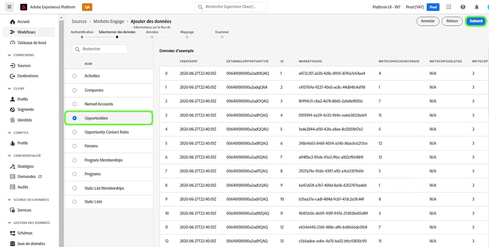
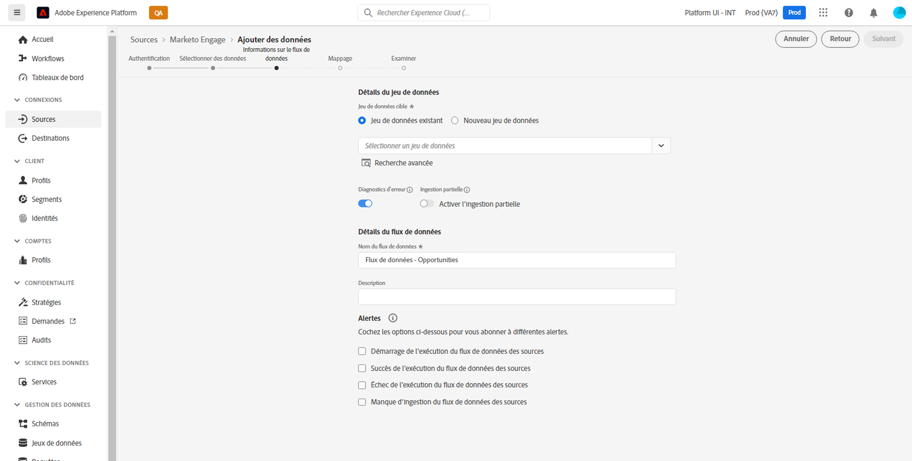
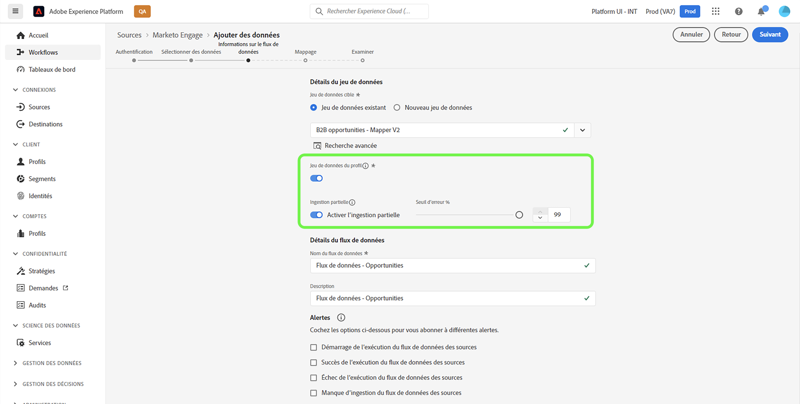
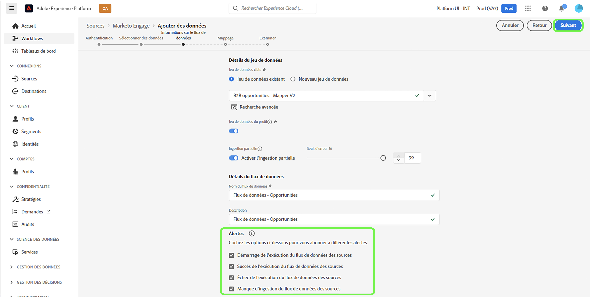

# Créez un [!DNL Marketo Engage] connexion source et flux de données dans l’interface utilisateur

>[!IMPORTANT]
>
>Avant de créer un [!DNL Marketo Engage] connexion source et un flux de données, vous devez d’abord vous assurer que vous disposez de [mappage de votre ID d’organisation Adobe](https://experienceleague.adobe.com/docs/marketo/using/product-docs/core-marketo-concepts/miscellaneous/set-up-adobe-organization-mapping.html) in [!DNL Marketo]. En outre, vous devez également vous assurer que vous avez terminé [auto-remplissage de votre [!DNL Marketo] Espaces de noms et schémas B2B](../../../../connectors/adobe-applications/marketo/marketo-namespaces.md) avant de créer une connexion source et un flux de données.

Ce tutoriel décrit les étapes à suivre pour créer un connecteur source [!DNL Marketo Engage] (ci-après dénommé « [!DNL Marketo] ») dans l’interface utilisateur pour importer des données B2B dans Adobe Experience Platform.

## Prise en main

Ce tutoriel nécessite une compréhension du fonctionnement des composants suivants d’Adobe Experience Platform :

* [Espaces de noms B2B et utilitaire de génération automatique de schéma](../../../../connectors/adobe-applications/marketo/marketo-namespaces.md): les espaces de noms B2B et l’utilitaire de génération automatique de schéma vous permettent d’utiliser [!DNL Postman] pour générer automatiquement des valeurs pour vos espaces de noms et vos schémas B2B. Vous devez d’abord renseigner vos espaces de noms et schémas B2B avant de créer une [!DNL Marketo] connexion source et flux de données.
* [Sources](../../../../home.md) : Experience Platform permet d’ingérer des données provenant de diverses sources tout en vous offrant la possibilité de structurer, d’étiqueter et d’améliorer les données entrantes à l’aide des services de Platform.
* [Modèle de données d’expérience (XDM)](../../../../../xdm/home.md) : framework normalisé selon lequel Experience Platform organise les données d’expérience client.
   * [Créer et modifier des schémas dans l’interface utilisateur](../../../../../xdm/ui/resources/schemas.md) : découvrez comment créer et modifier des schémas dans l’interface utilisateur.
* [Espaces de noms d’identité](../../../../../identity-service/features/namespaces.md) : les espaces de noms d’identité sont des composants d’[!DNL Identity Service] qui servent d’indicateurs du contexte auquel une identité se rapporte. Une identité complète est composée d’une valeur d’identifiant et d’un espace de noms.
* [[!DNL Real-Time Customer Profile]](/help/profile/home.md) : fournit un profil de consommateur unifié en temps réel, basé sur des données agrégées provenant de plusieurs sources.
* [Sandbox](../../../../../sandboxes/home.md) : Experience Platform fournit des sandbox virtuels qui divisent une instance de plateforme unique en environnements virtuels distincts pour favoriser le développement et l’évolution d’applications d’expérience digitale.

### Collecter les informations d’identification requises

Pour accéder au compte [!DNL Marketo] sur Platform, vous devez fournir les valeurs suivantes :

| Informations d’identification | Description |
| ---------- | ----------- |
| `munchkinId` | L’identifiant Munchkin est l’identifiant unique d’une instance [!DNL Marketo] spécifique. |
| `clientId` | Identifiant client unique de l’instance [!DNL Marketo]. |
| `clientSecret` | Secret client unique de l’instance [!DNL Marketo]. |

Pour plus d’informations sur l’acquisition de ces valeurs, consultez le [[!DNL Marketo] guide dʼauthentification](../../../../connectors/adobe-applications/marketo/marketo-auth.md).

Une fois que vous avez rassemblé les informations d’identification requises, vous pouvez suivre les étapes de la section suivante.

## Connecter votre compte [!DNL Marketo]

Dans l’interface utilisateur de Platform, sélectionnez **[!UICONTROL Sources]** à partir de la barre de navigation de gauche pour accéder à l’espace de travail [!UICONTROL Sources]. L’écran [!UICONTROL Catalogue] affiche diverses sources avec lesquelles vous pouvez créer un compte.

Vous pouvez sélectionner la catégorie appropriée dans le catalogue sur le côté gauche de votre écran. Vous pouvez également sélectionner la source de votre choix à l’aide de la barre de recherche.

Dans la catégorie [!UICONTROL Applications Adobe], sélectionnez **[!UICONTROL Marketo Engage]**. Sélectionnez ensuite **[!UICONTROL Ajouter des données]** pour créer un flux de données [!DNL Marketo].

La page **[!UICONTROL Connexion au compte Marketo Engage]** s’affiche. Sur cette page, vous pouvez utiliser un nouveau compte ou accéder à un compte existant.

### Compte existant

Pour créer un flux de données à lʼaide dʼun compte existant, sélectionnez **[!UICONTROL Compte existant]**, puis le compte [!DNL Marketo] que vous souhaitez utiliser. Cliquez sur **[!UICONTROL Suivant]** pour continuer.

### Nouveau compte

Si vous créez un compte, sélectionnez **[!UICONTROL Nouveau compte]**. Dans le formulaire de saisie qui s’affiche, indiquez un nom de compte, une description facultative et vos informations d’authentification [!DNL Marketo]. Lorsque vous avez terminé, sélectionnez **[!UICONTROL Connexion à la source]**, puis patientez quelques instants le temps que la nouvelle connexion sʼétablisse.

## Sélectionner un jeu de données

Une fois le compte [!DNL Marketo] créé, une interface sʼaffiche pour explorer les jeux de données [!DNL Marketo].

La moitié gauche de l’interface est un navigateur de répertoire qui affiche les 10 jeux de données [!DNL Marketo]. Une connexion source [!DNL Marketo] pleinement fonctionnelle nécessite l’ingestion des neuf jeux de données différents. Si vous utilisez également la fonctionnalité Account-Based Marketing (ABM) [!DNL Marketo], vous devez créer un 10e flux de données pour ingérer le jeu de données [!UICONTROL Comptes nommés].

>[!NOTE]
>
>À des fins de concision, le tutoriel suivant utilise [!UICONTROL Opportunités] comme exemple, mais les étapes décrites ci-dessous s’appliquent aux 10 jeux de données [!DNL Marketo].

Sélectionnez d’abord le jeu de données à ingérer, puis cliquez sur **[!UICONTROL Suivant]**.

## Fournir des détails sur le flux de données {#provide-dataflow-details}

La page [!UICONTROL Détails du flux de données] vous permet de choisir si vous souhaitez utiliser un jeu de données existant ou un nouveau jeu de données. Au cours de ce processus, vous pouvez également configurer les paramètres de [!UICONTROL Jeu de données de profil], [!UICONTROL Diagnostics d’erreur], [!UICONTROL Ingestion partielle] et [!UICONTROL Alertes].

>[!BEGINTABS]

>[!TAB Utiliser un jeu de données existant]

Pour ingérer vos données dans un jeu de données existant, sélectionnez **[!UICONTROL Jeu de données existant]**. Vous pouvez soit récupérer un jeu de données existant à l’aide de l’option de [!UICONTROL Recherche avancée], soit faire défiler la liste des jeux de données existants dans le menu déroulant. Une fois que vous avez sélectionné un jeu de données, indiquez un nom et une description pour votre flux de données.

>[!TAB Utiliser un nouveau jeu de données]

Pour procéder à lʼingestion dans un nouveau jeu de données, sélectionnez **[!UICONTROL Nouveau jeu de données]**, puis saisissez un nom pour le jeu de données de sortie et une description facultative. Sélectionnez ensuite un schéma à mapper à l’aide de l’option [!UICONTROL Recherche avancée] ou en faisant défiler la liste des schémas existants dans le menu déroulant. Une fois que vous avez sélectionné un schéma, saisissez un nom et une description pour votre flux de données.

>[!ENDTABS]

### Activer [!DNL Profile] et les diagnostics d’erreur

Sélectionnez ensuite le bouton (bascule) du **[!UICONTROL Jeu de données de profil]** pour activer votre jeu de données pour [!DNL Profile]. Cela vous permet de créer une vue holistique des attributs et des comportements d’une entité. Les données issues de tous les jeux de données activés par le [!DNL Profile] seront incluses dans [!DNL Profile] et les modifications sont appliquées lorsque vous enregistrez votre flux de données.

Le [!UICONTROL diagnostic d’erreur] permet de générer un message d’erreur détaillé pour tout enregistrement erroné survenant dans votre flux de données, tandis que l’[!UICONTROL ingestion partielle] vous permet d’ingérer des données contenant des erreurs, jusqu’à un certain seuil que vous définissez manuellement. Pour plus d’informations, consultez la [présentation de l’ingestion par lots partiels](../../../../../ingestion/batch-ingestion/partial.md).

>[!IMPORTANT]
>
>La variable [!DNL Marketo] source utilise l’ingestion par lots pour ingérer tous les enregistrements historiques et utilise l’ingestion par flux pour les mises à jour en temps réel. Cela permet à la source de continuer la diffusion en continu tout en ingérant des enregistrements erronés. Activez le bouton (bascule) **[!UICONTROL Ingestion partielle]**, puis définissez le [!UICONTROL Seuil d’erreur %] au maximum pour empêcher l’échec du flux de données.

### Activer les alertes

Vous pouvez activer les alertes pour recevoir des notifications sur le statut de votre flux de données. Sélectionnez une alerte dans la liste et abonnez-vous à des notifications concernant le statut de votre flux de données. Pour plus d’informations sur les alertes, consultez le guide sur l’[abonnement aux alertes des sources dans l’interface utilisateur](../../alerts.md).

Lorsque vous avez terminé de renseigner votre flux de données, sélectionnez **[!UICONTROL Suivant]**.

### Ignorer les comptes non réclamés lors de l’ingestion de données d’entreprises

Lors de la création d’un flux de données pour ingérer des données à partir du jeu de données des entreprises, vous pouvez configurer [!UICONTROL Exclure les comptes non réclamés] pour exclure ou inclure des comptes non réclamés de l’ingestion.

Lorsque des individus remplissent un formulaire, [!DNL Marketo] crée un enregistrement de compte fantôme basé sur le nom de la société qui ne contient aucune autre donnée. Pour les nouveaux flux de données, la bascule permettant d’exclure les comptes non réclamés est activée par défaut. Pour les flux de données existants, vous pouvez activer ou désactiver la fonctionnalité, avec des modifications s’appliquant aux données nouvellement ingérées et non aux données existantes.

## Mappez vos champs sources du jeu de données [!DNL Marketo] aux champs XDM cibles.

L’interface de [!UICONTROL mappage] fournit un outil complet pour mapper les champs sources de votre schéma source aux champs XDM cibles correspondants dans le schéma cible.

Chaque jeu de données [!DNL Marketo] comporte ses propres règles de mappage spécifiques à suivre. Pour plus d’informations sur le mappage de jeux de données [!DNL Marketo] à XDM, consultez les sections suivantes :

* [Activités](../../../../connectors/adobe-applications/mapping/marketo.md#activities)
* [Programmes](../../../../connectors/adobe-applications/mapping/marketo.md#programs)
* [Abonnements au programme](../../../../connectors/adobe-applications/mapping/marketo.md#program-memberships)
* [Sociétés](../../../../connectors/adobe-applications/mapping/marketo.md#companies)
* [Listes statiques](../../../../connectors/adobe-applications/mapping/marketo.md#static-lists)
* [Abonnements à des listes statiques](../../../../connectors/adobe-applications/mapping/marketo.md#static-list-memberships)
* [Comptes désignés](../../../../connectors/adobe-applications/mapping/marketo.md#named-accounts)
* [Opportunités](../../../../connectors/adobe-applications/mapping/marketo.md#opportunities)
* [Rôles de contact d’opportunité](../../../../connectors/adobe-applications/mapping/marketo.md#opportunity-contact-roles)
* [Personnes](../../../../connectors/adobe-applications/mapping/marketo.md#persons)

Selon vos besoins, vous pouvez choisir de mapper directement des champs ou d’utiliser des fonctions de préparation de données pour transformer les données sources afin d’obtenir des valeurs informatisées ou calculées. Pour obtenir des instructions complètes sur l’utilisation de l’interface de mappage, consultez le [Guide de l’interface utilisateur de la préparation de données](../../../../../data-prep/ui/mapping.md).

Une fois vos jeux de mappages prêts, cliquez sur **[!UICONTROL Suivant]** et patientez quelques instants le temps que le flux de données soit créé.

## Vérifier le flux de données

L’écran de **[!UICONTROL Révision]** s’affiche, vous permettant dʼexaminer votre nouveau flux de données avant sa création. Les détails sont regroupés dans les catégories suivantes :

* **[!UICONTROL Connexion]** : affiche le type de source, le chemin d’accès correspondant de l’entité source choisie et le nombre de colonnes au sein de cette entité source.
* **[!UICONTROL Attribuer des champs de jeu de données et de mappage]** : affiche le jeu de données dans lequel les données sources sont ingérées, y compris le schéma auquel le jeu de données se conforme.

Une fois que vous avez révisé votre flux de données, sélectionnez **[!UICONTROL Enregistrer et ingérer]** et patientez quelques instants le temps que le flux de données soit créé.

## Surveiller votre flux de données

Une fois votre flux de données créé, vous pouvez surveiller les données ingérées et afficher les informations relatives au taux d’ingestion, aux succès et aux erreurs. Pour plus d’informations sur la surveillance des flux de données, suivez le tutoriel sur la [surveillance des flux de données dans l’interface utilisateur](../../../../../dataflows/ui/monitor-sources.md).

## Supprimer les attributs

Les attributs personnalisés des jeux de données ne peuvent pas être masqués ni supprimés rétroactivement. Si vous souhaitez masquer ou supprimer un attribut personnalisé d’un jeu de données existant, vous devez créer un nouveau jeu de données sans cet attribut personnalisé, un nouveau schéma XDM et configurer un nouveau flux de données pour le nouveau jeu de données que vous souhaitez créer. Vous devez également désactiver ou supprimer le flux de données d’origine constitué du jeu de données et de l’attribut personnalisé que vous souhaitez masquer ou supprimer.

## Supprimer le flux de données

Vous pouvez supprimer les flux de données qui ne sont plus nécessaires ou qui ont été créés de manière incorrecte à l’aide de la fonction **[!UICONTROL Supprimer]**, disponible dans l’espace de travail [!UICONTROL Flux de données]. Pour plus d’informations sur la suppression des flux de données, consultez le tutoriel sur la [suppression de flux de données dans l’interface utilisateur](../../delete.md).

## Étapes suivantes

Vous êtes arrivé au bout de ce tutoriel, félicitations ! Grâce à celui-ci, vous avez créé un flux de données pour importer les données [!DNL Marketo]. Ces données peuvent désormais être utilisées par les services de Platform en aval, comme [!DNL Real-Time Customer Profile] et [!DNL Data Science Workspace]. Consultez les documents suivants pour plus d’informations :

* [Présentation de [!DNL Real-Time Customer Profile]](/help/profile/home.md)
* [Présentation de [!DNL Data Science Workspace]](/help/data-science-workspace/home.md)

## Annexe {#appendix}

Les sections suivantes contiennent des instructions supplémentaires que vous pouvez suivre lorsque vous utilisez le [!DNL Marketo] source.

### Messages d’erreur dans l’interface utilisateur {#error-messages}

Les messages d’erreur suivants s’affichent dans l’interface utilisateur lorsque Platform détecte des problèmes liés à votre configuration :

#### [!DNL Munchkin ID] n’est pas mappé à l’organisation appropriée

L’authentification sera refusée si votre [!DNL Munchkin ID] n’est pas mappé à l’organisation Platform que vous utilisez. Configurez le mappage entre vos [!DNL Munchkin ID] et votre organisation à l’aide de la variable [[!DNL Marketo] interface](https://app-sjint.marketo.com/#MM0A1).

#### Identité du Principal manquante

Un flux de données n’enregistre pas et n’ingère pas si une identité principale est manquante. Assurez-vous que [une identité principale existe dans votre schéma XDM](../../../../../xdm/tutorials/create-schema-ui.md), avant de tenter de configurer un flux de données.

