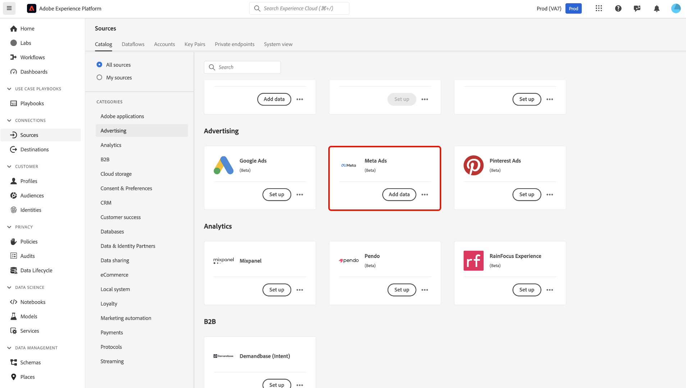
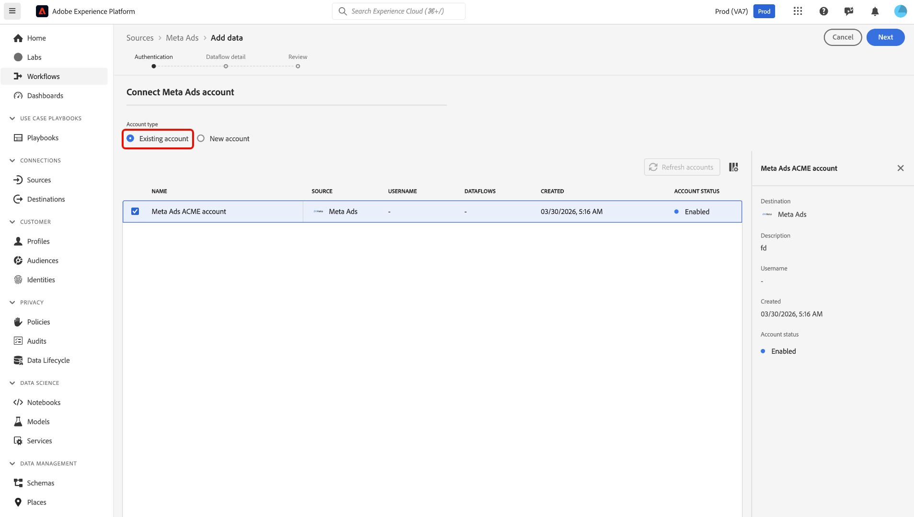
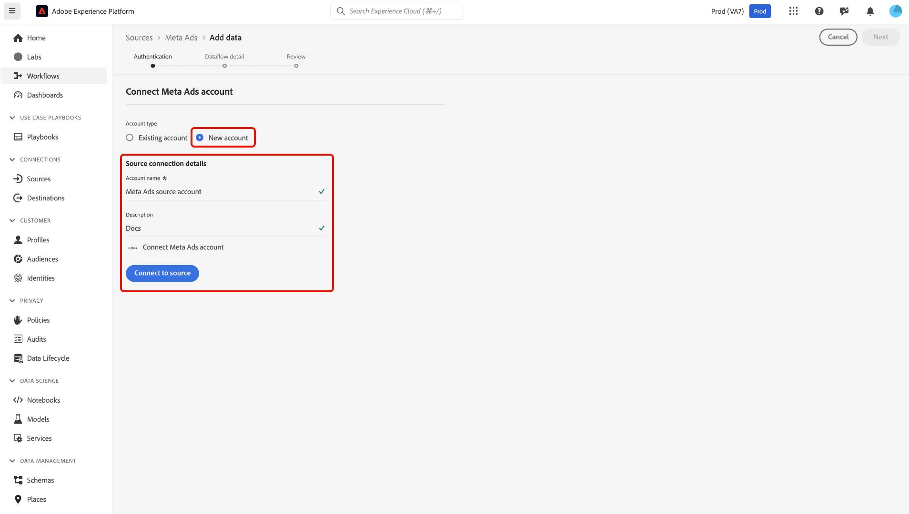
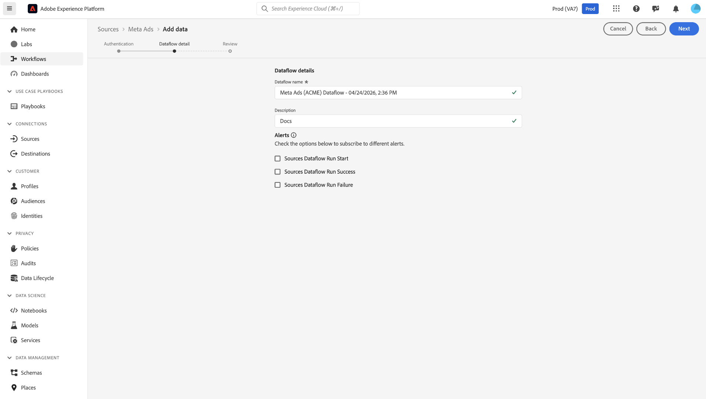
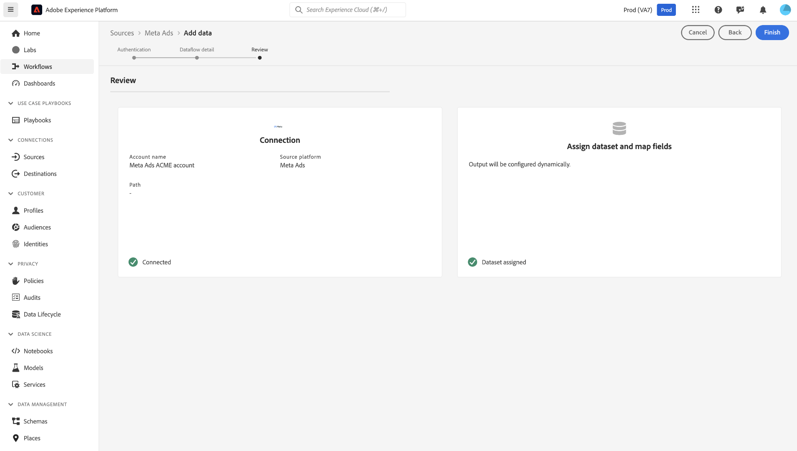

# Ingestion de données [!DNL Meta Ads] vers Experience Platform dans l’interface utilisateur

>[!NOTE]
>
>La source [!DNL Meta Ads] est en version Beta. Lisez la [présentation des sources](../../../../home.md#terms-and-conditions) pour plus d’informations sur l’utilisation de sources étiquetées bêta.

Découvrez comment connecter votre compte [!DNL Meta Ads] et importer des données publicitaires dans Adobe Experience Platform à l’aide de l’espace de travail des sources.

## Prise en main

Ce tutoriel nécessite une compréhension du fonctionnement des composants suivants d’Adobe Experience Platform :

- [[!DNL Experience Data Model (XDM)] Système](../../../../../xdm/home.md) : Cadre normalisé selon lequel Experience Platform organise les données d’expérience client.
   - [Principes de base de la composition des schémas](../../../../../xdm/schema/composition.md) : découvrez les blocs de création de base des schémas XDM, y compris les principes clés et les bonnes pratiques en matière de composition de schémas.
   - [Tutoriel sur l’éditeur de schémas](../../../../../xdm/tutorials/create-schema-ui.md) : découvrez comment créer des schémas personnalisés à l’aide de l’interface utilisateur de l’éditeur de schémas.
- [[!DNL Real-Time Customer Profile]](../../../../../profile/home.md) : fournit un profil de consommateur unifié en temps réel, basé sur des données agrégées provenant de plusieurs sources.

>[!IMPORTANT]
>
>Lisez la [[!DNL Meta Ads] présentation](../../../../connectors/advertising/meta-ads.md) pour découvrir les étapes préalables à suivre avant de connecter votre compte à Experience Platform.

## Parcourir le catalogue des sources

Dans l’interface utilisateur d’Experience Platform, sélectionnez **[!UICONTROL Sources]** dans le volet de navigation de gauche pour accéder à l’espace de travail *[!UICONTROL Sources]*. Sélectionnez la catégorie appropriée dans le panneau *[!UICONTROL Catégories]*. Vous pouvez également utiliser la barre de recherche pour accéder à la source spécifique que vous souhaitez utiliser.

Pour ingérer des données à partir de [!DNL Meta Ads], sélectionnez la carte source **[!UICONTROL Meta Ads]** sous *[!UICONTROL Advertising]* puis sélectionnez **[!UICONTROL Ajouter des données]**.

>[!TIP]
>
>Les sources du catalogue affichent l’option **[!UICONTROL Configurer]** lorsqu’une source donnée ne dispose pas encore d’un compte authentifié. Une fois un compte authentifié créé, cette option devient **[!UICONTROL Ajouter des données]**.

### Utiliser un compte existant

Pour utiliser un compte existant, sélectionnez **[!UICONTROL Compte existant]** et sélectionnez le compte [!DNL Meta Ads] à utiliser dans l’interface Comptes.

### Créer un nouveau compte

Pour créer un compte, sélectionnez **[!UICONTROL Nouveau compte]** et indiquez un nom et une description pour votre nouveau compte source [!DNL Meta Ads]. Sélectionnez **[!UICONTROL Se connecter à la source]**.

Après avoir sélectionné **[!UICONTROL Se connecter à la source]**, vous serez redirigé vers la page de connexion [!DNL Facebook]. Saisissez vos informations d’identification pour l’authentification. Une fois la connexion effectuée, vous serez invité à configurer les autorisations [!DNL Facebook] nécessaires pour Experience Platform.

### Configuration des autorisations sur [!DNL Meta]

Tout d’abord, spécifiez les pages auxquelles Experience Platform doit accéder :

- **S’inscrire à toutes les pages actuelles et futures** : accordez à Experience Platform l’accès à toutes vos pages existantes, ainsi qu’à toutes les pages que vous créerez à l’avenir.
- **S’inscrire aux pages actives uniquement** : accordez l’accès uniquement aux pages que vous sélectionnez pour le moment.

Sélectionnez ensuite les comptes Instagram auxquels Experience Platform doit accéder :

- **Opt-in à tous les comptes Instagram actuels et futurs** : Autorisez l’accès à tous vos comptes Instagram actuels et futurs.
- **Opt-in aux comptes Instagram actuels uniquement** : Autorisez l’accès uniquement aux comptes Instagram que vous sélectionnez actuellement.

Après avoir examiné les demandes d’accès, sélectionnez **[!UICONTROL Enregistrer]** pour confirmer vos autorisations et continuer.

## Fournir des détails sur le flux de données

Utilisez la page [!UICONTROL Détails du flux de données] pour indiquer un nom et une description à votre flux de données. De plus, vous pouvez configurer des alertes pour votre flux de données au cours de cette étape.

## Vérifier le flux de données

Enfin, utilisez l’interface [!UICONTROL Révision] pour consulter les détails de votre flux de données avant de le créer. Les détails sont regroupés dans les catégories suivantes :

- **[!UICONTROL Connexion]** : affiche le nom du compte, la plateforme source et le nom de la source.
- **[!UICONTROL Attribuer des champs de jeu de données et de mappage]** : affiche le jeu de données cible et le schéma auquel le jeu de données se conforme.

Après avoir confirmé que les détails sont corrects, sélectionnez **[!UICONTROL Terminer]**.

