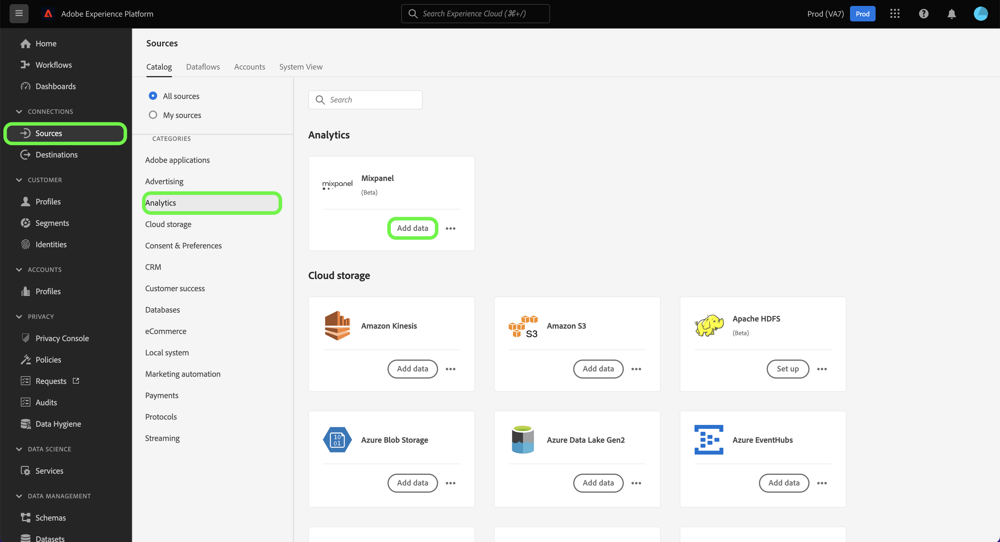

# Créer une connexion source [!DNL Mixpanel] dans l’interface utilisateur

Ce tutoriel décrit les étapes à suivre pour créer une connexion source [!DNL Mixpanel] à l’aide de l’interface utilisateur de la plateforme Adobe Experience Platform.

## Prise en main

Ce tutoriel nécessite une compréhension du fonctionnement des composants suivants d’Adobe Experience Platform : 

* [[!DNL Experience Data Model (XDM)] Système](../../../../../xdm/home.md) : le cadre normalisé en fonction duquel [!DNL Experience Platform] organise les données d’expérience client.
   * [Principes de base de la composition des schémas](../../../../../xdm/schema/composition.md) : découvrez les blocs de création de base des schémas XDM, y compris les principes clés et les bonnes pratiques en matière de composition de schémas.
   * [Tutoriel sur l’éditeur de schémas](../../../../../xdm/tutorials/create-schema-ui.md) : découvrez comment créer des schémas personnalisés à l’aide de l’interface utilisateur de l’éditeur de schémas.
* [[!DNL Real-Time Customer Profile]](../../../../../profile/home.md) : fournit un profil de consommateur unifié en temps réel, basé sur des données agrégées provenant de plusieurs sources.

### Collecter les informations d’identification requises

Pour connecter [!DNL Mixpanel] à Platform, vous devez fournir des valeurs pour les propriétés de connexion suivantes :

| Informations d’identification | Description | Exemple |
| --- | --- | --- |
| Nom d’utilisateur | Nom d’utilisateur du compte de service qui correspond à votre compte [!DNL Mixpanel]. Pour plus d’informations, consultez la [[!DNL Mixpanel] documentation sur les comptes de service](https://developer.mixpanel.com/reference/service-accounts#authenticating-with-a-service-account) . | `Test8.6d4ee7.mp-service-account` |
| Mot de passe | Mot de passe du compte de service qui correspond à votre compte [!DNL Mixpanel]. | `dLlidiKHpCZtJhQDyN2RECKudMeTItX1` |
| Identifiant de projet | Votre ID de projet [!DNL Mixpanel]. Cet identifiant est nécessaire pour créer une connexion source. Pour plus d’informations, consultez la [[!DNL Mixpanel] documentation sur les paramètres de projet](https://help.mixpanel.com/hc/en-us/articles/115004490503-Project-Settings) et le [[!DNL Mixpanel]  guide de création et de gestion de projets](https://help.mixpanel.com/hc/en-us/articles/115004505106-Create-and-Manage-Projects). | `2384945` |
| Fuseau horaire | Le fuseau horaire correspondant à votre projet [!DNL Mixpanel]. Le fuseau horaire est requis pour créer une connexion source. Pour plus d’informations, consultez la [documentation sur les paramètres du projet Mixpanel](https://help.mixpanel.com/hc/en-us/articles/115004490503-Project-Settings) . | `Pacific Standard Time` |

Pour plus d’informations sur l’authentification de votre source [!DNL Mixpanel], consultez la [[!DNL Mixpanel] présentation de la source](../../../../connectors/analytics/mixpanel.md).

## Connecter votre compte [!DNL Mixpanel]

Dans l’interface utilisateur de Platform, sélectionnez **[!UICONTROL Sources]** à partir de la barre de navigation de gauche pour accéder à l’espace de travail [!UICONTROL Sources]. L’écran [!UICONTROL Catalogue] affiche diverses sources avec lesquelles vous pouvez créer un compte.

Vous pouvez sélectionner la catégorie appropriée dans le catalogue sur le côté gauche de votre écran. Vous pouvez également trouver la source spécifique à utiliser à l’aide de l’option de recherche.

Sous la catégorie *Analytics*, sélectionnez [!DNL Mixpanel], puis **[!UICONTROL Ajouter des données]**.

La page **[!UICONTROL Se connecter au compte Mixpanel]** s’affiche. Sur cette page, vous pouvez utiliser de nouvelles informations d’identification ou des informations d’identification existantes.

### Compte existant

Pour utiliser un compte existant, sélectionnez le compte [!DNL Mixpanel] avec lequel vous souhaitez créer un flux de données, puis sélectionnez **[!UICONTROL Suivant]** pour continuer.

### Nouveau compte

Si vous créez un compte, sélectionnez **[!UICONTROL Nouveau compte]**, puis fournissez un nom, une description facultative et vos informations d’identification. Lorsque vous avez terminé, sélectionnez **[!UICONTROL Connexion à la source]**, puis patientez quelques instants le temps que la nouvelle connexion sʼétablisse.

## Sélectionner l’ID et le fuseau horaire de votre projet {#project-id-and-timezone}

>[!CONTEXTUALHELP]
>id="platform_sources_mixpanel_timezone"
>title="Définir un fuseau horaire pour l&#39;ingestion de Mixpanel"
>abstract="Le fuseau horaire doit être identique à celui du profil Mixpanel, car Platform utilise le fuseau horaire du projet désigné pour ingérer les données pertinentes à partir de Mixpanel. Mixpanel adaptera son fuseau horaire afin de le coordonner à celui de votre projet avant d&#39;enregistrer l&#39;événement dans un entrepôt de données Mixpanel."
>additional-url="https://experienceleague.adobe.com/docs/experience-platform/sources/ui-tutorials/create/analytics/mixpanel.html?lang=fr#project-id-and-timezone" text="En savoir plus dans la documentation."

Une fois votre source authentifiée, indiquez l’ID de projet et le fuseau horaire, puis sélectionnez **[!UICONTROL Sélectionner]**.

Le fuseau horaire que vous désignez avant d’ingérer vos données [!DNL Mixpanel] vers Platform doit être identique à celui de votre profil [!DNL Mixpanel]. Toute modification du fuseau horaire de vos données ne sera appliquée qu’aux nouveaux événements et aux anciens événements resteront dans le fuseau horaire que vous avez précédemment désigné. [!DNL Mixpanel] prend en charge l’heure d’été et ajustera l’horodatage de votre ingestion de manière appropriée. Pour plus d’informations sur la façon dont les fuseaux horaires affectent vos données, consultez le guide [!DNL Mixpanel] sur la [gestion des fuseaux horaires pour les projets](https://help.mixpanel.com/hc/en-us/articles/115004547203-Manage-Timezones-for-Projects-in-Mixpanel).

Au bout de quelques instants, l’interface appropriée se met à jour vers un panneau d’aperçu, ce qui vous permet d’examiner votre schéma avant de créer un flux de données. Lorsque vous avez terminé, sélectionnez **[!UICONTROL Suivant]**.

## Étapes suivantes

En suivant ce tutoriel, vous avez établi une connexion à votre compte [!DNL Mixpanel]. Vous pouvez maintenant passer au tutoriel suivant et [configurer un flux de données pour importer des données d’analyse dans Platform](../../dataflow/analytics.md).

## Ressources supplémentaires {#additional-resources}

Les sections ci-dessous fournissent des ressources supplémentaires auxquelles vous pouvez vous référer lors de l’utilisation de la source [!DNL Mixpanel].

### Validation {#validation}

Les étapes suivantes décrivent les étapes que vous pouvez suivre pour vérifier que vous avez correctement connecté votre source [!DNL Mixpanel] et que les événements [!DNL Mixpanel] sont ingérés dans Platform.

Dans l’interface utilisateur de Platform, sélectionnez **[!UICONTROL Jeux de données]** dans la barre de navigation de gauche pour accéder à l’espace de travail [!UICONTROL Jeux de données]. L’écran [!UICONTROL Activité du jeu de données] affiche les détails des exécutions.

Sélectionnez ensuite l’identifiant d’exécution du flux de données que vous souhaitez afficher pour afficher des détails spécifiques sur cette exécution.

Enfin, sélectionnez **[!UICONTROL Prévisualiser le jeu de données]** pour afficher les données ingérées.

Vous pouvez comparer ces données aux données de la page [!DNL Mixpanel] > [!DNL Events]. Pour plus d’informations, consultez le [[!DNL Mixpanel] document sur les événements](https://help.mixpanel.com/hc/en-us/articles/4402837164948-Events-formerly-Live-View-) .

### Schéma Mixpanel

Le tableau ci-dessous répertorie les mappages pris en charge qui doivent être configurés pour [!DNL Mixpanel].

>[!TIP]
>
>Voir [API d’exportation d’événements > Téléchargement](https://developer.mixpanel.com/reference/raw-event-export) pour plus d’informations sur l’API.

| Source | Type |
|---|---|
| `distinct_id` | chaîne |
| `event_name` | chaîne |
| `import` | booléen |
| `insert_id` | chaîne |
| `item_id` | chaîne |
| `item_name` | chaîne |
| `item_price` | chaîne |
| `mp_api_endpoint` | chaîne |
| `mp_api_timestamp_ms` | nombre entier |
| `mp_processing_time_ms` | Entier |
| `time` | Entier |

### Limites {#limits}

* Vous avez un maximum de 100 requêtes simultanées et 60 requêtes par heure, comme indiqué sur la page [Limites de débit de l’API d’exportation](https://help.mixpanel.com/hc/en-us/articles/115004602563-Rate-Limits-for-API-Endpoints).
