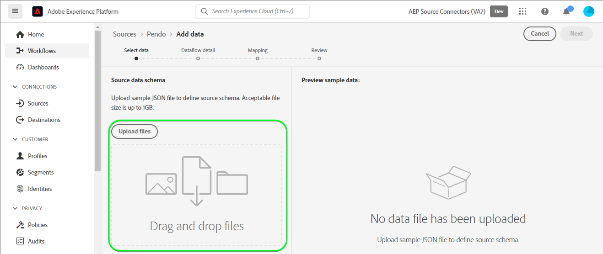
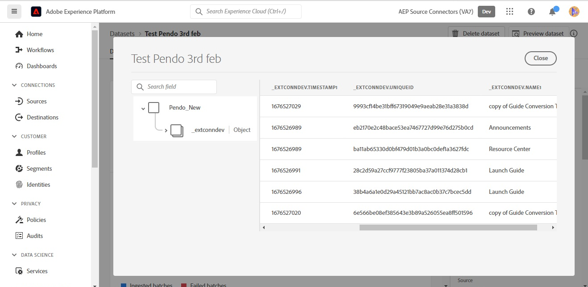

# Créer un flux de données de connexion source [!DNL Pendo] et dans l’interface utilisateur

>[!NOTE]
>
>La source [!DNL Pendo] est en version Beta. Veuillez lire la [présentation des sources](../../../../home.md#terms-and-conditions) pour plus d’informations sur l’utilisation de sources étiquetées bêta.

Ce tutoriel décrit les étapes à suivre pour créer une connexion source et un flux de données [!DNL Pendo] à l’aide de l’interface utilisateur de Adobe Experience Platform.

## Prise en main {#getting-started}

Ce tutoriel nécessite une compréhension du fonctionnement des composants suivants d’Adobe Experience Platform : 

* [[!DNL Experience Data Model (XDM)] Système](../../../../../xdm/home.md) : le cadre normalisé en fonction duquel [!DNL Experience Platform] organise les données d’expérience client.
   * [Principes de base de la composition des schémas](../../../../../xdm/schema/composition.md) : découvrez les blocs de création de base des schémas XDM, y compris les principes clés et les bonnes pratiques en matière de composition de schémas.
   * [Tutoriel sur l’éditeur de schémas](../../../../../xdm/tutorials/create-schema-ui.md) : découvrez comment créer des schémas personnalisés à l’aide de l’interface utilisateur de l’éditeur de schémas.
* [[!DNL Real-Time Customer Profile]](../../../../../profile/home.md) : fournit un profil de consommateur unifié en temps réel, basé sur des données agrégées provenant de plusieurs sources.

## Conditions préalables {#prerequisites}

La section suivante fournit des informations sur les conditions préalables à remplir avant de pouvoir créer une connexion source [!DNL Pendo].

### Exemple JSON pour définir le schéma source pour [!DNL Pendo] {#prerequisites-json-schema}

Avant de créer une connexion source [!DNL Pendo], vous devez fournir un schéma source. Vous pouvez utiliser le fichier JSON ci-dessous.

```
{
  "accountId": "58f79ee324d3f",
  "timestamp": 1673372516,
  "visitorId": "test@test.com",
  "uniqueId": "166e50cdf40930fe1367e4d44795c9c74d88b83a",
  "properties": {
    "guideProperties": {
  "name": "Guide Conversion Test"
  }
}
}
```

Pour plus d’informations, consultez le [[!DNL Pendo] guide sur les webhooks](https://support.pendo.io/hc/en-us/articles/360032285012-Webhooks).

### Création d’un schéma de plateforme pour [!DNL Pendo] {#create-platform-schema}

Vous devez également veiller à créer au préalable un schéma Platform à utiliser pour votre source. Consultez le tutoriel sur la [création d’un schéma de plateforme](../../../../../xdm/schema/composition.md) pour obtenir des instructions complètes sur la création d’un schéma.


## Connecter votre compte [!DNL Pendo] {#connect-account}

Dans l’interface utilisateur de Platform, sélectionnez **[!UICONTROL Sources]** dans le volet de navigation de gauche pour accéder à l’espace de travail [!UICONTROL Sources] et afficher un catalogue de sources disponibles dans Experience Platform.

Utilisez le menu *[!UICONTROL Catégories]* pour filtrer les sources par catégorie. Vous pouvez également saisir un nom de source dans la barre de recherche pour trouver une source spécifique dans le catalogue.

Accédez à la catégorie [!UICONTROL Analytics] pour afficher la carte source [!DNL Pendo]. Pour commencer, sélectionnez **[!UICONTROL Ajouter des données]**.


## Sélectionner les données {#select-data}

L’étape **[!UICONTROL Sélectionner les données]** s’affiche, vous permettant ainsi de sélectionner les données à importer dans Platform.

* La partie gauche de l’interface est un navigateur qui vous permet d’afficher les flux de données disponibles dans votre compte ;
* La partie droite de l’interface vous permet de prévisualiser jusqu’à 100 lignes de données à partir d’un fichier JSON.

Sélectionnez **[!UICONTROL Télécharger des fichiers]** pour charger un fichier JSON à partir de votre système local. Vous pouvez également faire glisser et déposer le fichier JSON que vous souhaitez charger dans le panneau [!UICONTROL Glisser-déposer des fichiers].



Une fois le fichier chargé, l’interface de prévisualisation se met à jour pour afficher un aperçu du schéma que vous avez chargé. L’interface d’aperçu vous permet d’examiner le contenu et la structure d’un fichier. Vous pouvez également utiliser l’utilitaire [!UICONTROL Search field] pour accéder à des éléments spécifiques à partir de votre schéma.

Lorsque vous avez terminé, sélectionnez **[!UICONTROL Suivant]**.


## Détails du flux de données {#dataflow-detail}

L’étape **Détails du flux de données** s’affiche, vous fournissant des options permettant d’utiliser un jeu de données existant ou d’établir un nouveau jeu de données pour votre flux de données, ainsi qu’une opportunité de fournir un nom et une description pour votre flux de données. Au cours de cette étape, vous pouvez également configurer des paramètres pour l’ingestion de profils, les diagnostics d’erreur, l’ingestion partielle et les alertes.

Lorsque vous avez terminé, sélectionnez **[!UICONTROL Suivant]**.


## Mappage {#mapping}

L’interface de [!UICONTROL mappage] fournit un outil complet pour mapper les champs sources de votre schéma source aux champs XDM cibles correspondants dans le schéma cible.

Platform fournit des recommandations intelligentes pour les champs mappés automatiquement en fonction du schéma ou du jeu de données cible que vous avez sélectionné. Vous pouvez ajuster manuellement les règles de mappage en fonction de vos cas d’utilisation. Selon vos besoins, vous pouvez choisir de mapper directement des champs ou d’utiliser des fonctions de préparation de données pour transformer les données sources afin d’obtenir des valeurs informatisées ou calculées. Pour obtenir des instructions complètes sur l’utilisation de l’interface du mappeur et des champs calculés, consultez le [guide de l’interface utilisateur de la préparation des données](../../../../../data-prep/ui/mapping.md).

Les mappages répertoriés ci-dessous sont obligatoires et doivent être configurés avant de passer à l’étape [!UICONTROL Révision].

| Champ cible | Description |
| --- | --- |
| `uniqueId` | L’identifiant [!DNL Pendo] de l’événement. |

Une fois le mappage de vos données source réussi, sélectionnez **[!UICONTROL Suivant]**.


## Révision {#review}

L’écran de **[!UICONTROL Révision]** s’affiche, vous permettant dʼexaminer votre nouveau flux de données avant sa création. Les détails sont regroupés dans les catégories suivantes :

* **[!UICONTROL Connexion]** : affiche le type de source, le chemin d’accès correspondant au fichier source choisi et le nombre de colonnes au sein de ce fichier source.
* **[!UICONTROL Attribuer des champs de jeu de données et de mappage]** : affiche le jeu de données dans lequel les données sources sont ingérées, y compris le schéma auquel le jeu de données se conforme.

Une fois que vous avez vérifié votre flux de données, sélectionnez **[!UICONTROL Terminer]** et patientez quelques instants le temps que le flux de données soit créé.


## Obtention de l’URL de votre point de terminaison de diffusion {#get-streaming-endpoint-url}

Une fois votre flux de données de diffusion en continu créé, vous pouvez désormais récupérer l’URL de votre point de terminaison de diffusion en continu. Ce point de terminaison sera utilisé pour s’abonner à votre webhook, ce qui permet à votre source de diffusion en continu de communiquer avec l’Experience Platform.

Pour construire l’URL utilisée pour configurer le webhook sur [!DNL Pendo], vous devez récupérer les éléments suivants :

* **[!UICONTROL Identifiant de flux de données]**
* **[!UICONTROL Point d’entrée de diffusion en continu]**

Pour récupérer votre **[!UICONTROL identifiant de flux de données]** et votre **[!UICONTROL point d’entrée de flux]**, accédez à la page [!UICONTROL activité de flux de données] du flux de données que vous venez de créer et copiez les détails depuis le bas du panneau [!UICONTROL Propriétés].


Une fois que vous avez récupéré votre point de terminaison de diffusion en continu et votre identifiant de flux de données, créez une URL basée sur le modèle suivant : ```{STREAMING_ENDPOINT}?x-adobe-flow-id={DATAFLOW_ID}```. Par exemple, une URL webhook construite peut se présenter comme suit : ```https://dcs.adobedc.net/collection/0c61859cc71939a0caf01123f91b2fc52589018800ad46b6c76c2dff3595ee95```

## Configuration de Webhook dans [!DNL Pendo] {#set-up-webhook}

Ensuite, connectez-vous à votre compte sur [[!DNL Pendo]](https://pendo.io/) et créez un webhook. Pour savoir comment créer un webhook à l’aide de l’interface utilisateur [!DNL Pendo], reportez-vous au [[!DNL Pendo] guide de création de webhook](https://support.pendo.io/hc/en-us/articles/360032285012-Webhooks#create-a-webhook-0-4).

Une fois votre webhook créé, accédez à la page des paramètres de votre webhook [!DNL Pendo] et saisissez l’URL de votre webhook dans le champ [!DNL URL] .


>[!TIP]
>
>Vous pouvez vous abonner à différentes catégories d’événements afin de déterminer le type d’événements que vous souhaitez envoyer de votre instance [!DNL Pendo] vers Platform. Pour plus d&#39;informations sur les différents événements, consultez la [[!DNL Pendo] documentation](https://support.pendo.io/hc/en-us/articles/360032285012-Webhooks#create-a-webhook-0-4).

## Étapes suivantes {#next-steps}

En suivant ce tutoriel, vous avez correctement configuré un flux de données en continu pour importer vos données [!DNL Pendo] dans Experience Platform. Pour surveiller les données ingérées, reportez-vous au guide sur la [surveillance des flux de données en continu à l’aide de l’interface utilisateur de Platform](../../monitor-streaming.md).

## Ressources supplémentaires {#additional-resources}

Les sections ci-dessous fournissent des ressources supplémentaires auxquelles vous pouvez vous référer lors de l’utilisation de la source [!DNL Pendo].

### Validation {#validation}

Pour vérifier que vous avez correctement configuré la source et que les messages [!DNL Pendo] sont ingérés, procédez comme suit :

* Vous pouvez consulter la page [!DNL Pendo] **[!UICONTROL Rapports]** > **[!UICONTROL Historique de conversation]** pour identifier les événements capturés par [!DNL Pendo].


* Dans l’interface utilisateur de Platform, sélectionnez **[!UICONTROL Afficher les flux de données]** en regard du menu de carte [!DNL Pendo] du catalogue des sources. Ensuite, sélectionnez **[!UICONTROL Prévisualiser le jeu de données]** pour vérifier les données ingérées pour les webhooks que vous avez configurés dans [!DNL Pendo].



### Erreurs et résolution des problèmes {#errors-and-troubleshooting}

Lors de la vérification d’une exécution de flux de données, vous pouvez rencontrer le message d’erreur suivant : `The message can't be validated ... uniqueID:expected minLength:1, actual 0].`


Pour corriger cette erreur, vous devez vérifier que le mappage *uniqueID* a été configuré. Pour plus d&#39;informations, reportez-vous à la section [Mapping](#mapping) .

Pour plus d’informations, consultez le [[!DNL Pendo] centre d’aide](https://www.pendo.io/help-center/).
