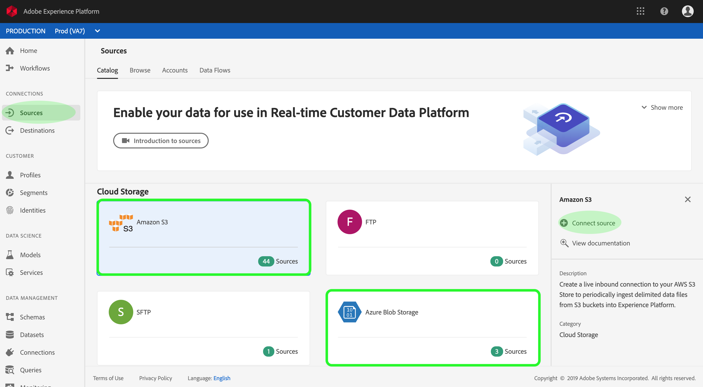

# Création d’un connecteur source Azure Blob ou Amazon S3 dans l’interface utilisateur

Les connecteurs source d’Adobe Experience Platform permettent d’importer des données provenant de l’extérieur sur une base planifiée. Ce didacticiel décrit les étapes à suivre pour créer un connecteur source Azure Blob (ci-après dénommé &quot;Blob&quot;) ou Amazon S3 (ci-après dénommé &quot;S3&quot;) à l’aide de l’interface utilisateur de la plate-forme.

## Prise en main

Ce didacticiel nécessite une compréhension pratique des composants suivants d’Adobe Experience Platform :

- [Système](../../../../../xdm/home.md)de modèle de données d’expérience (XDM) : Cadre normalisé selon lequel la plate-forme d’expérience organise les données d’expérience client.
   - [Principes de base de la composition](../../../../../xdm/schema/composition.md)des schémas : Découvrez les éléments de base des schémas XDM, y compris les principes clés et les meilleures pratiques en matière de composition des schémas.
   - [Didacticiel](../../../../../xdm/tutorials/create-schema-ui.md)sur l’éditeur de Schéma : Découvrez comment créer des schémas personnalisés à l’aide de l’interface utilisateur de l’éditeur de Schémas.
- [Profil](../../../../../profile/home.md)client en temps réel : Fournit un profil de consommation unifié en temps réel basé sur des données agrégées provenant de plusieurs sources.

Si vous disposez déjà d’une connexion de base Blob ou S3, vous pouvez ignorer le reste de ce document et passer au didacticiel sur la [configuration d’un flux de données](../../dataflow/batch/cloud-storage.md).

### Formats de fichiers pris en charge

Experience Platform prend en charge les formats de fichier suivants à assimiler à partir d’enregistrements externes :

- Valeurs séparées par des délimiteurs (DSV) : La prise en charge des fichiers de données au format DSV est actuellement limitée aux valeurs séparées par des virgules. La valeur des en-têtes de champ des fichiers au format DSV ne doit être composée que de caractères alphanumériques et de traits de soulignement. La prise en charge des fichiers DSV généraux sera assurée à l’avenir.
- Notation d’objet JavaScript (JSON) : Les fichiers de données au format JSON doivent être compatibles XDM.
- Apache Parquet : Les fichiers de données au format Parquet doivent être conformes à XDM.

### Collecte des informations d’identification requises

Pour accéder à votre enregistrement Blob sur la plate-forme, vous devez fournir une chaîne **de connexion d&#39;Enregistrement** Azure valide. Vous pouvez en savoir plus sur les chaînes de connexion, y compris les moyens de les obtenir via <a href="https://docs.microsoft.com/en-us/azure/storage/common/storage-configure-connection-string" target="_blank">ce document</a>Microsoft Azure.

De même, l&#39;accès à votre compartiment S3 sur la plate-forme nécessite que vous fournissiez votre clé **d&#39;accès** S3 et votre clé **secrète** S3. For more information, refer to <a href="https://aws.amazon.com/blogs/security/wheres-my-secret-access-key/" target="_blank">this AWS document</a>.

## Connecter votre compte Blob ou S3

Les informations d’identification de votre enregistrement cloud étant prêtes, vous pouvez suivre les étapes ci-dessous pour créer une nouvelle connexion de base entrante afin de lier votre compte Blob ou S3 à la plateforme.

Connectez-vous à <a href="https://platform.adobe.com" target="_blank">Adobe Experience Platform</a> , puis sélectionnez **Sources** dans la barre de navigation de gauche pour accéder à l’espace de travail sources. L’écran *Catalogue* affiche diverses sources pour lesquelles vous pouvez créer des connexions de base entrantes et chaque source affiche le nombre de connexions de base existantes qui lui sont associées.

Sous la catégorie Enregistrement ** Cloud, sélectionnez l’Enregistrement **Blob** Azure ou **Amazon S3** pour afficher une barre d’informations sur le côté droit de l’écran. La barre d&#39;informations fournit une brève description de la source sélectionnée ainsi que des options permettant de vue de sa documentation ou de se connecter à la source. Pour créer une connexion de base entrante, cliquez sur **Connexion source**.

Dans le formulaire d’entrée, fournissez la connexion de base avec un nom, une description facultative et vos informations d’identification Blob ou S3. Enfin, cliquez sur **Se connecter** , puis accordez un certain temps à la nouvelle connexion de base pour établir.

## Étapes suivantes

En suivant ce didacticiel, vous avez établi une connexion de base à votre compte Azure Blob ou Amazon S3. Vous pouvez maintenant passer au didacticiel suivant et [configurer un flux de données pour importer des données dans la plate-forme](../../dataflow/batch/cloud-storage.md).