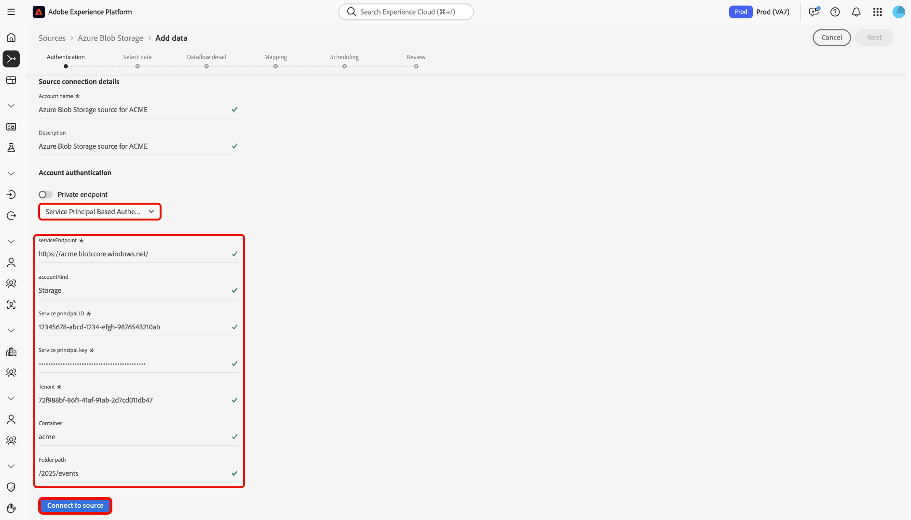

# Connexion d’[!DNL Azure Blob Storage] à Experience Platform à l’aide de l’interface utilisateur

Lisez ce guide pour savoir comment connecter votre instance [!DNL Azure Blob Storage] à Adobe Experience Platform à l’aide de l’espace de travail des sources dans l’interface utilisateur d’Experience Platform.

## Prise en main

Ce tutoriel nécessite une compréhension du fonctionnement des composants suivants d’Adobe Experience Platform :

* [[!DNL Experience Data Model (XDM)] Système](../../../../../xdm/home.md) : cadre normalisé pour organiser les données d’expérience client dans Experience Platform.
   * [Principes de base de la composition des schémas](../../../../../xdm/schema/composition.md) : découvrez les blocs de création de base des schémas XDM, y compris les principes clés et les bonnes pratiques en matière de composition de schémas.
   * [Tutoriel sur l’éditeur de schémas](../../../../../xdm/tutorials/create-schema-ui.md) : découvrez comment créer des schémas personnalisés à l’aide de l’interface utilisateur de l’éditeur de schémas.
* [[!DNL Real-Time Customer Profile]](../../../../../profile/home.md) : fournit un profil de consommateur unifié en temps réel, basé sur des données agrégées provenant de plusieurs sources.

Si vous disposez déjà d’une connexion [!DNL Azure Blob Storage] valide, vous pouvez ignorer le reste de ce document et passer au tutoriel sur la [configuration d’un flux de données](../../dataflow/batch/cloud-storage.md).

### Formats de fichiers pris en charge

Experience Platform prend en charge les formats de fichiers suivants à ingérer à partir de stockages externes :

* Valeurs séparées par un délimiteur (DSV) : vous pouvez utiliser n’importe quel délimiteur de colonne unique, tel qu’une tabulation, une virgule, une barre verticale, un point-virgule ou un hachage pour collecter des fichiers plats dans n’importe quel format.
* JavaScript Object Notation (JSON) : les fichiers de données au format JSON doivent être conformes à XDM.
* Apache Parquet : les fichiers de données au format Parquet doivent être conformes à XDM.

### Collecter les informations d’identification requises

Lisez la [[!DNL Azure Blob Storage] présentation](../../../../connectors/cloud-storage/blob.md#authentication) pour plus d’informations sur l’authentification.

## Parcourir le catalogue des sources

Dans l’interface utilisateur d’Experience Platform, sélectionnez **[!UICONTROL Sources]** dans le volet de navigation de gauche pour accéder à l’espace de travail *[!UICONTROL Sources]*. Choisissez une catégorie ou utilisez la barre de recherche pour trouver votre source.

Pour vous connecter à [!DNL Azure Blob Storage], accédez à la catégorie *[!UICONTROL Espace de stockage dans le cloud]*, sélectionnez la carte source **[!UICONTROL Stockage Blob Azure]**, puis sélectionnez **[!UICONTROL Configurer]**.

>[!TIP]
>
>Les sources indiquent **[!UICONTROL Configurer]** pour les nouvelles connexions et **[!UICONTROL Ajouter des données]** si un compte existe déjà.

## Utiliser un compte existant

Pour utiliser un compte existant, sélectionnez **[!UICONTROL Compte existant]** puis sélectionnez le compte [!DNL Azure Blob Storage] à utiliser.

## Créer un nouveau compte

Pour créer un compte, sélectionnez **[!UICONTROL Nouveau compte]** puis indiquez un nom et éventuellement ajoutez une description pour votre compte. Vous pouvez connecter votre compte [!DNL Azure Blob Storage] à Experience Platform à l’aide des types d’authentification suivants :

* **Authentification de la clé de compte** : utilise la clé d’accès du compte de stockage pour s’authentifier et se connecter à votre compte [!DNL Azure Blob Storage].
* **Signature d’accès partagé (SAS)** : utilise un URI SAS pour fournir un accès délégué et limité dans le temps aux ressources de votre compte [!DNL Azure Blob Storage].
* **Authentification basée sur le principal de service** : utilise un principal de service Azure Active Directory (AAD) (identifiant client et secret) pour s’authentifier en toute sécurité sur votre compte de stockage Blob Azure.

>[!BEGINTABS]

>[!TAB Authentification de la clé de compte]

Sélectionnez **[!UICONTROL Authentification par clé de compte]** et fournissez vos `connectionString`, `container` et `folderPath`. Ensuite, sélectionnez **[!UICONTROL Se connecter à la source]** et patientez quelques instants le temps que la connexion s’établisse.

>[!TAB Signature d’accès partagé]

Sélectionnez **[!UICONTROL Signature d’accès partagé]** et fournissez vos `sasUri`, `container` et `folderPath`. Ensuite, sélectionnez **[!UICONTROL Se connecter à la source]** et patientez quelques instants le temps que la connexion s’établisse.

>[!TAB Authentification basée sur le principal de service]

Sélectionnez **[!UICONTROL Authentification basée sur le principal de service]** et fournissez vos `serviceEndpoint`, `servicePrincipalId`, `servicePrincipalKey`, `accountKind`, `tenant`, `container` et `folderPath`. Ensuite, sélectionnez **[!UICONTROL Se connecter à la source]** et patientez quelques instants le temps que la connexion s’établisse.

>[!ENDTABS]

## Étapes suivantes

En suivant ce tutoriel, vous avez établi une connexion à votre compte [!DNL Azure Blob Storage]. Vous pouvez maintenant passer au tutoriel suivant et [configurer un flux de données pour importer des données de votre espace de stockage dans Experience Platform](../../dataflow/batch/cloud-storage.md).
