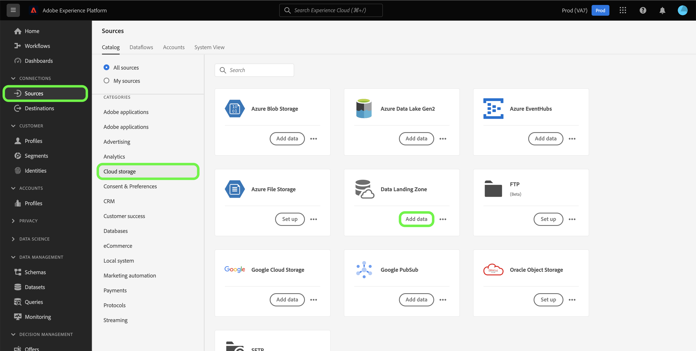

# Connecter [!DNL Data Landing Zone] à Platform à l’aide de l’interface utilisateur

>[!IMPORTANT]
>
>Cette page est spécifique au connecteur [!DNL Data Landing Zone] *source* dans l’Experience Platform. Pour plus d’informations sur la connexion au connecteur [!DNL Data Landing Zone] *destination*, consultez la page de documentation [[!DNL Data Landing Zone] destination](/help/destinations/catalog/cloud-storage/data-landing-zone.md).

[!DNL Data Landing Zone] est une fonctionnalité de stockage de fichiers sécurisée basée sur le cloud permettant d’importer des fichiers dans Adobe Experience Platform. Les données sont automatiquement supprimées du [!DNL Data Landing Zone] au bout de sept jours.

Ce tutoriel décrit les étapes à suivre pour créer une connexion source [!DNL Data Landing Zone] à l’aide de l’interface utilisateur de Platform.

## Prise en main

Ce tutoriel nécessite une compréhension du fonctionnement des composants suivants d’Adobe Experience Platform :

* [Sources](../../../../home.md) : Experience Platform permet d’ingérer des données provenant de diverses sources tout en vous offrant la possibilité de structurer, d’étiqueter et d’améliorer les données entrantes à l’aide des services de Platform.
* [Sandbox](../../../../../sandboxes/home.md) : Experience Platform fournit des sandbox virtuels qui divisent une instance de plateforme unique en environnements virtuels distincts pour favoriser le développement et l’évolution d’applications d’expérience digitale.

## Importer vos fichiers de [!DNL Data Landing Zone] vers Platform

>[!IMPORTANT]
>
> Pour vous connecter à la source, vous avez besoin des autorisations de contrôle d’accès **[!UICONTROL Afficher les sources]** et **[!UICONTROL Gérer les sources]**. Lisez la [présentation du contrôle d’accès](../../../../../access-control/home.md) ou contactez votre administrateur ou administratrice du produit pour obtenir les autorisations requises.

Dans l’interface utilisateur de Platform, sélectionnez **[!UICONTROL Sources]** dans le volet de navigation de gauche pour accéder à l’espace de travail [!UICONTROL Sources]. L’écran [!UICONTROL Catalogue] affiche diverses sources avec lesquelles vous pouvez créer un compte.

Vous pouvez sélectionner la catégorie appropriée dans le catalogue sur le côté gauche de votre écran. Vous pouvez également sélectionner la source de votre choix à l’aide de la barre de recherche.

Dans la catégorie [!UICONTROL Espace de stockage], sélectionnez [!DNL Data Landing Zone] puis **[!UICONTROL Ajouter des données]**.

L’étape [!UICONTROL Ajouter des données] s’affiche, vous fournissant une interface pour sélectionner et prévisualiser les données que vous souhaitez importer dans Platform.

* La partie gauche de l’interface est un navigateur de dossiers, qui vous fournit une liste des fichiers de votre conteneur que vous pouvez ensuite importer dans Platform.
* La partie droite de l’interface permet de prévisualiser jusqu’à 100 lignes de données à partir d’un fichier compatible.

Sélectionnez le fichier que vous souhaitez apporter à l’Experience Platform et patientez quelques instants le temps que l’interface appropriée se mette à jour dans un écran de prévisualisation.

>[!TIP]
>
>Platform détecte automatiquement les informations de propriété du fichier que vous avez sélectionné, y compris des informations sur le format de données du fichier, le délimiteur de colonne désigné et le type de compression.

L’interface de prévisualisation vous permet d’examiner le contenu et la structure d’un fichier. Par défaut, l’interface de prévisualisation affiche le premier fichier dans le dossier que vous avez sélectionné.

Pour prévisualiser un autre fichier, sélectionnez l’icône d’aperçu à côté du nom du fichier à inspecter.

Lorsque vous avez terminé, sélectionnez **[!UICONTROL Suivant]**.

Pour obtenir un guide détaillé et détaillé sur la création d’un flux de données pour une source d’espace de stockage dans le cloud, consultez le tutoriel sur la [création d’un flux de données d’espace de stockage pour importer des données dans Platform](../../dataflow/batch/cloud-storage.md).

## Récupération des informations d’identification [!DNL Data Landing Zone]

[!DNL Data Landing Zone] est une source qui est fournie avec votre licence Sources Adobe Experience Platform. [!DNL Data Landing Zone] utilise un URI SAS et une authentification basée sur les jetons SAS. Vous pouvez récupérer vos informations d’authentification à partir de la page [!UICONTROL Catalogue des sources].

Pour récupérer vos informations d’identification, sélectionnez la carte **[!UICONTROL Zone d’atterrissage des données]**, puis copiez vos informations d’identification à partir du rail de droite qui s’affiche.

Une fenêtre contextuelle s’affiche, affichant votre nom de conteneur, votre jeton SAS, le nom du compte de stockage, l’URI SAS et la date d’expiration.

## Actualiser vos informations d’identification [!DNL Data Landing Zone]

Vos informations d’identification [!DNL Data Landing Zone] sont définies pour expirer automatiquement au bout de 90 jours et vous devez utiliser de nouvelles informations d’identification pour vous reconnecter à [!DNL Data Landing Zone] après l’expiration. Vos flux de données dans Experience Platform ne sont pas affectés par les informations d’identification arrivant à expiration et vous pouvez toujours continuer à utiliser des flux de données nouveaux et existants avec vos nouvelles informations d’identification.

Il existe deux manières d’actualiser vos informations d’identification [!DNL Data Landing Zone] :

>[!BEGINTABS]

>[!TAB Utiliser la carte source]

Pour actualiser vos informations d’identification à partir de la page du catalogue de sources, sélectionnez les points de suspension (**`...`**) dans la vignette de [!DNL Data Landing Zone], puis sélectionnez **[!UICONTROL Actualiser les informations d’identification]**.

Une fenêtre pop-up s’affiche, vous invitant à confirmer l’opération avant de pouvoir continuer. Lorsque vous êtes prêt, sélectionnez **[!UICONTROL Actualiser les informations d’identification]**.

>[!TAB Utiliser le rail de droite]

Pour actualiser vos informations d’identification à l’aide du rail de droite, sélectionnez la carte source **[!UICONTROL Zone d’atterrissage de données]** puis sélectionnez **[!UICONTROL Autres actions]**. Sélectionnez ensuite **[!UICONTROL Actualiser les informations d’identification]** puis confirmez à l’aide de la fenêtre pop-up qui s’affiche.

>[!ENDTABS]

## Étapes suivantes

En suivant ce tutoriel, vous avez accédé à votre conteneur [!DNL Data Landing Zone] et avez appris à récupérer et à actualiser vos informations d’identification. Vous pouvez maintenant passer au tutoriel suivant sur la [création d’un flux de données pour importer des données d’un espace de stockage dans Platform](../../dataflow/batch/cloud-storage.md).
