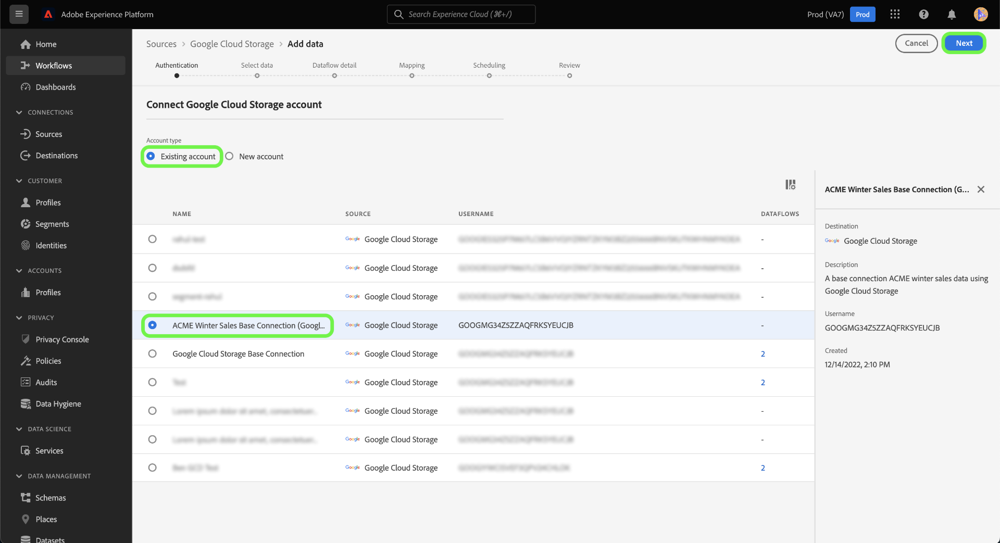

# Create a [!DNL Google Cloud Storage] source connector in the UI

Les connecteurs source dans l’Adobe Experience Platform permettent d’importer des données provenant de l’extérieur sur une base planifiée. Ce didacticiel décrit les étapes à suivre pour créer un connecteur source [!DNL Google Cloud Storage] (ci-après appelé &quot;GCS&quot;) à l’aide de l’ [!DNL Platform] interface utilisateur.

## Prise en main

Ce tutoriel nécessite une compréhension du fonctionnement des composants suivants d’Adobe Experience Platform :

* [Système de modèle de données d’expérience (XDM)](../../../../../xdm/home.md) : cadre normalisé selon lequel Experience Platform organise les données d’expérience client.
   * [Principes de base de la composition des schémas](../../../../../xdm/schema/composition.md) : découvrez les blocs de création de base des schémas XDM, y compris les principes clés et les bonnes pratiques en matière de composition de schémas.
   * [Didacticiel](../../../../../xdm/tutorials/create-schema-ui.md)sur l’éditeur de Schéma : Découvrez comment créer des schémas personnalisés à l’aide de l’interface utilisateur de l’éditeur de Schémas.
* [Real-time Customer Profile](../../../../../profile/home.md) : fournit un profil client en temps réel unifié basé sur des données agrégées issues de plusieurs sources.

Si vous disposez déjà d’une connexion de base GCS, vous pouvez ignorer le reste de ce document et passer au didacticiel sur la [configuration d’un flux de données](../../dataflow/batch/cloud-storage.md).

### Formats de fichiers pris en charge

[!DNL Experience Platform] prend en charge les formats de fichier suivants à ingérer à partir d’enregistrements externes :

* Valeurs séparées par des délimiteurs (DSV) : La prise en charge des fichiers de données au format DSV est actuellement limitée aux valeurs séparées par des virgules. La valeur des en-têtes de champ des fichiers au format DSV ne doit être composée que de caractères alphanumériques et de traits de soulignement. La prise en charge des fichiers DSV généraux sera assurée à l’avenir.
* Notation d’objet JavaScript (JSON) : Les fichiers de données au format JSON doivent être compatibles XDM.
* Apache Parquet : Les fichiers de données au format Parquet doivent être conformes à XDM.

### Collecte des informations d’identification requises

Pour accéder à vos données GCS sur [!DNL Platform], vous devez fournir un identifiant **de clé d&#39;** accès GCS valide et un **secret**. Vous pouvez en savoir plus sur la manière d’obtenir ces valeurs en lisant le guide <a href="https://cloud.google.com/docs/authentication/production" target="_blank">d’authentification</a> serveur à serveur pour [!DNL Google Cloud].

## Connecter votre compte GCS

Une fois que vous avez rassemblé les informations d’identification requises, vous pouvez suivre les étapes ci-dessous pour créer un nouveau compte GCS auquel vous connecter [!DNL Platform].

Connectez-vous à [l’Adobe Experience Platform](https://platform.adobe.com) , puis sélectionnez **[!UICONTROL Sources]** dans la barre de navigation de gauche pour accéder à l’espace de travail *[!UICONTROL Sources]* . L’écran *[!UICONTROL Catalogue]* affiche diverses sources pour lesquelles vous pouvez créer un compte entrant et chaque source affiche le nombre de comptes et de flux de données existants qui y sont associés.

Vous pouvez sélectionner la catégorie appropriée dans le catalogue sur le côté gauche de l’écran. Vous pouvez également trouver la source spécifique avec laquelle vous souhaitez travailler à l’aide de l’option de recherche.

Sous la catégorie *[!UICONTROL Bases de données]* , sélectionnez Enregistrement **** Google Cloud et cliquez sur **l’icône + (+)** pour créer un nouveau connecteur GCS.

La page *[!UICONTROL Se connecter à l’Enregistrement]* Google Cloud s’affiche. Sur cette page, vous pouvez utiliser de nouvelles informations d’identification ou des informations d’identification existantes.

### Nouveau compte

Si vous utilisez de nouvelles informations d’identification, sélectionnez **[!UICONTROL Nouveau compte]**. Dans le formulaire d’entrée qui s’affiche, indiquez le nom de la connexion, une description facultative et vos informations d’identification GCS. Lorsque vous avez terminé, sélectionnez **[!UICONTROL Se connecter]** , puis accordez un certain temps à l’établissement du nouveau compte.

### Compte existant

Pour connecter un compte existant, sélectionnez le compte GCS avec lequel vous souhaitez vous connecter, puis sélectionnez **[!UICONTROL Suivant]** pour continuer.

## Étapes suivantes

En suivant ce didacticiel, vous avez établi une connexion à votre compte GCS. Vous pouvez maintenant passer au didacticiel suivant et [configurer un flux de données pour importer des données de votre enregistrement cloud dans Platform](../../dataflow/batch/cloud-storage.md).