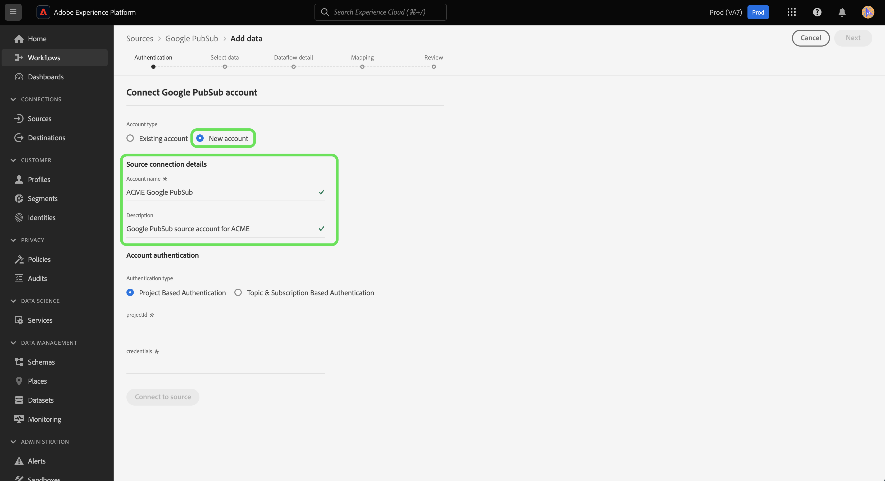

# Créer une connexion source [!DNL Google PubSub] dans l’interface utilisateur

>[!IMPORTANT]
>
>La source [!DNL Google PubSub] est disponible dans le catalogue des sources pour les utilisateurs qui ont acheté Real-Time Customer Data Platform Ultimate.

Ce tutoriel décrit les étapes à suivre pour créer une connexion de source [!DNL Google PubSub] (ci-après dénommée « [!DNL PubSub] ») à l’aide de l’interface utilisateur de Platform.

## Commencer

Ce tutoriel nécessite une compréhension du fonctionnement des composants suivants d’Adobe Experience Platform :

* [Sources](../../../../home.md) : Experience Platform permet d’ingérer des données provenant de diverses sources tout en vous offrant la possibilité de structurer, d’étiqueter et d’améliorer les données entrantes à l’aide des services de Platform.
* [Sandbox](../../../../../sandboxes/home.md) : Experience Platform fournit des sandbox virtuels qui divisent une instance de plateforme unique en environnements virtuels distincts pour favoriser le développement et l’évolution d’applications d’expérience digitale.

Si vous disposez déjà d’une connexion [!DNL PubSub] valide, vous pouvez ignorer le reste de ce document et passer au tutoriel sur la [configuration d’un flux de données](../../dataflow/batch/cloud-storage.md).

### Collecter les informations d’identification requises

Vous devez fournir des valeurs pour les propriétés de connexion décrites ci-dessous afin de connecter votre compte [!DNL PubSub] à Experience Platform. Pour plus d’informations sur l’authentification et la configuration des prérequis, consultez la [[!DNL PubSub source] présentation](../../../../connectors/cloud-storage/google-pubsub.md#prerequisites).

>[!BEGINTABS]

>[!TAB Authentification basée sur un projet]

| Informations d’identification | Description |
| --- | --- |
| Identifiant de projet | Identifiant de projet requis pour authentifier [!DNL PubSub]. |
| Informations d’identification | Informations d’identification requises pour l’authentification [!DNL PubSub]. Vous devez vous assurer de placer l’intégralité du fichier JSON après avoir supprimé les espaces blancs de vos informations d’identification. |

>[!TAB  Authentification par sujet et par abonnement ]

| Informations d’identification | Description |
| --- | --- |
| Informations d’identification | Informations d’identification requises pour l’authentification [!DNL PubSub]. Vous devez vous assurer de placer l’intégralité du fichier JSON après avoir supprimé les espaces blancs de vos informations d’identification. |
| Nom de la rubrique | Nom de votre abonnement [!DNL PubSub]. Dans [!DNL PubSub], les abonnements permettent de recevoir des messages, en s’abonnant à la rubrique vers laquelle les messages ont été publiés. **Remarque** : un seul abonnement [!DNL PubSub] ne peut être utilisé que pour un seul flux de données. Pour créer plusieurs flux de données, vous devez disposer de plusieurs abonnements. |
| Nom d&#39;abonnement | Nom de votre abonnement [!DNL PubSub]. Dans [!DNL PubSub], les abonnements permettent de recevoir des messages, en s’abonnant à la rubrique vers laquelle les messages ont été publiés. |

>[!ENDTABS]

Pour plus d’informations sur ces valeurs, consultez le document suivant : [Authentification PubSub](https://cloud.google.com/pubsub/docs/authentication). Si vous utilisez l’authentification par compte de service, consultez le [guide de PubSub](https://cloud.google.com/docs/authentication/production#create_service_account) et suivez les instructions pour générer vos informations d’identification.

>[!TIP]
>
>Si vous utilisez l’authentification par compte de service, assurez-vous que vous avez accordé un accès utilisateur suffisant à votre compte de service et qu’il n’y a pas d’espaces blancs supplémentaires dans le fichier JSON lors de la copie et du collage de vos informations d’identification.

Une fois que vous avez rassemblé les informations d’identification requises, vous pouvez suivre la procédure ci-dessous et lier votre compte [!DNL PubSub] à Platform.

## Connecter votre compte [!DNL PubSub]

Dans l’interface utilisateur de Platform, sélectionnez **[!UICONTROL Sources]** dans le volet de navigation de gauche pour accéder à l’espace de travail [!UICONTROL Sources]. L’écran [!UICONTROL Catalogue] affiche diverses sources avec lesquelles vous pouvez créer un compte.

Vous pouvez sélectionner la catégorie appropriée dans le catalogue sur le côté gauche de votre écran. Vous pouvez également trouver la source spécifique à utiliser à l’aide de l’option de recherche.

Dans la catégorie [!UICONTROL Espace de stockage], sélectionnez **[!UICONTROL Google PubSub]**, puis cliquez sur **[!UICONTROL Ajouter des données]**.

La page **[!UICONTROL Connexion à Google PubSub]** s’affiche. Sur cette page, vous pouvez utiliser de nouvelles informations d’identification ou des informations d’identification existantes.

### Compte existant

Pour utiliser un compte existant, sélectionnez le compte [!DNL PubSub] avec lequel vous souhaitez créer un flux de données, puis sélectionnez **[!UICONTROL Suivant]** pour continuer.

### Nouveau compte

>[!TIP]
>
>* Lors de la création d’un compte avec accès restreint, vous devez indiquer au moins un nom de rubrique ou d’abonnement. L’authentification échoue si les deux valeurs sont manquantes.
>* Une fois créé, vous ne pouvez pas modifier le type d&#39;authentification d&#39;une connexion de base [!DNL Google PubSub]. Pour modifier le type d&#39;authentification, vous devez créer une nouvelle connexion de base.

Si vous créez un compte, sélectionnez **[!UICONTROL Nouveau compte]**, puis fournissez un nom et une description facultative de votre nouveau compte [!DNL PubSub].

La source [!DNL PubSub] vous permet de spécifier le type d’accès que vous souhaitez autoriser lors de l’authentification. Vous pouvez configurer votre compte pour qu’il dispose d’une authentification basée sur le projet ou d’une authentification par rubrique et par abonnement. L’authentification basée sur un projet vous permet d’accorder l’accès au projet racine dans votre compte, tandis que l’authentification par rubrique et par abonnement vous permet de restreindre l’accès à une rubrique et à un abonnement [!DNL PubSub] spécifiques.

>[!BEGINTABS]

>[!TAB Authentification basée sur un projet]

Pour créer un compte ayant accès au dossier du projet [!DNL PubSub] racine. Sélectionnez les **[!UICONTROL informations d’authentification PubSub de Google]** comme type d’authentification et fournissez votre ID de projet et vos informations d’identification. Lorsque vous avez terminé, sélectionnez **[!UICONTROL Se connecter à la source]** puis attendez que la nouvelle connexion s’établisse.

>[!TAB  Authentification par sujet et par abonnement ]

Pour créer un compte avec un accès limité uniquement à une rubrique et à un abonnement [!DNL PubSub] spécifiques, sélectionnez **[!UICONTROL Informations d’authentification Google PubSub Scoped]** , puis fournissez vos informations d’identification, le nom de la rubrique et/ou le nom de l’abonnement. Lorsque vous avez terminé, sélectionnez **[!UICONTROL Se connecter à la source]** puis attendez que la nouvelle connexion s’établisse.

>[!ENDTABS]

>[!NOTE]
>
>Les entités de sécurité (rôles) affectées à un projet [!DNL PubSub] sont héritées dans toutes les rubriques et tous les abonnements créés dans un projet [!DNL PubSub]. Si vous souhaitez qu’une entité (rôle) ait accès à une rubrique spécifique, cette entité (rôle) doit également être ajoutée à l’abonnement correspondant à la rubrique. Pour plus d’informations, consultez la [[!DNL PubSub] documentation sur le contrôle d’accès](<https://cloud.google.com/pubsub/docs/access-control>).

## Sélectionner les données

Une authentification réussie vous amène à l’étape [!UICONTROL Sélectionner les données], où vous pouvez parcourir votre hiérarchie de données [!DNL PubSub] et sélectionner les données à importer dans Experience Platform.

>[!BEGINTABS]

>[!TAB Authentification basée sur un projet]

Si vous vous êtes authentifié avec un accès basé sur un projet, l’interface [!UICONTROL Sélectionner les données] affichera tous les abonnements de votre projet auxquels est associée une rubrique.

>[!TAB  Authentification par sujet et par abonnement ]

Si vous vous êtes authentifié avec un accès par rubrique et par abonnement, l’affichage de l’interface [!UICONTROL Sélectionner les données] peut varier en fonction des informations que vous avez fournies.

* Si vous indiquez uniquement le nom de la rubrique, l’interface affiche toutes les paires rubrique-abonnement qui correspondent à la rubrique fournie.
* Si vous fournissez uniquement le nom de l’abonnement, l’interface affiche toutes les paires rubrique-abonnement qui correspondent au nom d’abonnement fourni.
* Si des noms de rubrique et d’abonnement sont fournis, l’interface affiche la paire rubrique-abonnement qui correspond aux deux valeurs fournies.

>[!ENDTABS]

## Étapes suivantes

En suivant ce tutoriel, vous avez créé une connexion entre votre compte [!DNL PubSub] et Platform. Vous pouvez maintenant passer au tutoriel suivant et [configurer un flux de données pour importer des données de diffusion en continu depuis votre espace de stockage dans Platform](../../dataflow/streaming/cloud-storage-streaming.md).
