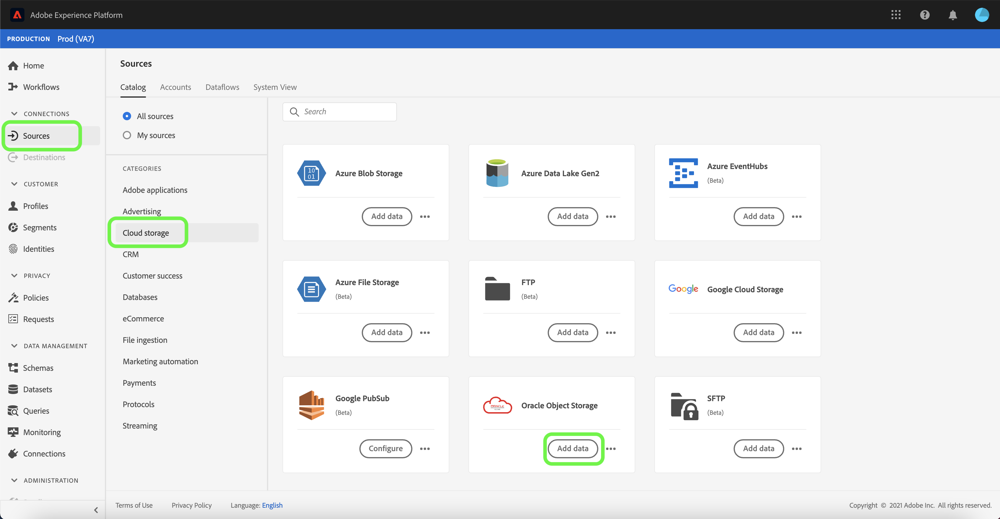
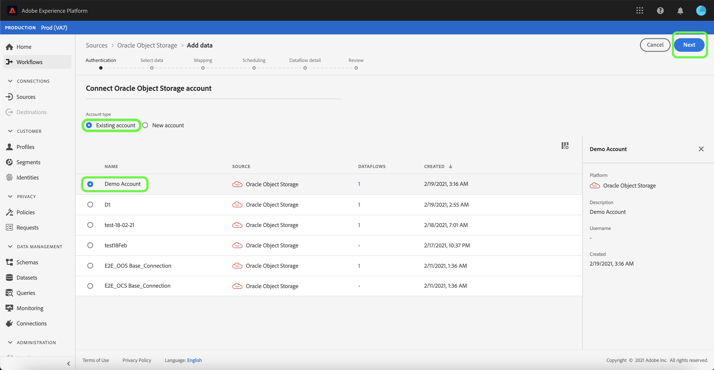
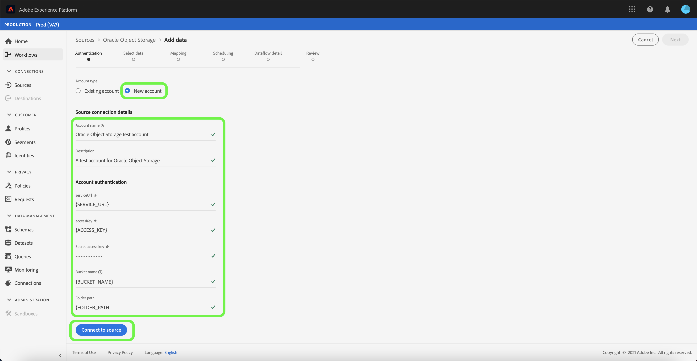

# Créer une connexion Source [!DNL Oracle Object Storage] dans l’interface utilisateur

Ce tutoriel décrit les étapes à suivre pour créer une connexion source [!DNL Oracle Object Storage] à l’aide de l’interface utilisateur de Adobe Experience Platform.

## Prise en main

Ce tutoriel nécessite une compréhension du fonctionnement des composants suivants d’Adobe Experience Platform :

* [Sources](../../../../home.md) : Experience Platform permet d’ingérer des données provenant de diverses sources tout en vous offrant la possibilité de structurer, d’étiqueter et d’améliorer les données entrantes à l’aide des services d’Experience Platform.
* [Sandbox](../../../../../sandboxes/home.md) : Experience Platform fournit des sandbox virtuels qui divisent une instance Experience Platform unique en environnements virtuels distincts pour favoriser le développement et l’évolution d’applications d’expérience digitale.

### Collecter les informations d’identification requises

Pour connecter à [!DNL Oracle Object Storage], vous devez fournir des valeurs pour les propriétés de connexion suivantes :

| Informations d’identification | Description |
| ---------- | ----------- |
| `serviceUrl` | Point d’entrée [!DNL Oracle Object Storage] requis pour l’authentification. Le format du point d’entrée est : `https://{OBJECT_STORAGE_NAMESPACE}.compat.objectstorage.eu-frankfurt-1.oraclecloud.com` |
| `accessKey` | Identifiant de clé d’accès [!DNL Oracle Object Storage] requis pour l’authentification. |
| `secretKey` | Mot de passe [!DNL Oracle Object Storage] requis pour l’authentification. |
| `bucketName` | Le nom de compartiment autorisé est obligatoire si l’utilisateur dispose d’un accès restreint. Le nom du compartiment doit comporter entre 3 et 63 caractères, commencer et se terminer par une lettre ou un chiffre, et ne peut contenir que des lettres minuscules, des chiffres ou des tirets (`-`). Le nom du compartiment ne peut pas être formaté comme une adresse IP. |
| `folderPath` | Chemin d’accès au dossier autorisé requis si l’utilisateur dispose d’un accès restreint. |

Pour plus d’informations sur la manière d’obtenir ces valeurs, consultez le guide d’authentification du stockage d’objets Oracle [&#128279;](https://docs.oracle.com/en-us/iaas/Content/Identity/Concepts/usercredentials.htm#User_Credentials).

Une fois que vous avez rassemblé les informations d’identification requises, vous pouvez suivre les étapes ci-dessous pour créer un compte de stockage d’objets Oracle afin de vous connecter à Experience Platform.

## Se connecter au stockage d’objets Oracle

Dans l’interface utilisateur d’Experience Platform, sélectionnez **[!UICONTROL Sources]** dans le volet de navigation de gauche pour accéder à l’espace de travail [!UICONTROL Sources]. L’écran [!UICONTROL Catalog] affiche diverses sources avec lesquelles vous pouvez créer un compte.

Vous pouvez sélectionner la catégorie appropriée dans le catalogue sur le côté gauche de votre écran. Vous pouvez également sélectionner la source de votre choix à l’aide de la barre de recherche.

Sous la catégorie [!UICONTROL Cloud storage] , sélectionnez **[!UICONTROL Oracle Object Storage]** puis **[!UICONTROL Add data]**.

### Compte existant

Pour utiliser un compte existant, sélectionnez le compte [!DNL Oracle Object Storage] avec lequel vous souhaitez créer un flux de données, puis sélectionnez **[!UICONTROL Next]** pour continuer.

### Nouveau compte

Si vous créez un compte, sélectionnez **[!UICONTROL New account]**, puis fournissez un nom, une description facultative et vos informations d’identification [!DNL Oracle Object Storage]. Lorsque vous avez terminé, sélectionnez **[!UICONTROL Connect to source]** puis attendez que la nouvelle connexion s’établisse.

## Étapes suivantes

En suivant ce tutoriel, vous avez établi une connexion à votre compte [!DNL Oracle Object Storage]. Vous pouvez maintenant passer au tutoriel suivant sur [la configuration d’un flux de données pour importer des données de votre espace de stockage dans Experience Platform](../../dataflow/batch/cloud-storage.md).
