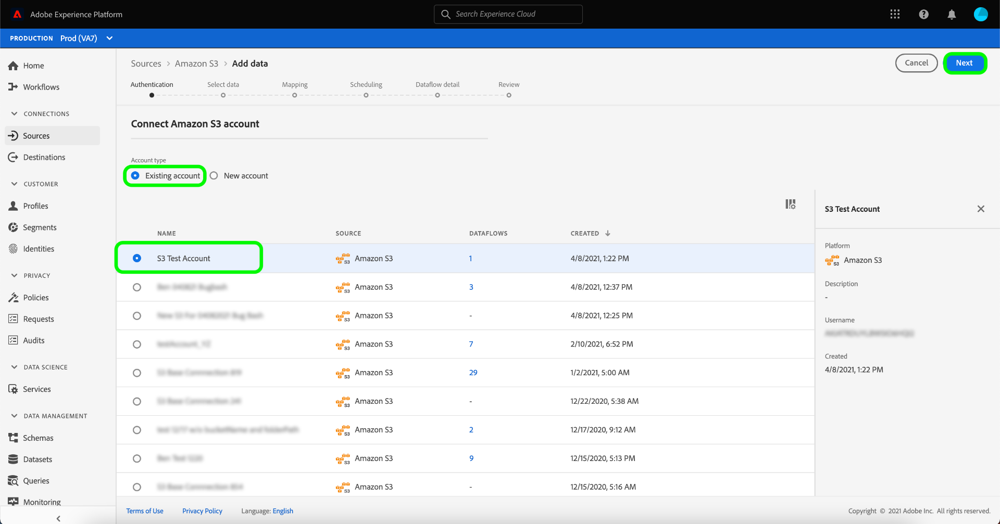

# Créer une connexion source [!DNL Amazon S3] dans l’interface utilisateur

Les connecteurs Source de Adobe Experience Platform permettent d’ingérer des données provenant de l’extérieur selon un calendrier précis. Ce tutoriel décrit les étapes à suivre pour créer un connecteur source [!DNL Amazon S3] (ci-après dénommé « [!DNL S3] ») à l’aide de l’interface utilisateur d’Experience Platform.

## Prise en main

Ce tutoriel nécessite une compréhension du fonctionnement des composants suivants d’Adobe Experience Platform :

- [[!DNL Experience Data Model (XDM)] Système](../../../../../xdm/home.md) : Cadre normalisé selon lequel Experience Platform organise les données d’expérience client. 
   - [Principes de base de la composition des schémas](../../../../../xdm/schema/composition.md) : découvrez les blocs de création de base des schémas XDM, y compris les principes clés et les bonnes pratiques en matière de composition de schémas.
   - [Tutoriel sur l’éditeur de schémas](../../../../../xdm/tutorials/create-schema-ui.md) : découvrez comment créer des schémas personnalisés à l’aide de l’interface utilisateur de l’éditeur de schémas.
- [[!DNL Real-Time Customer Profile]](../../../../../profile/home.md) : fournit un profil de consommateur unifié en temps réel, basé sur des données agrégées provenant de plusieurs sources.

Si vous disposez déjà d’une connexion [!DNL S3] valide, vous pouvez ignorer le reste de ce document et passer au tutoriel sur la [configuration d’un flux de données](../../dataflow/batch/cloud-storage.md).

### Collecter les informations d’identification requises

Pour accéder à votre compartiment [!DNL S3] sur Experience Platform, vous devez fournir des valeurs valides pour les informations d’identification suivantes :

| Informations d’identification | Description |
| ---------- | ----------- |
| `s3AccessKey` | Identifiant de clé d’accès pour votre compartiment [!DNL S3]. |
| `s3SecretKey` | Identifiant de clé secrète pour votre compartiment [!DNL S3]. |
| `serviceUrl` | (Facultatif) Point d’entrée de [!DNL S3] personnalisé auquel se connecter. Ce champ est obligatoire lorsque votre intervalle de [!DNL S3] est spécifique à une région. Le format de `serviceUrl` est : `https://s3.{REGION}.amazonaws.com/)`. |
| `bucketName` | Le compartiment [!DNL S3] contient vos données et leurs métadonnées descriptives correspondantes. Le nom de votre compartiment [!DNL S3] doit comporter entre 3 et 63 caractères et doit commencer et se terminer par une lettre ou un chiffre. Le nom du compartiment ne peut contenir que des lettres minuscules, des chiffres ou des tirets (`-`) et ne peut pas être formaté comme une adresse IP. |
| `folderPath` | Chemin d’accès au dossier dans votre compartiment [!DNL S3] où vos données sont stockées. Ces informations d’identification sont requises lorsque l’utilisateur dispose d’un accès restreint. |

Pour plus d’informations sur la prise en main, consultez [ce document AWS](https://aws.amazon.com/blogs/security/wheres-my-secret-access-key/).

## Connecter votre compte [!DNL S3]

Dans l’interface utilisateur d’Experience Platform, sélectionnez **[!UICONTROL Sources]** dans la barre de navigation de gauche pour accéder à l’espace de travail [!UICONTROL Sources]. L’écran [!UICONTROL Catalogue] affiche diverses sources pour lesquelles vous pouvez créer un compte.

Vous pouvez sélectionner la catégorie appropriée dans le catalogue sur le côté gauche de votre écran. Vous pouvez également trouver la source spécifique à utiliser à l’aide de l’option de recherche.

Dans la catégorie **[!UICONTROL Espace de stockage]**, sélectionnez **[!UICONTROL Amazon S3]** puis **[!UICONTROL Ajouter des données]**.

La page **[!UICONTROL Se connecter à Amazon S3]** s’affiche. Sur cette page, vous pouvez utiliser de nouvelles informations d’identification ou des informations d’identification existantes.

### Nouveau compte

Si vous utilisez de nouvelles informations d’identification, sélectionnez **[!UICONTROL Nouveau compte]**.  Dans le formulaire de saisie qui s’affiche, indiquez un nom, une description facultative et vos informations d’identification [!DNL S3]. Lorsque vous avez terminé, sélectionnez **[!UICONTROL Se connecter à la source]** puis attendez que la nouvelle connexion s’établisse.

### Compte existant

Pour connecter un compte existant, sélectionnez le compte [!DNL S3] auquel vous souhaitez vous connecter, puis sélectionnez **[!UICONTROL Suivant]** pour continuer.

## Étapes suivantes et ressources supplémentaires

En suivant ce tutoriel, vous avez établi une connexion à votre compte [!DNL S3]. Vous pouvez maintenant passer au tutoriel suivant et [configurer un flux de données pour importer des données de votre espace de stockage dans Experience Platform](../../dataflow/batch/cloud-storage.md).
