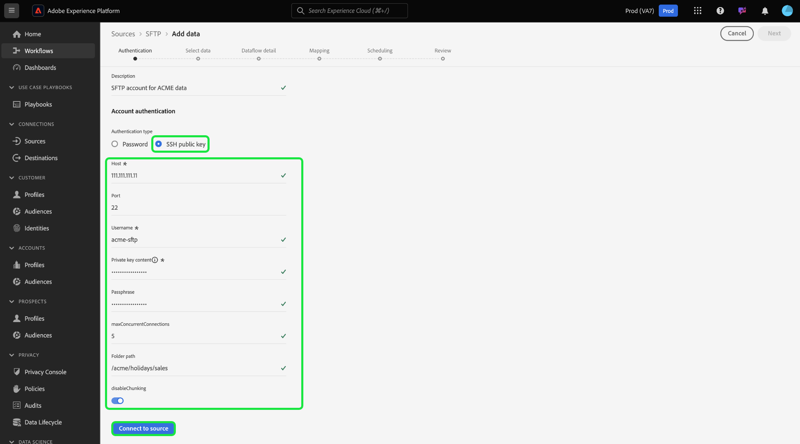

# Créer une connexion source [!DNL SFTP] dans l’interface utilisateur

Ce tutoriel décrit les étapes à suivre pour créer une connexion source [!DNL SFTP] à l’aide de l’interface utilisateur de Adobe Experience Platform.

## Commencer

Ce tutoriel nécessite une compréhension du fonctionnement des composants suivants d’Adobe Experience Platform : 

* [[!DNL Experience Data Model (XDM)] Système](../../../../../xdm/home.md) : Cadre normalisé selon lequel Experience Platform organise les données d’expérience client. 
   * [Principes de base de la composition des schémas](../../../../../xdm/schema/composition.md) : découvrez les blocs de création de base des schémas XDM, y compris les principes clés et les bonnes pratiques en matière de composition de schémas.
   * [Tutoriel sur l’éditeur de schémas](../../../../../xdm/tutorials/create-schema-ui.md) : découvrez comment créer des schémas personnalisés à l’aide de l’interface utilisateur de l’éditeur de schémas.
* [[!DNL Real-Time Customer Profile]](../../../../../profile/home.md) : fournit un profil de consommateur unifié en temps réel, basé sur des données agrégées provenant de plusieurs sources.

>[!IMPORTANT]
>
>Il est recommandé d’éviter les nouvelles lignes ou les retours à la ligne lors de l’ingestion d’objets JSON avec une connexion source [!DNL SFTP]. Pour contourner cette limitation, utilisez un seul objet JSON par ligne et utilisez des lignes multiples pour les fichiers suivants.

Si vous disposez déjà d’une connexion [!DNL SFTP] valide, vous pouvez ignorer le reste de ce document et passer au tutoriel sur la [configuration d’un flux de données](../../dataflow/batch/cloud-storage.md).

### Collecter les informations d’identification requises

Lisez le [[!DNL SFTP] guide d’authentification](../../../../connectors/cloud-storage/sftp.md#gather-required-credentials) pour obtenir des instructions détaillées sur la manière de récupérer vos informations d’authentification.

## Connexion à votre serveur [!DNL SFTP]

Dans l’interface utilisateur d’Experience Platform, sélectionnez **[!UICONTROL Sources]** dans la barre de navigation de gauche pour accéder à l’espace de travail [!UICONTROL Sources]. L’écran [!UICONTROL Catalogue] affiche diverses sources avec lesquelles vous pouvez créer un compte.

Vous pouvez sélectionner la catégorie appropriée dans le catalogue sur le côté gauche de votre écran. Vous pouvez également trouver la source spécifique à utiliser à l’aide de l’option de recherche.

Dans la catégorie [!UICONTROL Espace de stockage], sélectionnez **[!UICONTROL SFTP]** puis **[!UICONTROL Ajouter des données]**.

La page **[!UICONTROL Se connecter à SFTP]** s’affiche. Sur cette page, vous pouvez utiliser de nouvelles informations d’identification ou des informations d’identification existantes.

### Compte existant

Pour connecter un compte existant, sélectionnez le compte FTP ou SFTP auquel vous souhaitez vous connecter, puis sélectionnez **[!UICONTROL Suivant]** pour continuer.

### Nouveau compte

>[!TIP]
>
>* Une fois créé, vous ne pouvez pas modifier le type d’authentification d’une connexion de base [!DNL SFTP]. Pour modifier le type d’authentification, vous devez créer une connexion de base.
>
>* SFTP prend en charge une clé OpenSSH de type RSA ou DSA. Assurez-vous que le contenu de votre fichier clé commence par `"-----BEGIN [RSA/DSA] PRIVATE KEY-----"` et se termine par `"-----END [RSA/DSA] PRIVATE KEY-----"`. Si le fichier de clé privée est un fichier au format PPK, utilisez l’outil PuTTY pour convertir le fichier PPK au format OpenSSH.

Si vous créez un compte, sélectionnez **[!UICONTROL Nouveau compte]**, puis fournissez un nom et une description facultative pour votre nouveau compte [!DNL SFTP].

La source [!DNL SFTP] prend en charge l’authentification de base et l’authentification par clé publique SSH.

>[!BEGINTABS]

>[!TAB  Authentification de base ]

Pour utiliser l’authentification de base, sélectionnez **[!UICONTROL Mot de passe]** puis indiquez les valeurs appropriées pour les informations d’identification suivantes :

* hôte
* port
* nom d&#39;utilisateur
* mot de passe

Au cours de cette étape, vous pouvez également configurer vos connexions simultanées maximales, définir votre chemin d’accès au dossier et activer ou désactiver le fractionnement de votre serveur [!DNL SFTP]. Lorsque vous avez terminé, sélectionnez **[!UICONTROL Se connecter à la source]** et patientez quelques instants le temps que la connexion s’établisse.

Pour plus d’informations sur l’authentification, consultez le guide sur la [collecte des informations d’identification requises pour [!DNL SFTP]](../../../../connectors/cloud-storage/sftp.md#gather-required-credentials).

>[!TAB authentification par clé publique SSH]

Pour utiliser les informations d’identification basées sur une clé publique SSH, sélectionnez **[!UICONTROL Clé publique SSH]** puis indiquez les valeurs appropriées pour les informations d’identification suivantes :

* hôte
* port
* nom d&#39;utilisateur
* contenu de clé privée
* phrase secrète

Au cours de cette étape, vous pouvez également configurer vos connexions simultanées maximales, définir votre chemin d’accès au dossier et activer ou désactiver le fractionnement de votre serveur [!DNL SFTP]. Lorsque vous avez terminé, sélectionnez **[!UICONTROL Se connecter à la source]** et patientez quelques instants le temps que la connexion s’établisse.

Pour plus d’informations sur l’authentification, consultez le guide sur la [collecte des informations d’identification requises pour [!DNL SFTP]](../../../../connectors/cloud-storage/sftp.md#gather-required-credentials).

>[!ENDTABS]

## Étapes suivantes

En suivant ce tutoriel, vous avez établi une connexion à votre compte SFTP. Vous pouvez maintenant passer au tutoriel suivant et [configurer un flux de données pour importer des données de votre espace de stockage dans Experience Platform](../../dataflow/batch/cloud-storage.md).
