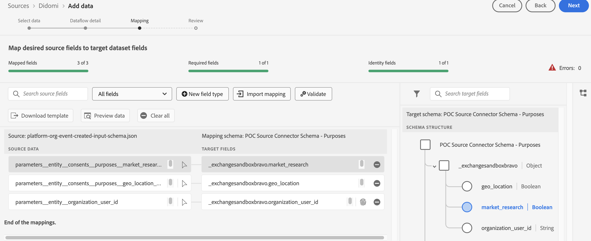

# Connexion de [!DNL Didomi] à Experience Platform

>[!AVAILABILITY]
>
>La source [!DNL Didomi] est en version Beta. Lisez les [termes et conditions](../../../../home.md#terms-and-conditions) dans la présentation des sources pour plus d’informations sur l’utilisation de sources étiquetées bêta.

Lisez ce guide pour savoir comment connecter votre compte [!DNL Didomi] à Adobe Experience Platform à l’aide de l’espace de travail des sources dans l’interface utilisateur.

>[!IMPORTANT]
>
>* Cette page de documentation a été créée par l’équipe *Didomi*. Pour toute question ou demande de mise à jour, contactez-les directement à l’adresse *support@didomi.io*.
>* Pour obtenir des instructions détaillées sur la génération de la connexion, reportez-vous à la [documentation du connecteur source Didomi Adobe](https://developers.didomi.io/integrations/third-party-apps/preference-management-platform-integrations/Adobe-source-connector).

## Commencer

Ce tutoriel nécessite une compréhension du fonctionnement des composants suivants d’Adobe Experience Platform :

* [[!DNL Experience Data Model (XDM)] Système](../../../../../xdm/home.md) : Cadre normalisé selon lequel Experience Platform organise les données d’expérience client. 
   * [Principes de base de la composition des schémas](../../../../../xdm/schema/composition.md) : découvrez les blocs de création de base des schémas XDM, y compris les principes clés et les bonnes pratiques en matière de composition de schémas.
   * [Tutoriel sur l’éditeur de schémas](../../../../../xdm/tutorials/create-schema-ui.md) : découvrez comment créer des schémas personnalisés à l’aide de l’interface utilisateur de l’éditeur de schémas.
* [[!DNL Real-Time Customer Profile]](../../../../../profile/home.md) : fournit un profil de consommateur unifié en temps réel, basé sur des données agrégées provenant de plusieurs sources.

### Configuration de votre compte [!DNL Didomi]

Avant de poursuivre, assurez-vous de lire et d’effectuer les étapes préalables décrites dans la [[!DNL Didomi] présentation](../../../../connectors/consent-and-preferences/didomi.md#prerequisites) pour connecter votre compte à Experience Platform.

## Parcourir le catalogue des sources

Dans l’interface utilisateur d’Experience Platform, sélectionnez **[!UICONTROL Sources]** dans le volet de navigation de gauche pour accéder à l’espace de travail *[!UICONTROL Sources]*. Choisissez une catégorie ou utilisez la barre de recherche pour trouver votre source.

Pour vous connecter à [!DNL Didomi], accédez à la catégorie *[!UICONTROL Bases de données]*, sélectionnez la vignette source **[!UICONTROL Didomi]**, puis sélectionnez **[!UICONTROL Configurer]**.

>[!TIP]
>
>Les sources du catalogue affichent l’option **[!UICONTROL Configurer]** lorsqu’une source donnée ne dispose pas encore d’un compte authentifié. Une fois un compte authentifié créé, cette option devient **[!UICONTROL Ajouter des données]**.

## Ajouter votre schéma de données source

Ensuite, utilisez l’interface *[!UICONTROL Sélectionner des données]* pour charger le fichier JSON qui a été [téléchargé dans les étapes préalables](../../../../connectors/consent-and-preferences/didomi.md#download-the-sample-payload-file).

Vous pouvez utiliser l’interface de prévisualisation pour afficher la structure de fichiers de la payload. Lorsque vous avez terminé, sélectionnez **[!UICONTROL Suivant]**.

## Fournir des détails sur le flux de données

Ensuite, vous devez fournir des informations concernant votre jeu de données et votre flux de données.

### Détails du jeu de données

Un jeu de données est une structure de stockage et de gestion pour une collection de données, généralement sous la forme d’un tableau, qui contient un schéma (des colonnes) et des champs (des lignes). Les données correctement ingérées par Experience Platform sont conservées sous forme de jeux de données dans le lac de données.

Au cours de cette étape, vous pouvez utiliser un jeu de données existant ou en créer un nouveau.

>[!NOTE]
>
>Que vous utilisiez un jeu de données existant ou en créiez un nouveau, vous devez vous assurer que votre jeu de données est **activé pour l’ingestion de profils**.

+++Sélectionnez pour connaître les étapes d’activation de l’ingestion de profil, des diagnostics d’erreur et de l’ingestion partielle.

Si votre jeu de données est activé pour le profil client en temps réel, au cours de cette étape, vous pouvez activer/désactiver le **[!UICONTROL jeu de données de profil]** pour activer vos données pour l’ingestion de profil. Vous pouvez également utiliser cette étape pour activer les **[!UICONTROL diagnostics d’erreur]** et **[!UICONTROL ingestion partielle]**.

* **[!UICONTROL Diagnostics d’erreur]** : sélectionnez **[!UICONTROL Diagnostics d’erreur]** pour demander à la source de générer des diagnostics d’erreur que vous pourrez référencer ultérieurement lors de la surveillance de l’activité du jeu de données et du statut du flux de données.
* **[!UICONTROL Ingestion partielle]** : l’ingestion par lots partielle est la possibilité d’ingérer des données contenant des erreurs, jusqu’à un certain seuil configurable. Cette fonctionnalité vous permet d’ingérer toutes vos données exactes dans Experience Platform, tandis que toutes vos données incorrectes sont traitées par lots séparément avec des informations sur les raisons de leur non-validité.

+++

### Détails du flux de données

Une fois votre jeu de données configuré, vous devez fournir des détails sur votre flux de données, y compris un nom, une description facultative et des configurations d’alerte.

| Configurations du flux de données | Description |
| --- | --- |
| Nom du flux de données | Nom du flux de données.  Par défaut, le nom du fichier importé est utilisé. |
| Description | (Facultatif) Brève description de votre flux de données. |
| Alertes | Experience Platform peut générer des alertes basées sur des événements auxquelles les utilisateurs et utilisatrices peuvent s’abonner. Ces options sont toutes exécutées dans un flux de données pour les déclencher.  Pour plus d’informations, reportez-vous à la présentation des alertes  <ul><li>**Début d’exécution du flux de données des sources** : sélectionnez cette alerte pour recevoir une notification lorsque l’exécution du flux de données commence.</li><li>**Succès de l’exécution du flux de données des sources** : sélectionnez cette alerte pour recevoir une notification si votre flux de données se termine sans erreur.</li><li>**Échec de l’exécution du flux de données des sources** : sélectionnez cette alerte pour recevoir une notification si l’exécution de votre flux de données se termine par des erreurs.</li></ul> |

{style="table-layout:auto"}

## Mappage

Utilisez l’interface de mappage pour mapper vos données source aux champs de schéma appropriés avant d’ingérer des données vers Experience Platform.  Pour plus d’informations, consultez le guide de mappage [ dans l’interface utilisateur](../../../../../data-prep/ui/mapping.md)

Le mappage est utilisé spécifiquement pour transférer des données **d’objectif** de [!DNL Didomi] vers le jeu de données Experience Platform. Ces objectifs représentent les choix de consentement de l’utilisateur (par exemple, pour les analyses, la personnalisation, la publicité, etc.) et sont les seuls champs de mappage acceptés dans cette intégration.

Utilisez l’[exemple de payload webhook téléchargé](../../../../connectors/consent-and-preferences/didomi.md#download-the-sample-payload-file) dans les paramètres webhook [!DNL Didomi] pour mapper chaque objectif [!DNL Didomi] aux champs appropriés dans votre jeu de données Adobe.

Lorsque vous avez terminé, sélectionnez **[!UICONTROL Suivant]**.

## Réviser

L’étape *[!UICONTROL Révision]* s’affiche et vous permet de consulter les détails de votre flux de données avant sa création. Les détails sont regroupés dans les catégories suivantes :

* **[!UICONTROL Connexion]** : affiche le nom du compte, la plateforme source et le nom de la source.
* **[!UICONTROL Attribuer des champs de jeu de données et de mappage]** : affiche le jeu de données cible et le schéma auquel le jeu de données se conforme.

Après avoir confirmé que les détails sont corrects, sélectionnez **[!UICONTROL Terminer]**.

## Récupérer l’URL du point d’entrée de diffusion en continu

Une fois la connexion créée, la page des détails des sources s’affiche. Cette page affiche les détails de la connexion que vous venez de créer, y compris les flux de données précédemment exécutés, l’identifiant et l’URL du point d’entrée de diffusion en continu.

## Terminer la configuration sur Adobe

Une fois votre flux de données créé, accédez au catalogue *[!UICONTROL Sources]*, puis sélectionnez **[!UICONTROL Flux de données]**. Utilisez le répertoire des flux de données pour localiser votre flux de données [!DNL Didomi] et accéder à l’interface *[!UICONTROL Activité du flux de données]*. Utilisez ensuite le panneau *[!UICONTROL Propriétés]* dans le rail de droite et récupérez les valeurs des éléments suivants :

* [!UICONTROL Point d’entrée de diffusion en continu]
* [!UICONTROL Identifiant du flux de données]

Dans l’interface utilisateur d’Experience Platform :

1. Une fois la configuration terminée, passez en revue les paramètres de configuration qui manquaient dans la configuration initiale de webhook.
2. Une fois ces valeurs disponibles, revenez à Didomi et mettez à jour la configuration du webhook.

## Mise à jour de la configuration du Webhook

Une fois la configuration terminée, revenez à la console [!DNL Didomi] et mettez à jour votre configuration webhook avec votre **URL de point d’entrée en flux continu** et votre **identifiant de flux de données**.

Une fois cette opération terminée, [!DNL Didomi] commencerez à envoyer des événements de gestion du consentement et des préférences via l’intégration. Les données seront stockées dans votre jeu de données Adobe.

## Étapes suivantes

Ce tutoriel vous a permis de créer un flux de données pour importer des données par lots de votre source de [!DNL Didomi] vers Experience Platform. Pour obtenir des ressources supplémentaires, consultez la documentation décrite ci-dessous.

### Surveiller votre flux de données

Une fois votre flux de données créé, vous pouvez surveiller les données ingérées et afficher les informations relatives au taux d’ingestion, aux succès et aux erreurs. Pour plus d’informations sur la surveillance des flux de données, consultez le tutoriel sur la [surveillance des comptes et des flux de données dans l’interface utilisateur](../../../../../dataflows/ui/monitor-sources.md).

### Mettre à jour votre flux de données

Pour mettre à jour les configurations pour la planification, le mappage et les informations générales de vos flux de données, consultez le tutoriel sur la [mise à jour des flux de données sources dans l’interface utilisateur](../../update-dataflows.md).

### Supprimer le flux de données

Vous pouvez supprimer les flux de données qui ne sont plus nécessaires ou qui ont été créés de manière incorrecte à l’aide de la fonction **[!UICONTROL Supprimer]**, disponible dans l’espace de travail **[!UICONTROL Flux de données]**. Pour plus d’informations sur la suppression des flux de données, consultez le tutoriel sur la [suppression de flux de données dans l’interface utilisateur](../../delete.md).
