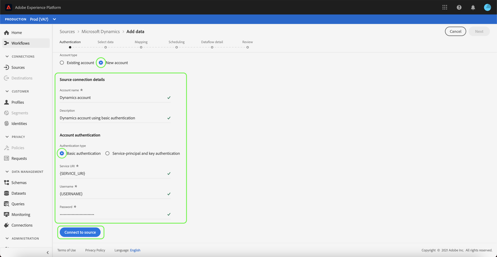

# Créer une connexion source [!DNL Microsoft Dynamics] dans l’interface utilisateur

Ce tutoriel décrit les étapes à suivre pour créer une [!DNL Microsoft Dynamics] (ci-après dénommés &quot;[!DNL Dynamics]&quot;) connexion source à l’aide de l’interface utilisateur de Adobe Experience Platform.

## Prise en main

Ce tutoriel nécessite une compréhension du fonctionnement des composants suivants d’Adobe Experience Platform :

* [[!DNL Experience Data Model (XDM)] Système](../../../../../xdm/home.md): Cadre normalisé selon lequel l’Experience Platform organise les données d’expérience client.
   * [Principes de base de la composition des schémas](../../../../../xdm/schema/composition.md) : découvrez les blocs de création de base des schémas XDM, y compris les principes clés et les bonnes pratiques en matière de composition de schémas.
   * [Tutoriel sur l’éditeur de schémas](../../../../../xdm/tutorials/create-schema-ui.md) : découvrez comment créer des schémas personnalisés à l’aide de l’interface utilisateur de l’éditeur de schémas.
* [[!DNL Real-time Customer Profile]](../../../../../profile/home.md) : fournit un profil de consommateur unifié en temps réel, basé sur des données agrégées provenant de plusieurs sources.

Si vous disposez déjà d’un [!DNL Dynamics] , vous pouvez ignorer le reste de ce document et passer au tutoriel sur [configuration d’un flux de données pour une source CRM](../../dataflow/crm.md).

### Collecter les informations d’identification requises

| Informations d’identification | Description |
| ---------- | ----------- |
| `serviceUri` | L’URL du service de votre [!DNL Dynamics] instance. |
| `username` | Le nom d’utilisateur de votre [!DNL Dynamics] compte utilisateur. |
| `password` | Le mot de passe de votre [!DNL Dynamics] compte . |
| `servicePrincipalId` | L’ID client de votre [!DNL Dynamics] compte . Cet identifiant est requis lors de l’utilisation de l’authentification principale et basée sur les clés du service. |
| `servicePrincipalKey` | Clé secrète principale du service. Ces informations d’identification sont requises lors de l’utilisation de l’authentification principale et basée sur les clés du service. |

Pour plus d’informations sur la prise en main, reportez-vous à la section [this [!DNL Dynamics] document](https://docs.microsoft.com/en-us/powerapps/developer/common-data-service/authenticate-oauth).

## Connecter votre compte [!DNL Dynamics]

Une fois que vous avez rassemblé les informations d’identification requises, vous pouvez suivre la procédure ci-dessous et lier votre compte [!DNL Dynamics] à Platform.

Connectez-vous à [Adobe Experience Platform](https://platform.adobe.com) puis sélectionnez **[!UICONTROL Sources]** à partir de la barre de navigation de gauche pour accéder au [!UICONTROL Sources] workspace. L’écran **[!UICONTROL Catalogue]** affiche diverses sources pour lesquelles vous pouvez créer un compte.

Vous pouvez sélectionner la catégorie appropriée dans le catalogue sur le côté gauche de votre écran. Vous pouvez également trouver la source spécifique à utiliser à l’aide de l’option de recherche.

Sous , **[!UICONTROL CRM]** catégorie, sélectionnez **[!UICONTROL Microsoft Dynamics]**. Si c’est la première fois que vous utilisez ce connecteur, sélectionnez **[!UICONTROL Configurer]**. Sinon, sélectionnez **[!UICONTROL Ajouter des données]** pour créer [!DNL Dynamics] connecteur.

Le **[!UICONTROL Connexion à Dynamics]** s’affiche. Sur cette page, vous pouvez utiliser de nouvelles informations d’identification ou des informations d’identification existantes.

### Nouveau compte

Si vous utilisez de nouvelles informations d’identification, sélectionnez **[!UICONTROL Nouveau compte]**. Dans le formulaire de saisie qui s’affiche, indiquez un nom et une description facultative de votre nouvelle [!DNL Dynamics] compte .

Le [!DNL Dynamics] connector vous fournit différents types d’authentification pour l’accès. Sous [!UICONTROL Authentification du compte] select **[!UICONTROL Authentification de base]** pour utiliser des informations d’identification basées sur un mot de passe.

Lorsque vous avez terminé, sélectionnez **[!UICONTROL Connexion à la source]** puis accorder un certain temps pour établir le nouveau compte.

Vous pouvez également sélectionner **[!UICONTROL Authentification principale et clé de service]** et connectez votre [!DNL Dynamics] compte utilisant une combinaison de [!UICONTROL ID principal du service] et [!UICONTROL Clé principale du service].

>[!IMPORTANT]
>
> Authentification de base dans [!DNL Dynamics] peut être bloqué par l’authentification à deux facteurs, qui n’est actuellement pas prise en charge par Platform. Dans ce cas, il est recommandé d’utiliser l’authentification par clé pour créer un connecteur source à l’aide de [!DNL Dynamics].

| Informations d’identification | Description |
| ---------- | ----------- |
| [!UICONTROL ID principal du service] | L’ID client de votre [!DNL Dynamics] compte . Cet identifiant est requis lors de l’utilisation de l’authentification principale et basée sur les clés du service. |
| [!UICONTROL Clé principale du service] | Clé secrète principale du service. Ces informations d’identification sont requises lors de l’utilisation de l’authentification principale et basée sur les clés du service. |

### Compte existant

Pour connecter un compte existant, sélectionnez le [!DNL Dynamics] compte auquel vous souhaitez vous connecter, puis sélectionnez **[!UICONTROL Suivant]** dans le coin supérieur droit pour continuer.

## Étapes suivantes

En suivant ce tutoriel, vous avez établi une connexion à votre compte [!DNL Dynamics]. Vous pouvez maintenant passer au tutoriel suivant et [configurer un flux de données pour importer des données dans Platform](../../dataflow/crm.md).
