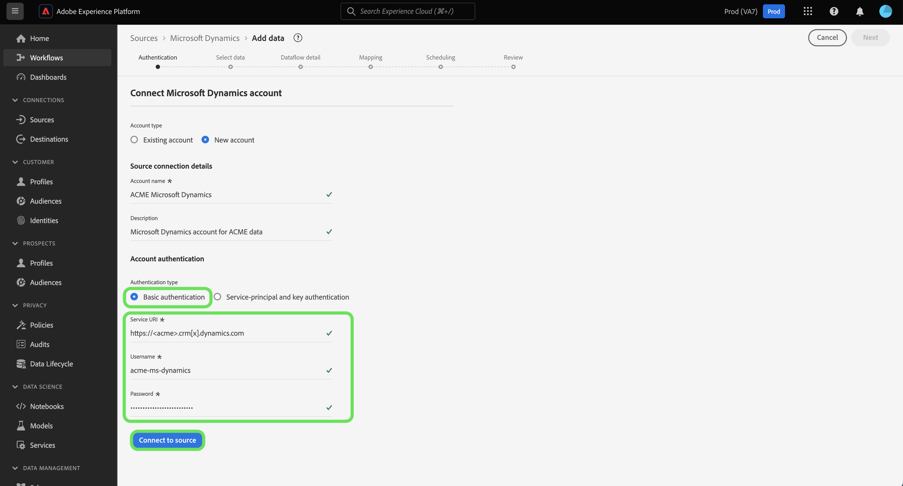

# Créer une connexion source [!DNL Microsoft Dynamics] dans l’interface utilisateur

Ce tutoriel décrit les étapes à suivre pour créer une connexion source [!DNL Microsoft Dynamics] (ci-après dénommée « [!DNL Dynamics] ») à l’aide de l’interface utilisateur de Adobe Experience Platform.

## Prise en main

Ce tutoriel nécessite une compréhension du fonctionnement des composants suivants d’Adobe Experience Platform :

* [[!DNL Experience Data Model (XDM)] Système](../../../../../xdm/home.md) : Cadre normalisé selon lequel Experience Platform organise les données d’expérience client. 
   * [Principes de base de la composition des schémas](../../../../../xdm/schema/composition.md) : découvrez les blocs de création de base des schémas XDM, y compris les principes clés et les bonnes pratiques en matière de composition de schémas.
   * [Tutoriel sur l’éditeur de schémas](../../../../../xdm/tutorials/create-schema-ui.md) : découvrez comment créer des schémas personnalisés à l’aide de l’interface utilisateur de l’éditeur de schémas.
* [[!DNL Real-Time Customer Profile]](../../../../../profile/home.md) : fournit un profil de consommateur unifié en temps réel, basé sur des données agrégées provenant de plusieurs sources.

Si vous disposez déjà d’un compte [!DNL Dynamics] valide, vous pouvez ignorer le reste de ce document et passer au tutoriel sur [la configuration d’un flux de données pour une source CRM](../../dataflow/crm.md).

### Collecter les informations d’identification requises

Pour authentifier votre source [!DNL Dynamics], vous devez fournir des valeurs pour les propriétés de connexion suivantes :

>[!BEGINTABS]

>[!TAB  Authentification de base ]

| Informations d’identification | Description |
| --- | --- |
| `serviceUri` | URL du service de votre instance [!DNL Dynamics]. |
| `username` | Nom d’utilisateur de votre compte utilisateur [!DNL Dynamics]. |
| `password` | Mot de passe de votre compte [!DNL Dynamics]. |

>[!TAB Authentification principale et par clé du service]

| Informations d’identification | Description |
| --- | --- |
| `servicePrincipalId` | Identifiant client de votre compte [!DNL Dynamics]. Cet identifiant est requis lors de l’utilisation du principal de service et de l’authentification par clé. |
| `servicePrincipalKey` | Clé secrète principale du service. Ces informations d’identification sont requises lors de l’utilisation du principal de service et de l’authentification par clé. |

>[!ENDTABS]

Pour plus d’informations sur la prise en main, consultez [ce [!DNL Dynamics] document](https://docs.microsoft.com/en-us/powerapps/developer/common-data-service/authenticate-oauth).

## Connecter votre compte [!DNL Dynamics]

Dans l’interface utilisateur d’Experience Platform, sélectionnez **[!UICONTROL Sources]** dans le volet de navigation de gauche pour accéder à l’espace de travail [!UICONTROL Sources]. L’écran [!UICONTROL Catalogue] affiche diverses sources avec lesquelles vous pouvez créer un compte.

Vous pouvez sélectionner la catégorie appropriée dans le catalogue sur le côté gauche de votre écran. Vous pouvez également trouver la source spécifique à utiliser à l’aide de l’option de recherche.

Dans la catégorie [!UICONTROL CRM], sélectionnez **[!UICONTROL Microsoft Dynamics]**, puis **[!UICONTROL Ajouter des données]**.

La page **[!UICONTROL Connecter le compte Microsoft Dynamics]** s’affiche. Sur cette page, vous pouvez utiliser de nouvelles informations d’identification ou des informations d’identification existantes.

### Compte existant

Pour utiliser un compte existant, sélectionnez le compte [!DNL Dynamics] que vous souhaitez utiliser, puis sélectionnez **[!UICONTROL Suivant]** dans le coin supérieur droit pour continuer.

 

### Nouveau compte

>[!TIP]
>
>Une fois créé, vous ne pouvez pas modifier le type d’authentification d’une connexion de base [!DNL Dynamics]. Pour modifier le type d’authentification, vous devez créer une connexion de base.

Pour créer un compte, sélectionnez **[!UICONTROL Nouveau compte]**, puis fournissez un nom et une description facultative pour votre nouveau compte [!DNL Dynamics].

Vous pouvez utiliser l’authentification de base ou l’authentification par principal de service et par clé lors de la création d’un compte [!DNL Dynamics].

>[!BEGINTABS]

>[!TAB  Authentification de base ]

Pour créer un compte [!DNL Dynamics] avec une authentification de base, sélectionnez [!UICONTROL Authentification de base] puis indiquez les valeurs de vos [!UICONTROL URI de service], [!UICONTROL Nom d’utilisateur] et [!UICONTROL Mot de passe]. **Remarque** : l’authentification de base dans [!DNL Dynamics] peut être bloquée par l’authentification à deux facteurs, qui n’est actuellement pas prise en charge par Experience Platform. Dans ce cas, il est recommandé d’utiliser l’authentification par clé pour créer un connecteur source à l’aide de [!DNL Dynamics].

Lorsque vous avez terminé, sélectionnez **[!UICONTROL Se connecter à la source]** puis attendez que le nouveau compte s’établisse.

>[!TAB Authentification principale et par clé du service]

Pour créer un compte [!DNL Dynamics] avec authentification du principal de service et de la clé, sélectionnez **[!UICONTROL Authentification du principal de service et de la clé]** puis fournissez les valeurs de votre [!UICONTROL ID du principal de service] et [!UICONTROL Clé du principal de service].

Lorsque vous avez terminé, sélectionnez **[!UICONTROL Se connecter à la source]** puis attendez que le nouveau compte s’établisse.

>[!ENDTABS]

## Étapes suivantes

En suivant ce tutoriel, vous avez établi une connexion à votre compte [!DNL Dynamics]. Vous pouvez maintenant passer au tutoriel suivant et [configurer un flux de données pour importer des données dans Experience Platform](../../dataflow/crm.md).
