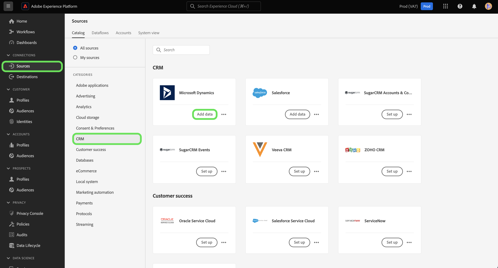

# Création d’un connecteur source Microsoft Dynamics dans l’interface utilisateur

Les connecteurs source de Adobe Experience Platform permettent d’importer des données de gestion de la relation client de source externe sur une base planifiée. Ce didacticiel décrit les étapes à suivre pour créer un connecteur source Microsoft Dynamics (ci-après appelé &quot;Dynamics&quot;) à l&#39;aide de l&#39;interface utilisateur de la plate-forme.

## Prise en main

Ce didacticiel nécessite une compréhension pratique des composants suivants de la plateforme d’expérience Adobe :

* [Système](../../../../../xdm/home.md)de modèle de données d’expérience (XDM) : Cadre normalisé selon lequel la plate-forme d’expérience organise les données d’expérience client.
   * [Principes de base de la composition](../../../../../xdm/schema/composition.md)des schémas : Découvrez les éléments de base des schémas XDM, y compris les principes clés et les meilleures pratiques en matière de composition des schémas.
   * [Didacticiel](../../../../../xdm/tutorials/create-schema-ui.md)sur l’éditeur de Schéma : Découvrez comment créer des schémas personnalisés à l’aide de l’interface utilisateur de l’éditeur de Schémas.
* [Profil](../../../../../profile/home.md)client en temps réel : Fournit un profil de consommation unifié en temps réel basé sur des données agrégées provenant de plusieurs sources.

Si vous disposez déjà d&#39;un compte Dynamics valide, vous pouvez ignorer le reste de ce document et passer au didacticiel sur la [configuration d&#39;un flux de données](../../dataflow/crm.md).

### Collecte des informations d’identification requises

| Informations d’identification | Description |
| ---------- | ----------- |
| `serviceUri` | URL de service de votre instance Dynamics. |
| `username` | Nom d&#39;utilisateur de votre compte utilisateur Dynamics. |
| `password` | Mot de passe de votre compte Dynamics. |

Pour plus d&#39;informations sur la prise en main, consultez [ce document](https://docs.microsoft.com/en-us/powerapps/developer/common-data-service/authenticate-oauth)Dynamics.

## Connecter votre compte Dynamics

Une fois que vous avez rassemblé les informations d&#39;identification requises, vous pouvez suivre les étapes ci-dessous pour créer un compte Dynamics pour vous connecter à la plate-forme.

Connectez-vous à [Adobe Experience Platform](https://platform.adobe.com) , puis sélectionnez **[!UICONTROL Sources]** dans la barre de navigation de gauche pour accéder à l’espace de travail *[!UICONTROL Sources]* . L’écran *[!UICONTROL Catalogue]* affiche diverses sources pour lesquelles vous pouvez créer un compte entrant et chaque source affiche le nombre de comptes et de flux de jeux de données existants qui y sont associés.

Vous pouvez sélectionner la catégorie appropriée dans le catalogue sur le côté gauche de l’écran. Vous pouvez également trouver la source spécifique avec laquelle vous souhaitez travailler à l’aide de l’option de recherche.

Sous la catégorie *[!UICONTROL Bases de données]* , sélectionnez **[!UICONTROL Dynamics]** click **sur l&#39;icône + (+)** pour créer un connecteur Dynamics.

La page *[!UICONTROL Se connecter à Dynamics]* s&#39;affiche. Sur cette page, vous pouvez utiliser de nouvelles informations d’identification ou des informations d’identification existantes.

### Nouveau compte

Si vous utilisez de nouvelles informations d’identification, sélectionnez **[!UICONTROL Nouveau compte]**. Dans le formulaire d&#39;entrée qui s&#39;affiche, indiquez le nom de la connexion, une description facultative et vos informations d&#39;identification Dynamics. Lorsque vous avez terminé, sélectionnez **[!UICONTROL Se connecter]** , puis accordez un certain temps à l’établissement du nouveau compte.

### Compte existant

Pour connecter un compte existant, sélectionnez le compte Dynamics avec lequel vous souhaitez vous connecter, puis sélectionnez **[!UICONTROL Suivant]** dans le coin supérieur droit pour continuer.

## Étapes suivantes

En suivant ce didacticiel, vous avez établi une connexion à votre compte Dynamics. Vous pouvez maintenant passer au didacticiel suivant et [configurer un flux de données pour importer des données dans la plate-forme](../../dataflow/crm.md).