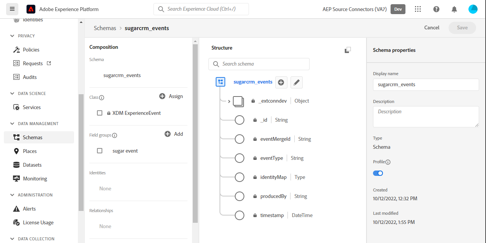
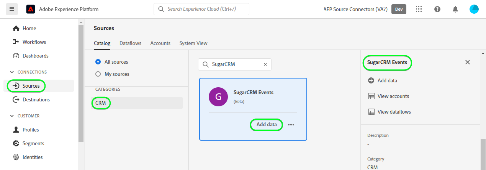
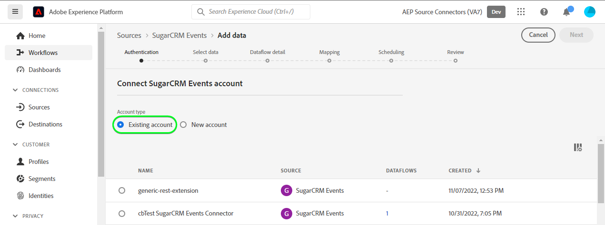
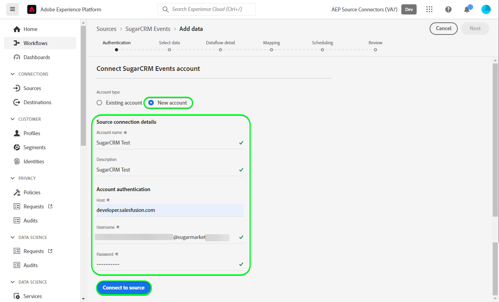
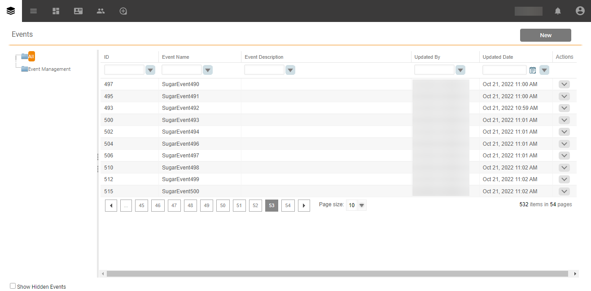

# Créer une connexion source [!DNL SugarCRM Events] dans l’interface utilisateur

Ce tutoriel décrit les étapes à suivre pour créer une connexion source [!DNL SugarCRM Events] à l’aide de l’interface utilisateur de Adobe Experience Platform.

## Prise en main

Ce tutoriel nécessite une compréhension du fonctionnement des composants suivants d’Adobe Experience Platform :

* [[!DNL Experience Data Model (XDM)] Système](../../../../../xdm/home.md) : le cadre normalisé en fonction duquel [!DNL Experience Platform] organise les données d’expérience client.
   * [Principes de base de la composition des schémas](../../../../../xdm/schema/composition.md) : découvrez les blocs de création de base des schémas XDM, y compris les principes clés et les bonnes pratiques en matière de composition de schémas.
   * [Tutoriel sur l’éditeur de schémas](../../../../../xdm/tutorials/create-schema-ui.md) : découvrez comment créer des schémas personnalisés à l’aide de l’interface utilisateur de l’éditeur de schémas.
* [[!DNL Real-Time Customer Profile]](../../../../../profile/home.md) : fournit un profil de consommateur unifié en temps réel, basé sur des données agrégées provenant de plusieurs sources.

Si vous disposez déjà d’un compte [!DNL SugarCRM], vous pouvez ignorer le reste de ce document et passer au tutoriel expliquant comment [Configurer un flux de données](../../dataflow/crm.md).

### Collecter les informations d’identification requises

Pour connecter [!DNL SugarCRM Events] à Experience Platform, vous devez fournir des valeurs pour les propriétés de connexion suivantes :

| Informations d’identification | Description | Exemple |
| --- | --- | --- |
| `Host` | Point d’entrée de l’API SugarCRM auquel la source se connecte. | `developer.salesfusion.com` |
| `Username` | Nom d’utilisateur de votre compte de développeur SugarCRM. | `abc.def@example.com@sugarmarketdemo000.com` |
| `Password` | Votre mot de passe de compte de développeur SugarCRM. | `123456789` |

### Création d’un schéma Experience Platform pour [!DNL SugarCRM]

Avant de créer une connexion source [!DNL SugarCRM], vous devez également vous assurer de créer d’abord un schéma Experience Platform à utiliser pour votre source. Pour obtenir des instructions complètes sur la création d’un schéma](../../../../../xdm/schema/composition.md) consultez le tutoriel sur la [création d’un schéma Experience Platform).

>[!WARNING]
>
>Lors du mappage du schéma, veillez également à mapper les champs `event_id` et `timestamp` obligatoires requis par Experience Platform.

## Connecter votre compte [!DNL SugarCRM Events]

Dans l’interface utilisateur d’Experience Platform, sélectionnez **[!UICONTROL Sources]** dans la barre de navigation de gauche pour accéder à l’espace de travail [!UICONTROL Sources]. L’écran [!UICONTROL Catalog] affiche diverses sources avec lesquelles vous pouvez créer un compte.

Vous pouvez sélectionner la catégorie appropriée dans le catalogue sur le côté gauche de votre écran. Vous pouvez également trouver la source spécifique à utiliser à l’aide de l’option de recherche.

Dans la catégorie *CRM*, sélectionnez **[!UICONTROL SugarCRM Events]**, puis **[!UICONTROL Add data]**.

La page **[!UICONTROL Connect SugarCRM Events account]** s’affiche. Sur cette page, vous pouvez utiliser de nouvelles informations d’identification ou des informations d’identification existantes.

### Compte existant

Pour utiliser un compte existant, sélectionnez le compte [!DNL SugarCRM Events] avec lequel vous souhaitez créer un flux de données, puis sélectionnez **[!UICONTROL Next]** pour continuer.

### Nouveau compte

Si vous créez un compte, sélectionnez **[!UICONTROL New account]**, puis fournissez un nom, une description facultative et vos informations d’identification. Lorsque vous avez terminé, sélectionnez **[!UICONTROL Connect to source]** puis attendez que la nouvelle connexion s’établisse.

## Étapes suivantes

En suivant ce tutoriel, vous avez établi une connexion à votre compte [!DNL SugarCRM Events]. Vous pouvez maintenant passer au tutoriel suivant et [configurer un flux de données pour importer des données dans Experience Platform](../../dataflow/crm.md).

## Ressources supplémentaires

Les sections ci-dessous fournissent des ressources supplémentaires auxquelles vous pouvez vous référer lors de l’utilisation de la source [!DNL SugarCRM].

### Mécanismes de sécurisation {#guardrails}

Les taux de limitation de l’API [!DNL SugarCRM] sont de 90 appels par minute ou 2 000 appels par jour, selon ce qui se produit en premier. Cependant, cette restriction a été contournée en ajoutant un paramètre dans la spécification de connexion qui retardera le temps de requête afin que la limite de débit ne soit jamais atteinte.

### Validation {#validation}

Pour vérifier que vous avez correctement configuré la source et [!DNL SugarCRM Events] les données sont ingérées, procédez comme suit :

* Dans l’interface utilisateur d’Experience Platform, sélectionnez **[!UICONTROL View Dataflows]** à côté du menu de carte [!DNL SugarCRM Events] dans le catalogue de sources. Sélectionnez ensuite **[!UICONTROL Preview dataset]** pour vérifier les données ingérées.

* Selon le type d’objet que vous utilisez, vous pouvez vérifier les données agrégées par rapport aux nombres visibles sur la page Événements [!DNL SugarMarket] ci-dessous :

>[!NOTE]
>
>Les pages [!DNL SugarMarket] n’incluent pas le nombre d’objets supprimés. Cependant, les données récupérées par le biais de cette source incluront également le nombre supprimé, qui sera marqué d’un indicateur supprimé.
