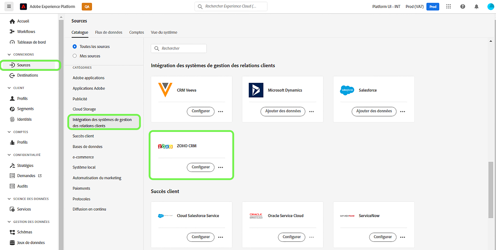
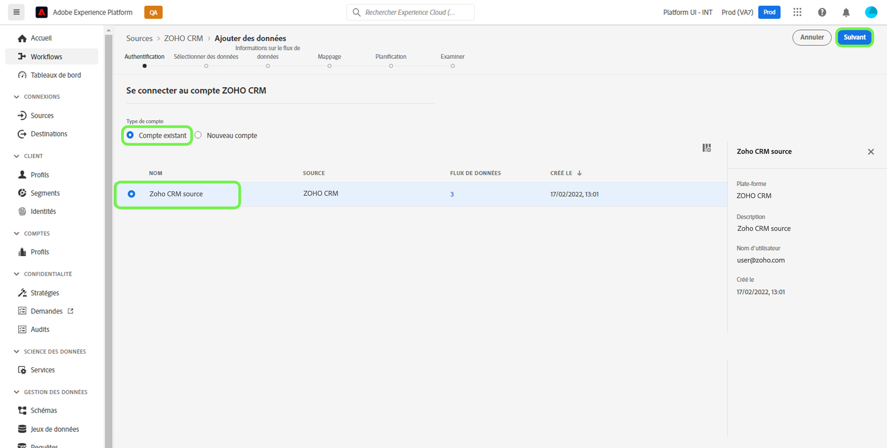

# Créer une connexion source [!DNL Zoho CRM] dans l’interface utilisateur

Les connecteurs source d’Adobe Experience Platform permettent d’ingérer des données CRM externes selon un calendrier précis. Ce tutoriel décrit les étapes à suivre pour créer un connecteur source [!DNL Zoho CRM] à l’aide de l’interface utilisateur de [!DNL Platform].

## Prise en main

Ce tutoriel nécessite une compréhension du fonctionnement des composants suivants d’Adobe Experience Platform :

* [[!DNL Experience Data Model (XDM)] Système](../../../../../xdm/home.md) : le cadre normalisé en fonction duquel [!DNL Experience Platform] organise les données d’expérience client.
   * [Principes de base de la composition des schémas](../../../../../xdm/schema/composition.md) : découvrez les blocs de création de base des schémas XDM, y compris les principes clés et les bonnes pratiques en matière de composition de schémas.
   * [Tutoriel sur l’éditeur de schémas](../../../../../xdm/tutorials/create-schema-ui.md) : découvrez comment créer des schémas personnalisés à l’aide de l’interface utilisateur de l’éditeur de schémas.
* [[!DNL Real-Time Customer Profile]](../../../../../profile/home.md) : fournit un profil de consommateur unifié en temps réel, basé sur des données agrégées provenant de plusieurs sources.

Si vous disposez déjà d’un compte [!DNL Zoho CRM], vous pouvez ignorer le reste de ce document et passer au tutoriel expliquant comment [Configurer un flux de données](../../dataflow/crm.md).

### Collecter les informations d’identification requises

Pour connecter [!DNL Zoho CRM] à Platform, vous devez fournir des valeurs pour les propriétés de connexion suivantes :

| Informations d’identification | Description |
| --- | --- |
| Point d’entrée | Point d’entrée du serveur [!DNL Zoho CRM] auprès duquel vous effectuez votre demande. |
| URL des comptes | L’URL des comptes est utilisée pour générer vos jetons d’accès et d’actualisation. L’URL doit être spécifique au domaine. |
| Identifiant client | Identifiant client correspondant à votre compte d’utilisateur [!DNL Zoho CRM]. |
| Secret client | Secret client correspondant à votre compte d’utilisateur [!DNL Zoho CRM]. |
| Jeton d’accès | Le jeton d’accès autorise l’accès sécurisé et temporaire à votre compte [!DNL Zoho CRM]. |
| Jeton d’actualisation | Un jeton d’actualisation est un jeton utilisé pour générer un nouveau jeton d’accès, une fois que votre jeton d’accès a expiré. |

Pour plus d’informations sur ces informations d’identification, consultez la documentation sur l’[[!DNL Zoho CRM] authentication](https://www.zoho.com/crm/developer/docs/api/v2/oauth-overview.html).

## Connecter votre compte [!DNL Zoho CRM]

Une fois les informations d’identification requises collectées, vous pouvez suivre les étapes ci-dessous pour lier votre compte [!DNL Zoho CRM] à [!DNL Platform].

Dans l’interface utilisateur de Platform, sélectionnez **[!UICONTROL Sources]** à partir de la barre de navigation de gauche pour accéder à l’espace de travail [!UICONTROL Sources]. L’écran [!UICONTROL Catalogue] affiche diverses sources avec lesquelles vous pouvez créer un compte.

Vous pouvez sélectionner la catégorie appropriée dans le catalogue sur le côté gauche de votre écran. Vous pouvez également trouver la source spécifique à utiliser à l’aide de l’option de recherche.

Sous la catégorie [!UICONTROL CRM], sélectionnez **[!UICONTROL Zoho CRM]**, puis sélectionnez **[!UICONTROL Ajouter des données]**.

La page **[!UICONTROL Connecter le compte Zoho CRM]** s’affiche. Sur cette page, vous pouvez utiliser de nouvelles informations d’identification ou des informations d’identification existantes.

### Compte existant

Pour utiliser un compte existant, sélectionnez le compte [!DNL Zoho CRM] avec lequel vous souhaitez créer un flux de données, puis sélectionnez **[!UICONTROL Suivant]** pour continuer.

### Nouveau compte

Si vous créez un compte, sélectionnez **[!UICONTROL Nouveau compte]**, puis fournissez un nom, une description facultative et vos informations d’identification [!DNL Zoho CRM]. Lorsque vous avez terminé, sélectionnez **[!UICONTROL Connecter à la source]** puis attendez que la nouvelle connexion s’établisse.

>[!TIP]
>
>Votre domaine URL de comptes doit correspondre à l’emplacement de domaine approprié. Vous trouverez ci-dessous les différents domaines et leurs URL de comptes correspondantes :<ul><li>États-Unis : https://accounts.zoho.com</li><li>Australie : https://accounts.zoho.com.au</li><li>Europe : https://accounts.zoho.eu</li><li>Inde : https://accounts.zoho.in</li><li>Chine : https://accounts.zoho.com.cn</li></ul>

## Étapes suivantes

En suivant ce tutoriel, vous avez établi une connexion à votre compte [!DNL Zoho CRM]. Vous pouvez maintenant passer au tutoriel suivant et [configurer un flux de données pour importer des données dans Platform](../../dataflow/crm.md).
