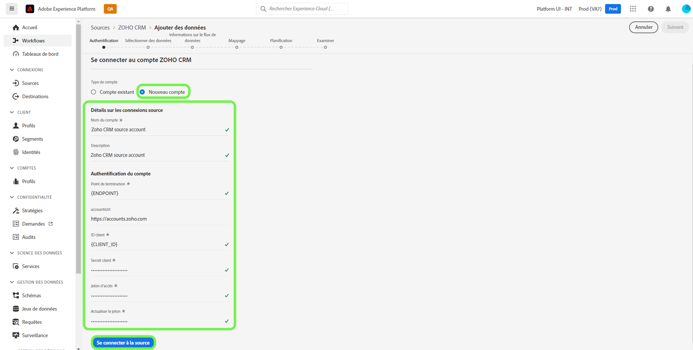

# Créer un [!DNL Zoho CRM] connexion source dans l’interface utilisateur

Les connecteurs source de Adobe Experience Platform permettent d’assimiler des données CRM externes sur une base planifiée. Ce tutoriel explique comment créer une [!DNL Zoho CRM] connecteur source utilisant [!DNL Platform] interface utilisateur.

## Prise en main

Ce tutoriel nécessite une compréhension du fonctionnement des composants suivants d’Adobe Experience Platform :

* [[!DNL Experience Data Model (XDM)] Système](../../../../../xdm/home.md): Cadre normalisé selon lequel [!DNL Experience Platform] organise les données d’expérience client.
   * [Principes de base de la composition des schémas](../../../../../xdm/schema/composition.md) : découvrez les blocs de création de base des schémas XDM, y compris les principes clés et les bonnes pratiques en matière de composition de schémas.
   * [Didacticiel sur l’éditeur de schéma](../../../../../xdm/tutorials/create-schema-ui.md): Découvrez comment créer des schémas personnalisés à l’aide de l’interface utilisateur de l’éditeur de schéma.
* [[!DNL Real-time Customer Profile]](../../../../../profile/home.md) : fournit un profil client en temps réel unifié basé sur des données agrégées issues de plusieurs sources.

Si vous disposez déjà d’un [!DNL Zoho CRM] , vous pouvez ignorer le reste de ce document et passer au tutoriel sur [configuration d&#39;un flux de données](../../dataflow/crm.md).

### Collecte des informations d’identification requises

Pour connecter [!DNL Zoho CRM] sur Plate-forme, vous devez fournir des valeurs pour les propriétés de connexion suivantes :

| Informations d&#39;identification | Description |
| --- | --- |
| Point de terminaison | Le point de terminaison de [!DNL Zoho CRM] le serveur auquel vous faites votre demande. |
| URL du compte | L’URL du compte est utilisée pour générer vos jetons d’accès et d’actualisation. L’URL doit être spécifique au domaine. |
| Identifiant du client | L’ID client correspondant à votre [!DNL Zoho CRM] compte utilisateur. |
| Secret du client | Le secret client qui correspond à votre [!DNL Zoho CRM] compte utilisateur. |
| Jeton d’accès | Le jeton d’accès autorise votre accès sécurisé et temporaire à votre [!DNL Zoho CRM] compte. |
| Actualiser le jeton | Un jeton d’actualisation est un jeton utilisé pour générer un nouveau jeton d’accès, une fois que votre jeton d’accès a expiré. |

Pour plus d’informations sur ces informations d’identification, consultez la documentation sur [[!DNL Zoho CRM] authentification](https://www.zoho.com/crm/developer/docs/api/v2/oauth-overview.html).

## Connectez-vous [!DNL Zoho CRM] compte

Une fois que vous avez rassemblé vos informations d’identification requises, vous pouvez suivre les étapes ci-dessous pour lier votre [!DNL Zoho CRM] compte [!DNL Platform].

Dans l’interface utilisateur de la plate-forme, sélectionnez **[!UICONTROL Sources]** à partir de la barre de navigation de gauche pour accéder au [!UICONTROL Sources] espace de travail. Le [!UICONTROL Catalogue] affiche une variété de sources avec lesquelles vous pouvez créer un compte.

Vous pouvez sélectionner la catégorie appropriée dans le catalogue sur le côté gauche de l’écran. Vous pouvez également trouver la source spécifique avec laquelle vous souhaitez travailler à l’aide de l’option de recherche.

Sous [!UICONTROL CRM] catégorie, sélectionnez **[!UICONTROL Zoho CRM]**, puis sélectionnez **[!UICONTROL Ajout de données]**.

Le **[!UICONTROL Connexion d’un compte Zoho CRM]** s’affiche. Sur cette page, vous pouvez utiliser de nouvelles informations d’identification ou des informations d’identification existantes.

### Compte existant

Pour utiliser un compte existant, sélectionnez l’option [!DNL Zoho CRM] compte avec lequel vous souhaitez créer un nouveau flux de données, puis sélectionnez **[!UICONTROL Suivant]** pour continuer.

### Nouveau compte

Si vous créez un compte, sélectionnez **[!UICONTROL Nouveau compte]**, puis indiquez un nom, une description facultative et votre [!DNL Zoho CRM] informations d&#39;identification. Lorsque vous avez terminé, sélectionnez **[!UICONTROL Connexion à la source]** puis laissez un certain temps pour que la nouvelle connexion s&#39;établisse.

>[!TIP]
>
>Votre domaine d’URL de compte doit correspondre à l’emplacement de votre domaine approprié. Voici les différents domaines et leurs URL de compte correspondantes :<ul><li>États-Unis : https://accounts.zoho.com</li><li>Australie : https://accounts.zoho.com.au</li><li>Europe : https://accounts.zoho.eu</li><li>Inde : https://accounts.zoho.in</li><li>Chine : https://accounts.zoho.com.cn</li></ul>

## Étapes suivantes

En suivant ce tutoriel, vous avez établi une connexion à votre [!DNL Zoho CRM] compte. Vous pouvez maintenant passer au tutoriel suivant et [configurer un flux de données pour importer des données dans la plate-forme](../../dataflow/crm.md).
