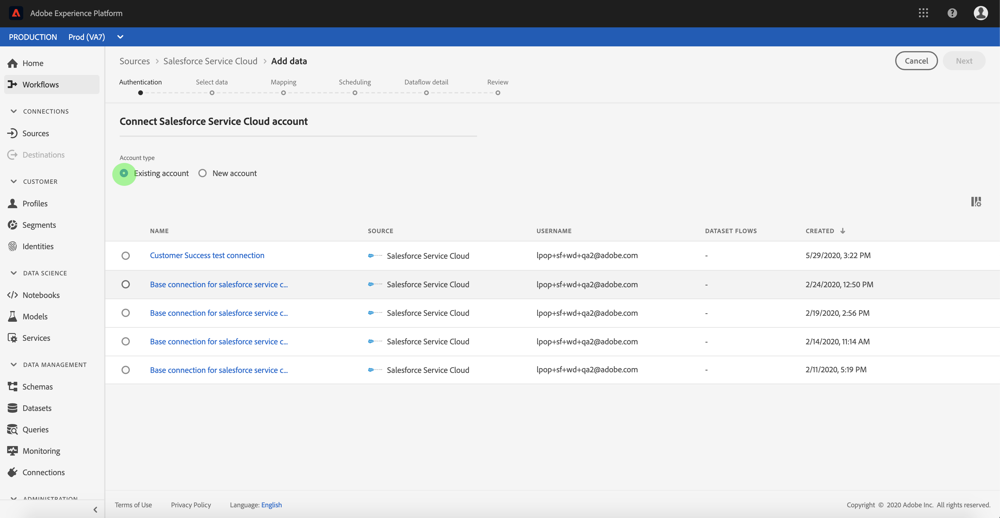

# Créer une connexion source [!DNL Salesforce Service Cloud] dans l’interface utilisateur

Les connecteurs source d’Adobe Experience Platform permettent d’ingérer des données externes selon un calendrier précis. Ce tutoriel décrit les étapes à suivre pour créer une [!DNL Salesforce Service Cloud] (ci-après appelé &quot;SSC&quot;) Connecteur source à l’aide de la fonction [!DNL Platform] de l’interface utilisateur.

## Prise en main

Ce tutoriel nécessite une compréhension du fonctionnement des composants suivants d’Adobe Experience Platform :

* [[!DNL Experience Data Model (XDM)] Système](../../../../../xdm/home.md) : le cadre normalisé en fonction duquel [!DNL Experience Platform] organise les données d’expérience client.
   * [Principes de base de la composition des schémas](../../../../../xdm/schema/composition.md) : découvrez les blocs de création de base des schémas XDM, y compris les principes clés et les bonnes pratiques en matière de composition de schémas.
   * [Tutoriel sur l’éditeur de schémas](../../../../../xdm/tutorials/create-schema-ui.md) : découvrez comment créer des schémas personnalisés à l’aide de l’interface utilisateur de l’éditeur de schémas.
* [[!DNL Real-Time Customer Profile]](../../../../../profile/home.md) : fournit un profil de consommateur unifié en temps réel, basé sur des données agrégées provenant de plusieurs sources.

Si vous disposez déjà d’une connexion SSC valide, vous pouvez ignorer le reste de ce document et passer au tutoriel sur [configuration d’un flux de données](../../dataflow/customer-success.md)

### Collecter les informations d’identification requises

Pour accéder à votre compte SSC sur [!DNL Platform], vous devez fournir les valeurs suivantes :

| Informations d’identification | Description |
| ---------- | ----------- |
| `username` | Nom d’utilisateur du compte d’utilisateur. |
| `password` | Mot de passe du compte utilisateur. |
| `securityToken` | Jeton de sécurité du compte utilisateur. |

Pour plus d’informations sur la prise en main, reportez-vous à la section [this [!DNL Salesforce Service Cloud] document](https://developer.salesforce.com/docs/atlas.en-us.api_iot.meta/api_iot/qs_auth_access_token.htm).

## Connecter votre compte [!DNL Salesforce Service Cloud]

Une fois que vous avez rassemblé les informations d’identification requises, vous pouvez suivre les étapes ci-dessous pour lier votre compte SSC à [!DNL Platform].

Connectez-vous à [Adobe Experience Platform](https://platform.adobe.com) puis sélectionnez **[!UICONTROL Sources]** à partir de la barre de navigation de gauche pour accéder au **[!UICONTROL Sources]** workspace. L’écran **[!UICONTROL Catalogue]** affiche diverses sources pour lesquelles vous pouvez créer un compte.

Vous pouvez sélectionner la catégorie appropriée dans le catalogue sur le côté gauche de votre écran. Vous pouvez également trouver la source spécifique à utiliser à l’aide de l’option de recherche.

Sous , **[!UICONTROL Succès des clients]** catégorie, sélectionnez **[!UICONTROL Salesforce Service Cloud]**. Si c’est la première fois que vous utilisez ce connecteur, sélectionnez **[!UICONTROL Configurer]**. Sinon, sélectionnez **[!UICONTROL Ajouter des données]** pour créer un nouveau connecteur SSC.

Le **[!UICONTROL Connexion à Salesforce Service Cloud]** s’affiche. Sur cette page, vous pouvez utiliser de nouvelles informations d’identification ou des informations d’identification existantes.

### Nouveau compte

Si vous utilisez de nouvelles informations d’identification, sélectionnez **[!UICONTROL Nouveau compte]**.  Dans le formulaire de saisie qui s’affiche, indiquez un nom, une description facultative et vos informations d’identification SSC. Lorsque vous avez terminé, sélectionnez **[!UICONTROL Connexion]** puis accorder un certain temps pour établir la nouvelle connexion.

### Compte existant

Pour connecter un compte existant, sélectionnez le compte SSC auquel vous souhaitez vous connecter, puis sélectionnez **[!UICONTROL Suivant]** pour continuer.

## Étapes suivantes

En suivant ce tutoriel, vous avez établi une connexion à votre compte SSC. Vous pouvez maintenant passer au tutoriel suivant et [configurer un flux de données pour importer les données de succès client dans [!DNL Platform]](../../dataflow/customer-success.md).
