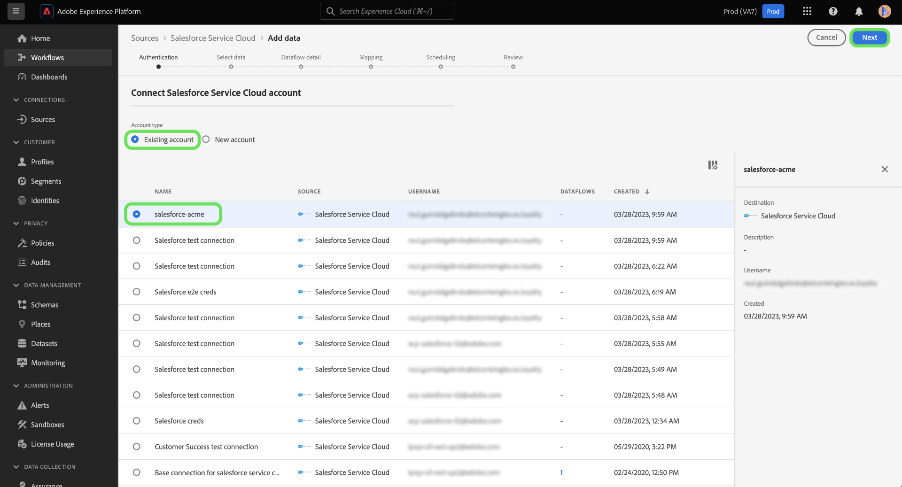

# Connectez-vous à [!DNL Salesforce Service Cloud] compte à Experience Platform à l’aide de l’interface utilisateur

Ce tutoriel décrit les étapes à suivre pour connecter votre [!DNL Salesforce Service Cloud] et importez vos données de succès client dans Adobe Experience Platform à l’aide de l’interface utilisateur de l’Experience Platform.

## Prise en main

Ce tutoriel nécessite une compréhension du fonctionnement des composants suivants d’Adobe Experience Platform : 

* [[!DNL Experience Data Model (XDM)] Système](../../../../../xdm/home.md) : Cadre normalisé selon lequel Experience Platform organise les données d’expérience client. 
   * [Principes de base de la composition des schémas](../../../../../xdm/schema/composition.md) : découvrez les blocs de création de base des schémas XDM, y compris les principes clés et les bonnes pratiques en matière de composition de schémas.
   * [Tutoriel sur l’éditeur de schémas](../../../../../xdm/tutorials/create-schema-ui.md) : découvrez comment créer des schémas personnalisés à l’aide de l’interface utilisateur de l’éditeur de schémas.
* [[!DNL Real-Time Customer Profile]](../../../../../profile/home.md) : fournit un profil de consommateur unifié en temps réel, basé sur des données agrégées provenant de plusieurs sources.

Si vous disposez déjà d’un [!DNL Salesforce Service Cloud] vous pouvez ignorer le reste de ce document et passer au tutoriel sur [configuration d’un flux de données pour une réussite client](../../dataflow/customer-success.md)

### Collecter les informations d’identification requises

La variable [!DNL Salesforce Service Cloud] source prend en charge l’authentification de base et les informations d’identification du client OAuth2.

>[!BEGINTABS]

>[!TAB Authentification de base]

Vous devez fournir des valeurs pour les informations d’identification suivantes afin de connecter votre [!DNL Salesforce Service Cloud] à l’aide de l’authentification de base.

| Informations d’identification | Description |
| --- | --- |
| URL de l’environnement | L’URL de la variable [!DNL Salesforce Service Cloud] instance source. |
| Nom d’utilisateur | Nom d’utilisateur de la variable [!DNL Salesforce Service Cloud] compte utilisateur. |
| Mot de passe | Le mot de passe du [!DNL Salesforce Service Cloud] compte utilisateur. |
| Jeton de sécurité | Jeton de sécurité pour la variable [!DNL Salesforce Service Cloud] compte utilisateur. |
| Version de l’API | (Facultatif) La version de l’API REST de la variable [!DNL Salesforce Service Cloud] que vous utilisez. La valeur de la version de l’API doit être formatée avec une valeur décimale. Par exemple, si vous utilisez la version d’API `52`, vous devez saisir la valeur sous la forme `52.0`. Si ce champ n’est pas renseigné, l’Experience Platform utilisera automatiquement la dernière version disponible. |

Pour plus d’informations sur l’authentification, reportez-vous à la section [this [!DNL Salesforce Service Cloud] guide d&#39;authentification](https://developer.salesforce.com/docs/atlas.en-us.api_rest.meta/api_rest/quickstart_oauth.htm).

>[!TAB Informations d’identification du client OAuth2]

Vous devez fournir des valeurs pour les informations d’identification suivantes afin de connecter votre [!DNL Salesforce Service Cloud] compte à l’aide des informations d’identification du client OAuth2.

| Informations d’identification | Description |
| --- | --- |
| URL de l’environnement | L’URL de la variable [!DNL Salesforce Service Cloud] instance source. |
| Identifiant client | L’ID client est utilisé en tandem avec le secret client dans le cadre de l’authentification OAuth2. Ensemble, l’ID client et le secret client permettent à votre application d’opérer pour le compte de votre client en identifiant votre application à [!DNL Salesforce Service Cloud]. |
| Secret client | Le secret client est utilisé en tandem avec l’ID client dans le cadre de l’authentification OAuth2. Ensemble, l’ID client et le secret client permettent à votre application d’opérer pour le compte de votre client en identifiant votre application à [!DNL Salesforce Service Cloud]. |
| Version de l’API | La version de l’API REST de la variable [!DNL Salesforce Service Cloud] que vous utilisez. La valeur de la version de l’API doit être formatée avec une valeur décimale. Par exemple, si vous utilisez la version d’API `52`, vous devez saisir la valeur sous la forme `52.0`. Si ce champ n’est pas renseigné, l’Experience Platform utilisera automatiquement la dernière version disponible. |

Pour plus d’informations sur l’utilisation d’OAuth pour [!DNL Salesforce Service Cloud], lisez le [[!DNL Salesforce Service Cloud] Guide sur les flux d’autorisation OAuth](https://help.salesforce.com/s/articleView?id=sf.remoteaccess_oauth_flows.htm&amp;type=5).

>[!ENDTABS]

Une fois que vous avez rassemblé vos informations d’identification requises, vous pouvez suivre les étapes ci-dessous pour connecter votre [!DNL Salesforce Service Cloud] compte à Experience Platform.

## Connecter votre compte [!DNL Salesforce Service Cloud]

Dans l’interface utilisateur de Platform, sélectionnez **[!UICONTROL Sources]** dans le volet de navigation de gauche pour accéder à l’espace de travail [!UICONTROL Sources]. Vous pouvez sélectionner la catégorie appropriée dans le catalogue sur le côté gauche de votre écran. Vous pouvez également trouver la source spécifique à utiliser à l’aide de l’option de recherche.

Sélectionner **[!DNL Salesforce Service Cloud]** sous le *[!UICONTROL Succès des clients]* catégorie, puis sélectionnez **[!UICONTROL Ajouter des données]**.

>[!TIP]
>
>Les sources dans le catalogue des sources affichent la variable **[!UICONTROL Configuration]** lorsqu’une source donnée ne dispose pas encore d’un compte authentifié. Une fois qu’un compte authentifié existe, cette option devient **[!UICONTROL Ajouter des données]**.

La variable **[!UICONTROL Connexion à Salesforce Service Cloud]** s’affiche. Sur cette page, vous pouvez utiliser de nouvelles informations d’identification ou des informations d’identification existantes.

### Utiliser un compte existant

Pour utiliser un compte existant, sélectionnez **[!UICONTROL Compte existant]**, puis sélectionnez le compte de votre choix dans la liste qui s’affiche. Lorsque vous avez terminé, sélectionnez **[!UICONTROL Suivant]** pour continuer.

### Création d’un compte

Pour créer un compte, sélectionnez **[!UICONTROL Nouveau compte]** et indiquez un nom et une description pour votre nouvelle [!DNL Salesforce Service Cloud] compte .

Sélectionnez ensuite le type d&#39;authentification que vous souhaitez utiliser pour votre nouveau compte.

>[!BEGINTABS]

>[!TAB Authentification de base]

Pour l’authentification de base, sélectionnez **[!UICONTROL Authentification de base]** puis saisissez des valeurs pour les informations d’identification suivantes :

* URL de l’environnement
* Nom d’utilisateur
* Mot de passe
* Version de l’API (facultatif)

Lorsque vous avez terminé, sélectionnez **[!UICONTROL Connexion à la source]**.

>[!TAB Informations d’identification du client OAuth2]

Pour OAuth 2 Client Credential, sélectionnez **[!UICONTROL Informations d’identification du client OAuth2]** puis saisissez des valeurs pour les informations d’identification suivantes :

* URL de l’environnement
* Identifiant client
* Secret client
* Version de l’API

Lorsque vous avez terminé, sélectionnez **[!UICONTROL Connexion à la source]**.

>[!ENDTABS]

## Étapes suivantes

En suivant ce tutoriel, vous avez établi une connexion à votre compte [!DNL Salesforce Service Cloud]. Vous pouvez maintenant passer au tutoriel suivant et [configurer un flux de données pour importer les données de succès client dans Experience Platform ;](../../dataflow/customer-success.md).
