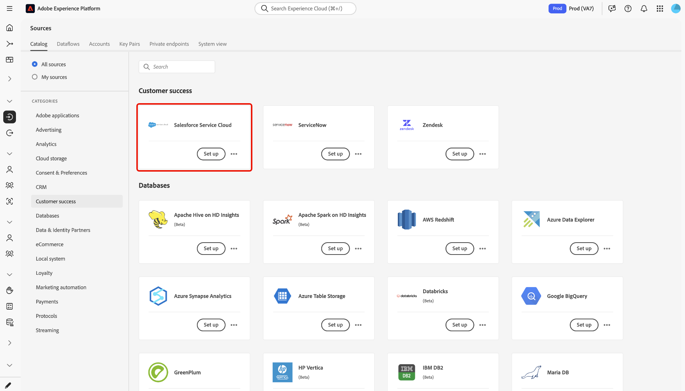
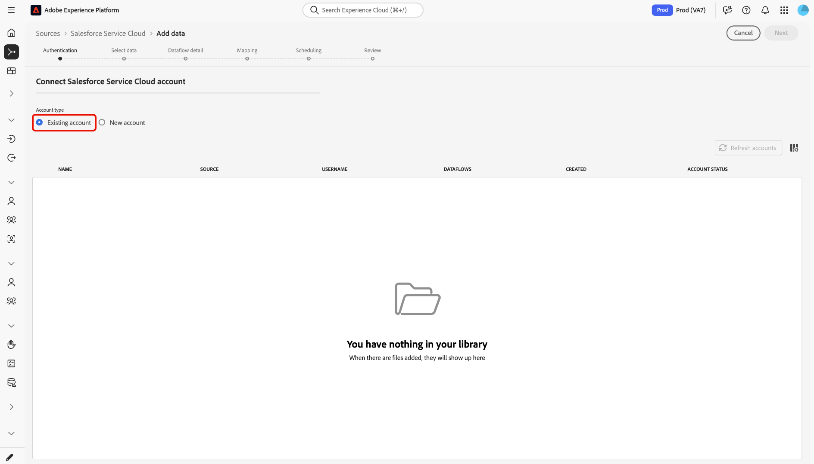

# Connecter votre compte [!DNL Salesforce Service Cloud] à Experience Platform à l’aide de l’interface utilisateur

Suivez ce guide détaillé pour connecter facilement votre compte [!DNL Salesforce Service Cloud] et importer vos données de succès client dans Adobe Experience Platform.

## Prise en main

Ce tutoriel nécessite une compréhension du fonctionnement des composants suivants d’Adobe Experience Platform :

* [[!DNL Experience Data Model (XDM)] Système](../../../../../xdm/home.md) : Cadre normalisé selon lequel Experience Platform organise les données d’expérience client.
   * [Principes de base de la composition des schémas](../../../../../xdm/schema/composition.md) : découvrez les blocs de création de base des schémas XDM, y compris les principes clés et les bonnes pratiques en matière de composition de schémas.
   * [Tutoriel sur l’éditeur de schémas](../../../../../xdm/tutorials/create-schema-ui.md) : découvrez comment créer des schémas personnalisés à l’aide de l’interface utilisateur de l’éditeur de schémas.
* [[!DNL Real-Time Customer Profile]](../../../../../profile/home.md) : fournit un profil de consommateur unifié en temps réel, basé sur des données agrégées provenant de plusieurs sources.

Si vous disposez déjà d’une connexion [!DNL Salesforce Service Cloud] valide, vous pouvez ignorer le reste de ce document et passer au tutoriel sur [la configuration d’un flux de données pour le succès d’un client](../../dataflow/customer-success.md)

### Collecter les informations d’identification requises

Lisez le [ guide d’authentification ](../../../../connectors/customer-success/salesforce-service-cloud.md#credentials) pour plus d’informations sur la récupération de vos informations d’identification.

## Connecter votre compte [!DNL Salesforce Service Cloud]

Dans l’interface utilisateur d’Experience Platform, sélectionnez **[!UICONTROL Sources]** dans le volet de navigation de gauche pour accéder à l’espace de travail [!UICONTROL Sources]. Vous pouvez sélectionner la catégorie appropriée dans le catalogue sur le côté gauche de votre écran. Vous pouvez également trouver la source spécifique à utiliser à l’aide de l’option de recherche.

Sélectionnez **[!DNL Salesforce Service Cloud]** sous la catégorie *[!UICONTROL Customer success]*, puis sélectionnez **[!UICONTROL Add data]**.

>[!TIP]
>
>Les sources du catalogue affichent l’option **[!UICONTROL Set up]** lorsqu’une source donnée ne dispose pas encore d’un compte authentifié. Une fois qu’un compte authentifié existe, cette option devient **[!UICONTROL Add data]**.

La page **[!UICONTROL Connect to Salesforce Service Cloud]** s’affiche. Sur cette page, vous pouvez utiliser de nouvelles informations d’identification ou des informations d’identification existantes.

### Utiliser un compte existant

Pour utiliser un compte existant, sélectionnez **[!UICONTROL Existing account]**, puis sélectionnez le compte de votre choix dans la liste qui s’affiche. Lorsque vous avez terminé, sélectionnez **[!UICONTROL Next]** pour continuer.

### Créer un nouveau compte

Pour créer un compte, sélectionnez **[!UICONTROL New account]** et indiquez un nom et une description pour votre nouveau compte [!DNL Salesforce Service Cloud]. Sélectionnez ensuite **[!UICONTROL OAuth2 Client Credential]** et indiquez les valeurs des informations d’identification suivantes :

* URL de l’environnement
* Identifiant client
* Secret client
* Version de l’API

Lorsque vous avez terminé, sélectionnez **[!UICONTROL Connect to source]**.

## Étapes suivantes

En suivant ce tutoriel, vous avez établi une connexion à votre compte [!DNL Salesforce Service Cloud]. Vous pouvez maintenant passer au tutoriel suivant et [configurer un flux de données pour importer des données de succès client dans Experience Platform](../../dataflow/customer-success.md).
