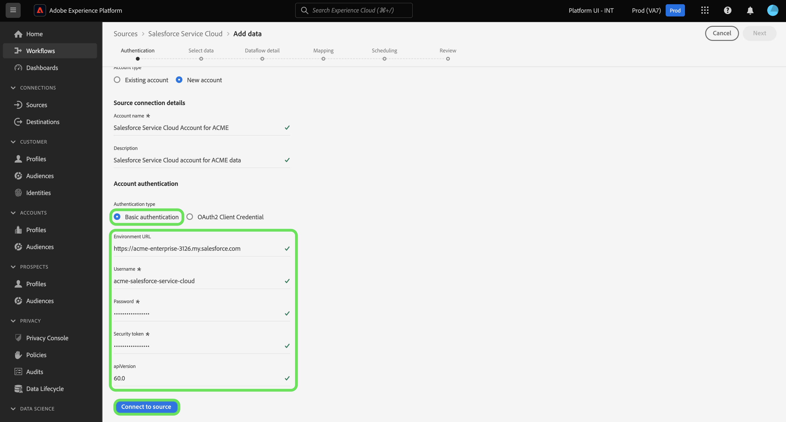

# Connecter votre compte [!DNL Salesforce Service Cloud] à Experience Platform à l’aide de l’interface utilisateur

Ce tutoriel décrit les étapes à suivre pour connecter votre compte [!DNL Salesforce Service Cloud] et importer vos données de succès client dans Adobe Experience Platform à l’aide de l’interface utilisateur d’Experience Platform.

## Prise en main

Ce tutoriel nécessite une compréhension du fonctionnement des composants suivants d’Adobe Experience Platform : 

* [[!DNL Experience Data Model (XDM)] Système](../../../../../xdm/home.md) : Cadre normalisé selon lequel Experience Platform organise les données d’expérience client. 
   * [Principes de base de la composition des schémas](../../../../../xdm/schema/composition.md) : découvrez les blocs de création de base des schémas XDM, y compris les principes clés et les bonnes pratiques en matière de composition de schémas.
   * [Tutoriel sur l’éditeur de schémas](../../../../../xdm/tutorials/create-schema-ui.md) : découvrez comment créer des schémas personnalisés à l’aide de l’interface utilisateur de l’éditeur de schémas.
* [[!DNL Real-Time Customer Profile]](../../../../../profile/home.md) : fournit un profil de consommateur unifié en temps réel, basé sur des données agrégées provenant de plusieurs sources.

Si vous disposez déjà d’une connexion [!DNL Salesforce Service Cloud] valide, vous pouvez ignorer le reste de ce document et passer au tutoriel sur [la configuration d’un flux de données pour le succès d’un client](../../dataflow/customer-success.md)

### Collecter les informations d’identification requises

La source [!DNL Salesforce Service Cloud] prend en charge l’authentification de base et les informations d’identification du client OAuth2.

>[!BEGINTABS]

>[!TAB  Authentification de base ]

Vous devez fournir des valeurs pour les informations d’identification suivantes afin de connecter votre compte [!DNL Salesforce Service Cloud] à l’aide de l’authentification de base.

| Informations d’identification | Description |
| --- | --- |
| URL de l’environnement | URL de l’instance source de la [!DNL Salesforce Service Cloud]. |
| Nom d’utilisateur | Nom d’utilisateur du compte utilisateur [!DNL Salesforce Service Cloud]. |
| Mot de passe | Mot de passe du compte utilisateur [!DNL Salesforce Service Cloud]. |
| Jeton de sécurité | Jeton de sécurité du compte utilisateur [!DNL Salesforce Service Cloud]. |
| Version de l’API | (Facultatif) Version de l’API REST de l’instance [!DNL Salesforce Service Cloud] que vous utilisez. La valeur de la version de l’API doit être formatée avec une décimale. Par exemple, si vous utilisez la version `52` de l’API, vous devez saisir la valeur comme `52.0`. Si ce champ n’est pas renseigné, Experience Platform utilise automatiquement la dernière version disponible. |

Pour plus d’informations sur l’authentification, consultez [ce guide  [!DNL Salesforce Service Cloud] ’authentification](https://developer.salesforce.com/docs/atlas.en-us.api_rest.meta/api_rest/quickstart_oauth.htm).

>[!TAB Informations d’identification du client OAuth2]

Vous devez fournir des valeurs pour les informations d’identification suivantes afin de connecter votre compte [!DNL Salesforce Service Cloud] à l’aide des informations d’identification du client OAuth2.

| Informations d’identification | Description |
| --- | --- |
| URL de l’environnement | URL de l’instance source de la [!DNL Salesforce Service Cloud]. |
| Identifiant client | L’identifiant client est utilisé conjointement avec le secret client dans le cadre de l’authentification OAuth2. Ensemble, l’identifiant client et le secret client permettent à votre application d’opérer pour le compte de votre compte en identifiant votre application à [!DNL Salesforce Service Cloud]. |
| Secret client | Le secret client est utilisé conjointement avec l’identifiant client dans le cadre de l’authentification OAuth2. Ensemble, l’identifiant client et le secret client permettent à votre application d’opérer pour le compte de votre compte en identifiant votre application à [!DNL Salesforce Service Cloud]. |
| Version de l’API | Version de l’API REST de l’instance [!DNL Salesforce Service Cloud] que vous utilisez. La valeur de la version de l’API doit être formatée avec une décimale. Par exemple, si vous utilisez la version `52` de l’API, vous devez saisir la valeur comme `52.0`. Si ce champ n’est pas renseigné, Experience Platform utilise automatiquement la dernière version disponible. |

Pour plus d’informations sur l’utilisation d’OAuth pour [!DNL Salesforce Service Cloud], consultez le guide [[!DNL Salesforce Service Cloud]  sur les flux d’autorisation OAuth](https://help.salesforce.com/s/articleView?id=sf.remoteaccess_oauth_flows.htm&amp;type=5).

>[!ENDTABS]

Une fois les informations d’identification requises collectées, vous pouvez suivre les étapes ci-dessous pour connecter votre compte [!DNL Salesforce Service Cloud] à Experience Platform.

## Connecter votre compte [!DNL Salesforce Service Cloud]

Dans l’interface utilisateur d’Experience Platform, sélectionnez **[!UICONTROL Sources]** dans le volet de navigation de gauche pour accéder à l’espace de travail [!UICONTROL Sources]. Vous pouvez sélectionner la catégorie appropriée dans le catalogue sur le côté gauche de votre écran. Vous pouvez également trouver la source spécifique à utiliser à l’aide de l’option de recherche.

Sélectionnez **[!DNL Salesforce Service Cloud]** sous la catégorie *[!UICONTROL Succès client]*, puis sélectionnez **[!UICONTROL Ajouter des données]**.

>[!TIP]
>
>Les sources du catalogue affichent l’option **[!UICONTROL Configurer]** lorsqu’une source donnée ne dispose pas encore d’un compte authentifié. Une fois qu’un compte authentifié existe, cette option devient **[!UICONTROL Ajouter des données]**.

La page **[!UICONTROL Connexion à Salesforce Service Cloud]** s’affiche. Sur cette page, vous pouvez utiliser de nouvelles informations d’identification ou des informations d’identification existantes.

### Utiliser un compte existant

Pour utiliser un compte existant, sélectionnez **[!UICONTROL Compte existant]**, puis sélectionnez le compte de votre choix dans la liste qui s’affiche. Lorsque vous avez terminé, sélectionnez **[!UICONTROL Suivant]** pour continuer.

### Créer un nouveau compte

Pour créer un compte, sélectionnez **[!UICONTROL Nouveau compte]** et indiquez un nom et une description pour votre nouveau compte [!DNL Salesforce Service Cloud].

Sélectionnez ensuite le type d’authentification que vous souhaitez utiliser pour votre nouveau compte.

>[!BEGINTABS]

>[!TAB  Authentification de base ]

Pour l’authentification de base, sélectionnez **[!UICONTROL Authentification de base]** puis fournissez des valeurs pour les informations d’identification suivantes :

* URL de l’environnement
* Nom d’utilisateur
* Mot de passe
* Version de l’API (facultatif)

Lorsque vous avez terminé, sélectionnez **[!UICONTROL Se connecter à la source]**.

>[!TAB Informations d’identification du client OAuth2]

Pour les informations d’identification du client OAuth 2, sélectionnez **[!UICONTROL Informations d’identification du client OAuth 2]** puis fournissez des valeurs pour les informations d’identification suivantes :

* URL de l’environnement
* Identifiant client
* Secret client
* Version de l’API

Lorsque vous avez terminé, sélectionnez **[!UICONTROL Se connecter à la source]**.

>[!ENDTABS]

## Étapes suivantes

En suivant ce tutoriel, vous avez établi une connexion à votre compte [!DNL Salesforce Service Cloud]. Vous pouvez maintenant passer au tutoriel suivant et [configurer un flux de données pour importer des données de succès client dans Experience Platform](../../dataflow/customer-success.md).
